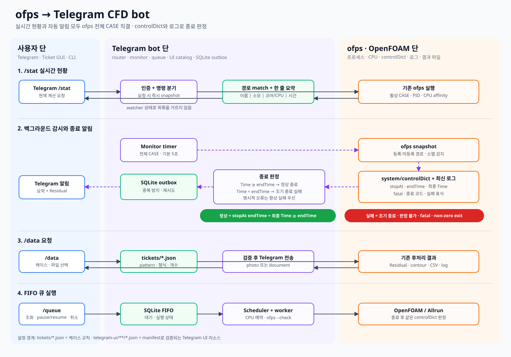
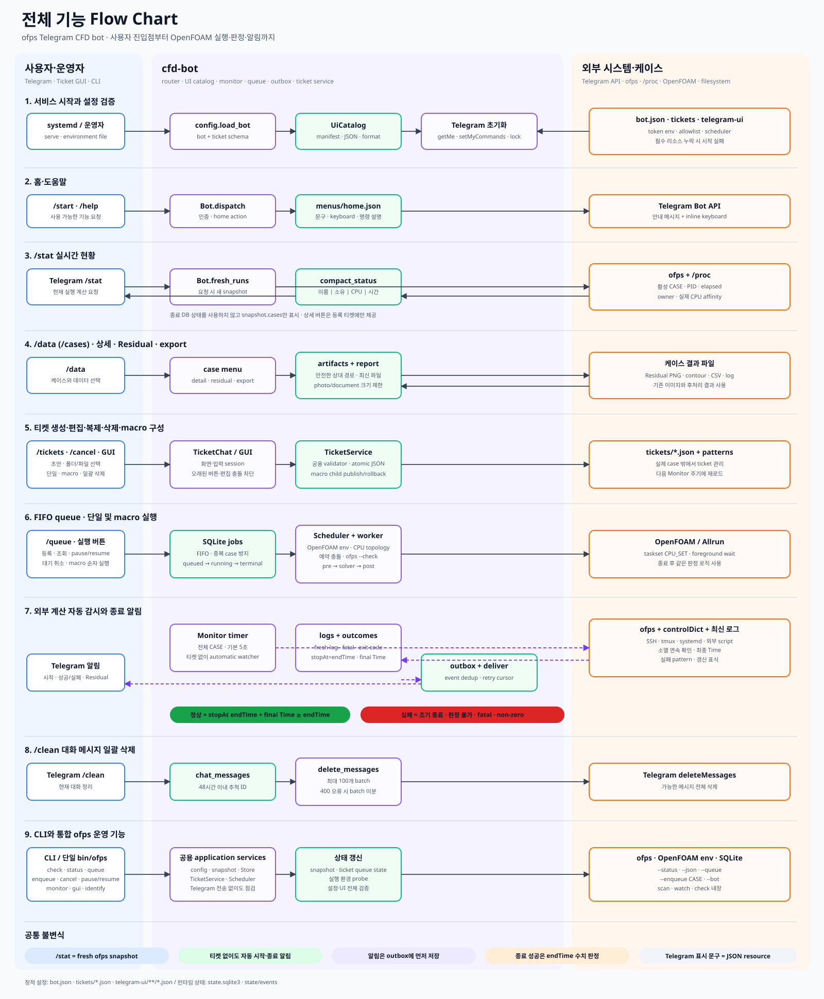

# CFD bot 아키텍처 — 유즈케이스와 플랫폼 지도

> #20 공용 티켓 색인·증분 감시, #21 이름 있는 대기열·동적 매크로, #24 코어 수 기반 자동 quota와 현재 head admission, #25 `ofps` monitor CPU 관측, #26 SQLite lock 격리, #27 실행 중단을 반영한다. [#27 설계](history/2026-10-07-running-job-interruption.md).

## 1. 문서 탐색

| 확인할 내용 | 문서 |
|---|---|
| 프로세스·thread·서비스 경계, 소유권, 공유 자원 | [HLD](HLD.md) |
| 공용 함수의 입력·반환·예외·부수 효과와 도메인 시퀀스 | [LLD](LLD.md) |
| Telegram 명령·callback·session별 진입과 응답 | [Telegram LLD](lld/telegram.md) |
| Tk 이벤트·작업 thread·화면 반영 | [GUI LLD](lld/gui.md) |
| 브라우저 이벤트·HTTP·응답·화면 반영 | [Web LLD](lld/web.md) |
| CLI·ofps·Monitor·Scheduler·worker·outbox | [Runtime LLD](lld/runtime.md) |
| 전체 함수 정의와 소스 위치, 정적 호출식 | [함수 색인](analysis/function-index.md) |
| 확인된 비용·실험 결과·미확인 가설·개선 순서 | [병목 분석](analysis/performance.md) |
| 921행 매크로의 중첩 검색·큐 응답량·실제 측정 | [운영 데이터 분석](analysis/live-bottlenecks.md) |
| 문서 변경 배경·As-Is/To-Be | [이력 #19](history/2026-10-04-architecture-function-flows.md) |

아래 UC ID는 플랫폼 LLD, 공용 LLD, 병목 분석을 연결하는 키다. 여러 버튼이 같은 처리를 호출하면 같은 UC에 매핑하고, 버튼별 분기는 플랫폼 명세에서 구분한다. BG는 사용자 요청과 독립적으로 시작하지만 결과를 사용자에게 전달하는 백그라운드 흐름이다.

## 2. 전체 사용자 유즈케이스 × 플랫폼

`N/A`는 해당 UI에 진입점이 없다는 뜻이다. 부분 지원은 구체적 차이를 적었다. GUI에는 전체 활성 CASE 대시보드, 큐 pause/resume 버튼, 파일 다운로드 기능이 없다. Windows/macOS launcher는 웹 접속 수단이며 별도 티켓 도메인을 구현하지 않는다.

| ID / 사용자 의도 | Telegram | cfd-ticket-gui (Linux/Tk) | web (브라우저) | CLI / launcher | 상세 |
|---|---|---|---|---|---|
| UC-01 진입·도움말 | `/start`, `/help`, `home`; 알 수 없는 일반 입력도 home | `launch`로 편집기 열기 | `start`, hash 화면 전환 | `--help` | [T](lld/telegram.md#uc-01), [G](lld/gui.md#entry), [W](lld/web.md#entry) |
| UC-02 현재 실행 조회·갱신 | `/stat`, `status` | N/A: 전체 CASE 화면 없음 | 대시보드·10초 polling·새로고침 | `status [--json]`, `ofps [--watch]` | [T](lld/telegram.md#uc-02), [W](lld/web.md#uc-02), [R](lld/runtime.md#cli) |
| UC-03 등록 케이스 선택 | `/data`, `/cases`, `cases:<page>`, `case:<id>` | 결과는 큐 이력에서 선택 | 결과 화면 `/api/cases` | N/A: 전용 목록 명령 없음 | [데이터](LLD.md#data) |
| UC-04 상태 상세·ETA·최근 이력 | `detail:<id>` | 큐 목록 상태만; 상세 telemetry N/A | `loadData`, job 상세 modal | `status --json`에 job estimate | [데이터](LLD.md#data) |
| UC-05 Residual 조회 | `residual:<id>` → 이미지/파일 | 큐 결과 창의 경로 목록만 | 이미지 preview·다운로드 | N/A: 전용 전송 명령 없음 | [데이터](LLD.md#data) |
| UC-06 선언된 결과 파일 조회 | `export:<id>:<name>` | 큐 결과 창의 경로 목록만 | 파일 목록·다운로드 | N/A | [데이터](LLD.md#data) |
| UC-07 티켓 목록·선택·전체 선택/해제 | `/tickets`, `/ticket`, `tickets`, bulk·pagination | Listbox·전체 선택/해제 | 티켓 검색·checkbox·전체 선택/해제 | N/A: 편집은 `gui`/`web` 진입 | [초안](LLD.md#draft) |
| UC-08 단일/매크로 티켓 생성 | `new:single/macro` | 새 티켓 + 작업 종류 선택 | `new-single/new-macro` | N/A | [초안](LLD.md#draft) |
| UC-09 티켓 열기·복원 | `open`, `ticketopen`, 기존 draft 재개 | `open_selected` | `openTicket` | N/A | [초안](LLD.md#draft) |
| UC-10 감시·알림·스크립트·기본 필드 편집 | basic/rules/scripts/field/event | 탭·폼·텍스트 입력 | basic/rules/scripts 등의 폼 | N/A | [필드](LLD.md#fields) |
| UC-11 티켓 검증 | `validate` | 검증 버튼 | `validate` + export별 검증 | `check`: 저장된 설정 검증 | [검증](LLD.md#validate) |
| UC-12 저장·이름 변경·충돌 처리 | review → save, overwrite 확인 | save·overwrite 확인 | saveNow, revision; overwrite UI 없음 | N/A | [저장](LLD.md#save) |
| UC-13 복제 | `duplicate` | duplicate | duplicate-ticket | N/A | [초안](LLD.md#draft) |
| UC-14 개별/다중 삭제 | delete/breview → 확인 | delete → 확인 | delete-selected → preview → 확인 | N/A | [삭제](LLD.md#delete) |
| UC-15 매크로 하위 검색·포함/제외 필터 | scan worker·stopscan | scan_cases worker | discover HTTP | N/A | [검색](LLD.md#discover) |
| UC-16 매크로 구성원 선택·순서 | 검색 후 행 제거; 순서 이동 UI 없음 | 행 제거; 순서 이동 UI 없음 | 행 제거·위/아래 이동 | N/A | [구성원](LLD.md#members) |
| UC-17 실행 출처·NP·CPU·모니터·queue 이름 설정 | queue 편집 화면·동적 macro 자식별 NP | 실행 설정 폼·동적 macro 자식별 NP | resources 폼·동적 macro 자식별 NP | 파일 설정 읽기만 | [실행 설정](LLD.md#execution) |
| UC-18 즉시 실행·이름 있는 대기열 등록 | runstate/runreview/runyes | 즉시 실행·queue 등록 | requestRun(mode) → /api/run | enqueue: 직접 DB 등록 | 동적 macro는 첫 child로 즉시 실행 판정, 최대 child는 전체 한도만 검사 · [실행](LLD.md#run) |
| UC-19 큐·이력·매크로 진행 조회 | `/queue`, queue; 결과 버튼 | 큐 창·새로고침·결과 목록 | queue/history·live_macros | queue, status --json | [큐](LLD.md#queue) |
| UC-20 자동 시작 pause/resume | pause/resume | **N/A: 버튼 없음** | pause-queue/resume-queue | pause/resume | [큐](LLD.md#queue) |
| UC-21 대기 작업 선택·취소 | cancel, qselect/qall/qnone/qcancel | 전체 선택/해제·선택 취소 | 개별·선택 취소 | cancel JOB… | [큐](LLD.md#queue) |
| UC-22 실패 패턴 템플릿 적용·저장 | templates/template/savetemplate | apply_pattern/save_pattern | apply-preset/save-preset | N/A | [필드](LLD.md#fields) |
| UC-23 폴더·로그·Residual·export 경로 입력 | browser(폴더/로그/Residual); export는 텍스트 | filedialog 및 export 편집 dialog | browse modal; 매크로는 child 검색 후 첫 child 기준 | N/A | [필드](LLD.md#fields) |
| UC-24 입력 취소·초안 폐기·뒤로가기 | `/cancel`, backinput, discard, bcancel, stopscan | dialog 취소·confirm_switch·close | modal 취소·confirmDiscard·beforeunload | Ctrl-C는 프로세스 종료 | [취소](LLD.md#cancel) |
| UC-25 대화 메시지 정리 | `/clean` | N/A: Telegram 전용 | N/A: Telegram 전용 | N/A | [T](lld/telegram.md#uc-25) |
| UC-26 외부 PC 접속·배포 파일 받기 | N/A | SSH X11은 배포 환경 기능 | client-downloads ZIP·SSH 전달 후 웹 | Windows CMD/PS, macOS app, cfd-web-tunnel | [R](lld/runtime.md#launcher) |
| UC-27 운영·검증·감시/서비스 기동 | 사용자 명령 N/A | CLI gui로 기동 | health endpoint·CLI web 기동 | check/identify/monitor/serve/_worker | [R](lld/runtime.md#cli) |
| UC-28 실행 중 managed 작업 중단 | `/queue`의 중단 버튼 → 확인 | 큐 창의 실행 작업 선택 → 확인 | 실행 중 표의 중단 버튼 → modal 확인 | N/A | [D-16](lld/domain.md#d-16) |

세 UI의 공용 티켓 필드에는 이름, case_dir, task_type/role, end_time, watcher 로그·실패 정규식·오류 파일, 알림 events, Residual, exports, 전/후처리, 실행 출처·CPU·monitoring, `execution_queue.id`, `dynamic_cores`, 매크로 필터·자식별 cores가 포함된다. quota는 입력 필드가 아니라 일반 head의 실제 NP 또는 동적 child NP에서 산정된다. 각 필드의 코드 변환은 [LLD 필드 계약](LLD.md#fields)에 정리했다.

## 3. 백그라운드 유즈케이스

| ID | 트리거 | 호출 경로 | 사용자가 보는 결과 | 명세 |
|---|---|---|---|---|
| BG-01 프로세스 snapshot | `/stat`, Monitor, web fresh, 실행 전 검사, ofps | `processes.snapshot → bin/ofps → parse_snapshot`; 같은 CASE의 solver·표식 monitor affinity 병합 | 현재 CASE·소유자·실제 전체 CPU | [scan](lld/runtime.md#bg-01) |
| BG-02 외부 계산 감시 | Monitor 주기 | `Monitor.run_once → tick → observe → decide → terminal_event` | 시작/종료 알림·저장된 상태 | [monitor](lld/runtime.md#bg-02) |
| BG-03 JSON 제출 접수·동기화 | Monitor tick | `accept_submissions → Store.enqueue_batch`; `sync_ticket_states` | 기다리는 티켓이 DB 큐에 반영 | [접수](lld/runtime.md#bg-03) |
| BG-04 CPU 검사·병렬 시작 | Monitor 안의 Scheduler | `Scheduler.tick → unpublished terminal event → scheduling_candidates(batch별 현재 head) → queue_heads → borrowing_plan/drain/fair turn → allocate_cpus/check_cpus → Popen` | 종료 알림 1회 또는 queued 이유·서로 다른 queue의 복수 starting | [scheduler](lld/runtime.md#bg-04) |
| BG-05 계산·후처리·판정 | detached worker | `worker → .process-core → Allrun → hooks → lock 재시도 → stopping 확인/child 정리 → decide → freeze_exports` | DB 경합 중 계산 유지·진행·최종 상태 또는 사용자 중단 | [worker](lld/runtime.md#bg-05) |
| BG-06 알림 전달·재시도 | delivery loop | `deliver → Store.pending → Telegram.send/file → save_delivery` | 요약·첨부 | [delivery](lld/runtime.md#bg-06) |
| BG-07 복구 | Monitor/Scheduler tick·서비스 재시작 | `Scheduler.recover`, 저장된 session/offset/outbox 복원 | 중복 제출 억제·작업 추적 지속 | [recovery](lld/runtime.md#bg-07) |

## 4. 현행과 설계 원칙의 차이

이 표는 구현 변경 요청을 자동 수행한다는 뜻이 아니다. 문서가 현재 코드와 다른 보장을 하지 않도록 발견 사항을 기록한다.

| 구분 | 코드에서 확인한 사실 | 후속 검토 |
|---|---|---|
| 실행 진입점 | 편집기의 실행은 `TicketRunner.request`; Telegram legacy enqueue와 CLI enqueue는 `Store.enqueue` 직접 호출 | 공유 실행 정책을 어디까지 통합할지 [P-06](analysis/performance.md#p-06) |
| 플랫폼 동등성 | GUI pause/resume·매크로 순서 이동, TG 매크로 순서 이동 UI 없음 | 사용자 기능 변경 시 세 adapter 동등 반영 원칙과 별도 검토 |
| 저장/삭제 전 live 확인 | web은 `fresh()` 수행; TG/GUI 일반 저장·삭제는 저장된 JSON queue 상태 검사 | stale 상태에 대한 정책 통일 필요; UI parity와 freshness를 혼동하지 않음 |
| 성공 목표 | `control_times()`는 ticket `end_time`이 있으면 controlDict의 endTime보다 우선 사용 | AGENTS의 controlDict 기준 원칙과 차이. 기존 테스트도 override를 기대하므로 문서 수정으로 정책을 확정하지 않음 |
| 종료 자동 첨부 | 편집기는 exports의 자동 전송을 끄지만 `load_case`는 생략된 `on_complete`를 true로 기본화; `freeze_exports`는 legacy 자동 exports 처리 | 모든 티켓에 ‘Residual 하나만’을 보장하는지 정책 검토 필요 |
| 전송 중복 | outbox unique key는 event 중복 삽입 방지; API 성공 후 DB offset 저장 전 종료되면 재전송 가능 | exactly-once 전달을 보장한다고 기술하지 않음 |

## 5. 검증 지도와 유지 방법

| 기능/경계 | 기존 검증 소스 |
|---|---|
| 인증·stat·outbox·외부 감시·CPU·clean | [test_core.py](../tests/test_core.py) |
| 티켓 공유 규칙·session·충돌·저장·삭제 | [test_ticket_chat.py](../tests/test_ticket_chat.py), [test_gui.py](../tests/test_gui.py) |
| HTTP·revision·artifact·현황 | [test_web.py](../tests/test_web.py), [web_browser.cjs](../tests/web_browser.cjs) |
| 실행·매크로·이름 있는 queue·동적 quota·원자성 | [test_ticket_run.py](../tests/test_ticket_run.py), [test_queue_tickets.py](../tests/test_queue_tickets.py), [test_named_queues.py](../tests/test_named_queues.py) |
| 실행환경·CPU·hooks | [test_execution_environment.py](../tests/test_execution_environment.py), [test_cpu_allocation.py](../tests/test_cpu_allocation.py), [test_scripts.py](../tests/test_scripts.py) |
| 로그·ETA·Residual·추적 이력 | [test_eta.py](../tests/test_eta.py), [test_history.py](../tests/test_history.py), [test_residual.py](../tests/test_residual.py), [test_run_views.py](../tests/test_run_views.py) |
| UI 문구·접속 launcher | [test_ui_resources.py](../tests/test_ui_resources.py), [test_clients.py](../tests/test_clients.py), [test_web_tunnel.py](../tests/test_web_tunnel.py) |

새 버튼/API/명령을 추가하면 이 표의 UC와 플랫폼 LLD의 라우팅 표를 먼저 갱신한다. 공용 계약을 바꾸면 LLD와 함수 색인, 실행 경계를 바꾸면 HLD, 비용을 바꾸면 병목 분석의 측정 기준을 함께 갱신한다. 이번 검증의 실제 실행 여부·누락은 [검증 결과](analysis/validation.md)에 기록한다.
