# ofps Telegram CFD bot 아키텍처와 유즈케이스

이 문서는 현재 구현을 기준으로 사용자 단, Telegram bot 단, `ofps` 단의 책임과 유즈케이스별 데이터 흐름을 설명합니다. 시스템 수준 설계는 [HLD.md](HLD.md), 모듈·상태·DB 수준 설계는 [LLD.md](LLD.md)를 함께 참조합니다.


전체 명령과 백그라운드 동작을 한 장에서 보려면 [전체 기능 Flow Chart](all-feature-flows.svg)를 참조합니다.


## 1. 핵심 경계

| 기능 | 진실 원천 | Telegram bot의 역할 | 티켓 필요 여부 |
|---|---|---|---|
| `/stat` 실시간 현황 | 요청 시 실행한 `ofps` 결과 | 전체 실행을 한 줄씩 요약 | 불필요. 미등록 계산도 표시 |
| 시작·완료·실패 알림 | `ofps`의 프로세스 존재 여부 + `controlDict.endTime` + 로그의 최종 `Time` | 모든 활성 케이스를 추적하고 판정 | 불필요. 티켓은 판정 규칙을 정밀화 |
| `/data`와 상세 조회 | 티켓의 경로·파일 패턴 + 저장된 실행 상태 | 파일을 찾아 Telegram으로 전송 | 필요 |
| FIFO 계산 실행 | SQLite 작업 큐 + 기존 티켓의 `command`, `cpu_set` | CPU 충돌 검사 후 독립 worker 실행 | 실행 설정이 있는 티켓 필요 |
| 예상시간 | `controlDict.endTime`과 최근 로그 속도, 필요시 최근 정상 종료 이력 | 잔여시간을 계산 | 등록 케이스 필요 |

`/stat`은 watcher 상태로 결과를 거르지 않습니다. 백그라운드 watcher도 같은 `ofps` snapshot의 모든 케이스를 대상으로 하며, 티켓이 없으면 자동 감시 설정을 만들어 시작·종료를 추적합니다.

## 2. 전체 컴포넌트 아키텍처

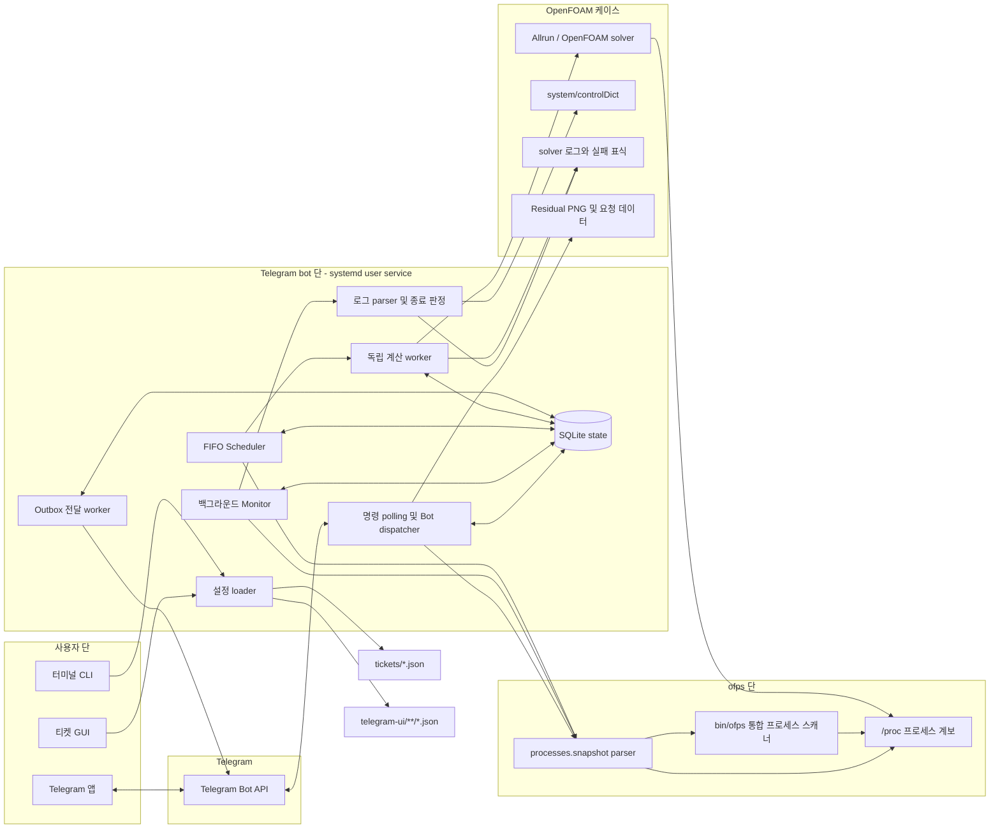

서비스 안에서는 세 흐름이 동시에 동작합니다.

1. 메인 루프는 Telegram `getUpdates` long polling으로 명령과 버튼을 처리합니다. 버튼 callback 확인은 별도 짧은 worker가 보내므로 실제 action은 확인 API 왕복을 기다리지 않습니다.
2. Monitor thread는 기본 5초마다 `ofps`를 실행하고 감지된 모든 케이스의 로그 상태를 갱신합니다.
3. Notification thread는 1초마다 SQLite outbox를 확인하고 미전송 알림을 재시도합니다.

메인 루프의 `/stat` 조회와 Monitor의 주기 조회가 겹치면 `SNAPSHOT_LOCK`이 한 번에 하나의 `ofps` scan만 실행시킵니다. application 호출은 `CFD_BOT_OFPS_MANAGED=1`로 scanner 내부 상태 동기화를 생략합니다. `/stat`은 즉시 표시하고, Monitor가 성공한 snapshot을 티켓 JSON과 SQLite에 반영합니다.

## 3. 계층별 기능

### 3.1 사용자 단

| 진입점 | 사용자가 하는 일 | 결과 |
|---|---|---|
| `/stat` | 현재 계산 확인 | `ofps` 즉시 scan에 나온 실행을 케이스당 한 줄로 수신 |
| `/data` | 등록 케이스와 데이터 종류 선택 | 상세 상태, Residual PNG, contour, CSV, 로그 등 요청 파일 수신 |
| `/queue` | 큐 확인·일시 정지·재개·개별/전체 선택·전체 해제·선택 대기 취소 | FIFO 작업 상태와 예상 대기시간 확인 |
| `/clean` | 현재 bot 대화 정리 | 봇이 추적한 사용자·봇 메시지 삭제 |
| `/start`, `/help` | 명령 확인 | 사용 가능한 명령 안내 |
| `cfd-ticket-gui` | 케이스 감시 규칙과 요청 데이터를 편집 | `tickets/*.json` 생성·검증·수정 |
| `python3 -m cfd_bot ...` | 운영·점검·큐 제어 | 설정 검사, 상태 JSON, monitor 1회 실행, 큐 조작 |

### 3.2 Telegram bot 단

| 모듈 | 책임 |
|---|---|
| `bot.py` | 사용자 인증, 명령 분기, 버튼 생성, `/stat`, `/data`, `/clean`, 알림 전달 |
| `monitor.py` | 주기적 `ofps` snapshot, 모든 외부 계산의 시작·소멸 감지, 미등록 케이스 자동 감시 설정 생성 |
| `processes.py` | `ofps` 실행·출력 parsing, 실제 경로 정규화, 소유 세션과 CPU 배치 계산 |
| `logs.py` | 다단계 로그 선택, incremental parsing, 진행값·residual·실패 패턴 수집 |
| `outcomes.py` | 종료 코드와 오류 증거를 우선 확인한 뒤 `controlDict.endTime`과 최종 `Time`으로 결과 판정 |
| `jobs.py` | FIFO scheduler, solver·monitor CPU 예약, 독립 worker, 후처리, 종료 이벤트 생성 |
| `artifacts.py` | Residual PNG와 요청 파일 검색, 종료 시 파일 snapshot 보관 |
| `storage.py` | 작업, 관측 상태, outbox, 메시지 ID, 실행시간 이력을 SQLite에 저장 |
| `telegram.py` | Bot API 호출, 긴 문장 분할, 파일 업로드, retry 정보, 메시지 삭제 |
| `config.py` | `bot.json`과 티켓 schema 검증, 경로 이탈 방지 |
| `ui.py` | `telegram-ui` namespace 로딩, format 검증, manifest 필수 키 검사, catalog 캐시 |
| `report.py` | compact `/stat`, 상세·완료·queue 문구 렌더링 |
| `run_views.py` | 현재 티켓 기반 작업 추적 여부와 실행 중 매크로 진행률·ETA 공용 집계 |
| `control.py` | 안전한 `controlDict` 읽기와 시작·종료값 추출 |
| `execution.py`, `cpu_allocation.py` | OpenFOAM 환경 검증, 실행 설정 적용, CPU topology 기반 자동 배정 |
| `tickets.py` | 티켓 상태 동기화, macro child 발행, 제출 수락 |
| `ticket_run.py` | 저장된 단일·macro 티켓의 실행 상태 확인과 queue 등록 |
| `ticket_chat.py` | Telegram 티켓 편집 session과 화면 흐름 |
| `editor.py` | GUI와 Telegram이 공유하는 티켓 저장·복제·삭제 service |
| `gui.py` | 티켓을 JSON 직접 편집 없이 관리하는 Tk GUI |

### 3.3 ofps 단

`ofps`는 다음 원시 정보를 제공합니다.

OpenFOAM 항목은 프로세스 이름 일치와 함께 실제 `system/controlDict`가 있는 case root를 확인한 경우에만 제공합니다. Basilisk 항목은 명시된 root 안에서 Makefile과 C source가 있는 case를 확인해야 합니다. case를 확인하지 못한 utility, symlink 설치 경로의 일반 실행 파일과 이름 오탐은 현황과 자동 알림 범위에서 제외합니다.

- 실행 엔진: OpenFOAM 또는 Basilisk
- 실제 계산 케이스 절대 경로
- supervisor PID, PPID, 프로세스 이름, 경과시간
- solver PID, 실행 모드, thread 수, CPU affinity, socket, NUMA, 경과시간
- 지정 CPU 사용 가능 여부와 다른 계산과의 중복 여부

Telegram bot의 adapter는 `ofps` 출력에 다음 처리를 추가합니다.

- `CASE:` 경로를 `resolve()`하여 티켓의 `case_dir`과 비교
- `/proc` 계보와 환경에서 SSH 주소, TTY, tmux/screen, systemd, background 소유자 추론
- 여러 MPI rank의 CPU affinity 합집합으로 실제 코어 수와 CPU 목록 계산
- 동일 프로세스 PID 재사용을 구분하는 boot ID·start tick identity 저장

실행 파일은 저장소의 `bin/ofps` 하나입니다. `/home/joon/.local/bin/ofps` symlink와 `bot.json.ofps_command`가 같은 파일을 가리킵니다. 이 파일은 일반 scan, `--watch`, `--check`를 직접 수행하고 bot 확장 option만 Python CLI로 연결합니다. 별도 legacy scanner와 fallback은 없습니다. 확장 option은 다음과 같습니다.

```text
--status  --json  --queue  --enqueue CASE  --bot
```

## 4. 유즈케이스 1: `/stat` 실시간 현황

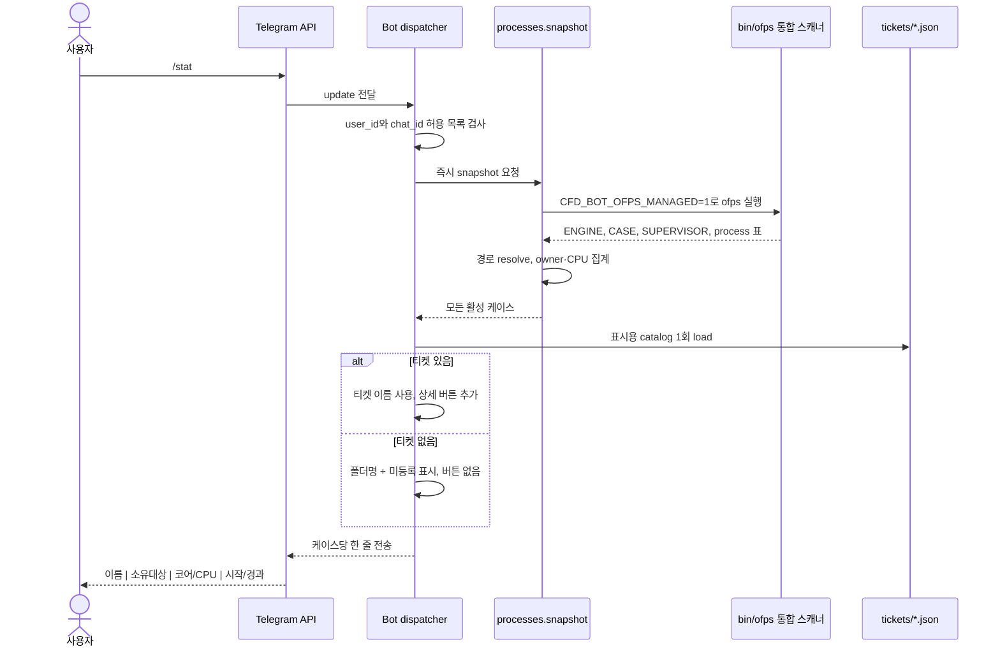

판정 규칙은 단순합니다.

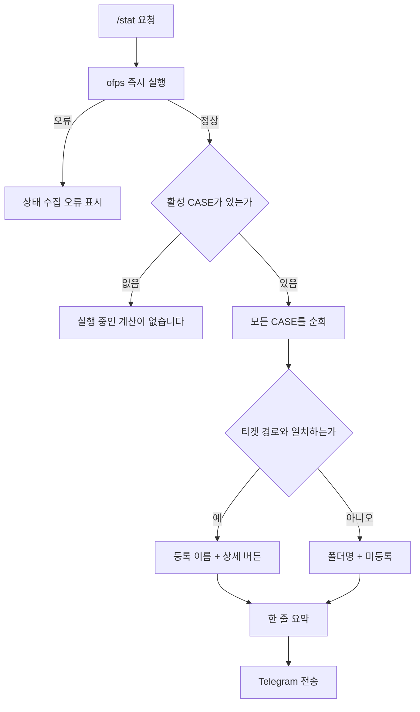

`/stat`에는 종료된 계산이 나오지 않습니다. watcher의 `running`, `succeeded`, `failed` 값도 `/stat` 목록을 결정하지 않습니다.

## 5. 유즈케이스 2: 등록 케이스 상세와 `/data`

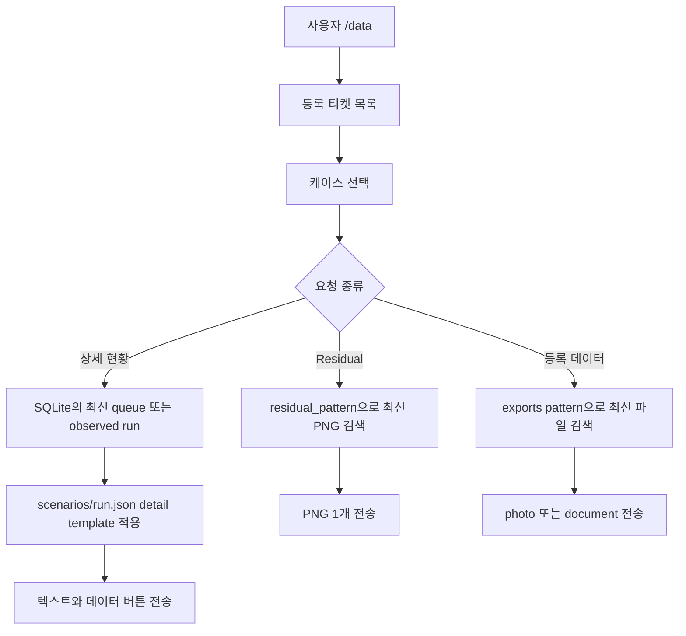

상세 현황은 현재 실행만 찾는 기능이 아닙니다. 등록 케이스의 가장 최근 managed job 또는 external observed run을 보여줍니다. `/stat`과 목적이 다릅니다.

파일 처리 규칙:

- 모든 경로는 케이스 디렉터리 내부의 상대 경로여야 합니다.
- Residual은 케이스가 이미 만든 PNG를 보내며 bot이 그래프를 생성하지 않습니다.
- export는 티켓의 `pattern`, `kind`, `max_files`를 따릅니다.
- photo가 Telegram 이미지 조건을 만족하지 못하면 document로 다시 전송합니다.
- 일반 document는 49 MiB, photo는 9 MiB 제한을 적용합니다.

## 6. 유즈케이스 3: 외부 계산 시작·종료 감시

이 흐름은 `/stat` 요청과 별개의 백그라운드 루프지만 입력 범위는 같습니다. `ofps`가 반환한 모든 `CASE:` 경로를 추적하므로 SSH, 터미널, tmux, systemd, `nohup` 또는 다른 스크립트에서 시작한 계산도 실행 방식과 무관하게 알림 대상입니다. 단, 감시 주기 사이에 시작하고 끝나 `ofps` snapshot에 한 번도 나타나지 않은 프로세스는 발견할 수 없습니다.

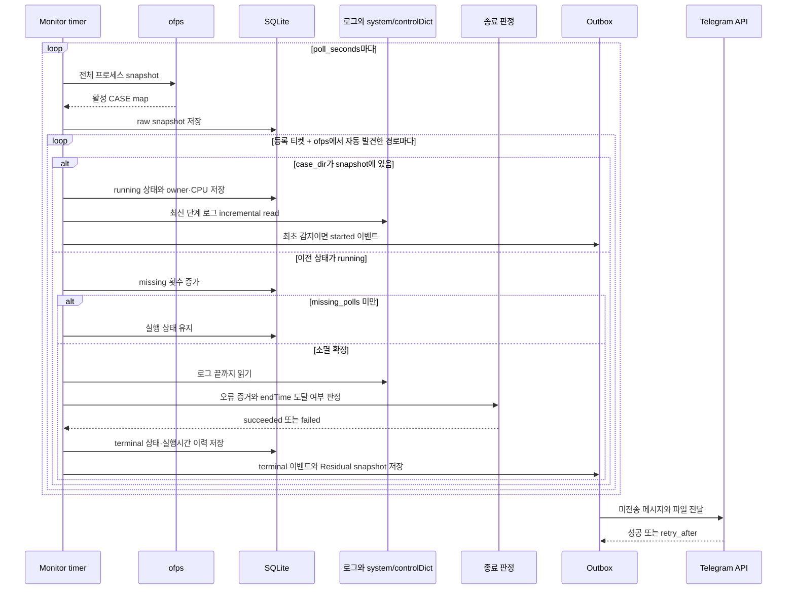

미등록 경로는 처음 보인 즉시 SQLite의 `auto_observed_roots`에 저장합니다. 이후 `ofps`에서 사라져도 종료 판정이 끝날 때까지 유지합니다. 케이스 최상위의 최신 `log*` 파일과 OpenFOAM 기본 fatal 패턴을 사용하며, 등록 티켓이 생기면 다음 주기부터 그 티켓의 이름·로그 순서·실패 패턴·Residual 규칙으로 전환합니다. 관리 큐에서 실행한 작업은 job watcher 한 곳에서만 처리해 중복 알림을 막습니다.

종료 판정 우선순위:

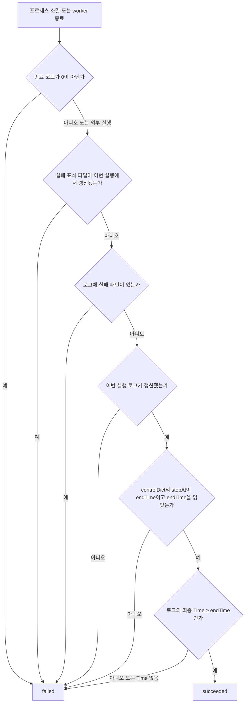

정상상태 계산에서는 `Time`이 반복 횟수이고 비정상 계산에서는 물리 시간입니다. 어느 경우든 선택된 최신 단계 로그의 최종 `Time`이 `system/controlDict`의 `endTime`에 도달해야 정상 종료입니다. 로그의 `End` 문구, 기존 `success` 패턴, `incomplete_status`는 최종 상태를 바꾸지 않습니다.

현재 GUI로 저장한 요청 데이터는 자동 첨부하지 않습니다. 종료 알림에는 `residual_pattern`에서 이번 실행 중 갱신된 최신 PNG 한 개만 snapshot으로 보관해 첨부합니다. `telegram-ui/scenarios/run.json`은 상세·종료 요약 문구를 전역으로 제어합니다.

## 7. 유즈케이스 4: FIFO 큐 실행

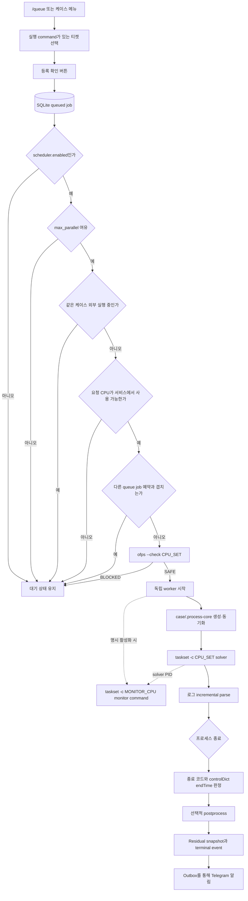

Managed job 상태는 다음과 같습니다.

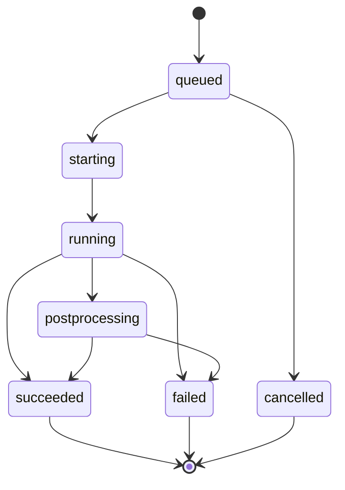

큐 자동 시작 여부는 현재 `scheduler.enabled`와 SQLite의 `queue_paused` 값으로 결정합니다. 개별 티켓은 세 UI의 실행 설정에서 케이스 설정 사용 또는 티켓 지정(NP·명령·CPU 정책)을 선택합니다. `resource_source=ticket`은 기존 케이스 NP보다 우선하며 매크로는 `resource_source=macro` 공통 설정을 child에 적용합니다. 두 명시 설정 모두 같은 가용 코어 배정과 worker 설정 반영 경로를 사용합니다. Child에서는 상속값을 확인하고 부모 매크로에서 편집합니다.

`resource_source=case`는 케이스별 `.process-core`가 있으면 이 파일의 안전한 literal NP·CPU_SET을 legacy `Allrun`·`config/*Run`보다 우선해 사용합니다. 같은 줄의 `; export NP`도 인식합니다. CPU 승인 뒤 worker는 `.process-core`가 없으면 생성하고, 자동 배정 또는 ticket/macro 출처이면 승인값과 동기화합니다. 기존 legacy 설정 반영도 유지해 `.process-core`를 아직 직접 사용하지 않는 케이스와 호환합니다.

선택적 `monitoring`은 실행 출처와 독립적인 공통 설정이며 기본값은 비활성입니다. 세 UI는 사용자가 별도 코어 배치를 활성화한 때에만 command 입력란을 표시하고 `monitoring` 블록을 저장합니다. Scheduler는 이 블록이 있을 때만 계산 CPU와 겹치지 않는 물리 CPU 1개를 `monitor_cpu`로 예약하고 worker는 solver 시작 뒤 해당 CPU에서 monitor command를 실행합니다. solver PID와 job 환경을 전달하고 monitor 종료 문제는 계산 판정과 분리해 기록합니다. 구현 흐름은 [HLD 실행 설정 도식](HLD.md#3-시스템-컨텍스트), [Issue #13 변경 이력](history/2026-10-02-monitoring-cpu-allocation.md), [Issue #16 변경 이력](history/2026-10-04-monitoring-opt-in-visibility.md)에 기록합니다.

큐 다중 취소는 세 UI가 공용 `cancel_queued_jobs`를 호출하고 `Store.cancel_queued`가 한 transaction에서 처리합니다. 선택 후 이미 시작된 작업은 그대로 두고 `unavailable`로 돌려 부분 상태 변화를 사용자에게 알립니다. 작업 큐와 티켓 관리 모두 개별 선택, 전체 선택, 전체 해제를 제공하며 Telegram 선택은 페이지 이동 중에도 유지됩니다.

웹의 티켓 선택은 편집 데이터를 읽는 동작이므로 저장된 최신 `ofps` snapshot으로 버튼 상태를 구성하며 전체 프로세스 스캔을 실행하지 않습니다. `/api/run`은 사용자가 실제 실행을 요청한 시점에 fresh snapshot을 검사해 실행 중인 케이스를 차단합니다. 이 경계는 [Issue #4 변경 이력](history/2026-09-28-web-ticket-selection-latency.md)에 기록합니다.

## 8. 유즈케이스 5: `/clean`

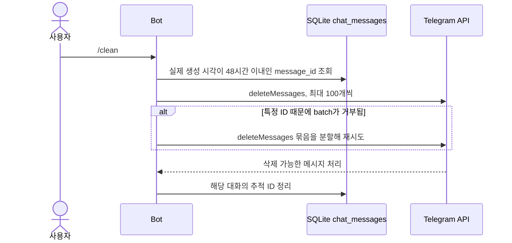

Telegram Bot API는 과거 대화를 다시 나열하지 않으므로 bot이 기록하기 시작한 이후의 메시지만 지울 수 있습니다. SQLite에는 대화당 최근 1000개 ID와 Telegram의 실제 메시지 생성 시각을 보관합니다. 48시간을 넘었거나 권한상 삭제할 수 없는 메시지는 Telegram 제한 때문에 남지만 다음 `/clean`의 배치 대상에서는 제거됩니다.

## 9. 유즈케이스 6: 티켓 편집

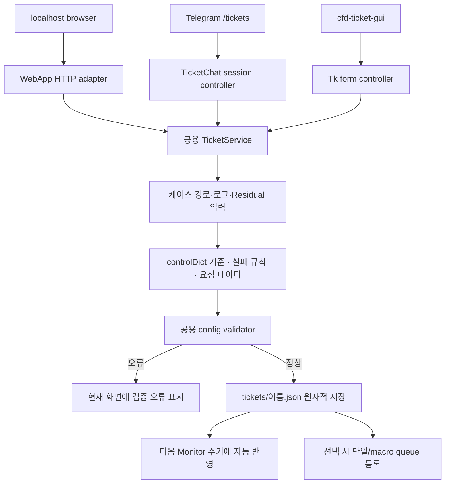

세 편집기의 공통 책임:

- 케이스 경로, 표시 이름, 로그 목록, Residual PNG 경로 관리
- `controlDict` 기반 정상 종료 안내, 실패 regex·표식, 알림 사건 관리
- `/data`에서 요청할 파일 등록
- 실패 패턴 template 저장과 재사용
- `TicketService`와 같은 validator로 저장 전 검사
- 단일 티켓 복제·삭제와 macro 직계 child 검색·발행. 검색은 매크로 루트의 직계 하위 폴더 중 바로 아래에 `Allrun`이 있는 폴더로 제한한다.

Telegram 편집 초안은 사용자·대화별 SQLite session에 저장하고, GUI는 로컬 form state, 웹은 브라우저 메모리의 draft를 사용합니다. 세 경로 모두 같은 atomic JSON 저장 로직과 `ticket-patterns.json`을 사용합니다.

### 9.1 웹 화면과 실행 흐름


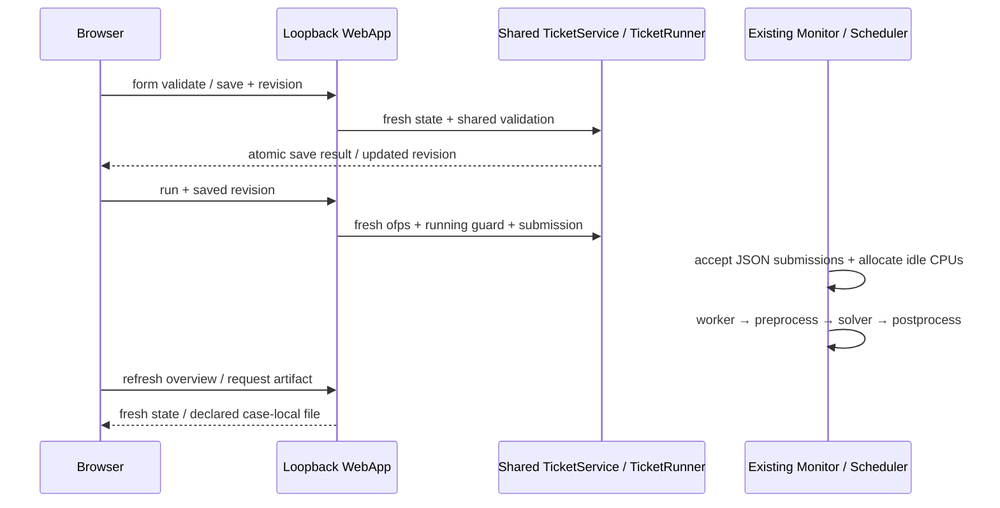

대시보드는 등록되지 않은 실행까지 표시하고 ofps 오류 시 마지막 snapshot임을 명시합니다. 증가 중인 로그의 작은 미처리 꼬리는 이미 파싱한 완전한 표본을 무효화하지 않으며, 다단계 로그가 `End` 뒤 새 `Time`으로 진행하면 이전 단계 성공 match를 해제합니다. 동일 실행에서 일시적으로 비어 온 ETA·진행률은 직전 유효값으로 안정화합니다. 10초 polling에서 실행·큐·이력 구조가 같으면 카드 DOM을 유지한 채 수치만 갱신합니다. 티켓 화면은 폼·macro 하위 목록·전체 선택·전체 해제·일괄 삭제를, 작업 큐는 pause/resume와 queued 다중 선택 취소를 제공합니다. 현재 티켓 JSON과 case directory가 일치하는 실행 이력은 추적 가능으로 표시해 결과 화면에 연결하고, active queue에서는 실제 계산 중인 행만 같은 링크를 활성화합니다. 실행 중인 매크로는 현재 child job ID 기준 완료/목표·경과·ETA·진행률을 표시합니다. 결과 화면은 선언된 Residual/export만 미리보기·다운로드합니다. `GET /api/browse`는 파일 선택용 목록을 제공하며 파일 내용은 artifact API의 허용 범위를 거쳐야 합니다.

웹은 기존 bot의 저장소를 공유하는 별도 user service입니다. 큐 컨트롤러와 알림 worker는 기존 bot 하나만 유지합니다. Telegram `/clean`처럼 채팅 메시지에 종속된 작업은 웹에서 Telegram에 부수 효과를 발생시키지 않습니다.

원격 사용은 `ssh -L local-port:127.0.0.1:8766 user@server`로 같은 HTTP 연결을 전달합니다. 외부 PC의 localhost가 browser Origin이 되므로 별도 웹 공개나 Tailscale API 설정 없이 기존 SSH 인증과 포워딩 정책을 사용합니다.

Windows/macOS 실행 프로그램은 이 연결을 더블클릭 동작으로 제공합니다. 기존 SSH config의 Host 선택 → SSH 연결 → 로컬 포트 열림 → 기본 브라우저의 순서이며, 기능 처리 자체는 서버 WebApp과 공용 도메인 서비스에 남습니다. 웹의 PC 실행 프로그램 메뉴에서 OS별 ZIP을 받을 수 있습니다.

## 10. 저장 데이터와 설정

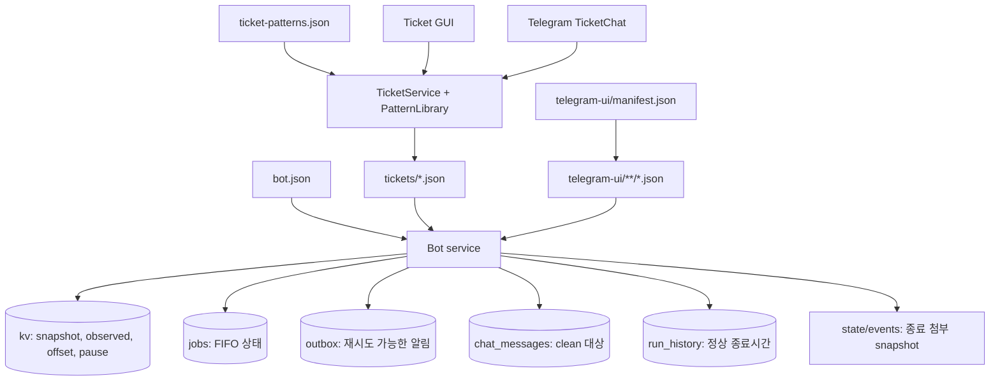

| 저장소 | 주요 내용 |
|---|---|
| `bot.json` | state 위치, UI 리소스 위치, `ofps` 명령, polling 간격, Telegram allowlist, scheduler 설정 |
| `tickets/*.json` | 케이스 경로, watcher 규칙, Residual PNG, 요청 데이터, 선택적 실행·모니터링 설정 |
| `case/.process-core` | 해당 케이스가 실행할 MPI rank `NP`와 허용 CPU 범위 `CPU_SET` |
| `telegram-ui/manifest.json` | 서비스 시작 시 검증할 필수 UI 리소스 키 목록 |
| `telegram-ui/strings.json` | 여러 메뉴와 시나리오가 공유하는 기호와 값 |
| `telegram-ui/menus/*.json` | Telegram 홈·케이스·큐·티켓 메뉴의 문구와 버튼 라벨 |
| `telegram-ui/scenarios/*.json` | 상태·데이터·실행·종료 판정·알림·오류 템플릿 |
| `state/state.sqlite3` | queue, 관측 상태, Telegram offset, outbox, 메시지 ID, 실행시간 이력 |
| `state/events/` | 종료 시점에 복사한 Residual 또는 자동 첨부 파일 |

`UiCatalog`는 service 시작 시 `manifest.json`의 필수 키, 모든 JSON object와 format template 문법을 검증합니다. 메뉴·시나리오 리소스는 프로세스에서 캐시되므로 수정 후 service를 재시작합니다.

## 11. 인증·오류 복구

- Telegram 요청은 `allowed_user_ids`와 `chat_ids`가 모두 일치해야 처리합니다.
- bot token은 JSON이 아니라 systemd 환경 파일에서 읽습니다.
- Telegram 오류 문자열에서는 token을 제거합니다.
- terminal 알림은 outbox에 먼저 저장한 뒤 전송하며, 실패 시 지수 backoff로 재시도합니다.
- 같은 사건은 `event_key + chat_id` unique key로 중복 발송을 막습니다.
- `ofps` scan 실패는 모든 계산이 종료된 것으로 해석하지 않고 monitor 장애로 기록합니다.
- 단일 daemon lock으로 같은 state directory를 두 서비스가 동시에 사용하지 못하게 합니다.
- 케이스 파일 경로는 `case_dir` 밖으로 벗어날 수 없습니다.

## 12. 저장소 기본 배포 설정

현재 저장소의 `bot.json`은 다음 값으로 배포되어 있습니다.

- Monitor polling: 5초
- 전역 기본 소멸 확인: 2회
- FIFO scheduler: 활성화, `max_parallel=1`
- 티켓 검색: `tickets/*.json`
- UI resource: `telegram-ui/`
- OpenFOAM 환경: `deploy/openfoam-env.sh`

티켓 개수와 내용은 운영 중 Telegram/GUI 편집으로 바뀌므로 아키텍처 상수로 취급하지 않습니다. `python3 -m cfd_bot --config bot.json check`가 현재 티켓 전체와 UI resource를 검증합니다.

등록되지 않은 새 계산도 `/stat`에 즉시 표시되고 자동 시작·종료 알림을 받습니다. 미등록 자동 감시는 최신 `log*`, OpenFOAM 기본 fatal 패턴과 `controlDict`만 사용합니다. 케이스별 로그 순서·실패 규칙·Residual 및 `/data` 버튼은 티켓을 등록해야 사용할 수 있습니다.
