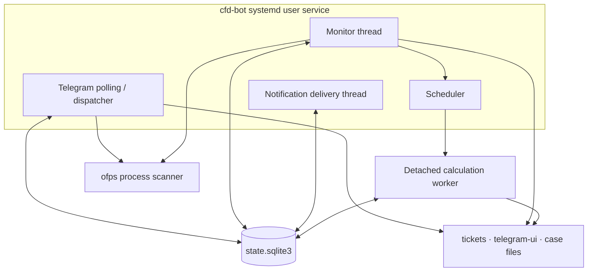

# ofps Telegram CFD bot — High-Level Design

이 문서는 시스템의 책임, 경계, 주요 데이터 흐름과 운영 원칙을 설명합니다. 클래스·함수·DB 키 수준의 설계는 [LLD.md](LLD.md), 전체 유즈케이스와 상세 흐름은 [ARCHITECTURE.md](ARCHITECTURE.md)를 참조합니다.


## 1. 목적과 범위

이 시스템은 Linux 호스트에서 실행되는 OpenFOAM/Basilisk 계산을 기존 `ofps`로 관측하고 Telegram으로 조회·알림·큐 실행 기능을 제공합니다.

핵심 기능은 다음과 같습니다.

- `/stat` 요청 시 그 시점의 `ofps` 결과를 케이스당 한 줄로 표시
- 실행 위치와 무관하게 `ofps`가 발견한 외부 계산의 시작·종료 감시
- `controlDict.endTime`과 로그의 최종 `Time`을 사용한 정상 종료 판정
- 등록 티켓의 Residual PNG와 요청 데이터 전송
- SQLite FIFO 큐, CPU 충돌 검사, 독립 worker를 통한 계산 실행
- Telegram과 GUI에서 같은 티켓 검증·저장 로직 사용
- Telegram 표시 문구와 버튼을 메뉴·시나리오별 JSON 리소스로 관리

## 2. 설계 원칙

### 2.1 실행 중 여부의 진실 원천

현재 실행 중인 계산은 watcher DB가 아니라 요청 시 새로 실행한 `ofps` snapshot으로 판단합니다. `/stat`과 백그라운드 Monitor가 같은 `processes.snapshot()` 경로를 사용하며, `SNAPSHOT_LOCK`으로 동시 프로세스 스캔을 직렬화합니다.

### 2.2 티켓은 관측의 전제 조건이 아님

티켓이 없는 케이스도 `ofps`에서 발견되면 자동 감시합니다. 티켓은 이름, 로그 순서, 실패 패턴, Residual, 요청 데이터와 선택적 실행 설정을 추가합니다.

### 2.3 종료 문구가 아닌 수치로 성공 판정

정상 종료는 다음 조건을 모두 만족해야 합니다.

1. 명시적인 비정상 종료 코드나 실패 증거가 없습니다.
2. 이번 실행에서 선택된 로그가 실제로 갱신됐습니다.
3. `system/controlDict`의 `stopAt`이 `endTime`입니다.
4. 로그의 최종 `Time`이 `controlDict.endTime` 이상입니다.

프로세스가 일찍 사라지거나 최종 수치가 부족하면 실패로 판정합니다.

### 2.4 상태 변경과 Telegram 전송 분리

Monitor와 worker는 알림을 SQLite outbox에 먼저 저장합니다. 전송 thread가 Telegram API를 호출하고 실패하면 지수 backoff로 재시도합니다. `event_key + chat_id` unique key로 같은 사건의 중복 발송을 막습니다.

### 2.5 표시 리소스와 동작 코드 분리

Telegram에 표시하는 고정 문구, 버튼, 명령 설명과 템플릿은 `telegram-ui/` JSON에서 관리합니다. `UiCatalog`는 시작 시 모든 리소스를 읽고 `manifest.json`의 필수 키, JSON 형식과 format placeholder 문법을 검증합니다.

## 3. 시스템 컨텍스트

```mermaid
flowchart LR
    USER[Telegram 사용자] <--> TG[Telegram Bot API]
    ADMIN[운영자] --> GUI[Ticket GUI / CLI]

    TG <--> BOT[CFD bot service]
    GUI --> TICKETS[tickets/*.json]
    TICKETS --> BOT
    UI[telegram-ui/**/*.json] --> BOT

    BOT --> OFPS[ofps]
    OFPS --> PROC[/proc 및 실행 프로세스]
    BOT --> CASE[OpenFOAM 케이스\ncontrolDict · 로그 · 결과 파일]
    BOT <--> DB[(SQLite state/outbox)]
```

| 외부 주체 | 시스템과의 관계 |
|---|---|
| Telegram 사용자 | 명령·버튼 요청, 상태·데이터·알림 수신 |
| Telegram Bot API | long polling, 메시지·파일 전송, 일괄 삭제 |
| `ofps` | 활성 계산, 프로세스 계보, 실제 CPU 배치 제공 |
| OpenFOAM 케이스 | `controlDict`, 로그, Residual, 후처리 파일 제공 |
| systemd user manager | 봇 서비스 실행·재시작과 환경 파일 주입 |
| 운영자 | 티켓·UI 리소스 관리, CLI 점검, GUI 편집 |

## 4. 컨테이너와 책임



서비스 프로세스 안에는 Telegram polling, Monitor, Notification delivery 세 흐름이 있습니다. Scheduler는 Monitor 주기에서 실행됩니다. 계산 worker는 봇 재시작과 분리된 새 세션으로 시작하며 SQLite를 통해 상태를 공유합니다.

## 5. 주요 유즈케이스

### 5.1 실시간 조회

`/stat → process_snapshot → ofps → 활성 CASE 정규화 → 티켓 이름 결합 → 한 줄 요약`

종료된 계산이나 SQLite의 과거 상태는 `/stat` 목록에 포함하지 않습니다.

### 5.2 외부 계산 자동 감시

`Monitor → ofps snapshot → 신규 CASE 시작 이벤트 → 로그 증분 수집 → 연속 소멸 확인 → 종료 판정 → outbox → Telegram`

SSH, tmux, systemd, `nohup`, 외부 스크립트 등 실행 주체와 관계없이 `ofps` snapshot에 나타난 계산을 감시합니다.

### 5.3 관리 큐 실행

`티켓 선택 → SQLite queued → 실행 환경 확인 → CPU 자동/수동 배정 → ofps --check → worker → 전처리 → solver → 종료 판정 → 후처리 → 알림`

한 케이스에는 동시에 하나의 활성 job만 존재할 수 있습니다. 매크로 티켓은 child를 지정 순서대로 원자적으로 등록합니다.

### 5.4 데이터 요청

`/data → 티켓 선택 → detail/residual/export 선택 → 안전한 case-relative 경로 확인 → Telegram photo/document`

Residual은 봇이 생성하지 않고 케이스가 만든 최신 PNG를 전송합니다.

### 5.5 메시지 정리

`/clean → 최근 48시간의 추적 message_id → deleteMessages 최대 100개 → 실패 batch 분할 → 로컬 추적 목록 정리`

## 6. 데이터 소유권

| 데이터 | 진실 원천 | 변경 주체 |
|---|---|---|
| 활성 계산 | 현재 `ofps` snapshot | 외부 프로세스와 `ofps` |
| 케이스 감시·실행 규칙 | `tickets/*.json` | Telegram editor, GUI, 운영자 |
| Telegram 표시 리소스 | `telegram-ui/**/*.json` | 운영자 |
| queue/observed/outbox | `state/state.sqlite3` | bot, Monitor, worker |
| 종료 목표 | 케이스 `system/controlDict` | 케이스 사용자 |
| 진행·실패 증거 | 선택된 solver 로그와 표식 파일 | solver/스크립트 |
| Residual·요청 데이터 | 케이스 파일 | 기존 후처리 스크립트 |

## 7. 배포 구조

- 단일 호스트의 systemd user service로 실행합니다.
- bot token은 `bot.json`이 아니라 권한 제한된 EnvironmentFile에서 읽습니다.
- `DaemonLock`이 같은 state directory를 사용하는 daemon 중복 실행을 차단합니다.
- `KillMode=process`로 bot만 재시작해도 이미 시작한 worker와 solver process group은 유지합니다.
- worker 환경에서는 bot token을 제거하고 OpenFOAM 환경만 전달합니다.

## 8. 신뢰성과 보안

- `allowed_user_ids`와 `chat_ids`를 모두 확인합니다.
- 티켓과 export 경로가 `case_dir` 밖으로 벗어나는 것을 거부합니다.
- symlink 탈출과 파일 크기 제한을 검사합니다.
- scan 실패를 모든 계산 종료로 해석하지 않습니다.
- worker PID는 boot ID와 process start tick을 함께 저장해 PID 재사용을 구분합니다.
- SQLite WAL, transaction, compare-and-swap 상태 변경과 unique index로 중복 실행을 막습니다.
- Telegram 오류에 bot token이 포함되지 않도록 제거합니다.

## 9. 제약

- 감시 주기 사이에 시작하고 끝나 `ofps`에 한 번도 나타나지 않은 계산은 발견할 수 없습니다.
- Telegram API 제한 때문에 bot이 추적하기 전 메시지나 삭제 가능 시간이 지난 메시지는 `/clean`으로 제거할 수 없습니다.
- 등록되지 않은 계산은 최신 `log*`와 기본 OpenFOAM fatal 패턴을 사용하므로 복잡한 다단계 계산은 티켓 등록이 필요합니다.
- UI 리소스는 프로세스에서 캐시되므로 JSON 수정 후 서비스를 재시작해야 합니다.

## 10. 관련 문서

- [LLD.md](LLD.md): 모듈, DB, 상태 전이, 함수 단위 흐름
- [ARCHITECTURE.md](ARCHITECTURE.md): 전체 구성과 유즈케이스별 sequence/flow chart
- [ofps-telegram-architecture.svg](ofps-telegram-architecture.svg): 한 장짜리 아키텍처 그림
- [all-feature-flows.svg](all-feature-flows.svg): 전체 사용자·백그라운드·운영 기능 플로우
- [../README.md](../README.md): 설치·설정·사용 방법
