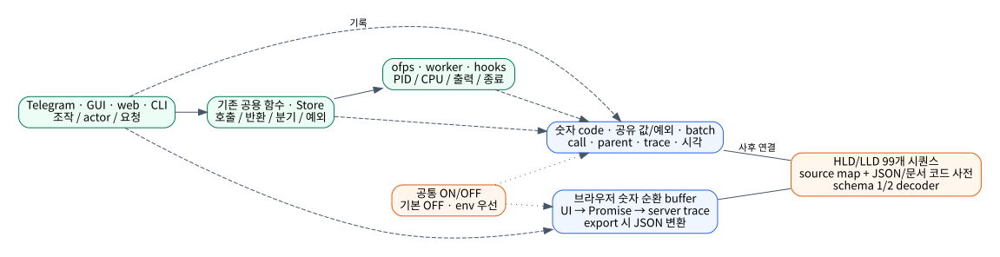
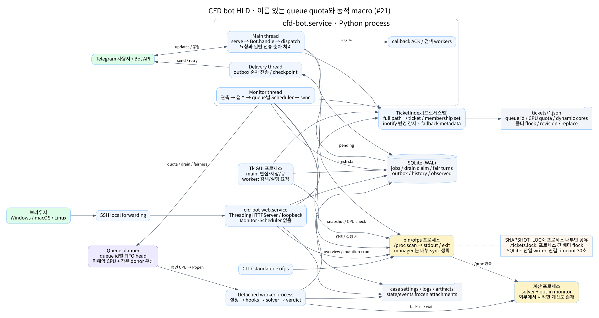
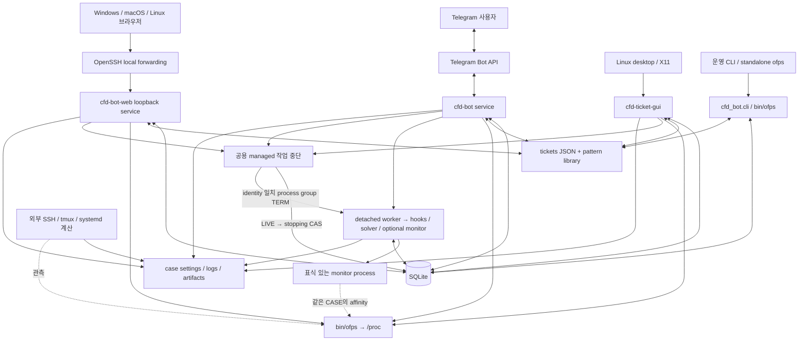
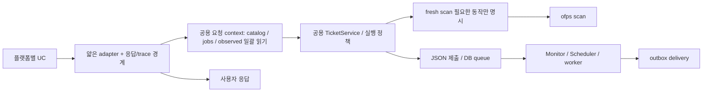

# CFD bot High-Level Design

> #30 수집 수준 분리: ON 기본 `basic`은 업무 경계·사용자 이벤트·티켓/작업 변경·경고/예외를 기록한다. 내부 정상 함수·분기/반복은 `detailed` 전용이다. [설계 이력](history/2026-10-07-diagnostic-logging-levels.md) · [최신 성능](analysis/diagnostic-level-performance.md).

> #18 사후 원인 분석 로그: [설정·기록·읽기](DIAGNOSTICS.md) · [모든 시퀀스 대응표](analysis/diagnostic-flow-coverage.md) · [ON/OFF 실측](analysis/diagnostic-performance.md). 업무 정책 변경 없이 기록만 추가하며 기본 OFF다.

> #20 운영 구조에 #21 이름 있는 대기열·동적 매크로, #22 `.process-core` CPU binding, #24 코어 수 기반 자동 quota, #25 `ofps` monitor CPU 관측, #26 SQLite lock 격리, #27 실행 중단을 반영했다. [#27 설계](history/2026-10-07-running-job-interruption.md).

> #20 운영 반영, 2026-10-04 · [기준 버전·플랫폼/UC 지도](ARCHITECTURE.md) · [함수 수준 LLD](LLD.md) · [근거와 성능 실험](analysis/performance.md). 개선 제안은 8절에 별도로 표시한다.

## 1. 목적·범위·품질 요구

대기 작업의 전체 선택·해제·취소 범위는 queue_id별이다. Web 카드, GUI 탭, Telegram
대기열 선택 화면이 같은 작업 ID를 기존 공용 취소 함수에 전달한다.

실행 작업 중단은 세 UI 모두 개별·다중 선택·전체 선택을 지원한다. 공용 batch helper가
선택한 ID만 기존 중단 함수로 전달한다. [설계 이력](history/2026-10-07-bulk-running-job-interruption.md).

#28은 계산 종료 뒤 남은 monitor가 외부 계산으로 재등록되는 중복 알림을 수정한다.
현황·CPU 점유에는 전체 snapshot을 쓰고 계산 생명주기에는 solver/계산 wrapper를 쓴다.
[원인·As-Is/To-Be](history/2026-10-07-monitor-tail-duplicate-notifications.md).

Linux 호스트의 OpenFOAM/Basilisk 계산과 cfd-bot 전용 monitor 프로세스를 `ofps`로 관측하고, Telegram·Tk GUI·localhost web에서 티켓과 실행 큐를 관리한다. 티켓이 없는 외부 계산도 관측한다. solver는 이 시스템 밖에서 이미 실행 중일 수도 있고 detached worker가 시작할 수도 있다.

설계 검토의 목적은 UC별 응답 지연을 설명하고, UI 응답에 필요하지 않은 작업·중복 읽기·직렬화·공유 자원 경합을 찾아 개선하는 것이다. 현재 p50/p95 운영 SLA는 정의되어 있지 않다. 45초 subprocess timeout이나 30초 SQLite busy timeout을 목표 응답 시간으로 해석하지 않는다.

| 요구 | 의미 | 현행 제약 |
|---|---|---|
| 상태 정확성 | `/stat`은 매 요청 fresh `ofps` 전체 CASE | watcher DB로 대체 불가; scan 대기 비용 존재 |
| 입력 응답성 | 화면 선택/편집은 계산 상태 수집과 결합을 줄임 | cached 실행 버튼은 stale일 수 있으며 실행 시 재검사 |
| 실행 일관성 | 케이스당 active job 하나, 51-core 관리 풀 안에서 CPU 중복 방지 | DB unique index·CAS와 최종 CPU 검사; 외부 실행까지 전역 transaction은 아님 |
| 복구 가능성 | daemon 재시작 뒤 job/outbox/session 복원 | 별도 worker와 DB 상태; API 전송 exactly-once는 아님 |
| 안전한 파일 접근 | 티켓·artifact 경로 검증 | case 파일과 legacy 설정의 실제 처리 범위는 LLD 참고 |
| UI 공용 정책 | 세 adapter는 TicketService/domain helper 사용 | [현행 우회 경로·미지원 기능](ARCHITECTURE.md#4-현행과-설계-원칙의-차이) 존재 |

## 2. 시스템 컨텍스트와 배포

진단 기록은 업무 DB와 분리된 프로세스별 파일 및 브라우저 로컬 버퍼로 간다. 동일 trace/parent를 통해 기존 실행 흐름을 관측한다. #30은 정적 숫자 코드·batch 값/예외 참조를 사용하고 browser는 export 시 JSON으로 변환한다. [별도 코드 사전](analysis/diagnostic-codebook.md)과 schema 1/2 decoder를 제공한다. 기록의 생성·직렬화·회전 외에는 실행 정책을 추가하지 않는다.

`cfd-bot.service`와 `cfd-bot-web.service`는 별도 프로세스다. Web은 Monitor/Scheduler/Delivery를 시작하지 않는다. 웹에서 수락한 JSON 제출은 봇 또는 `monitor`가 동작해야 DB 큐로 넘어간다. GUI와 CLI도 같은 저장소를 공유한다. `bin/ofps`는 자체 Bash scanner이며 추가 legacy scanner를 호출하지 않는다.

Web은 `127.0.0.1:8766`에 바인딩한다. Windows CMD/PowerShell과 macOS app은 기존 SSH Host 별칭을 선택하여 `127.0.0.1:local → SSH → 서버 127.0.0.1:8766`을 전달한다. 인증·키·ProxyJump는 OpenSSH가 해석하며 launcher가 별도 저장하지 않는다. launcher 종료 시 자신이 만든 연결을 정리한다.

## 3. 실행 단위와 스케줄링

| 실행 단위 | 진입점 / 실행 방식 | 점유하는 작업 | 응답/완료 경계 |
|---|---|---|---|
| 봇 main thread | `bot.serve`, updates 순차 for loop | 인증·routing·대부분의 도메인 호출·일반 메시지와 파일 전송 | handle 반환 후 update offset 저장 |
| callback ACK thread | callback마다 `start_callback_ack` | answerCallbackQuery 네트워크 호출 | 실제 action 완료와 독립 |
| Telegram 검색 thread | `TicketChat.scan.work` | snapshot·매크로 디렉터리 검색 | session 확인 후 RLock 아래 화면 전송 |
| Monitor thread | `run_once` 완료 뒤 `poll_seconds` 대기 | scan·관측·접수·복구·Scheduler·JSON sync | 한 tick 전체; 고정 주기 timer가 아님 |
| Delivery thread | `deliver` 완료 뒤 1초 대기 | pending 최대 10행을 순차 전송·checkpoint·retry | 수신자별 outbox row |
| detached worker | Scheduler의 `Popen(start_new_session=True)` | .process-core·hooks·solver·선택적 monitor·로그·판정 | terminal DB 상태; 다음 tick이 outbox 처리 |
| Web HTTP threads | `ThreadingHTTPServer` | 요청별 domain 호출·JSON 응답·파일 stream | 요청 하나의 HTTP 응답 |
| 브라우저 | JS event loop, fetch Promise | form·modal·DOM·화면별 10초 refresh + 탭 복귀 즉시 갱신 | HTTP 성공과 DOM 갱신은 구별 |
| Tk main thread | `root.mainloop` | 일반 편집·검증·저장·삭제·큐 조회 | 동기 callback 완료 시 화면 반영 |
| Tk 작업 thread | `scan_cases.work`, `submit.work` | scan/discover 또는 실행 요청 | Queue → `after(100, finish)` |
| CLI | `cli.main` | 선택 명령; monitor는 loop | stdout/exit code 또는 서비스 loop |

일반 Telegram 응답 전송은 outbox를 거치지 않으며 main thread를 점유한다. ACK를 비동기로 보낸다고 다음 사용자 요청까지 병렬 처리되는 것은 아니다. Tk의 일반 저장/검증은 main thread에서 수행한다. 브라우저가 비동기 fetch를 사용해도 현재 click 처리 중 `S.busy`와 `content.inert`가 다른 조작을 제한한다.

## 4. 데이터 소유권과 일관성

| 데이터 | 진실 원천 / writer | 독자 | 일관성·주의 |
|---|---|---|---|
| 현재 실행 CASE | `/proc` → fresh ofps | stat/Monitor/실행 검사/web fallback | OpenFOAM/Basilisk와 표식 있는 bot monitor를 case별 병합; 시점별 snapshot |
| 저장된 snapshot | Monitor·TicketRunner._snapshot·CLI·standalone ofps의 `kv.snapshot` | 편집 버튼·web 읽기 조회 | 여러 프로세스가 overwrite, 요청 간 단일 관측 시점 보장 없음 |
| 티켓 설정 | `tickets/*.json`, TicketService/publish_macro | catalog·UI·Scheduler | 폴더 flock + 파일별 replace; revision으로 사용자 편집 충돌 검사 |
| 티켓 queue 표시 | sync_ticket_states, request, accept_submissions | UI | 저장과 제출 분리; mode(run/queue), queue id·dynamic 여부를 보존하고 CPU 위치는 admission 때 배정 |
| jobs | Store + Scheduler + worker | 모든 UI·Monitor | `stopping` 포함 active case unique index, 상태 CAS, 즉시 요청 우선 + 이름 있는 대기열별 FIFO |
| queue drain/fair turn | Scheduler의 SQLite kv | Scheduler | oversized 동적 head 하나의 donor drain claim, 실행 뒤 donor 대기열별 1회 우선권 |
| 외부 observed | Monitor의 `kv.observed:<root>` | 상세·실행 guard·동기화 | monitor-only는 새 실행이 아님; 계산 소멸 연속 확인 후 종료; scan 실패는 소멸로 간주하지 않음 |
| outbox | Monitor/Scheduler의 Store.event | Delivery | 기존 event+recipient는 read 단계에서 종료; 신규 recipient만 INSERT·retry/checkpoint; Scheduler는 outbox/발행 marker가 없는 terminal job만 처리 |
| 성공 이력 | Store.remember_run | ETA/run_views | 케이스별 최대 20개 저장, 비교 가능한 최근 5개 사용 |
| 종료 파일 snapshot | worker/terminal_event의 state/events | Delivery | 다음 계산의 덮어쓰기와 분리 |
| UI session | Telegram kv / GUI 메모리 / web S.draft | 해당 adapter | Telegram은 재시작 복원; GUI/web draft는 지속 저장 아님 |
| 문구·패턴 | telegram-ui JSON / ticket-patterns.json | UiCatalog / PatternLibrary | Telegram 고정 문구는 manifest 검증; Tk/web 표시 문구는 별도 코드 |

`revision()`은 queue와 macro 행의 state/result/reason/job_id를 제외한 SHA-256이다. 감시 갱신은 편집 충돌로 취급하지 않는다. 여러 JSON 변경에는 rollback이 있지만 전원 장애까지 포함한 다중 파일 ACID transaction은 아니다.

## 5. 공유 자원·직렬화·대기 경계

| 자원 | 범위 / 획득 위치 | 보호 구간 | 병목/정확성 함의 |
|---|---|---|---|
| `SNAPSHOT_LOCK` | Python 프로세스 내부 threading.Lock | subprocess.run만; parse는 lock 밖 | 같은 봇의 stat/Monitor/검색 순차화; web/CLI/worker와 전역 공유 안 됨. lock 대기 timeout 없음 |
| `.tickets.lock` | 폴더별 flock, 프로세스 간 | catalog 변경 조회·cold 읽기, open/save/delete/request, 상태 파일 갱신 | 읽기도 배타 lock. 저장 검증·fsync·macro child 반복이 다른 읽기를 대기시킴 |
| `TicketChat.lock` | TicketChat 인스턴스 RLock | handle 전체, 검색 결과 반영, render의 API 호출 포함 | 한 사용자의 느린 API 호출이 다른 session 처리·검색 결과 반영에 영향 |
| SQLite writer | DB 파일; connect마다 timeout=30, WAL | BEGIN IMMEDIATE 또는 쓰기 transaction | 별도 연결/프로세스도 writer 경쟁. live child를 가진 worker는 locked/busy를 재시도해 DB 경합으로 solver를 종료하지 않음 |
| daemon.lock | state 디렉터리 flock NB | bot/monitor 전체 생애 | 중복 scheduler 프로세스 방지; web은 별도 lock 미사용 |
| API 네트워크 | Telegram.call | 일반 30초, upload 90초; updates 20초 | main 요청/파일 전송 및 Delivery batch의 순차 대기 |
| GUI/Web 조작 상태 | run_busy/scan_in_progress, S.busy/S.refreshing | 같은 UI 동작 재진입 제한 | 서버 공용 lock과 다른 개념; web 표시 fallback scan은 같은 process에서 합침 |

일반적인 잠금 순서는 snapshot lock 해제 → ticket flock → 필요한 DB transaction이다. catalog는 여러 폴더를 정렬하여 잠근다. TicketRunner는 fresh scan을 ticket lock 전에 실행하지만 lock 안에서 멤버별 observed와 jobs를 읽는다. 이 설명은 정적 경로 조사이며 모든 외부 프로세스와의 교착 부재를 증명한 것은 아니다.

## 6. 주요 end-to-end 경로

| UC/BG | 요청 critical path | 응답 뒤 계속되는 작업 |
|---|---|---|
| UC-02 Telegram stat | polling → handle → snapshot 대기/실행/parse → catalog → compact text → sendMessage | 별도 Monitor가 상태 동기화 |
| UC-09 편집 열기 | open/load/검증 → cached state DB 읽기 → 화면 | Monitor가 다음 snapshot 갱신 |
| UC-12 저장 | 폼 변환·색인 중복 검사 → revision/guard → atomic JSON → 화면 | 저장만 수행; 실행·큐 등록은 UC-18 |
| UC-18 공용 실행 | fresh scan → 51-core 용량·멤버·revision 검사 → 동적 macro는 첫 child NP로 즉시 실행 판정·전체 최대 NP로 실행 가능성 검사 → mode 제출 → 응답 | Monitor 접수 → 현재 batch head NP에서 quota/CPU 자동 배정 → 독립 병렬 worker |
| UC-02 web refresh | 최신 snapshot 읽기 → 화면별 jobs/증분 logs → metadata 조건부 응답 → DOM 상태 갱신 | visible/idle 10초 + 복귀 즉시; GET 쓰기 없음 |
| BG-02 종료 | 연속 missing → 최신 로그·control 판정 → frozen payload → outbox | Delivery retry와 메시지/첨부 전송 |
| BG-04 managed 종료 알림 | 미발행 terminal job 조회 → frozen payload 재사용 → outbox → 발행 marker | 다음 tick부터 outbox 또는 marker로 제외 |
| UC-28 실행 중단 | UI 확인 → LIVE를 stopping으로 CAS → 저장된 PID identity 재검증 → child process group TERM | worker가 최대 10초 뒤 KILL하고 interrupted 확정; 복구 루프가 소실 worker 보완 |

세부 함수·반환 계약은 [LLD](LLD.md)에 있다. 큐 등록 응답은 solver 시작/완료가 아니다. `TicketRunner.request`의 성공은 JSON 제출의 기록 완료이며 DB 큐 접수도 아직 아닐 수 있다.

monitor는 worker가 전달한 case/job/monitor CPU 표식 또는 TCB `Allrun`이 전달한 `TCB_MONITORED_SOLVER_PID` 표식으로 `ofps`에 잡힌다. 후자는 외부에서 시작한 TCB 계산에도 적용된다. scanner는 유효한 `system/controlDict`와 process cwd를 확인한 뒤 `ENGINE: Monitor`로 출력한다. 같은 CASE의 solver와 monitor affinity는 `parse_snapshot`에서 합쳐지므로 `/stat`, web 현황, scheduler 및 `ofps --check`가 동일한 실제 CPU 집합을 사용한다. active job DB의 monitor 예약은 보조 상태이며 CPU 집합은 중복 합산되지 않는다.

매크로의 로그·Residual·요청 데이터 pattern은 각 child case root에 적용되는 공통 상대경로다. Web 파일 선택기는 하위 케이스 검색이 끝난 뒤 첫 child를 기준으로 경로를 만들며, child가 없는 새 매크로에서는 부모 디렉터리를 대신 사용하지 않고 선택을 막는다.

대기열 수에는 고정 상한이 없다. 최상위 티켓에는 `execution_queue.id`만 저장하며 이 값이 FIFO 단위를 정한다. 일반 티켓과 고정 매크로는 FIFO head의 실제 NP와 선택적 monitor 1코어가 quota 크기이고, Scheduler가 admission 때 겹치지 않는 CPU 위치를 자동 배정한다. 케이스 설정을 쓰는 티켓은 `.process-core`/`Allrun`의 NP를 읽는다. `dynamic_cores=true`인 매크로는 고정 quota를 소유하지 않는다. 실행 버튼은 첫 child가 지금 들어갈 수 있는지만 판단하고, 전체 child 최대 NP는 51-core 관리 한도를 넘는 잘못된 매크로를 거절하는 데만 쓴다. 즉시 실행 batch도 queued 상태인 현재 child 하나만 Scheduler candidate가 되며, 다음 child는 앞 child가 끝난 뒤 자기 NP로 다시 admission된다. 부족하면 작은 고정 대기열부터 필요한 만큼 donor로 선택한다. `mode=run`으로 제출된 동적 macro에도 같은 drain·fair-turn 정책을 적용한다. donor의 실행 중 작업은 강제 종료하지 않고 자연 종료시키며 새 head admission만 잠근다. 동적 작업 종료 뒤 사용한 donor 대기열의 head를 각각 한 번 admission한 후 다음 동적 작업이 drain claim을 얻는다. 기존 `{id,cpu_set}` 티켓과 저장된 `queue_cpu_set` job은 호환 입력으로만 읽는다.

#20 구현은 공용 TicketIndex의 이벤트 기반 변경 감지와 전체 경로 색인을 사용한다. Monitor는 현재 실행과 이전 실행·종료 확인 중 대상만 감시하고, jobs/observed 상태 변화는 SQLite journal로 해당 티켓과 부모에 반영한다. `/stat`의 fresh ofps 경로는 유지한다. 전체 검증은 cold rebuild, 명시적 check, 변경 추적 손실 때 수행한다. [함수·자료구조·복구 LLD](LLD.md#catalog)를 참조한다.

기존 운영 코드의 O(N²) membership 표본은 16.56–19.68초였으며 managed ofps는 약 1.06초였다. 이는 구현 전 기준이다. 큐 전체 ETA/history 계산과 여러 Telegram 메시지의 순차 전송은 이번 색인 변경 뒤에도 남는 비용이다. [운영 기준 측정](analysis/live-bottlenecks.md) · [격리 성능 검증](analysis/ticket-index-results.json).

## 7. 실패·보안·운영 경계

- 허용된 Telegram sender와 chat을 모두 검사한다. 오래된 편집 callback token은 거절하고 초안은 유지한다.
- Web은 loopback Host/Origin/Fetch-Site, POST CSRF·JSON·2 MiB body를 검사한다. 파일은 선언된 artifact 목록과 열린 descriptor를 다시 검증하며 최대 49 MiB다.
- scanner 오류는 빈 정상 결과로 숨기지 않는다. web overview만 명시적 error와 함께 마지막 snapshot을 반환한다. Telegram stat의 timeout 예외 처리 범위는 [Telegram LLD](lld/telegram.md#uc-02)에 별도 기록했다.
- worker가 사라져도 solver/hook identity가 살아 있으면 CPU 예약을 유지한다. 시작 grace는 60초다. pause는 새 실행 admission만 막는다. 명시적 중단은 `stopping` 상태에서 CPU 예약을 유지한 채 저장된 identity가 일치하는 managed child process group만 종료한다.
- worker가 live solver·monitor·hook 상태를 저장할 때 SQLite locked/busy가 발생하면 같은 DB 쓰기를 재시도한다. 저장소 경합을 계산 실패로 판정하거나 child 종료 조건으로 사용하지 않는다.
- 정상 종료는 stopAt와 최신 Time 수치 및 실패 증거로 판정한다. 실제 코드의 ticket end_time override 및 legacy export 첨부 예외는 [차이 목록](ARCHITECTURE.md#4-현행과-설계-원칙의-차이)에 적었다.
- token은 환경변수로 주입하고 worker 환경에서 제거한다. 문서·계측에는 token/인증값·운영 티켓 내용을 포함하지 않는다.
- outbox 전송 offset 저장 전 프로세스가 종료되면 이미 성공한 API 호출을 반복할 수 있다. retry는 지수 backoff 및 retry_after를 더한다.

## 8. 남은 개선 방향 (미구현)

공용 티켓 색인과 Web 버튼 상태의 DB 일괄 읽기는 #20에서 구현했다. 다음 후보는 큐 ETA/history의 요청 내 재사용, 큐 응답 페이지화와 필요한 ETA만 계산, session lock 밖 전송과 순서 보장, 일반 dispatcher 작업의 제한된 병렬 처리, 실행 진입점의 공용화다. 각 제안의 근거·우선순위·비용·회귀 조건은 [성능 문서](analysis/performance.md)에 정리한다. `/stat`을 cached watcher 결과로 바꾸는 제안은 포함하지 않는다. To-Be 도표는 현재 동작이나 개선 완료를 뜻하지 않는다.

### 티켓 삭제의 실행 상태 경계

세 UI의 삭제는 공용 TicketService가 현재 ofps·SQLite 실행/대기 상태로 판정한다. 실행·대기 중인 매크로와 종속 child를 보호하고, 나머지는 부모 미선택·목록 불일치와 관계없이 삭제할 수 있다. 확인 화면은 삭제 가능 수와 보호 이유를 표시하며 비활성 부모의 참조도 함께 정리한다. [공용 삭제 흐름](diagrams/D-05.svg) · [변경 이력](history/2026-10-08-ticket-deletion-activity.md).

중단·완료 후 monitor만 남으면 공용 `processes.calculation_record`로 계산 상태에서 제외한다. 티켓 편집은 허용하되 ofps 현황과 CPU 배정에는 해당 모니터의 점유를 유지한다.

웹 조회는 [2026-10-08 변경](history/2026-10-08-web-incremental-refresh.md)에 따라 설정 목록과 실행 상태를 분리한다. 티켓 목록 버전은 queue 진행 상태를 제외한 revision에서 만들며, 실행 용량은 선택 티켓만 계산한다. 실제 실행/삭제와 Telegram `/stat`은 fresh 검사를 유지한다.
