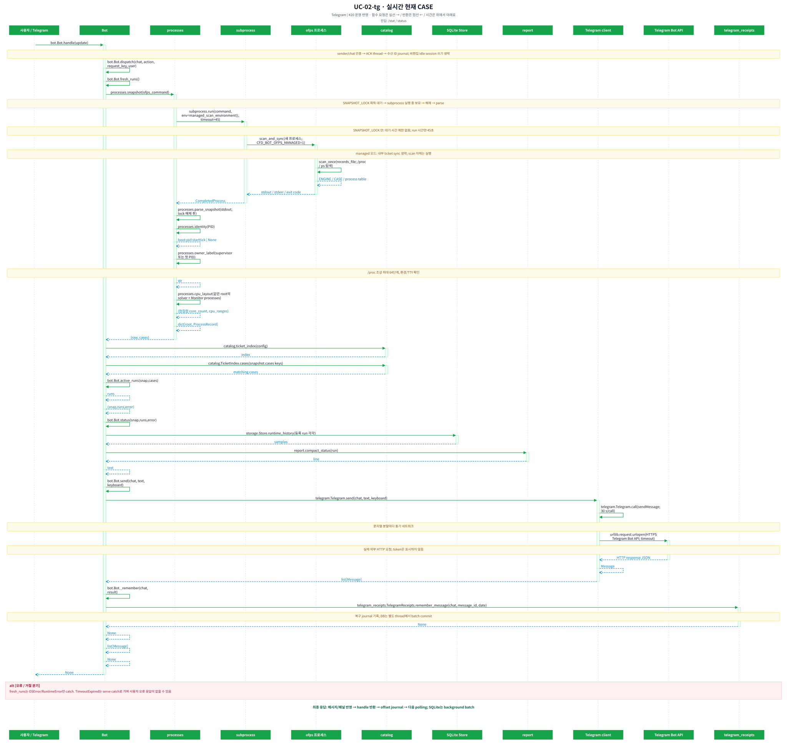
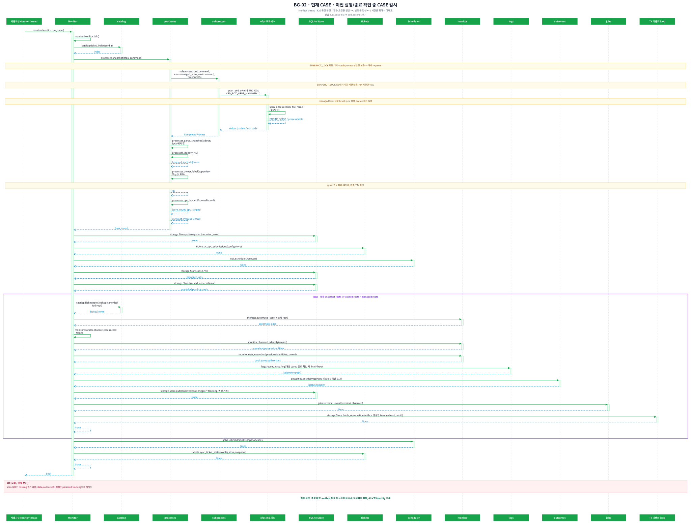
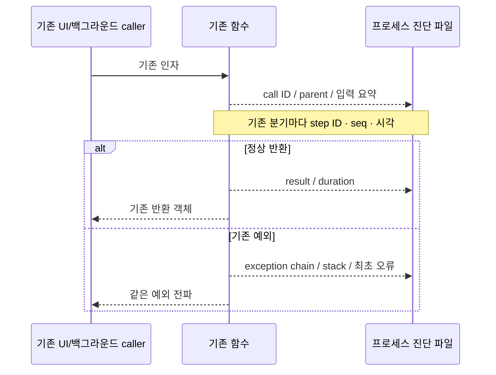

# CFD bot Low-Level Design — 함수 요청·응답 시퀀스

> #18 사후 원인 분석 로그: [설정·기록·읽기](DIAGNOSTICS.md) · [모든 시퀀스 대응표](analysis/diagnostic-flow-coverage.md) · [ON/OFF 실측](analysis/diagnostic-performance.md). 업무 정책 변경 없이 기록만 추가하며 기본 OFF다.

> #20 운영 구조와 #21 이름 있는 대기열·동적 매크로, #24 코어 수 기반 자동 quota, #25 `ofps` monitor CPU 관측, #26 terminal outbox 1회 처리를 반영했다. [#25 변경 이력](history/2026-10-07-ofps-monitor-cpu-observation.md) · [#26 변경 이력](history/2026-10-07-terminal-event-db-lock.md).

> 2026-10-04 현행 코드 기준. [기준 버전·유즈케이스 지도](ARCHITECTURE.md) · [HLD](HLD.md) · [실측과 병목 후보](analysis/performance.md). 사용자 요청에 따라 **호출 주체를 가로로 배치한 시퀀스 다이어그램**을 중심으로 구성한다.

## 1. 유즈케이스별 그림부터 보기

**[전체 UC × 플랫폼 그림 목록](lld/flows.md)**에서 원하는 동작을 선택한다. 각 플랫폼 문서에는 그림을 직접 삽입했다. SVG는 원본 크기로 확대할 수 있으며 공용 함수의 호출 화살표에서 D-xx 상세 그림으로 이동할 수 있다.

| 구분 | 함수 요청·응답 그림 |
|---|---|
| Telegram 명령·callback·대화 | [Telegram LLD](lld/telegram.md) |
| cfd-ticket-gui 이벤트·화면·작업 thread | [GUI LLD](lld/gui.md) |
| Browser → HTTP → 공용 서비스 → 화면 | [Web LLD](lld/web.md) |
| CLI·launcher·scanner·Monitor·Scheduler·worker·알림 | [Runtime LLD](lld/runtime.md) |
| 공용 함수 내부 | [도메인 상세 시퀀스](lld/domain.md) |

그림의 실선은 함수 요청, 점선은 반환이며 시간은 위에서 아래로 진행한다. 같은 주체 내부 호출은 self-call로 표시한다. 보라색 `loop` 프레임은 내부 반복 범위이며 노란 주석은 lock·조건·비동기 경계다. `alt` 영역은 실패 응답/전파를 기록한다. 한 UC에 여러 action이 있으면 호출 인자에 해당 조건을 표시하며, 모든 action이 한 요청에서 실행된다는 뜻이 아니다. 실제 시그니처와 소스 위치는 [함수 색인](analysis/function-index.md)에 연결한다.

## 2. 데이터 계약

아래 타입 이름은 문서상 별칭이다. 현재 Python은 주로 dict/list를 사용하며 이 이름의 dataclass가 존재하는 것은 아니다. `None`은 반환값 없음과 데이터 부재를 문맥에 따라 구분한다.

| 계약 | 주요 필드 / 타입 | 생성·소비 |
|---|---|---|
| BotConfig | `_path, state_dir, _ui_dir: str`, `ofps_command: list[str]`, `poll_seconds: number`, `telegram, scheduler: dict` | load_bot → 모든 서비스 |
| Ticket / Case | `_root, _config: str`, `task_type: single/macro`, `role: alone/child`, `watcher, queue, execution_queue: dict`, `dynamic_cores: bool`, `exports: list`, 실행 설정 | load_case; cases_for는 유효 single/child만 반환 |
| FormValues | `_source: dict`, 입력용 문자열·bool·list; `queue_id`, `dynamic_cores`, macro row별 `cores` | form_values ↔ form_document |
| Draft | `values, filename, current: str|None, revision: str|None, dirty: bool` | TicketService.new/open/duplicate → adapter |
| Snapshot | `raw: str`, `cases: dict[root, ProcessRecord]`; caller가 `at: float` 부여 | processes.snapshot; 저장 여부는 caller별로 다름 |
| ProcessRecord | `root, engines[OpenFOAM|Basilisk|Monitor], processes[], supervisors[], owner, actual_cores, actual_cpu_list`; 같은 root의 solver·monitor affinity 합집합 | parse_snapshot → UI/Monitor/CPU admission |
| RunState | `state`, `run_enabled`, `queue_enabled`, `capacity/used/free/required`, `queue_id/queue_quota/queue_required/queue_max_required/queue_dynamic`, `availability_message` | TicketRunner.state/_state → 세 UI 실행·큐 버튼; 동적 macro의 required는 현재 head, max는 전체 설정 검사 |
| RunResult | `already_queued: bool`, `request_id: str|None`, 신규 수락 시 `count: int`, queue mode이면 저장된 profile 사용 | TicketRunner.request → UI; 아직 DB job이 아닐 수 있음 |
| Job | `id, case_root, status, created, case, telemetry`, `queue_id, dynamic_cores`, admission 뒤 `queue_cpu_set`, optional `borrowed_queues, batch, started, finished, phase, *_pid, *_identity, terminal_event_published` | Store ↔ Scheduler/worker |
| Observed | Job 유사 + `external=True, missing:int, log_path, owner/CPU` | Monitor.observe → kv |
| Telemetry | `time, execution, clock, rate_samples, errors, tail`, `inode, offset, backlog, missing, log_path` 등 | logs.read_log/recent_case_log |
| Estimate | `remaining_seconds:number|None, progress:number|None, basis:str`, optional target/expected_seconds | logs.estimate → report/run_views/web |
| DeletionPlan | `names:list[str], revisions:dict[name,hash]` | deletion_preview → 사용자 확인 → delete_many |
| CancelResult | `cancelled:list[id], unavailable:list[id]` | cancel_queued_jobs → 세 UI/CLI |
| FileItem | `path, kind:photo/document, caption` | residual_files/freeze_exports → Telegram.file |
| Outbox row | `id,event_key,chat_id,body,sent,attempts,next_attempt` | Store.event → pending → deliver |

## 2.1 공용 티켓 색인 — cold 검증과 warm 조회

`config.cases_for(bot)`와 `tickets_for(bot)`은 공용 `catalog.ticket_index(bot)`을 사용한다. `cases_for(bot, tickets=...)`는 명시적으로 전달된 목록에 선형 membership 검사를 수행한다. `/stat`은 fresh ofps snapshot의 root만 `TicketIndex.cases(roots)`로 조회한다.

| 조건 | 실행 함수·반환 | 검증 범위 |
|---|---|---|
| 프로세스 최초 조회 / 설정 registry 변경 | `TicketIndex.refresh → load_case → active_cases` | 전체 JSON, 중복 root, 소속 |
| 변경 없음 | `FolderWatch.drain → TicketIndex.cases/lookup` | JSON 재검증 0회, 반환은 독립 사본 |
| 파일 추가·외부 편집·rename·삭제 | `refresh → load_case(changed)` | 바뀐 문서만 재검증; 메모리 catalog 관계 재계산 |
| 이벤트 overflow·폴더 교체 | watch 재생성, 전체 rebuild | 신뢰가 끊긴 색인 복구 |
| Linux 이벤트 지원 불가 / 동적 glob | metadata 비교 → changed load_case | O(T) metadata 조회, 변경 없는 JSON은 재검증하지 않음 |
| CLI `check` | `cases_for(force=True)` | 강제 전체 검증 |
| 편집 UI | `folder_index(strict=False)` | invalid 문서를 오류로 표시; 정상 문서 편집·정리 가능 |
| 실행 요청 / Scheduler 시작 | `TicketRunner._members(fresh=True)` / `load_case(target)` | 대상 실행 설정·경로 재검증 유지 |

색인 키는 디렉터리 basename이 아닌 정규화된 전체 경로다. macro별 `(ticket full path, case root)` set을 만들고 child는 set membership으로 검사한다. 부모 없는 staged child는 등록 CASE에서 제외한다. 전체 관계 재계산은 O(T+M)이며 파일 경로 정규화가 포함된다. 변경 없는 조회에서는 이 단계도 생략한다. 별도 수동 hash JSON은 없다.

폴더별 기존 배타 flock을 먼저 잡고 catalog mutex를 잡는다. 같은 스레드의 ticket lock은 재진입 가능하며 다른 프로세스의 JSON 발행과 상호 배제된다. validation 실패로 소비한 이벤트는 다음 조회에서 전체 rebuild로 복구한다. 캐시가 실행 권한의 근거를 대체하지 않는다.

## 2.2 감시 대상과 증분 상태 반영

`Monitor.tick`은 fresh snapshot과 SQLite `observed_tracking`의 합집합에서 managed worker CASE를 제외해 `observe(case, record|None)`한다. 티켓이 없는 CASE도 `automatic_case`로 감시한다. 이전에 실행 중이었지만 이번 snapshot에서 사라진 CASE는 `missing_polls` 동안 유지하고 최신 로그·stopAt/endTime으로 판정한다. outbox 저장이 완료된 terminal observation만 추적에서 제거한다.

`observed_identity`는 boot/PID/starttick 식별자를 저장한다. `new_execution`은 동일 경로의 새로운 실행을 구별한다. 같은 supervisor 아래 solver 단계 교체는 같은 실행이다. 이전 실행 종료 증거 없이 새로운 실행이 시작되면 이전 실행은 interrupted로 기록하며 새 로그를 이전 실행의 성공 근거로 사용하지 않는다.

`Store`의 jobs INSERT 및 status/reason UPDATE, observed kv 쓰기는 SQLite trigger로 `ticket_changes`를 같은 트랜잭션에 기록한다. 기존 worker의 SQL도 trigger를 거친다. 최초 schema 전환에서 기존 jobs/observed를 한 번 복구 대상으로 넣는다. 작업 ID·순서·body는 그대로 유지한다.

`sync_ticket_states`는 state 디렉터리 lock으로 전체 발행을 직렬화한다. 대상은 현재 snapshot roots ∪ index 변경 roots ∪ journal roots이다. `jobs_for_roots`와 `get_many`로 해당 작업만 읽고 child/single의 queue, 관련 macro row·집계를 갱신한다. 새 request_id가 감지되면 그 제출을 보존한다. 모든 JSON 반영이 성공한 뒤 읽었던 watermark 이하만 ACK하여 동기화 중 새 이벤트가 지워지지 않는다. 자식 저장 뒤 부모 저장이 실패해도 journal이 남아 재시도된다.

이미 반영된 과거 종료 티켓은 반복 처리하지 않는다. 관련 매크로가 한 JSON 파일이므로 부모를 바꿀 때는 여전히 O(M) 읽기·집계·직렬화가 필요하다. 여러 JSON 파일 자체가 단일 원자 트랜잭션이 되는 것은 아니다.

**검증 범위:** #20은 격리 작업 사본에서 검증한 뒤 운영에 반영했다. 다음 성능 수치는 격리 측정이다. 합성 921-member 측정에서 기존 membership 15.160초 → 새 membership 0.072초, warm 전체 catalog 0.047초, 단일 root 조회 0.000359초, 활성 1개 상태 sync 0.007414초였다. 전체 Telegram 응답 시간이 이 수치라는 뜻은 아니다. [조건·결과](analysis/ticket-index-results.json) · [기존 운영 병목](analysis/live-bottlenecks.md) · [전체 검증 유지/제거 표](history/2026-10-04-ticket-index-incremental-monitor.md).

## 3. UC-07/08/09/13 — 목록·생성·열기·복제

[Telegram 그림](lld/telegram.md#uc-07) · [GUI 그림](lld/gui.md#uc-07) · [Web 그림](lld/web.md#uc-07)

| 함수 | 요청 → 반환 | I/O·검사·실패 |
|---|---|---|
| `TicketService.listing()` | 없음 → 정렬된 JSON 이름 list | 폴더 flock, glob, symlink 제외 |
| `TicketService.new(kind)` | single/macro → 저장되지 않은 Draft | TEMPLATE deepcopy; 잘못된 kind ValueError |
| `TicketService.open(name)` | 파일명 → Draft | flock 안 load_case + read_json + revision; 여러 번 읽음 |
| `TicketService.duplicate(name)` | 기존 파일명 → dirty Draft | clone_document로 queue/연결 정리, 충돌 없는 이름 탐색; macro cases는 빈 목록 |
| `TicketService.revision(name)` | 파일명 → SHA-256 str | queue 및 macro 행 상태 필드를 제외하고 계산 |
| `TicketRunner.state(name, fresh=False)` | name → RunState | 기본 kv.snapshot; fresh=True면 scan 후 저장. flock 안 _members/_state |

GUI new는 `TicketService.new` 대신 공용 `TEMPLATE → set_form → form_values`를 사용한다. 열기·복제·저장 등 도메인 연산은 TicketService를 사용한다. Telegram session은 SQLite, GUI/web draft는 메모리다. 편집기 열기는 기본적으로 fresh ofps를 실행하지 않는다.

## 4. UC-10/22/23 — 필드·템플릿·파일 선택

[폼 변환 D-11](diagrams/D-11.svg) · [Telegram](lld/telegram.md#uc-10) · [GUI](lld/gui.md#uc-10) · [Web](lld/web.md#uc-10)

| 폼 필드 | 저장 문서 / 변환 함수 | 규칙 |
|---|---|---|
| case_dir/name/task_type/role | `form_document → load_case` | 상대 경로는 tickets_dir 기준; child parent·case 일치 검사 |
| logs | watcher.logs: list[str] | 비어 있으면 거절, case 내부 경로 |
| failure_patterns / updated_files / openfoam_defaults | watcher.failure | 정규식·경로·bool 검증; legacy success gate는 편집 저장 시 제거 |
| events | notifications.events | started/succeeded/failed/interrupted 부분집합; 빈 목록 가능 |
| residual_pattern | PNG pattern | 조회 시 최신 한 파일, path·크기 확인 |
| exports | name/pattern/kind/max_files | validate_export: 이름 유일, 최대 10, 안전한 경로; 편집 저장은 on=[]/on_complete=False |
| preprocess/postprocess | script_commands → argv hooks | shlex.split, 이전 timeout 보존; 새 기본은 Allclean/Allpost; 기존 빈 hooks 유지 |
| execution_source / macro_* | resource_source, command, cores, cpu_policy, cpu_set | D-11 및 실행 설정 절 참조 |
| monitoring_cpu/command | monitoring={allocate_cpu:true,command:argv} | 기본 off; off면 JSON block 제거 |
| case_include_patterns/exclude | discovery.include_patterns/exclude_patterns | macro만; basename glob·대소문자 구분·exclude 우선 |
| cases/end_time | ordered rows, number|None | 명시 end_time은 현행 control_times의 목표 override; 정책 차이 별도 기록 |

`PatternLibrary.load()`는 기본 템플릿과 저장된 템플릿 dict를 반환한다. `save(name,rules)`는 validate_rules → 폴더 flock → atomic_json 순서로 저장하고 None을 반환한다. 기본 이름 덮어쓰기는 거절한다. 적용은 폼만 변경하며 티켓 저장을 별도로 해야 한다.

파일 선택은 UI adapter 동작이다. Telegram browser는 session에 path/options/selected를 저장하고, GUI는 Tk filedialog, web은 `/api/browse`를 쓴다. 선택 취소는 기존 값 유지다. 매크로의 pattern은 모든 child에 복제되는 child 기준 상대경로다. Telegram과 Web은 검색된 첫 child를 파일 선택 root로 사용한다. Web은 child가 없는 매크로에서 파일 선택을 막아 매크로 부모 기준 경로가 초안에 들어가지 않게 한다. 최종 경로 검증은 form/load_case/inside 또는 validate_export에서 수행한다. Web browse는 파일 내용을 제공하지 않으며 artifact 전송의 권한 근거가 되지 않는다.

## 5. UC-11 — 검증

`validate(values,name,current)`는 `form_document → validate_document(json.dumps(...)) → load_case(.tmp)`를 호출한 뒤 기존 티켓의 동일 type/root 중복을 검사한다. 반환은 저장용 document이며 파일 저장 성공이 아니다. 검증은 메모리 계산만이 아니고 tickets 폴더에 `.tmp`를 생성·삭제한다. `load_case`의 ConfigError는 ValueError 계열이다. GUI.document와 Telegram.review는 save 전 검증을 호출하고, save도 lock 안에서 다시 검증하므로 반복 비용이 있다.

## 6. UC-12 — 저장

`save(values,name,current,submit=False,overwrite=False,expected_revision=None,request_id=None)`의 반환은 `(name, document)`다. 파일명 결정 → flock → 동일 request_id 재시도 확인 → revision 확인 → 검증 → destination 충돌 → macro/single 분기 순서다. revision은 caller가 전달해야 적용된다. web은 기존 티켓에 revision을 필수로 요구한다.

single은 기존 queue를 보존한다. running에서 scripts/execution_settings 변경을 막고, child는 부모의 상속 실행 설정과 케이스 경로를 검증한다. `atomic_json`은 같은 디렉터리 temp에 JSON을 쓰고 flush/fsync 후 replace한다. 이름 변경은 새 파일 저장 후 이전 파일 unlink다. 여러 파일 전체의 시스템 crash 원자성은 보장하지 않는다.

web은 save 전에 fresh snapshot + sync를 수행한다. Telegram/GUI의 일반 저장은 JSON 상태를 사용한다. web은 overwrite 플래그 UI가 없어 기존 destination 충돌이 400이 되며, TG/GUI는 별도 확인 후 overwrite=True를 줄 수 있다. 새 macro도 저장만 하며 즉시 실행 또는 티켓에 저장한 이름 있는 대기열 등록은 별도 요청이다.

## 7. UC-14 — 삭제

`deletion_preview(names,revisions?) → {names,revisions}`로 macro child까지 확장한다. 사용자 확인 후 `delete_many(plan.names,plan.revisions) → list[str]`가 동일 검사를 다시 실행한다. 빈 선택, busy macro, 제출/queued/running 티켓, 단독 child 삭제, parent 관계 변경, revision 불일치를 거절한다. 모든 검사와 backup을 마친 후 unlink하며 OSError이면 제거 파일을 복원한다. 결과 디렉터리·solver 파일은 삭제하지 않는다. 삭제 직전 fresh 동기화는 web adapter에만 있다.

## 8. UC-15 — 매크로 검색

`discover_cases(root, observed, end_time=None, include_patterns=None, exclude_patterns=None)`는 `(rows, skipped)`를 반환한다. root 직계 하위 중 Allrun이 있는 일반 디렉터리만 본다. hidden, symlink, `-template`, exclude 일치, include 불일치, 현재 실행은 제외한다. 후보마다 control_times/postprocess_time/checkpoint_time으로 이유를 붙인다. 완료 케이스도 결과에 남아 사용자가 재선택할 수 있다. 체크포인트는 processor별 진행을 고려하고 postprocess 탐색에는 파일 I/O가 발생한다.

TG/GUI는 worker thread, web은 HTTP request thread에서 실행한다. TG stopscan은 결과 채택을 무효화하며 subprocess를 취소하지 않는다. TG는 scan_id 및 root/end/filter/type을 재검사한다. GUI는 root/type/filter는 확인하지만 end 입력 재확인은 없다. web은 검색 중 content.inert로 현재 화면 조작을 제한한다.

## 9. UC-16 — 매크로 구성원 발행·재구성

`publish_macro(path,data,previous,request_id,submit,locked)`는 child들을 stage하고 마지막에 부모 macro를 저장한다. 각 파일 저장 뒤 load_case로 검증한다. 예외 시 backup으로 복원한다. 기존 running child의 실행 설정은 변경할 수 없고, 종료 후 멤버 재구성은 가능하다. 제외된 child는 alone으로 전환하며 결과는 유지한다. `TicketService.save`는 전달받은 submit을 그대로 적용하고 세 UI의 일반 저장은 false다. Web만 위/아래 순서 이동 UI가 있고 TG/GUI는 검색 순서와 행 제거를 제공한다.

## 10. UC-17 — 실행 설정 계약

`execution_case(case) → ExecutionCase`는 `Allrun → config/*Run → .process-core`의 literal NP·CPU_SET을 읽는다. `.process-core`가 있으면 마지막 우선순위다. shell 표현을 실행해서 값을 얻지 않는다. `resource_source=ticket|macro`는 티켓 NP/명령을 우선한다. case 모드로 복귀하면 명시 설정을 제거하고 기존 케이스 설정을 사용한다.

`apply_execution_settings(case,job_folder) → None`은 승인된 NP/CPU를 `.process-core`에 반영하고 기존 파일을 backup한다. 전처리 전에 실행한다. 자동 CPU 배정 및 ticket/macro 출처는 승인값으로 동기화한다. 수동 case 출처 기존 파일은 보존한다. symlink/non-file을 거절한다. legacy Allrun/config 갱신도 남아 있다. OpenFOAM 쪽 `Allrun`은 `.process-core`를 source하고 OpenMPI에 `--cpu-list "$CPU_SET" --bind-to cpu-list:ordered --mca odls_base_max_threads 1`을 전달한다. 마지막 옵션은 local rank spawn만 직렬화하여 CPU와 PID 순서를 일치시키며 solver의 MPI 계산 병렬성은 유지한다. 별도 monitor는 opt-in 시에만 추가 물리 코어를 예약한다. [BG-04](lld/runtime.md#bg-04), [BG-05](lld/runtime.md#bg-05)에 실제 호출·반환 그림이 있다.

`execution_queue={id}`는 최상위 티켓의 FIFO 이름이다. quota 크기나 CPU 위치를 티켓에서 별도 입력하지 않는다. 일반 티켓과 고정 macro는 실행할 case의 NP가 quota가 되고 monitor 별도 배치를 켜면 1코어를 더한다. `dynamic_cores=true`는 macro/child에만 허용되며 각 `cases[]` 행의 `cores`가 그 child의 실행 시점 quota다. `publish_macro`는 queue id, dynamic flag, 행별 cores를 child에 상속한다. macro는 다른 티켓과 queue id를 공유할 수 없다. 기존 `{id,cpu_set}`은 읽기 호환하며 세 편집기에서 다시 저장하면 `{id}`로 전환한다.

## 11. UC-18 — 실행 요청

`snapshot → _members → revision → _state/capacity → command 확인 → JSON 제출` 순서다. scan은 flock 전에 실행한다. `_state`는 snapshot, active/queued jobs, root별 observed와 51-core 관리 풀을 읽는다. 일반 티켓과 고정 macro는 기존 요구량을 사용한다. 동적 macro는 첫 child의 `required_cores`만 현재 `run_enabled` 판정에 쓰고, 전체 child의 `queue_max_required`는 관리 한도 초과 여부만 검사한다. 동적 `queue_quota`는 `None`이다. `mode=run`은 첫 child가 지금 실행 가능하고 모든 child가 관리 한도 이내일 때 제출한다. `mode=queue`는 티켓의 `execution_queue.id`를 사용하며 모든 child가 관리 한도 이내면 현재 가용 코어와 관계없이 등록할 수 있다. running이면 거절, queued 또는 동일 request_id면 already_queued=True다. 요청 수락은 `submit=True` 파일 쓰기이며 solver 시작이나 DB queued 확정이 아니다.

Telegram 케이스 메뉴의 `prepare/enqueue`와 CLI enqueue는 별도 경로다. Telegram은 fresh state를 검사한 뒤 `Store.enqueue(case,update_id)`를 직접 호출하고 CLI는 Store.enqueue를 직접 호출한다. 편집기의 세 UI는 TicketRunner.request를 사용한다. [우회 경로 그림](diagrams/UC-18-legacy-tg.svg)을 공용 실행 그림과 비교해야 한다.

## 12. UC-19/20/21 — 큐·이력·제어

`Store.jobs(statuses=None)`는 created 순서의 Job list를 반환한다. 새 Job은 `priority=run|queue`, `queue_id`, `dynamic_cores`를 등록 시점 snapshot으로 가진다. `scheduling_candidates(jobs,active)`는 실행 중 child가 없는 `priority=run` batch마다 첫 queued child 하나만 고른 뒤, 현재 active job이 없는 queue id별 가장 오래된 일반 queued job을 붙인다. 따라서 앞 child가 실행 중이거나 뒤 child가 head가 되기 전에 CPU나 donor drain claim을 선점하지 않는다. 일반 head는 `execution_case()`로 실제 NP를 해석한 뒤 비예약 CPU에서 그 크기의 profile을 만들고 `queue_cpu_set`을 job에 기록한다. 같은 대기열은 동시에 일반 작업 하나만 실행하며 서로 다른 대기열은 배정 CPU가 겹치지 않아 독립적으로 병렬 실행한다. head 요구량이 이전 작업보다 커지면 같은 queue의 기존 배정이 끝난 뒤 새 크기로 재배정한다. 기존 `queue_lane`만 가진 job은 `legacy-N` id로 해석한다.

`borrowing_plan(job,profiles,pool)`은 동적 head의 현재 child NP와 monitor 요구량을 계산하고 고정 대기열에 배정되지 않은 CPU를 먼저 사용한다. 이 정책은 `priority=queue`와 `priority=run` 동적 macro에 동일하다. 부족하면 profile 크기·queue id 오름차순으로 donor를 최소 개수만 선택한다. Scheduler는 SQLite `queue_drain_claim` 하나로 해당 head를 고정하고 donor 대기열의 새 admission을 멈춘다. 이미 실행 중인 donor 작업은 자연 종료하며, 모든 donor가 비면 동적 작업을 시작한다. 종료 시 `queue_fair_turns`에 사용한 donor를 기록한다. 각 donor의 다음 FIFO head가 한 번 admission해야 다음 동적 head가 같은 donor를 drain할 수 있다. 전체 허용 CPU가 요구량보다 작으면 queued 상태와 이유를 유지한다. legacy job의 저장 profile은 관리 CPU pool 안에서만 사용한다.

`tracking_registry(cases)`는 현재 load되고 실제 존재하는 티켓만 root로 색인하며 `job_view`가 trackable/case_id를 만든다.

`running_macro_views(macros,cases,jobs,store,now)`는 현재 macro row job_id와 일치하는 작업만 집계한다. completed/target에 실행 중 child의 progress를 더하고, 남은 queued child는 개별 설정/성공 이력, 없으면 같은 batch 최근 성공 최대 5개 중앙값으로 ETA를 보완한다. 추정할 수 없는 child가 남으면 전체 ETA는 None이다.

[매크로 ETA 내부 반복 그림 D-14](diagrams/D-14.svg): 현재 jobs를 ID로 색인하고 완료 행의 duration 중앙값을 먼저 구한다. 미완료 row마다 job·Case를 연결한 뒤 `_remaining`을 호출한다. running이면 최신 로그를 읽고, 먼저 이력 없이 `estimate`, basis=unknown이면 `runtime_history`와 `estimate`를 다시 호출한다. 이 반환값도 미정일 때 batch 중앙값을 적용한다. 따라서 batch 중앙값이 있어도 개별 history 조회를 먼저 수행한다. `remaining_known=False`가 되면 이후 queued는 생략하지만 running은 계속 처리한다.

Telegram `queue_text`는 `Store.jobs(queued + LIVE)`를 전부 읽고, 먼저 비 queued LIVE들의 남은 시간을 계산한 뒤 모든 job을 다시 순회한다. queued마다 `runtime_history(case)`와 `estimate(case, {}, 0, history)`를 호출한다. runtime_history는 history/jobs 조회용 연결 하나와 `get(observed:root)`용 연결 하나를 연다. queued/LIVE 합계 J개를 모두 처리하면 이 함수만 `1+2J`개 SQLite 연결을 생성한다. `estimate`는 조건에 따라 controlDict도 읽는다.

본문은 모든 queued 행을 join한다. 취소 버튼의 `[:20]`은 본문 길이를 제한하지 않는다. `Bot.send → Telegram.send → chunks(text,3500)`가 UTF-16 길이에 따라 나누고 각 조각을 동기 `sendMessage`한다. 마지막 조각에만 keyboard를 붙인다. 중간 전송 오류가 발생하면 남은 조각과 keyboard를 보내기 전에 예외가 전파될 수 있다. 전체 `handle`이 끝나야 main loop가 다음 update를 처리한다.

표본의 queue_text만 5.535초, runtime_history 919회, SQLite 연결 1,839회, 본문 119,378자/35조각이었다. macro 요약과 실제 네트워크 전송은 제외했다. 따라서 이 결과로 전송 35회의 총 시간을 단정하지 않는다. pause/resume도 같은 큐 화면을 만들어 이 비용을 부담한다. Web/GUI는 `report.queue_text`나 Telegram 분할 전송을 사용하지 않지만 공용 catalog·이력 조회 비용은 각 경로에 남는다.

#20 변경 전 운영 코드의 19:05 표본에서는 실제 `Bot.dispatch(queue)`와 `Telegram.send`를 실행하되 API만 fake로 바꿨다. **전송 지연 없이도 전체 35.888초**, 그중 cases_for 21.837초(JSON 읽기 포함), running_macro_views 7.874초, queue_text 4.586초였다. 전체 history 1,837회/SQLite 연결 3,681회/fake sendMessage 35회였다. 매크로 요약과 개별 큐 본문이 공통 ETA/history 결과를 재사용하지 않는다. 단계 시간은 일부 포함 관계가 있으므로 단순 합산하지 않는다. 측정마다 실제 큐 진행 상황이 달라진다.

pause/resume은 `Store.put('queue_paused', bool)`이며 Telegram/web/CLI에 존재한다. GUI 버튼은 없다. 실행 중 solver 중단 기능이 아니다. `cancel_queued_jobs → Store.cancel_queued`는 중복 제거된 ID를 한 BEGIN IMMEDIATE에서 재검사한다. queued만 cancelled로 바꾸고 나머지는 unavailable로 반환한다.

## 13. UC-03/04/05/06 — 상세·ETA·artifact

`Bot.latest_run(case)`는 전체 jobs 중 root 일치 항목과 observed를 비교해 가장 최근 created run을 반환하고 runtime_history를 붙인다. Telegram detail은 이 저장된 telemetry로 `render_run`을 만든다. web detail은 추가로 `recent_case_log(case)`를 읽는다. 같은 상세 기능이라도 freshness와 I/O가 다르다. GUI 큐 결과는 파일 경로 목록만 표시한다.

`export_files(case,export,since=None)`는 glob 일치 파일을 모두 수집·mtime 정렬한 후 max_files로 절단한다. max_files는 검색 비용의 상한이 아니다. `residual_files`는 최신 PNG 하나를 반환한다. Telegram은 FileItem을 동기 업로드하며 photo가 너무 크거나 API 400이면 document fallback을 사용한다. web은 선언된 목록을 다시 조회한 뒤 `inside → open → /proc/self/fd 확인 → fstat → 64 KiB stream`으로 반환한다. `/api/file`은 WebApp.get을 거치지 않고 Handler가 WebApp.file을 직접 호출한다.

`logs.estimate`는 configured duration → control target과 최근 log rate → 비교 가능한 성공 이력 중앙값 순서다. 64 KiB를 넘는 실제 backlog나 missing log는 live rate를 보류한다. `recent_case_log`가 단계 전환을 감지하면 cursor/rate를 초기화한다. [로그 상세 D-07](diagrams/D-07.svg).

## 14. UC-24/25 — 입력 취소·대화 정리

[Telegram 취소](lld/telegram.md#uc-24) · [GUI 취소](lld/gui.md#uc-24) · [Web 취소](lld/web.md#uc-24) · [clean](lld/telegram.md#uc-25)

입력 취소는 draft/session/modal 전이이며 이미 수락된 job을 취소하는 동작이 아니다. `/cancel`은 pending/browser/scan_id를 지우고 draft를 유지한다. dirty 초안 전환은 별도 폐기 확인이다. GUI confirm_switch는 Yes=save 결과, No=이동 허용, Cancel=이동 거절이다. web draft는 beforeunload 경고만 있으며 서버에 자동 저장하지 않는다.

`/clean`은 최근 48시간에서 60초 여유를 둔 message ID를 최대 100개씩 deleteMessages에 전달한다. 400이면 batch를 재귀 이분하고 단일 불가 ID를 제외한다. 정상 완료 후 로컬 추적 목록을 지우고 편집 panel/token/pending을 정리한다. Telegram 전송 오류는 목록 정리 전에 전파된다.

## 15. 저장소·오류·검증

| Store 연산 | transaction / 반환 |
|---|---|
| connect | sqlite3.connect(timeout=30), context 종료 commit/rollback 후 close; 연결 풀 없음 |
| get/get_many | JSON 값 또는 기본값; get_many는 한 연결에서 500개씩 조회 |
| enqueue/enqueue_batch | BEGIN IMMEDIATE, active case unique; request key 멱등, Job/Job[] |
| update_job | BEGIN IMMEDIATE, expected 상태 불일치 None; 성공 Job |
| unpublished_terminal_jobs | succeeded/failed/interrupted 중 발행 marker와 기존 terminal outbox가 모두 없는 Job[] |
| mark_terminal_published | managed terminal job body에 발행 완료 marker 저장; external/synthetic run은 False |
| event | 기존 `(event_key,chat_id)`를 먼저 조회; 없는 recipient만 writer lock 아래 재확인 후 INSERT; None |
| pending | 미전송·next_attempt 도래 최대 10개, id 순서 |
| retry | attempts 증가, next_attempt=now+retry_after+지수 backoff(최대 300초) |
| remember_run/runtime_history | root별 최대 20개 저장; 실행 profile/CPU가 맞는 최근 5개 반환 |

테이블은 jobs, kv, outbox, chat_messages, run_history다. kv 주요 키는 snapshot, monitor_error, observed:root, auto_observed_roots, telegram_offset, queue_paused, queue_drain_claim, queue_fair_turns, outage_id, event:run-id, ticket-editor:chat:user, queue-selection:chat:user, enqueue:request다. DB state와 ticket queue는 별도 상태 계층이다.

Scheduler는 `unpublished_terminal_jobs` 결과만 `terminal_event`로 넘긴다. 이미 outbox가 있는 legacy job은 migration 없이 제외되고, 알림 대상이 아니거나 outbox 저장이 끝난 managed job은 `terminal_event_published=true`가 된다. `Store.event`는 기존 event/recipient만 있으면 쓰기 transaction을 열지 않으므로 반복 start 복구와 external 감시도 `AUTOINCREMENT`를 소비하지 않는다. worker의 solver·monitor·hook 실행 이후 Store 쓰기는 SQLite `locked` 또는 `busy`만 재시도한다. 그동안 child는 계속 실행되며 다른 DB 오류는 기존 오류 경로로 전파된다.

함수 예외의 UI 변환은 각 플랫폼 LLD에 명시했다. 실제 테스트 실행 결과, SVG 렌더링과 링크/함수 검증은 [validation](analysis/validation.md)에 있다. 운영 Telegram/API latency와 실제 OpenFOAM 계산은 이번 문서 검증에 사용하지 않았다.

## 진단 기록의 공통 호출 계약 (#18)

[기계 판독 대응표](../cfd_bot/diagnostic_map.json)는 기존 99개 시퀀스의 모든 노드를 Python/JS/shell 기록 또는 외부 호출 경계에 연결한다. 정적 대응표의 완성도와 실제 환경에서 시나리오를 실행한 검증 범위는 구분한다. #30의 `log.batch.v2`는 함수/event 숫자 코드, 공통 context/call/value 사전, delta 시간/순서, error ID와 공유 stack을 사용한다. decoder는 기존 `log.batch`와 신형 Python/browser/ofps 기록을 모두 읽고 개별 호출·분기·반환을 복원한다. [정확한 필드 순서와 번호](analysis/diagnostic-codebook.md)를 별도 제공한다. 예외 객체 참조는 요청 종료 시 해제하며, 읽기 DB context 종료는 실제 commit과 다른 code를 쓴다.
