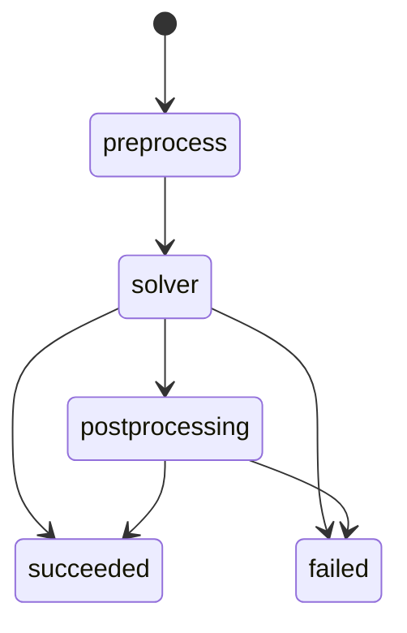
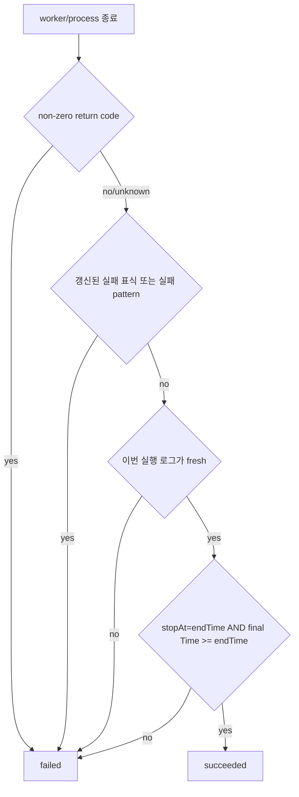
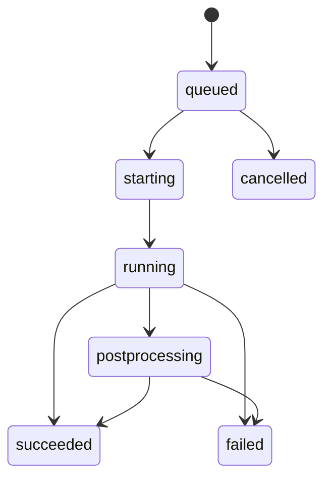

# ofps Telegram CFD bot — Low-Level Design

이 문서는 현재 Python 구현의 모듈 경계, 런타임 흐름, 데이터 구조와 실패 처리를 설명합니다. 시스템 수준 결정은 [HLD.md](HLD.md)를 참조합니다.


## 1. 프로세스와 동시성 모델

### 1.1 daemon process

`python3 -m cfd_bot --config bot.json serve`는 다음 실행 흐름을 구성합니다.

| 실행 흐름 | 구현 | 주기/입력 | 책임 |
|---|---|---|---|
| Main thread | `bot.serve()` | Telegram `getUpdates` | 인증, 명령·callback 분기, 응답 |
| Monitor thread | `Monitor.run_once()` | `poll_seconds` | `ofps` scan, 외부 계산 관측, Scheduler tick |
| Delivery thread | `bot.deliver()` | 1초 | outbox 메시지·파일 전송과 재시도 |

`DaemonLock(state/daemon.lock)`은 같은 state directory에 두 daemon이 붙는 것을 막습니다. `/stat`과 Monitor의 `ofps` 실행은 `processes.SNAPSHOT_LOCK`으로 직렬화합니다.

### 1.2 detached worker

Scheduler는 `python -m cfd_bot _worker --state ... --job ...`을 새 session으로 실행합니다. worker는 SQLite에서 job을 다시 읽으며, 다음 phase를 기록합니다.



## 2. 시작과 설정 검증

`config.load_bot()`의 처리 순서는 다음과 같습니다.

1. `bot.json`을 읽고 허용된 키와 타입을 검사합니다.
2. `state_dir`, `ui_dir`, `openfoam_bashrc`를 설정 파일 기준 절대 경로로 변환합니다.
3. `UiCatalog`를 로드해 JSON, template, manifest를 검증합니다.
4. `cases`와 `case_globs`에서 티켓 경로를 수집합니다.
5. 각 티켓을 `load_case()`로 정규화하고 watcher, export, hook, CPU 설정을 검사합니다.
6. macro-child 관계와 동일 `case_dir` 중복을 검사합니다.

서비스 시작 시 추가로 token, allowlist, `getMe`, Telegram command 등록, webhook 미사용 상태를 확인합니다.

## 3. Telegram UI 리소스

### 3.1 namespace

`telegram-ui` 아래 상대 경로와 JSON 객체 경로를 점으로 연결합니다.

```text
menus/home.json       + help                 → menus.home.help
menus/tickets.json    + card.body            → menus.tickets.card.body
scenarios/run.json    + completion           → scenarios.run.completion
```

### 3.2 loader

`ui.UiCatalog`은 다음 규칙을 적용합니다.

- 모든 `*.json`은 object여야 합니다.
- dict는 namespace를 구성하고 list/scalar는 leaf resource가 됩니다.
- 모든 문자열을 `string.Formatter.parse()`로 검사합니다.
- `manifest.json.required`에 있는 모든 leaf key가 존재해야 합니다.
- `text()`는 문자열만 반환하고 전달된 값으로 엄격하게 format합니다.
- `value()`는 list/dict가 호출자에게 수정되지 않도록 deep copy를 반환합니다.
- `load_ui()`는 절대 `ui_dir`별로 catalog를 캐시합니다.

리소스 분리는 다음과 같습니다.

| 경로 | 내용 |
|---|---|
| `strings.json` | 공통 기호·표현 |
| `menus/home.json` | `/start`, 명령 목록, 홈 keyboard |
| `menus/cases.json` | 케이스 선택·상세 버튼 |
| `menus/queue.json` | queue 메뉴 |
| `menus/tickets.json` | Telegram ticket editor 전체 화면과 입력 안내 |
| `scenarios/status.json` | `/stat` 한 줄 형식, snapshot 오류 |
| `scenarios/run.json` | detail/completion, ETA, 로그 요약 |
| `scenarios/notifications.json` | 시작·종료·대기·복구 알림 |
| 기타 `scenarios/*.json` | 데이터, 실행, 판정, artifact, runtime, diagnostics |

`text_file`은 이전 `detail`/`completion` override를 읽기 위한 호환 경로입니다. 현재 `bot.json`은 이를 사용하지 않습니다.

## 4. Telegram dispatcher

### 4.1 인증

`Bot.handle()`은 update의 `from.id`와 `chat.id`가 각각 `allowed_user_ids`, `chat_ids`에 포함될 때만 처리합니다. callback은 거절 이유를 `answerCallbackQuery`로 돌려줍니다.

### 4.2 명령 routing

| Telegram 명령 | 내부 action | 처리 |
|---|---|---|
| `/start`, `/help` | `home` | JSON 기반 홈 안내와 keyboard |
| `/stat` | `status` | 즉시 `ofps` scan과 compact 상태 |
| `/data`, `/cases` | `cases:0` | 등록 티켓 목록 |
| `/queue` | `queue` | FIFO 상태와 제어 버튼 |
| `/tickets` | TicketChat | 티켓 편집 화면 |
| `/clean` | `clean` | 추적 메시지 일괄 삭제 |
| `/cancel` | TicketChat | 현재 입력 취소 |

실시간 상태용 Telegram 명령은 `/stat` 하나만 등록합니다.

### 4.3 callback payload

일반 화면은 `detail:<case-id>`, `residual:<case-id>`, `export:<case-id>:<name>`, `enqueue:<case-id>`처럼 짧은 action을 사용합니다. TicketChat은 사용자 session token을 포함한 `te:<token>:<action>[:arg]`를 사용해 오래된 버튼과 다른 사용자의 버튼을 거부합니다.

## 5. `/stat` 상세 알고리즘

```text
Bot.fresh_runs()
  → processes.snapshot(ofps_command)
  → snapshot.at 저장
  → tickets.sync_ticket_states()
  → Bot.active_runs(snapshot)
  → report.compact_status(run)
```

- snapshot의 `cases`만 순회하므로 terminal DB record는 표시하지 않습니다.
- 등록 경로는 티켓 이름과 상세 버튼을 사용합니다.
- 미등록 경로는 폴더명에 `미등록`을 표시하고 상세 버튼을 만들지 않습니다.
- 시작 시각은 snapshot 관측 시각에서 supervisor/solver의 최대 elapsed를 빼서 계산합니다.
- CPU 수와 위치는 티켓 설정값이 아니라 `ofps`가 관측한 affinity 합집합을 사용합니다.
- scan 오류는 빈 목록으로 위장하지 않고 상태 수집 오류를 표시합니다.

## 6. 프로세스 snapshot

`processes.snapshot()`은 `ofps_command`를 최대 45초 실행하고 출력 계약을 검사합니다. `parse_snapshot()`은 `ENGINE`, `CASE`, `SUPERVISOR`와 process table을 case root별로 묶습니다.

후처리 단계:

- `Path.resolve()`로 case root 정규화
- `/proc/<pid>`의 PPID, session, environment, stdio TTY로 owner 계산
- MPI process들의 CPU range를 합쳐 `actual_cores`, `actual_cpu_list` 생성
- boot ID, PID, process start tick으로 process identity 생성

## 7. Monitor와 외부 계산 상태

### 7.1 tick 순서

1. 티켓을 다시 읽습니다.
2. `ofps` snapshot을 수집하고 `kv.snapshot`에 저장합니다.
3. 저장된 macro submission을 queue로 반영합니다.
4. 유실된 worker를 복구합니다.
5. managed live job에 실제 owner·CPU 관측값을 병합합니다.
6. 등록 케이스 중 managed가 아닌 계산을 관측합니다.
7. snapshot에서 처음 본 미등록 경로와 이전 자동 감시 경로를 관측합니다.
8. Scheduler tick을 실행합니다.
9. 티켓 JSON의 queue state를 snapshot/job 상태와 동기화합니다.

scan 자체가 실패하면 `monitor_error`와 단일 outage event를 저장하고, 기존 running record의 missing count를 증가시키지 않습니다.

### 7.2 observed record

외부 계산은 `kv`의 `observed:<resolved-case-root>`에 저장합니다. 핵심 필드는 다음과 같습니다.

```json
{
  "id": "event id",
  "case": {},
  "case_root": "/absolute/case",
  "created": 0,
  "started": 0,
  "status": "running|succeeded|failed|interrupted",
  "telemetry": {},
  "missing": 0,
  "external": true,
  "owner": "...",
  "actual_cores": 4,
  "actual_cpu_list": "0-3"
}
```

프로세스가 사라지면 `missing`을 증가시키고 case 또는 global `missing_polls`에 도달한 뒤에만 종료 판정을 수행합니다.

### 7.3 미등록 watcher

`automatic_case()`는 케이스 최상위의 일반 파일 `log*`를 수정시간 역순으로 선택하고 OpenFOAM 기본 fatal 패턴을 활성화합니다. 자동 발견 root는 `kv.auto_observed_roots`에 유지해 프로세스 소멸 뒤에도 판정을 끝냅니다.

## 8. 로그와 종료 판정

### 8.1 로그 선택·증분 읽기

`logs.py`는 ticket `watcher.logs` 순서와 실제 파일 수정 상태를 사용해 현재 단계를 선택합니다. inode/size/offset을 저장해 append만 읽고, truncate·rotation·단계 변경 시 parser state를 초기화합니다. 큰 기존 로그는 bounded tail에서 현재 진행값을 확보합니다.

수집 telemetry에는 최종 `Time`, ClockTime 표본, 실패 행, 로그 tail, 파일 cursor 등이 포함됩니다.

### 8.2 `outcomes.decide()` 우선순위



로그의 `End` 문자열과 legacy `success.patterns`는 최종 성공 근거로 사용하지 않습니다.

## 9. Scheduler와 worker

### 9.1 admission

Scheduler는 FIFO 순서에서 다음을 확인합니다.

- `scheduler.enabled`, queue pause, `max_parallel`
- 같은 macro batch의 다른 active job
- 같은 case의 외부/managed 실행
- 티켓 삭제·이름 변경·macro 관계
- OpenFOAM/MPI 실행 환경
- 자동 CPU topology 또는 수동 `cpu_set`
- active job 예약 CPU와 현재 `ofps` CPU 사용량
- 최종 `ofps --check`

조건이 충족되지 않으면 job은 `queued`에 남고 이유를 기록합니다.

### 9.2 job 상태



DB의 partial unique index가 한 `case_root`의 `queued|starting|running|postprocessing` 중복을 차단합니다. `Store.update_job(expected=...)`는 compare-and-swap처럼 stale action을 거부합니다.

### 9.3 실행 phase

worker는 다음 순서로 동작합니다.

1. 실행 설정을 case에 적용하고 backup을 남깁니다.
2. `preprocess` hooks를 순서대로 실행합니다.
3. 기존 로그 cursor를 수집합니다.
4. `taskset -c <cpu_set> <command>`로 solver wrapper를 실행합니다.
5. wrapper 종료 코드와 케이스 로그를 병합해 판정합니다.
6. 성공 시 `postprocess` hooks를 실행합니다.
7. 이번 실행에서 갱신된 Residual 한 개를 event directory에 복사합니다.
8. terminal event를 outbox에 저장합니다.

## 10. Ticket 모델과 편집

### 10.1 단일 티켓

주요 영역은 `case_dir/name`, `watcher`, `notifications`, `exports`, `preprocess/postprocess`, 선택적 `command/cores/cpu_set`입니다. 런타임의 `_root`, `_config`, `_ui_dir`는 loader가 추가하며 JSON에 저장하지 않습니다.

### 10.2 macro 티켓

macro는 ordered child 목록과 공통 실행 설정을 가집니다. `tickets.publish_macro()`는 child 파일을 먼저 stage하고 macro를 마지막에 원자적으로 저장하며 실패 시 rollback합니다. 실행 중 child의 실행 설정은 변경할 수 없지만 요청 데이터와 감시 설정은 갱신할 수 있습니다.

### 10.3 편집기 공유 계층

- `editor.TicketService`: 검증, 저장, 복제, 삭제
- `ticket_chat.TicketChat`: Telegram 화면·session controller
- `gui.py`: Tk form controller
- `patterns.PatternLibrary`: 실패 패턴 template 공유
- `ticket_run.TicketRunner`: 저장된 단일/macro 티켓 실행 상태와 submit

Telegram editor session은 `kv.ticket-editor:<chat>:<user>`에 저장해 재시작 후 복구합니다.

## 11. SQLite schema와 주요 키

### 11.1 table

| table | 용도 | 중복 방지 |
|---|---|---|
| `jobs` | 관리 queue와 실행 결과 JSON | `id` PK, active case partial unique index |
| `kv` | snapshot, observed, offset, pause, editor session | `key` PK |
| `outbox` | 재시도 가능한 알림 payload | `(event_key, chat_id)` unique |
| `chat_messages` | `/clean` 대상 메시지 ID·생성시각 | `(chat_id, message_id)` PK |
| `run_history` | ETA용 최근 정상 실행시간 | `id` PK, case index |

SQLite는 WAL mode와 30초 busy timeout을 사용합니다.

### 11.2 주요 `kv` key

| key | 값 |
|---|---|
| `snapshot` | 최신 정상 `ofps` 결과 |
| `monitor_error` | 최신 scan/monitor 오류 |
| `observed:<case-root>` | 외부 계산 상태 |
| `auto_observed_roots` | 미등록 자동 감시 root |
| `telegram_offset` | 처리 완료 update offset |
| `queue_paused` | scheduler pause flag |
| `outage_id` | monitor 장애 중복 알림 key |
| `event:<run-id>` | frozen terminal artifact payload |
| `ticket-editor:<chat>:<user>` | Telegram editor session |

## 12. Notification delivery

`terminal_event()`는 상태가 `succeeded|failed|interrupted`이고 해당 event가 활성화된 경우 실행 이력을 저장하고 terminal payload를 생성합니다. 종료 메시지는 `scenarios.run.completion`으로 렌더링하며 전체 결과 파일 대신 이번 실행에서 갱신된 Residual PNG 한 개만 첨부합니다.

`deliver()`는 다음 offset을 outbox body에 저장해 재시작 후 중간부터 계속합니다.

- `messages`, `message_index`
- `files`, `file_index`

Telegram rate limit의 `retry_after`와 지수 backoff를 함께 적용합니다.

## 13. `/clean`

수신 메시지와 bot이 보낸 메시지는 `chat_messages`에 기록합니다. `/clean`은 Telegram 생성시각 기준 48시간 이내 ID를 최대 100개씩 `deleteMessages`로 보냅니다. 400 오류가 특정 ID 때문이면 batch를 이분해 삭제 가능한 묶음을 처리합니다. 완료 후 해당 chat의 추적 ID와 TicketChat의 panel/pending 상태를 정리합니다.

## 14. 파일과 artifact 안전성

- ticket의 상대 경로는 `case_dir` 내부로 제한합니다.
- symlink로 case 밖을 가리키는 export/residual을 거부합니다.
- photo 9 MiB, document 49 MiB 제한을 적용합니다.
- Telegram photo 조건 오류는 document 전송으로 fallback합니다.
- 종료 artifact는 `state/events/<run-id>/`에 복사해 다음 계산의 덮어쓰기와 분리합니다.

## 15. 검증 전략

테스트는 임시 케이스, 가짜 solver, 가짜 `ofps`, fake Telegram API를 사용합니다. 주요 회귀 범위는 다음과 같습니다.

- `/stat`과 Monitor가 같은 snapshot 범위를 사용하는지
- 미등록 외부 계산 시작·종료 알림
- `controlDict.endTime` 경계와 조기 종료 실패
- CPU topology, 예약 충돌, detached worker 복구
- outbox 중복 방지와 retry
- `/clean` batch 삭제
- macro 티켓 원자성·편집 충돌
- UI manifest, 모든 리소스 참조와 코드 내 Telegram 문구 분리
