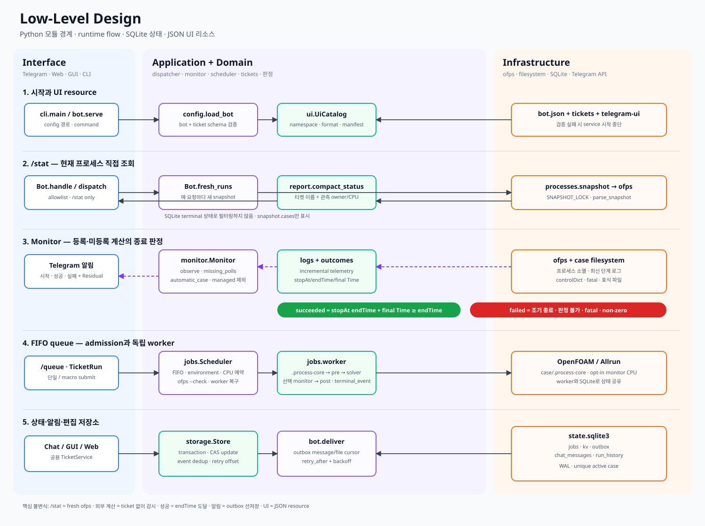
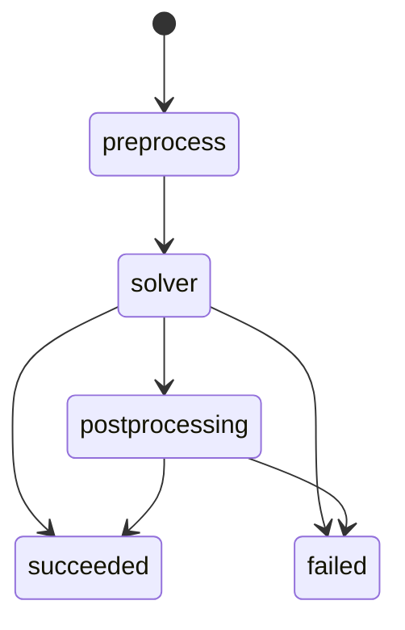
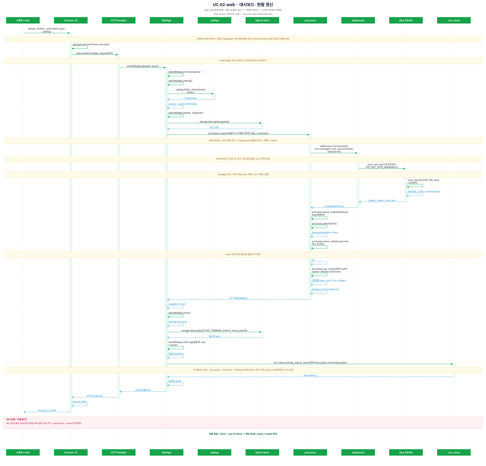
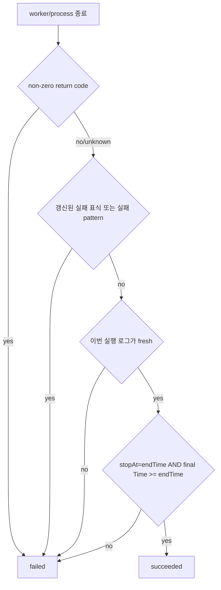
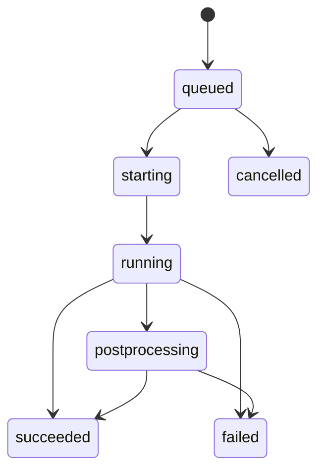

# ofps Telegram CFD bot — Low-Level Design

이 문서는 현재 Python 구현의 모듈 경계, 런타임 흐름, 데이터 구조와 실패 처리를 설명합니다. 시스템 수준 결정은 [HLD.md](HLD.md)를 참조합니다.



## 1. 프로세스와 동시성 모델

### 1.1 daemon process

`python3 -m cfd_bot --config bot.json serve`는 다음 실행 흐름을 구성합니다.

| 실행 흐름 | 구현 | 주기/입력 | 책임 |
|---|---|---|---|
| Main thread | `bot.serve()` | Telegram `getUpdates` | 인증, 명령·callback 분기, 응답 |
| Monitor thread | `Monitor.run_once()` | `poll_seconds` | `ofps` scan, 외부 계산 관측, Scheduler tick |
| Delivery thread | `bot.deliver()` | 1초 | outbox 메시지·파일 전송과 재시도 |

`DaemonLock(state/daemon.lock)`은 같은 state directory에 두 daemon이 붙는 것을 막습니다. `/stat`과 Monitor의 `ofps` 실행은 `processes.SNAPSHOT_LOCK`으로 직렬화합니다.

### 1.2 detached worker

Scheduler는 `python -m cfd_bot _worker --state ... --job ...`을 새 session으로 실행합니다. worker는 SQLite에서 job을 다시 읽으며, 다음 phase를 기록합니다.



### 1.3 localhost web process

`cli.web → web.serve → WebServer(ThreadingHTTPServer)`는 `127.0.0.1:8766`에 바인딩합니다. HTTP 요청별 thread는 기존 도메인 서비스만 호출하며 별도 Scheduler나 Telegram client를 생성하지 않습니다. JSON 변경은 `ticket_lock`과 revision, DB 변경은 기존 SQLite transaction/CAS를 사용합니다. `SNAPSHOT_LOCK`은 프로세스 내부 lock이며 웹과 봇의 별도 process는 각각 독립적인 읽기 스캔을 수행합니다.



| API | 연결 서비스 / 동작 |
|---|---|
| GET bootstrap | CSRF token, 공용 패턴, 기본 파일 선택 위치 |
| GET overview | fresh snapshot, `sync_ticket_states`, 실제 실행 목록 |
| GET ticket | `TicketService.open` + 저장된 최신 snapshot의 `TicketRunner.state`; 편집 선택 시 `ofps`를 실행하지 않음 |
| POST new / duplicate / validate / save | `TicketService`와 기존 폼 변환·검증, revision 비교, 원자적 저장 |
| POST delete/preview → delete | 실행 상태 갱신, macro 자식 포함 삭제 계획·revision, `delete_many` |
| POST run | fresh snapshot + `TicketRunner.request`, 멱등 submission flag |
| POST discover / patterns / exports/validate | 매크로 루트의 직계 하위 폴더와 그 바로 아래 `Allrun`만 검사하는 공용 `discover_cases`, `PatternLibrary`, `validate_export` |
| POST queue | `queue_paused`, 단일/다중 선택을 한 transaction에서 처리하는 `cancel_queued_jobs` / `Store.cancel_queued` |
| GET cases / detail / artifacts / file | 등록 케이스, 로그·ETA, 공용 artifact matcher, 허용된 파일 stream |
| GET overview | 현재 티켓 registry로 job 추적 가능 여부를 계산하고, 현재 macro child job ID만 집계한 진행 현황 반환 |
| GET browse / control | 서버 파일 선택 목록, 기본 OpenFOAM run 디렉토리, `control_times` |

Browser는 미저장 draft를 메모리에 보관하며 10초 현황 갱신 시 폼을 재생성하지 않습니다. 대시보드는 live/queue/history 구조가 같으면 기존 실행 카드 DOM의 수치와 progress 속성만 갱신합니다. 새 응답의 ETA가 `unknown`으로 잠깐 비더라도 동일 실행이고 진행 수치가 후퇴하지 않으면 직전 유효 ETA·progress를 유지합니다. `logs.estimate`는 64 KiB 이하의 동시 기록 꼬리에서는 이미 파싱한 완전한 Time/ClockTime 표본을 사용하고, 이를 넘는 실제 backlog와 missing log에서는 live rate를 보류합니다. 다단계 로그에서 `End` 뒤 새 `Time`이 나오면 이전 단계 success match를 비워 다음 단계의 속도 표본을 독립적으로 수집합니다. 저장 요청에는 기존 revision과 request id를 보내고 성공 후 새 revision을 수신합니다. 새 macro 저장 시 queue 등록을 먼저 확인하며, 저장 후 실행은 공용 저장 완료 뒤 실행 요청을 보냅니다. 현재 계산 중인 티켓은 실행할 수 없고 요청 데이터 같은 메타데이터 변경은 기존 service 규칙에 따릅니다.

`run_views.tracking_registry`는 현재 실제로 존재하고 load된 티켓 JSON만 case root로 색인합니다. `job_view`는 이 registry에서 `trackable`, `case_id`, `ticket`을 만든다. 종료 이력은 `trackable=true`일 때 결과 화면으로 이동하고, active queue는 추가로 `status=running`일 때만 이동합니다. `running_macro_views`는 macro의 현재 `cases[].job_id`와 일치하는 작업만 사용하며 완료 child 수에 현재 solver progress를 더해 전체 progress를 계산합니다. ETA는 현재 child의 log rate와 남은 queued child의 설정 시간 또는 개별 최근 성공 이력을 순서대로 합산합니다. 개별 이력이 없으면 같은 매크로에서 최근 완료된 성공 child 최대 5개의 중앙 실행 시간을 fallback으로 쓰고, 그래도 추정 불가한 항목이 있으면 전체 잔여 시간을 알 수 없음으로 둡니다.

티켓 선택은 읽기 동작이므로 Bot Monitor와 최근 overview가 SQLite에 기록한 snapshot으로 실행 버튼 상태를 계산합니다. 이 경로는 `ofps`를 새로 실행하지 않습니다. `/api/run`과 실행 상태 명시적 새로고침은 fresh snapshot을 다시 검사하므로 선택 화면의 snapshot이 갱신 직전이어도 중복 실행은 허용되지 않습니다. Telegram 카드와 GUI의 편집 열기도 같은 cached-state 정책을 사용합니다.

HTTP는 localhost Host와 같은 Origin/Fetch-Site를 확인하고 POST에 application/json 및 CSRF token을 요구합니다. body는 2 MiB로 제한하고 정적 asset은 allowlist만 제공합니다. artifact는 요청 시마다 선언된 export/Residual 목록을 다시 구한 뒤 case 내부 경로 및 열린 descriptor 경로를 검증합니다. 이미지만 inline, 나머지는 attachment로 내려보내고 49 MiB를 초과하는 파일은 거부합니다. 요청 로그에는 method/path/status만 남깁니다.

SSH `-L`의 외부 local port는 backend port와 다를 수 있으므로 Host는 `localhost`, `127.0.0.1`, `[::1]` 및 유효 TCP port 조합을 허용합니다. Origin은 그 요청 Host와 일치해야 합니다. `bin/cfd-web-tunnel`은 브라우저 PC의 IPv4 loopback에만 local port를 열며 `ExitOnForwardFailure`로 포트 충돌을 즉시 알립니다. 테스트 fixture는 별도 TCP forwarder를 통해 전체 브라우저 흐름을 검증합니다.

`clients/build.py`는 Windows CMD+PowerShell, macOS .app/.command를 재현 가능한 ZIP으로 생성합니다. ZIP 안의 macOS entrypoint 실행 권한과 PowerShell 5.1용 UTF-8 BOM을 보존합니다. 설정 GUI와 저장 파일은 사용하지 않습니다. 사용자 config와 Include를 읽어 중복·와일드카드·부정 패턴을 제외한 Host 목록을 만들고 번호를 선택받습니다. Windows는 PowerShell, macOS는 ssh-hosts.sh가 이름만 열거합니다. 선택한 별칭을 그대로 ssh argv에 전달하여 User·Port·IdentityFile·ProxyJump는 기존 OpenSSH 해석을 사용합니다. 로컬 전달 포트가 열리면 브라우저를 엽니다. 연결 창을 종료하면 자신이 시작한 SSH 프로세스를 종료합니다. `/downloads/`는 두 생성 ZIP만 allowlist로 제공합니다.

실행 시 `web.serve()`는 `state/web.log`에 회전 로그 handler를 설치합니다(5 MiB, backup 3개). method/path/status만 기록하고 HTTP body·CSRF·SSH 인증 정보는 기록하지 않습니다. 종료 시 handler를 해제합니다.

## 2. 시작과 설정 검증

`config.load_bot()`의 처리 순서는 다음과 같습니다.

1. `bot.json`을 읽고 허용된 키와 타입을 검사합니다.
2. `state_dir`, `ui_dir`, `openfoam_bashrc`를 설정 파일 기준 절대 경로로 변환합니다.
3. `UiCatalog`를 로드해 JSON, template, manifest를 검증합니다.
4. `cases`와 `case_globs`에서 티켓 경로를 수집합니다.
5. 각 티켓을 `load_case()`로 정규화하고 watcher, export, hook, CPU 설정을 검사합니다.
6. macro-child 관계와 동일 `case_dir` 중복을 검사합니다.

서비스 시작 시 추가로 token, allowlist, `getMe`, Telegram command 등록, webhook 미사용 상태를 확인합니다.

## 3. Telegram UI 리소스

### 3.1 namespace

`telegram-ui` 아래 상대 경로와 JSON 객체 경로를 점으로 연결합니다.

```text
menus/home.json       + help                 → menus.home.help
menus/tickets.json    + card.body            → menus.tickets.card.body
scenarios/run.json    + completion           → scenarios.run.completion
```

### 3.2 loader

`ui.UiCatalog`은 다음 규칙을 적용합니다.

- 모든 `*.json`은 object여야 합니다.
- dict는 namespace를 구성하고 list/scalar는 leaf resource가 됩니다.
- 모든 문자열을 `string.Formatter.parse()`로 검사합니다.
- `manifest.json.required`에 있는 모든 leaf key가 존재해야 합니다.
- `text()`는 문자열만 반환하고 전달된 값으로 엄격하게 format합니다.
- `value()`는 list/dict가 호출자에게 수정되지 않도록 deep copy를 반환합니다.
- `load_ui()`는 절대 `ui_dir`별로 catalog를 캐시합니다.

리소스 분리는 다음과 같습니다.

| 경로 | 내용 |
|---|---|
| `strings.json` | 공통 기호·표현 |
| `menus/home.json` | `/start`, 명령 목록, 홈 keyboard |
| `menus/cases.json` | 케이스 선택·상세 버튼 |
| `menus/queue.json` | queue 메뉴 |
| `menus/tickets.json` | Telegram ticket editor 전체 화면과 입력 안내 |
| `scenarios/status.json` | `/stat` 한 줄 형식, snapshot 오류 |
| `scenarios/run.json` | detail/completion, ETA, 로그 요약 |
| `scenarios/notifications.json` | 시작·종료·대기·복구 알림 |
| 기타 `scenarios/*.json` | 데이터, 실행, 판정, artifact, runtime, diagnostics |

`text_file`은 이전 `detail`/`completion` override를 읽기 위한 호환 경로입니다. 현재 `bot.json`은 이를 사용하지 않습니다.

## 4. Telegram dispatcher

### 4.1 인증

`Bot.handle()`은 update의 `from.id`와 `chat.id`가 각각 `allowed_user_ids`, `chat_ids`에 포함될 때만 처리합니다. callback은 짧은 daemon worker에서 `answerCallbackQuery`를 보내며 dispatcher는 API 응답을 기다리지 않고 action을 처리합니다. 거절된 callback도 같은 경로로 이유를 돌려줍니다.

### 4.2 명령 routing

| Telegram 명령 | 내부 action | 처리 |
|---|---|---|
| `/start`, `/help` | `home` | JSON 기반 홈 안내와 keyboard |
| `/stat` | `status` | 즉시 `ofps` scan과 compact 상태 |
| `/data`, `/cases` | `cases:0` | 등록 티켓 목록 |
| `/queue` | `queue` | FIFO 상태와 제어 버튼 |
| `/tickets` | TicketChat | 티켓 편집 화면 |
| `/clean` | `clean` | 추적 메시지 일괄 삭제 |
| `/cancel` | TicketChat | 현재 입력 취소 |

실시간 상태용 Telegram 명령은 `/stat` 하나만 등록합니다.

### 4.3 callback payload

일반 화면은 `detail:<case-id>`, `residual:<case-id>`, `export:<case-id>:<name>`, `enqueue:<case-id>`처럼 짧은 action을 사용합니다. TicketChat은 사용자 session token을 포함한 `te:<token>:<action>[:arg]`를 사용해 오래된 버튼과 다른 사용자의 버튼을 거부합니다.

## 5. `/stat` 상세 알고리즘

```text
Bot.fresh_runs()
  → processes.snapshot(ofps_command)
  → 응답용 snapshot.at 부여
  → ticket catalog 1회 load
  → Bot.active_runs(snapshot)
  → report.compact_status(run)
```

- snapshot의 `cases`만 순회하므로 terminal DB record는 표시하지 않습니다.
- 등록 경로는 티켓 이름과 상세 버튼을 사용합니다.
- 미등록 경로는 폴더명에 `미등록`을 표시하고 상세 버튼을 만들지 않습니다.
- 시작 시각은 snapshot 관측 시각에서 supervisor/solver의 최대 elapsed를 빼서 계산합니다.
- CPU 수와 위치는 티켓 설정값이 아니라 `ofps`가 관측한 affinity 합집합을 사용합니다.
- scan 오류는 빈 목록으로 위장하지 않고 상태 수집 오류를 표시합니다.
- `/stat` 표시에 필요하지 않은 ticket JSON queue state 기록은 기다리지 않습니다. 같은 service의 Monitor tick이 `sync_ticket_states()`를 수행합니다.

## 6. 프로세스 snapshot

`processes.snapshot()`은 `CFD_BOT_OFPS_MANAGED=1` 환경으로 `ofps_command`를 최대 45초 실행하고 출력 계약을 검사합니다. 현재 명령 `/home/joon/.local/bin/ofps`는 저장소의 자체 완결형 `bin/ofps`를 가리키며, 이 파일이 `/proc` scan을 직접 수행합니다. 별도 scanner subprocess나 fallback은 없습니다. `parse_snapshot()`은 `ENGINE`, `CASE`, `SUPERVISOR`와 process table을 case root별로 묶습니다.

OpenFOAM application 이름이나 실행 파일 경로가 일치해도 `-case` 또는 현재 경로의 상위에서 `system/controlDict`를 찾지 못하면 scanner가 해당 process record를 버립니다. 이전 scanner 형식의 `[controlDict not found]` CASE block도 parser가 전체 폐기해 일반 디렉터리가 자동 감시 대상으로 승격되지 않게 합니다.

Basilisk 기본 root는 `BASH_SOURCE`의 symlink 디렉터리가 아니라 `readlink -f`로 구한 실제 `bin/ofps` 디렉터리입니다. 다른 tree는 `OFPS_BASILISK_ROOT`로 명시합니다. root 안에서도 Makefile과 C source를 함께 찾지 못하면 record를 버리고, parser는 `[Basilisk case not found]` block을 폐기합니다.

`bin/ofps`는 일반 scan, `--watch`, `--check`를 내장 Bash scanner로 처리하고 bot 확장 option은 같은 파일의 argv 분기에서 `python3 -m cfd_bot`으로 연결합니다. standalone 호출은 scan 결과를 stdout과 snapshot·티켓 상태 동기화에 함께 사용하며, 동기화 실패가 CPU 검사 종료코드를 바꾸지 않습니다. managed 호출은 stdout만 반환하고 상태를 소유한 application service가 필요할 때 `sync_ticket_states()`를 실행합니다. 이 함수는 catalog를 한 번 읽고, job을 case root별로 묶으며, 모든 `observed:*` 값을 한 SQLite 연결에서 조회합니다.

후처리 단계:

- `Path.resolve()`로 case root 정규화
- `/proc/<pid>`의 PPID, session, environment, stdio TTY로 owner 계산
- MPI process들의 CPU range를 합쳐 `actual_cores`, `actual_cpu_list` 생성
- boot ID, PID, process start tick으로 process identity 생성

## 7. Monitor와 외부 계산 상태

### 7.1 tick 순서

1. 티켓을 다시 읽습니다.
2. `ofps` snapshot을 수집하고 `kv.snapshot`에 저장합니다.
3. 저장된 macro submission을 queue로 반영합니다.
4. 유실된 worker를 복구합니다.
5. managed live job에 실제 owner·CPU 관측값을 병합합니다.
6. 등록 케이스 중 managed가 아닌 계산을 관측합니다.
7. snapshot에서 처음 본 미등록 경로와 이전 자동 감시 경로를 관측합니다.
8. Scheduler tick을 실행합니다.
9. 티켓 JSON의 queue state를 snapshot/job 상태와 동기화합니다.

scan 자체가 실패하면 `monitor_error`와 단일 outage event를 저장하고, 기존 running record의 missing count를 증가시키지 않습니다.

### 7.2 observed record

외부 계산은 `kv`의 `observed:<resolved-case-root>`에 저장합니다. 핵심 필드는 다음과 같습니다.

```json
{
  "id": "event id",
  "case": {},
  "case_root": "/absolute/case",
  "created": 0,
  "started": 0,
  "status": "running|succeeded|failed|interrupted",
  "telemetry": {},
  "missing": 0,
  "external": true,
  "owner": "...",
  "actual_cores": 4,
  "actual_cpu_list": "0-3"
}
```

프로세스가 사라지면 `missing`을 증가시키고 case 또는 global `missing_polls`에 도달한 뒤에만 종료 판정을 수행합니다.

### 7.3 미등록 watcher

`automatic_case()`는 케이스 최상위의 일반 파일 `log*`를 수정시간 역순으로 선택하고 OpenFOAM 기본 fatal 패턴을 활성화합니다. 자동 발견 root는 `kv.auto_observed_roots`에 유지해 프로세스 소멸 뒤에도 판정을 끝냅니다.

## 8. 로그와 종료 판정

### 8.1 로그 선택·증분 읽기

`logs.py`는 ticket `watcher.logs` 순서와 실제 파일 수정 상태를 사용해 현재 단계를 선택합니다. inode/size/offset을 저장해 append만 읽고, truncate·rotation·단계 변경 시 parser state를 초기화합니다. 큰 기존 로그는 bounded tail에서 현재 진행값을 확보합니다.

수집 telemetry에는 최종 `Time`, ClockTime 표본, 실패 행, 로그 tail, 파일 cursor 등이 포함됩니다.

### 8.2 `outcomes.decide()` 우선순위



로그의 `End` 문자열과 legacy `success.patterns`는 최종 성공 근거로 사용하지 않습니다.

## 9. Scheduler와 worker

### 9.1 admission

Scheduler는 FIFO 순서에서 다음을 확인합니다.

- `scheduler.enabled`, queue pause, `max_parallel`
- 같은 macro batch의 다른 active job
- 같은 case의 외부/managed 실행
- 티켓 삭제·이름 변경·macro 관계
- OpenFOAM/MPI 실행 환경
- 자동 CPU topology 또는 수동 `cpu_set`
- 명시적으로 활성화된 `monitoring.allocate_cpu`에 필요한 빈 물리 CPU 1개
- active job 예약 CPU와 현재 `ofps` CPU 사용량
- 최종 `ofps --check`

조건이 충족되지 않으면 job은 `queued`에 남고 이유를 기록합니다.

### 9.2 job 상태



DB의 partial unique index가 한 `case_root`의 `queued|starting|running|postprocessing` 중복을 차단합니다. `Store.update_job(expected=...)`는 compare-and-swap처럼 stale action을 거부합니다. `Store.cancel_queued(ids)`는 중복 제거된 선택 전체를 한 `BEGIN IMMEDIATE` transaction에서 검사해 여전히 `queued`인 작업만 취소하고 나머지는 `unavailable`로 반환합니다.

### 9.3 실행 phase

worker는 다음 순서로 동작합니다.

1. 승인된 `NP`·`CPU_SET`으로 case의 `.process-core`를 생성하거나 동기화하고, 기존 파일을 바꿀 때 backup을 남깁니다.
2. `preprocess` hooks를 순서대로 실행합니다.
3. 기존 로그 cursor를 수집합니다.
4. `taskset -c <cpu_set> <command>`로 solver wrapper를 실행합니다.
5. 사용자가 활성화해 `monitoring`이 저장된 경우에만 solver PID를 `TCB_MONITORED_SOLVER_PID`로 전달하고 `taskset -c <monitor_cpu> <monitor command>`를 병렬 실행합니다.
6. wrapper 종료 코드와 케이스 로그를 병합해 판정하고, monitor가 자체 정리할 시간을 준 뒤 남은 process group을 종료합니다.
7. monitor 종료 코드·조기 종료·정리 제한시간은 `monitor_errors`에 별도로 기록하며 solver 판정을 덮어쓰지 않습니다.
8. 성공 시 `postprocess` hooks를 실행합니다.
9. 이번 실행에서 갱신된 Residual 한 개를 event directory에 복사합니다.
10. terminal event를 outbox에 저장합니다.

자동 배정은 monitor가 켜진 경우 `cores + 1`개의 물리 코어를 한 번에 고른 뒤 계산용 `cores`개와 monitor용 1개로 분리합니다. 수동 `cpu_set`은 계산 범위로 유지하고 이 범위와 live/active 예약을 제외한 CPU 1개를 monitor에 자동 배정합니다. `occupied_cpus()`는 active job의 `case.cpu_set`과 `case.monitor_cpu`를 모두 예약으로 취급합니다.

## 10. Ticket 모델과 편집

### 10.1 단일 티켓

주요 영역은 `case_dir/name`, `watcher`, `notifications`, `exports`, `preprocess/postprocess`, 선택적 `command/cores/cpu_set`과 `monitoring`입니다. 모니터링 별도 코어 배치는 기본적으로 꺼져 있으며 command 입력란도 숨깁니다. 활성화하면 입력란을 표시하고 `monitoring`을 `{allocate_cpu: true, command: ["./Allmonitor"]}` 형태로 저장합니다. 다시 끄면 블록을 제거합니다. 런타임의 `_root`, `_config`, `_ui_dir`, `monitor_cpu`는 loader 또는 scheduler가 추가하며 JSON에 저장하지 않습니다.

### 10.2 macro 티켓

macro는 ordered child 목록과 공통 실행 설정을 가집니다. `tickets.publish_macro()`는 child 파일을 먼저 stage하고 macro를 마지막에 원자적으로 저장하며 실패 시 rollback합니다. 모니터링 CPU·스크립트도 child에 복제합니다. 실행 중 child의 실행 설정은 변경할 수 없지만 요청 데이터와 watcher 감시 경로는 갱신할 수 있습니다.

독립 티켓도 세 UI에서 `execution_source=case|ticket`과 공통 실행 폼 필드(NP·명령·CPU 배정)를 사용합니다. `form_values` / `form_document`는 기존 `macro_*` 폼 키를 호환 유지하고 명시 지정일 때 JSON의 `resource_source=ticket`을 저장합니다. `config.load_case`는 `ticket`과 `macro`에 NP·명령 및 수동 모드의 CPU 범위를 요구합니다. `execution_case`는 두 출처 모두 케이스 내부 NP보다 티켓 값을 우선하며 `apply_execution_settings`는 할당된 NP/CPU_SET을 실행 전에 반영하고 원본을 백업합니다. `case` 모드로 되돌리면 명시 실행 값을 제거하고 자동 CPU 배정과 기존 케이스 NP를 사용합니다. 기존 case 티켓의 메타데이터만 저장할 때는 실행 설정을 보존합니다.

case 설정 parser는 shell을 실행하지 않고 `Allrun`, `config/*Run`, 케이스별 `.process-core`의 literal `NP`·`CPU_SET`만 읽습니다. `.process-core`가 있으면 legacy 파일보다 나중에 읽어 최종 우선순위를 가집니다. 단순 대입, `export NP=4`, `NP=4; export NP`를 지원하고 command substitution·backtick·복합 shell 표현은 채택하지 않습니다.

worker의 `apply_execution_settings()`는 전처리 전에 `.process-core`를 확인합니다. 파일이 없으면 승인된 값으로 `NP`, 인용된 `CPU_SET`, `export NP CPU_SET`을 같은 디렉터리의 임시 파일에서 원자적으로 생성합니다. case 출처 수동 설정의 기존 파일은 그대로 두고, 자동 배정이나 ticket/macro 출처는 실제 승인값과 파일을 동기화하며 기존 파일을 job backup에 보관합니다. `.process-core` symlink와 일반 파일이 아닌 경로는 거부합니다. legacy `Allrun`·`config/*Run` 갱신은 기존 케이스 호환성을 위해 유지합니다.

Child의 실행 설정은 세 UI에서 상속값으로 표시합니다. 저장 시 `TicketService`가 매크로 설정과 일치하는지 검증합니다. 실행 중인 독립 티켓은 `execution_settings` 비교로 실행 출처·NP·명령·CPU 정책·범위·소켓 허용·모니터링 CPU와 스크립트 변경을 거절합니다. 요청 데이터와 watcher 로그·판정 설정 변경에는 이 제한을 적용하지 않습니다. 모든 인터페이스 변경은 세 adapter와 관련 검증을 함께 갱신합니다(저장소 `AGENTS.md`).

### 10.3 편집기 공유 계층

- `editor.TicketService`: 검증, 저장, 복제, 삭제
- `ticket_chat.TicketChat`: Telegram 화면·session controller
- `gui.py`: Tk form controller
- `patterns.PatternLibrary`: 실패 패턴 template 공유
- `ticket_run.TicketRunner`: 저장된 단일/macro 티켓 실행 상태와 submit

Telegram editor session은 `kv.ticket-editor:<chat>:<user>`에 저장해 재시작 후 복구합니다.

## 11. SQLite schema와 주요 키

### 11.1 table

| table | 용도 | 중복 방지 |
|---|---|---|
| `jobs` | 관리 queue와 실행 결과 JSON | `id` PK, active case partial unique index |
| `kv` | snapshot, observed, offset, pause, editor session | `key` PK |
| `outbox` | 재시도 가능한 알림 payload | `(event_key, chat_id)` unique |
| `chat_messages` | `/clean` 대상 메시지 ID·생성시각 | `(chat_id, message_id)` PK |
| `run_history` | ETA용 최근 정상 실행시간 | `id` PK, case index |

SQLite는 WAL mode와 30초 busy timeout을 사용합니다.

### 11.2 주요 `kv` key

| key | 값 |
|---|---|
| `snapshot` | 최신 정상 `ofps` 결과 |
| `monitor_error` | 최신 scan/monitor 오류 |
| `observed:<case-root>` | 외부 계산 상태 |
| `auto_observed_roots` | 미등록 자동 감시 root |
| `telegram_offset` | 처리 완료 update offset |
| `queue_paused` | scheduler pause flag |
| `outage_id` | monitor 장애 중복 알림 key |
| `event:<run-id>` | frozen terminal artifact payload |
| `ticket-editor:<chat>:<user>` | Telegram editor session |

## 12. Notification delivery

`terminal_event()`는 상태가 `succeeded|failed|interrupted`이고 해당 event가 활성화된 경우 실행 이력을 저장하고 terminal payload를 생성합니다. 종료 메시지는 `scenarios.run.completion`으로 렌더링하며 전체 결과 파일 대신 이번 실행에서 갱신된 Residual PNG 한 개만 첨부합니다.

`deliver()`는 다음 offset을 outbox body에 저장해 재시작 후 중간부터 계속합니다.

- `messages`, `message_index`
- `files`, `file_index`

Telegram rate limit의 `retry_after`와 지수 backoff를 함께 적용합니다.

## 13. `/clean`

수신 메시지와 bot이 보낸 메시지는 `chat_messages`에 기록합니다. `/clean`은 Telegram 생성시각 기준 48시간 이내 ID를 최대 100개씩 `deleteMessages`로 보냅니다. 400 오류가 특정 ID 때문이면 batch를 이분해 삭제 가능한 묶음을 처리합니다. 완료 후 해당 chat의 추적 ID와 TicketChat의 panel/pending 상태를 정리합니다.

## 14. 파일과 artifact 안전성

- ticket의 상대 경로는 `case_dir` 내부로 제한합니다.
- symlink로 case 밖을 가리키는 export/residual을 거부합니다.
- photo 9 MiB, document 49 MiB 제한을 적용합니다.
- Telegram photo 조건 오류는 document 전송으로 fallback합니다.
- 종료 artifact는 `state/events/<run-id>/`에 복사해 다음 계산의 덮어쓰기와 분리합니다.

## 15. 검증 전략

테스트는 임시 케이스, 가짜 solver, 가짜 `ofps`, fake Telegram API를 사용합니다. 주요 회귀 범위는 다음과 같습니다.

- `/stat`과 Monitor가 같은 snapshot 범위를 사용하는지
- 미등록 외부 계산 시작·종료 알림
- `controlDict.endTime` 경계와 조기 종료 실패
- CPU topology, 예약 충돌, detached worker 복구
- outbox 중복 방지와 retry
- `/clean` batch 삭제
- macro 티켓 원자성·편집 충돌
- UI manifest, 모든 리소스 참조와 코드 내 Telegram 문구 분리
