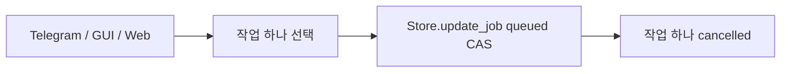
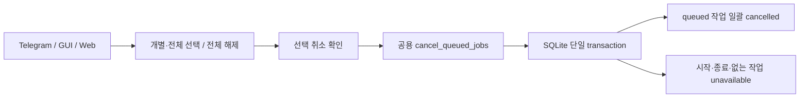

# 작업 큐 다중 선택 취소와 전체 선택·해제

GitHub Issue: [#8](https://github.com/jo0n-lab/cfd-bot/issues/8)

## 배경

현재 작업 큐는 대기 작업마다 취소 버튼을 한 번씩 눌러야 한다. 웹 티켓 관리에는 전체 선택 체크박스가 있지만 전체 해제 동작이 별도 버튼으로 드러나지 않고, 인터페이스별 선택 방식도 일치하지 않는다.

## As-Is HLD

## To-Be HLD

## As-Is LLD

1. Telegram과 web adapter가 각각 `Store.update_job(... expected=('queued',))`를 직접 호출한다.
2. 웹 큐는 행별 취소 버튼만 제공한다.
3. cfd-ticket-gui에는 실제 대기 큐를 여러 개 선택해 취소하는 화면이 없다.
4. 티켓 전체 선택·해제 표현이 인터페이스마다 다르다.

## To-Be LLD

1. `cancel_queued_jobs(store, ids)`가 id 정규화와 빈 선택 검증을 담당한다.
2. `Store.cancel_queued()`는 중복을 제거한 id 전체를 `BEGIN IMMEDIATE` transaction 안에서 읽고, 그 시점에 `queued`인 작업만 `cancelled`로 갱신한다.
3. 결과는 `cancelled`와 `unavailable` id 목록을 돌려 stale 선택을 숨기지 않는다.
4. Web은 큐 행 checkbox, 전체 선택, 전체 해제, 선택 취소를 제공하고 `cancel_many` API를 호출한다.
5. Telegram은 페이지와 무관하게 선택을 유지하며 전체 대기 작업 선택, 전체 해제, 선택 취소 확인 callback을 제공한다.
6. cfd-ticket-gui는 대기 큐 관리 창에서 다중 선택과 전체 선택·해제·선택 취소를 제공한다.
7. 세 인터페이스의 티켓 관리에도 명시적인 전체 선택과 전체 해제를 제공한다. Telegram 전체 선택은 현재 페이지만이 아니라 전체 티켓에 적용한다.

## 호환성

- 기존 개별 큐 취소 버튼과 CLI의 단일 job 취소는 유지한다.
- 시작·실행·후처리 중인 작업은 선택 취소 대상이 아니다.
- 기존 SQLite schema는 변경하지 않는다.

## 검증 계획

- 공용 domain/storage 테스트로 다중 취소, 중복 id, 일부 stale 선택, 빈 선택을 검증한다.
- Telegram callback, web HTTP API, GUI widget의 선택·전체 선택·전체 해제를 검증한다.
- browser fixture에서 큐와 티켓의 전체 선택·해제를 확인한다.
- 전체 Python test suite와 설정 검사를 실행하고 web/Telegram 서비스를 재시작한다.

## 결과

- 공용 `cancel_queued_jobs`와 `Store.cancel_queued`를 추가해 선택된 대기 작업을 한 transaction에서 취소한다.
- Telegram `/queue`, cfd-ticket-gui의 작업 큐 관리 창, web 작업 큐에 개별 선택·전체 선택·전체 해제·선택 취소를 연결했다.
- Telegram, cfd-ticket-gui, web 티켓 관리에 별도 전체 선택·전체 해제 동작을 제공한다.
- CLI `cancel`도 여러 job id를 받을 수 있게 공용 취소 경로로 통합했다.
- domain, Telegram callback, web HTTP, GUI widget, browser fixture 회귀 테스트를 추가했다.
