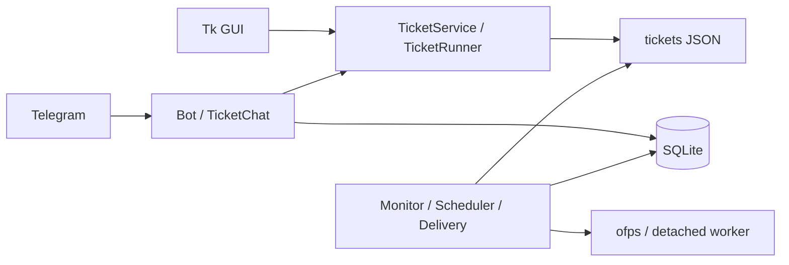
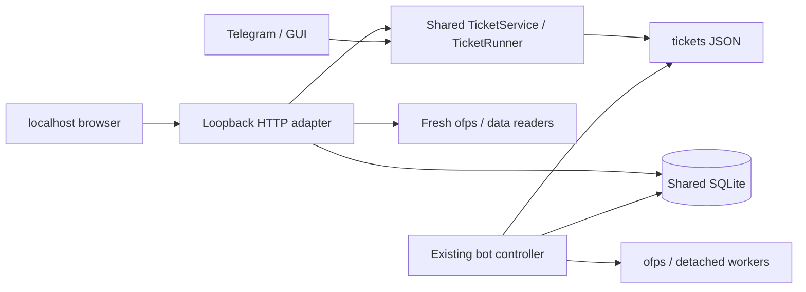
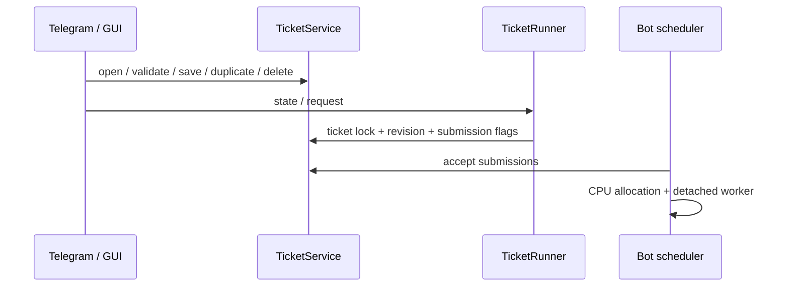
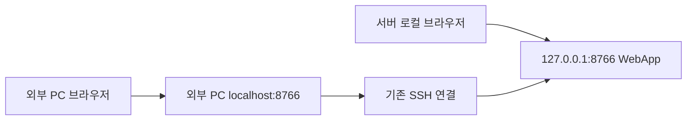
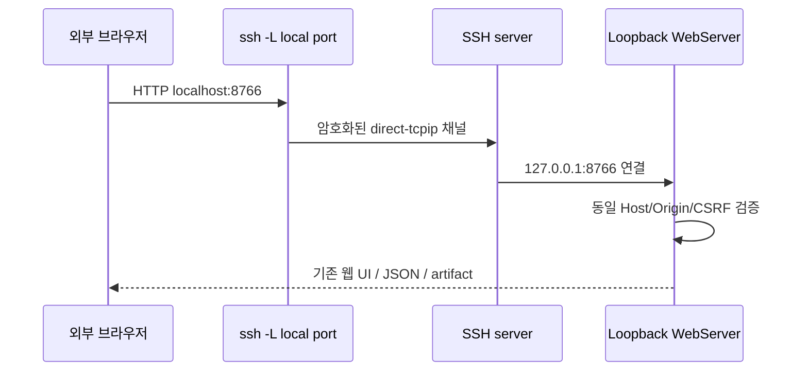
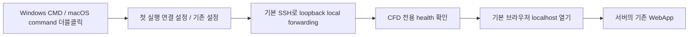
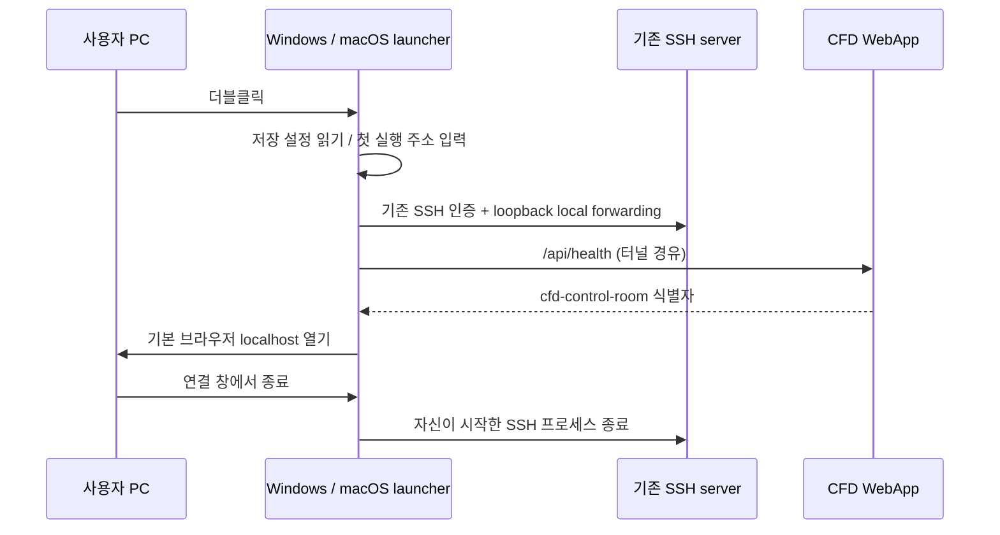

# localhost 웹 UI 추가

GitHub Issue: [#2](https://github.com/jo0n-lab/cfd-bot/issues/2)

## 배경
Telegram과 cfd-ticket-gui에서 제공하는 CFD 현황, 티켓 관리, 실행 요청, 큐 제어, 요청 데이터 기능을 웹에 최적화한 localhost UI로 제공한다. 실행 컨트롤러는 기존 bot을 유지하며 웹은 공용 도메인 서비스의 UI adapter이다.

## As-Is HLD


## To-Be HLD


## As-Is LLD


## To-Be LLD
```mermaid
sequenceDiagram
  participant B as Browser
  participant W as Web adapter
  participant S as Shared services
  participant D as Tickets / SQLite
  participant Q as Existing bot scheduler
  B->>W: same-origin bootstrap + CSRF token
  B->>W: JSON edit / validate / save / run
  W->>S: validate origin, input, revision; call shared service
  S->>D: atomic ticket changes / request flags
  Q->>D: accept submissions, reserve CPUs, update status
  B->>W: fresh status / declared artifact request
  W->>S: ofps snapshot / safe path validation
  W-->>B: JSON status / declared artifact stream
```

## 호환성 및 상세 설계
- 표준 라이브러리 HTTP 서버와 정적 HTML/CSS/JavaScript로 외부 프레임워크 없이 실행한다.
- localhost loopback만 바인딩하고 Host/Origin 검증 및 mutation CSRF 토큰을 적용한다.
- 저장된 티켓·패턴 템플릿·SQLite는 기존 GUI/Telegram과 공유한다. 미저장 웹 초안은 별도 브라우저 상태이다.
- 티켓 생성/수정/검증/복제/일괄 삭제, macro 검색과 child 목록, 공통 실행/전후처리/판정/요청 데이터 설정, 실행 상태 및 요청을 공용 서비스에 연결한다.
- ofps 현황은 외부 실행까지 포함한 최신 snapshot을 사용한다. 웹은 Scheduler/Monitor/Delivery를 추가 기동하지 않는다.
- 큐 pause/resume 및 대기 작업 취소는 기존 저장소 상태 전이를 사용한다.
- Residual 및 요청 데이터는 선언된 패턴과 case 내부 경로 검증을 거쳐 미리보기/다운로드한다.
- 웹 파일 탐색의 기본 위치는 OpenFOAM 사용자 run 디렉토리이다.
- Telegram 메시지 삭제처럼 채팅 매체에 종속된 기능은 웹에서 Telegram에 부수 효과를 일으키지 않는다.
- CLI web subcommand, launcher, 설치/실행 문서와 현행 HLD/LLD/ARCHITECTURE를 갱신한다.

## 검증 계획
- 임시 케이스/SQLite와 mock ofps로 API 생성/편집/저장/복제/삭제/큐/실행 동작, revision 충돌 및 실행 중 제한을 검증한다.
- Host/Origin/CSRF, traversal/symlink, artifact 허용 범위 및 malformed 요청을 검증한다.
- 실제 브라우저로 반응형 UI, 폼, 파일 탐색, 현황/큐/데이터 동선을 확인한다.
- compileall, 전체 unittest, 실제 bot 설정 check를 실행한다. 테스트 중 실제 Telegram 전송이나 OpenFOAM 계산은 실행하지 않는다.
- localhost 웹 서버를 가동하고 응답 및 기존 bot과의 상태 공유를 확인한다.

## 추가 요구: 일반 SSH 포트 포워딩 접속

사용자는 외부 접속을 Tailscale 전용 기능이 아닌 일반 SSH 포트 포워딩으로 명확히 했다. 원격 PC에서도 같은 웹을 사용하도록 SSH local forwarding을 지원한다. SSH가 TCP 포트를 전달하고 웹은 loopback에서 그대로 실행한다. 네트워크 서비스나 SSH 설정은 변경하지 않는다.

### As-Is → To-Be HLD



### To-Be LLD



외부 PC에서 실행할 `bin/cfd-web-tunnel`을 제공한다. local/server 포트가 달라도 사용할 수 있도록 Host의 hostname은 localhost/127.0.0.1/[::1]로 제한하고 port는 유효한 TCP 포트를 허용한다. Origin은 실제 요청 Host와 정확히 일치해야 하며 CSRF와 Fetch-Site 검증을 유지한다. 검증에서는 임시 TCP forwarder를 통해 브라우저 편집을 수행하여 포트가 달라도 동일하게 동작함을 확인한다. 실제 외부 호스트의 SSH 인증이나 sshd 포워딩 정책은 이 세션의 검증 범위 밖이다.

## 추가 요구: Windows / macOS 더블클릭 실행

브라우저 PC에서 명령을 직접 입력하지 않아도 사용할 수 있도록 OS별 SSH launcher ZIP을 제공한다. Windows는 CMD + 기본 PowerShell/OpenSSH, macOS는 .command + 기본 OpenSSH를 사용한다. 첫 실행 시 서버 주소·계정·포트를 저장하고 다음 실행부터 재사용한다. SSH 인증은 기본 SSH의 host key 확인·password/key 절차를 그대로 사용한다. 비밀번호를 launcher 설정에 저장하지 않는다.



LLD: launcher는 SSH 프로세스를 소유하고 종료 시 터널을 닫는다. HTTP /api/health의 앱 식별자를 확인한 뒤 브라우저를 열어 다른 로컬 프로그램의 포트와 혼동하지 않는다. 이미 같은 연결의 터널이 실행 중이면 기존 창을 안내한다. 설치는 ZIP 압축 해제만 필요하다. 테스트는 fake ssh를 사용한 인자·종료 처리와 ZIP 구성, TCP forwarder 브라우저 통합 검증으로 수행한다. 실제 Windows/macOS OS 검증 가능 여부는 결과에 명시한다.

배포 확인 중 8765가 기존 도식추리 GUI의 포트임을 확인했다. 기존 프로세스를 유지하고 CFD 웹의 기본 포트는 8766으로 지정한다.

### Launcher LLD



## 최종 구현 및 검증 결과

- `cfd_bot/web.py`와 `web_static/`에 대시보드·티켓·큐·요청 데이터 UI를 구현했다. 공용 `TicketService`, `TicketRunner`, `PatternLibrary`, ofps snapshot, SQLite를 사용한다.
- 등록/수정/검증/복제/일괄 삭제, macro 검색·postProcessing 강조·행 제외/순서, 공통 CPU·실패 규칙·전후처리·파일 선택·Residual/export 미리보기를 연결했다. 실제 실행은 기존 bot의 controller가 수행한다.
- localhost Host/Origin/CSRF/CSP와 artifact allowlist, path/symlink 검증, revision 충돌, 실행 중 중복 요청 차단을 검증했다. 다른 local port를 사용하는 TCP forwarder를 통해 실제 Chromium 편집 흐름도 통과했다.
- `bin/cfd-ticket-web`, `bin/cfd-web-tunnel`, `deploy/cfd-bot-web.service`를 추가했다. 서비스와 CLI 링크를 설치했고 웹/기존 bot 모두 active/running을 확인했다. 웹은 `http://localhost:8766`에서 동작하며 기존 8765 프로그램은 유지했다.
- Windows `Start CFD.cmd` + PowerShell 연결 폼, macOS `CFD Control Room.app` + 설정 dialog를 ZIP으로 생성했다. 웹에서도 두 ZIP을 다운로드할 수 있다. 비밀번호는 저장하지 않는다.
- 웹 요청 method/path/status와 오류는 journal 및 `state/web.log`에 기록한다. 파일 로그는 5 MiB / 이전 3개로 순환하며 본문·토큰은 기록하지 않는다.
- `python3 -m compileall -q cfd_bot tests clients`: 통과.
- `python3 -m unittest discover -s tests -q`: **229개 실행, 228개 통과, 기존 native GUI 환경 테스트 1개 skip**.
- `python3 -m cfd_bot --config bot.json check`: 통과.
- Chromium: 티켓 편집·파일 선택·요청 데이터 추가·복제/삭제·macro 검색/순서/등록·이미지 표시·큐 pause/resume·390px 모바일 레이아웃 통과. 실제 서버의 대시보드·티켓·데이터 및 ZIP 다운로드는 읽기 전용 검증으로 통과했다.
- SVG 전체 XML parse와 변경 그림의 실제 PNG 렌더링, systemd unit verify, ZIP 구조/CRC·macOS 실행 권한·shell 문법·연결 인자 검증 통과.
- 검증 중 실제 Telegram 전송이나 OpenFOAM 계산은 실행하지 않았다. 실제 티켓 내용은 테스트 목적으로 변경하지 않았으며 화면 조회의 runtime 상태 동기화만 수행했다.

### 검증 범위

현재 작업 호스트가 Linux이므로 Windows WinForms/OpenSSH console 및 macOS Finder/Terminal의 실제 UI 실행은 미검증이다. 서버 웹과 TCP 포워딩 통합, ZIP 구조와 macOS shell/연결 검증은 완료했다. 원격 PC의 SSH 인증·서버 forwarding 정책·OS별 실행 허용은 기존 환경에 따른다.
