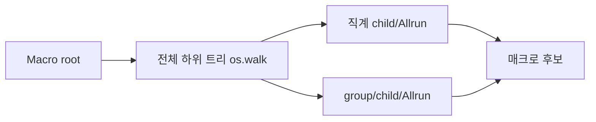
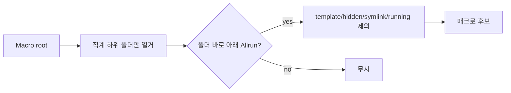

# 매크로 직계 하위 케이스 검색

GitHub Issue: [#7](https://github.com/jo0n-lab/cfd-bot/issues/7)

## 배경

매크로 Case directory는 여러 케이스를 직접 담는 상위 폴더다. 기존 구현은 `os.walk()`로 모든 깊이를 재귀 탐색해, 그룹·백업·별도 작업 폴더 안의 `Allrun`까지 의도하지 않은 매크로 케이스로 포함할 수 있다.

## As-Is HLD

## To-Be HLD

## As-Is LLD

1. `discover_cases()`가 `os.walk(root)`로 임의 깊이를 순회한다.
2. 발견한 케이스 아래만 `dirs[:] = []`로 중단한다.
3. 상위 중간 폴더에 `Allrun`이 없으면 더 깊은 케이스도 포함된다.

## To-Be LLD

1. `root.iterdir()`로 직계 하위 항목만 정렬한다.
2. 실제 디렉토리이고 symlink가 아니며 이름이 숨김 또는 `*-template`이 아닌 항목만 검사한다.
3. `<child>/Allrun`이 일반 파일일 때만 기존 실행 중 제외와 checkpoint/postProcessing 판정을 수행한다.
4. 중첩된 `<root>/<group>/<case>/Allrun`은 탐색하지 않는다.
5. 공용 `discover_cases()`를 호출하는 Telegram, cfd-ticket-gui, web에 같은 범위를 적용하고 세 UI 안내 문구를 동일하게 수정한다.
6. 단위 테스트에서 직계 child 포함, 중첩 child 제외, root 자체 제외, template/hidden/symlink 제외를 검증한다.

## 결과

- `discover_cases()`를 `root.iterdir()` 기반의 직계 하위 탐색으로 변경했다.
- Telegram, cfd-ticket-gui, web의 검색 안내에 직계 하위 폴더와 바로 아래 `Allrun` 조건을 표시했다.
- 단위 테스트와 브라우저 fixture에 중첩 `Allrun` 케이스를 넣어 검색 결과에서 제외되는지 검증한다.
