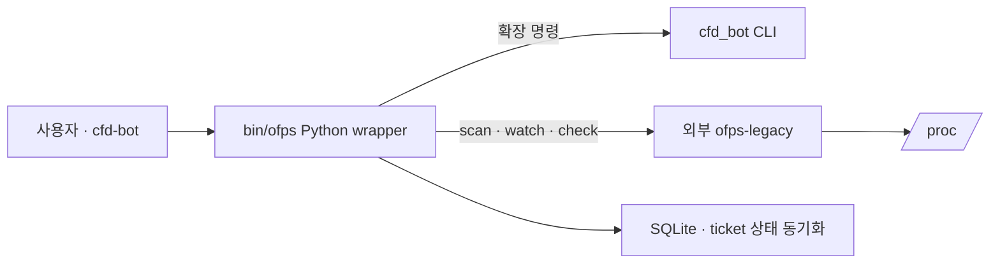
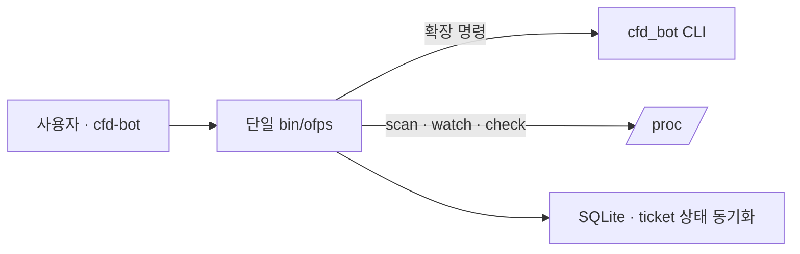
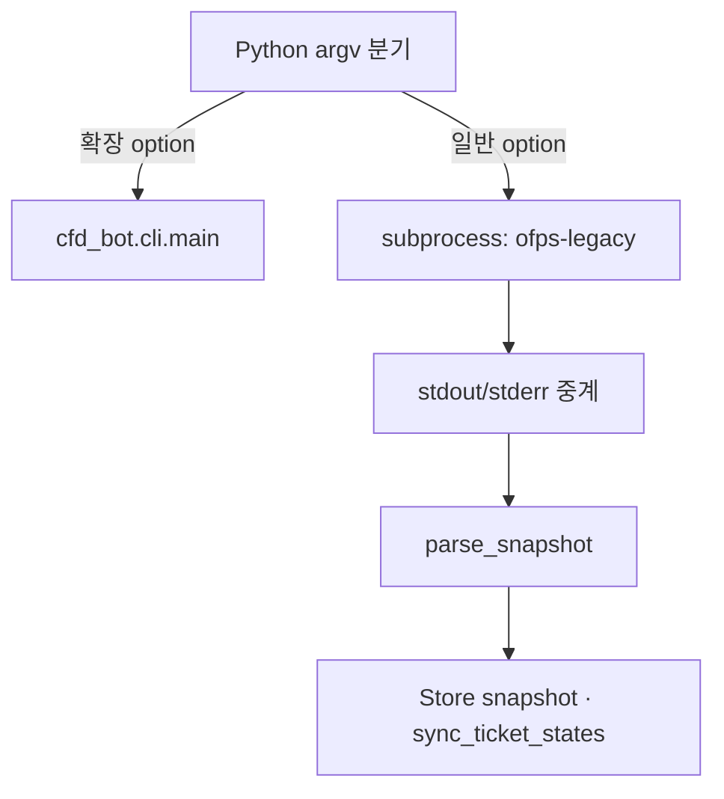
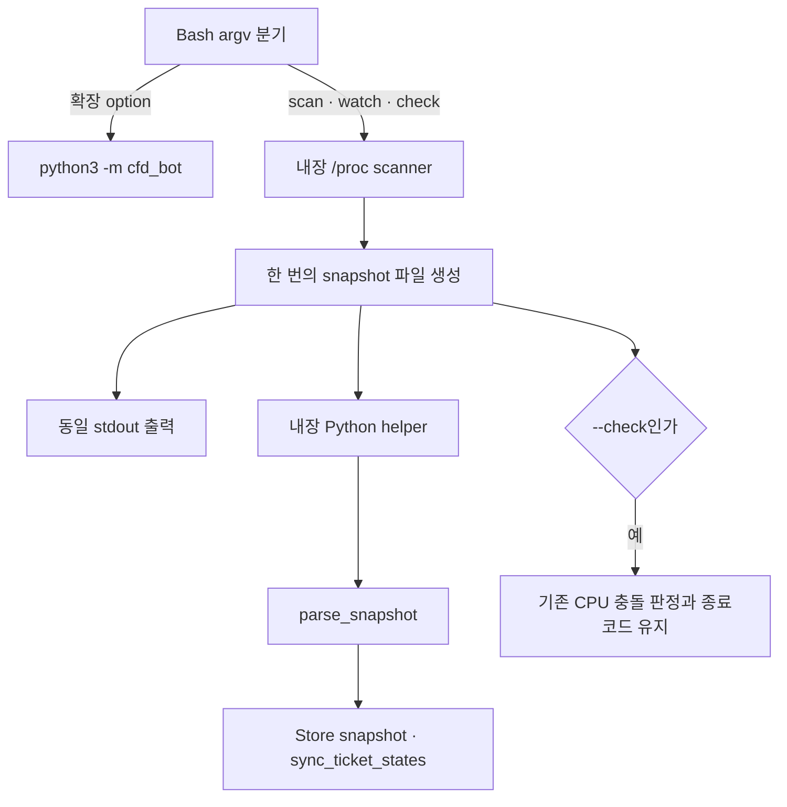

# `ofps` 단일 실행 파일 통합

- 날짜: 2026-09-28
- Issue 제목: `[Architecture] Integrate process scanner into bin/ofps`
- GitHub Issue: [#1](https://github.com/jo0n-lab/cfd-bot/issues/1)

## 문제

`bin/ofps`는 bot 확장 명령을 처리하는 Python wrapper이고 실제 `/proc` 탐색은 사용자 경로의 `ofps-legacy` 또는 `vendor/ofps-legacy`가 수행한다. 설치 상태에 따라 다른 scanner가 선택될 수 있어 실행 경로와 장애 원인이 불필요하게 갈린다.

## As-Is HLD

## To-Be HLD

`~/.local/bin/ofps`는 저장소의 `bin/ofps`만 가리킨다. 실행에 `ofps-legacy`, `OFPS_LEGACY`, vendor fallback이 필요하지 않다.

## As-Is LLD

## To-Be LLD

## 호환성과 검증

- 무인자 scan, `--watch`, `--check`, `--allow-cross-socket`, 도움말의 scanner 동작을 보존한다.
- `--status`, `--json`, `--queue`, `--enqueue`, `--bot`은 기존 Python CLI로 연결한다.
- scanner 결과가 유효할 때만 snapshot과 티켓 상태를 동기화한다. 동기화 실패는 scanner의 종료코드를 바꾸지 않는다.
- Basilisk 탐색 root는 symlink 호출 경로 기준 기본값을 유지하며 `OFPS_BASILISK_ROOT`로 명시할 수 있다.
- 대상 테스트, 전체 단위 테스트, 실제 `ofps` 출력, SVG 렌더링을 검증한다.
