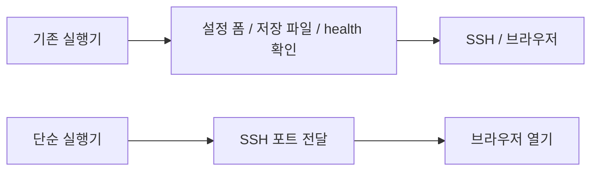
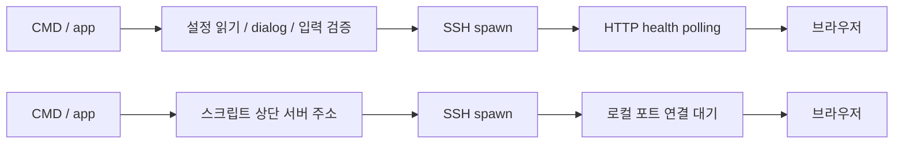

# SSH 실행기 단순화

GitHub Issue: [#2](https://github.com/jo0n-lab/cfd-bot/issues/2)

사용자 요청: 복잡한 앱 설정 없이 SSH 연결 스크립트에 더블클릭 진입점만 제공한다.

## As-Is / To-Be HLD

## As-Is / To-Be LLD

설정 GUI·저장·별도 설정 실행 파일을 제거한다. 기본 연결은 joon@boil61, 웹 포트 8766이다. SSH 인증은 SSH 자체가 수행한다. 기존 웹/티켓/큐는 변경하지 않는다. ZIP을 다시 생성하고 실행 권한·스크립트 구문·가짜 SSH를 통한 연결/종료만 확인한다.

## 결과

Windows 26줄 / Mac 19줄 SSH 스크립트로 축소하고 두 ZIP을 교체했다. 설정 창·설정 저장·HTTP health polling·별도 설정 실행 파일을 제거했다. ZIP 구성과 Mac 구문, 가짜 SSH를 통한 브라우저 열기/종료 검증이 통과했다. 실제 OS UI 실행은 미검증이다.
