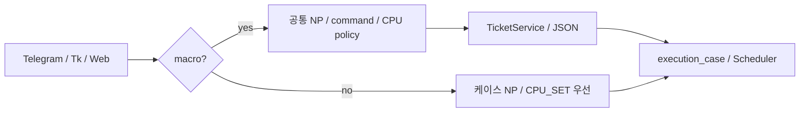
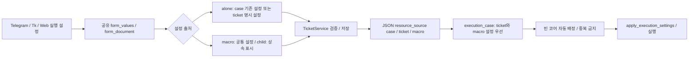

개별 티켓의 실행 설정과 Telegram / cfd-ticket-gui / web 동등 적용

GitHub Issue: [#3](https://github.com/jo0n-lab/cfd-bot/issues/3)

## 배경
실행 설정 폼과 직렬화가 macro 조건에 묶여 있고 execution_case도 resource_source=macro만 명시 설정으로 취급한다. 개별 티켓에 설정 UI가 없으며 입력만 추가하면 실제 NP가 케이스 설정에 의해 덮인다.

## As-Is HLD / LLD

## To-Be HLD / LLD

## 호환성
기존 개별 티켓은 case 출처를 유지한다. 명시 지정은 resource_source=ticket으로 저장한다. 기존 macro_* 폼 키와 매크로 child 상속을 유지한다. 실행 중에는 실행 설정 변경을 거절하되 요청 데이터와 감시 설정 편집은 계속 허용한다. 실제 케이스와 사용자 티켓은 테스트에서 변경하지 않는다.

## 검증 및 문서
세 UI의 설정 표시·입력·저장과 실행 리소스 선택, 기존 티켓 roundtrip, 수동/자동 설정, child 상속, 실행 중 변경 보호를 검증한다. compileall / unittest / 설정 check 및 웹 브라우저 확인 후 bot과 web 서비스를 재시작한다. AGENTS.md에 모든 인터페이스 변경의 세 UI 동시 적용 및 공유 도메인·검증 의무를 명시하고 HLD/LLD/ARCHITECTURE 및 예제를 갱신한다.

## 구현 및 검증 결과

- 독립 티켓에 실행 설정 출처 선택과 NP·실행 명령·자동/수동 CPU 배정을 Telegram, cfd-ticket-gui, 웹 모두 연결했다. 기본은 기존 케이스 설정 사용이며 명시 지정은 resource_source=ticket으로 저장한다.
- 실행 해석과 worker 설정 적용까지 ticket 출처를 지원한다. 기존 케이스 NP=99에 티켓 NP=4를 지정했을 때 NP=4를 사용하고 배정된 CPU_SET과 원본 백업을 적용하는 것을 임시 케이스로 확인했다. 별도의 수동 배정 worker 테스트도 통과했다.
- child는 공통 설정을 표시하고 부모에서 수정한다. 실행 중 설정 변경을 막으며 요청 데이터·감시 설정 편집은 유지한다.
- AGENTS.md에 모든 인터페이스 변경의 Telegram / GUI / web 동시 적용·공유 로직·검증 의무를 명시했다. README, 예제, HLD/LLD/ARCHITECTURE 및 웹 구조 그림을 갱신했다.
- compileall, 설정 check, git diff --check, 예제 로드, SVG XML parse/렌더링 통과. 전체 unittest 237개 중 236개 통과, native Tk 테스트 묶음 1개는 디스플레이 부재로 skip. GUI 폼·직렬화 테스트는 통과했으며 실제 Tk 위젯 조작은 미검증이다.
- Chromium에서 개별 설정 입력·저장, child 상속 표시, 기존 매크로 및 요청 데이터 흐름, 모바일 레이아웃과 콘솔 오류 없음까지 통과했다. 실제 OpenFOAM 계산과 테스트 Telegram 전송은 하지 않았다.
- cfd-bot.service / cfd-bot-web.service 재시작 후 둘 다 active/running 확인. localhost:8766 실제 웹 읽기 전용 점검과 개별 실행 설정 화면 확인 통과.

History: docs/history/2026-09-28-single-ticket-execution.md
