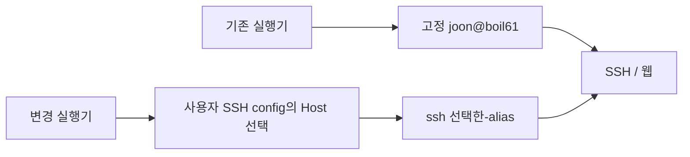
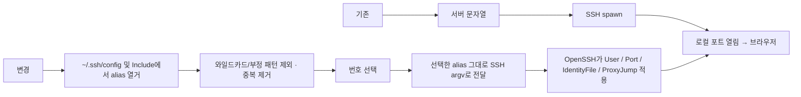

# 기존 SSH config의 Host 선택

GitHub Issue: [#2](https://github.com/jo0n-lab/cfd-bot/issues/2)

사용자 요청: 실행 스크립트에서 기존 SSH config의 접속 대상을 읽어 선택한다. 새 연결 설정은 만들지 않는다.

## As-Is / To-Be HLD

## As-Is / To-Be LLD

목록은 사용자의 config에서 명시된 Host 별칭만 읽으며 `Host *` 같은 패턴은 접속 대상으로 표시하지 않는다. Include 파일의 별칭도 포함하되 Include 순환을 제한한다. 실제 접속 설정의 해석은 OpenSSH에 맡기고 사용자 config는 수정하지 않는다. Windows는 `%USERPROFILE%/.ssh/config`, macOS는 `~/.ssh/config`를 사용한다. 번호 선택만 추가하고 이전의 설정 폼/저장 기능은 복원하지 않는다.

검증: 임시 SSH config로 여러 alias·Include·중복·와일드카드 제외를 확인하고 가짜 SSH에 선택한 alias가 전달되는지 검증한다. ZIP을 재생성하고 필수 저장소 검사도 실행한다. 실제 Windows/macOS SSH 인증 UI는 이 Linux 환경에서 미검증이다.

## 결과

Windows/Mac 실행기에 번호 선택을 추가하고 두 ZIP을 갱신했다. 공통 설정/키/포트는 재해석하거나 저장하지 않고 선택한 alias를 그대로 ssh에 전달한다. Include의 상대 경로·공백 포함 경로·순환, 여러 alias·주석·중복·패턴 제외와 실제 선택 전달을 임시 파일/가짜 SSH로 검증했다. compileall·설정 check·SVG parse/render·ZIP 검증 통과. 전체 테스트 230개 중 229개 통과, 기존 native GUI 테스트 1개 skip. 봇 로직과 서비스 변경은 없다.
