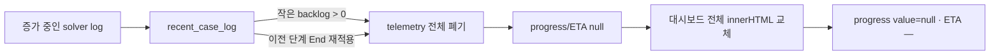
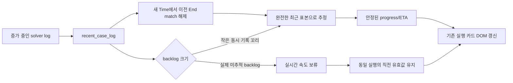

# 웹 진행 현황 ETA·진행바 깜박임 제거

GitHub Issue: [#6](https://github.com/jo0n-lab/cfd-bot/issues/6)

## 배경

실행 중인 계산의 로그는 웹 `/api/overview`가 읽는 동안에도 계속 증가한다. 실제 케이스에서 완전한 `Time`·`ExecutionTime` 표본 21개를 파싱하고도 조회 중 추가된 4~315 byte가 `backlog`로 남았고, ETA 계산기가 이 표본 전체를 무효화했다. 다단계 로그에서는 이전 단계의 `End` match가 다음 단계까지 남아 새 `Time`마다 `ended`를 다시 설정하고 속도 표본을 초기화하는 문제도 있었다. 브라우저는 10초 주기마다 대시보드 전체 DOM을 다시 만들기 때문에 ETA가 `—`로 바뀌는 순간 progress element도 파괴·재생성되었다.

## As-Is HLD

## To-Be HLD

## As-Is LLD

1. `logs.estimate()`는 `backlog`가 1 byte 이상이면 `telemetry = {}`로 바꾼다.
2. 이전 단계에서 매치한 `End`가 다음 단계의 모든 `Time` 뒤에 다시 적용되어 `rate_samples`를 계속 초기화한다.
3. `overview()`는 null progress를 문자열 `null`로 `value` 속성에 넣는다.
4. `refresh()`는 실행 목록 구조가 같아도 `render()`를 호출해 `#content.innerHTML` 전체를 교체한다.
5. 직전 응답의 유효한 ETA·진행률을 기억하지 않는다.

## To-Be LLD

1. 최근 로그의 `backlog`가 64 KiB 이하이고 완전한 진행·clock 표본이 있으면 해당 표본을 사용한다. 64 KiB를 초과한 실제 미추적 상태와 missing log는 기존처럼 live rate를 사용하지 않는다.
2. `ended` 상태 뒤 새 `Time`이 나타나면 이전 단계의 success match를 비워 새 단계가 독립적으로 속도 표본을 쌓게 한다.
3. 새 응답의 ETA 또는 progress가 일시적으로 비어도 동일 case/run이고 진행 수치가 후퇴하지 않았다면 직전 유효값을 합친다.
4. progress는 항상 유효한 수치 속성을 사용한다. 추정할 수 없는 최초 상태는 `value=0`으로 표시한다.
5. live/queue/history 구조가 같으면 통계와 실행 카드의 텍스트·progress 속성만 갱신한다. 구조가 달라질 때만 전체 화면을 렌더링한다.
6. Python 단위 테스트는 작은/큰 backlog 분기와 다단계 `End → Time` 전환을 검증한다. Chromium은 API가 유효 추정값과 null 추정값을 번갈아 반환해도 동일 progress DOM과 값을 유지하는지 검증한다.

## Result

- `logs.estimate()`는 64 KiB 이하의 동시 기록 backlog에서 완전한 최근 표본을 계속 사용한다.
- 다단계 로그의 이전 `End` match는 다음 `Time`에서 해제되어 새 단계가 21개 속도 표본을 정상 축적한다.
- 브라우저는 동일 실행의 일시적인 `unknown` 응답에 직전 유효 ETA·progress를 합치고, 실행·큐·이력 구조가 같으면 기존 카드 DOM을 직접 갱신한다.
- null progress는 `value="null"`로 출력하지 않고 최초 미추정 상태를 수치 `0`으로 표시한다.
- Chromium 회귀 테스트에서 유효 응답 다음 null 응답을 주입해 progress DOM identity, `value=0.4`, 남은 시간 표시가 유지됨을 확인했다.
- Python 전체 테스트 240개가 통과했고 1개 환경 의존 테스트가 skip되었다. 실제 서비스 read-only Chromium smoke도 통과했다.
- 최종 실제 `/api/overview`는 실행 케이스에 `progress=0.291538…`, `remaining_seconds=737.2`, `basis=recent_log_rate`를 반환했다.
- `cfd-bot-web.service`와 `cfd-bot.service`를 재시작해 웹과 Telegram에 공유 계산 로직을 반영했다.
