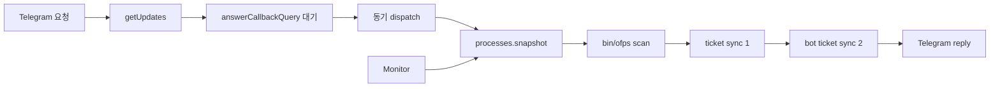
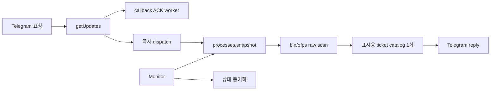
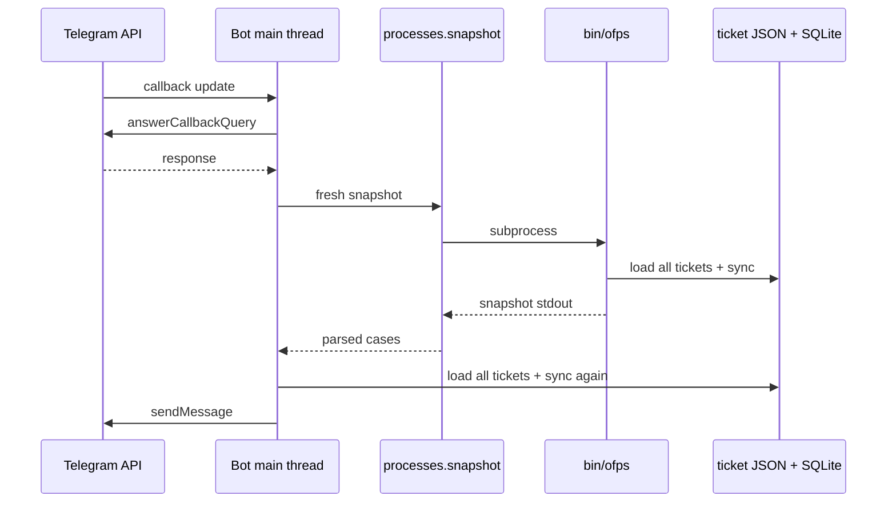
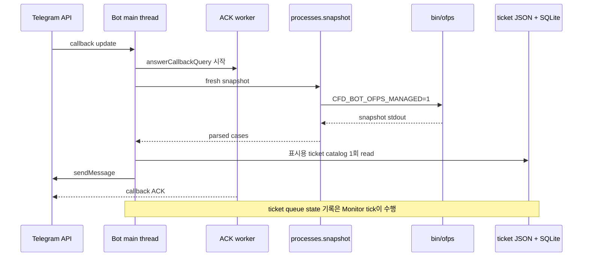

# Telegram 응답 지연 제거

- 날짜: 2026-09-29
- Issue 제목: `[Performance] Remove duplicate ofps synchronization from Telegram request path`
- GitHub Issue: [#10](https://github.com/jo0n-lab/cfd-bot/issues/10)

## 배경과 측정

Telegram 요청 후 reply가 늦어지는 경로를 실제 환경에서 분리 측정했다.

| 구간 | 중앙값 |
|---|---:|
| Telegram Bot API `getMe` 왕복 | 844 ms |
| 원시 `/proc` process scan | 101 ms |
| 티켓 상태 동기화 | 1,007 ms |
| 통합 `ofps` 전체 | 930 ms |
| CLI status 전체 | 2,903 ms |

`/stat`은 통합 `ofps` 내부에서 티켓 상태를 동기화한 뒤 `Bot.fresh_runs()`에서 다시 동기화한다. Monitor scan과 겹치면 `SNAPSHOT_LOCK`을 기다린 후 새 scan을 실행한다. callback 요청은 `answerCallbackQuery` API 호출이 끝난 뒤 dispatch하여 Telegram API 왕복도 직렬로 두 번 발생한다.

## 구현 후 측정

동일한 실제 ticket catalog와 state DB에서 최종 `/stat` 경로는 20회 측정했다.

| 구간 | 변경 전 중앙값 | 변경 후 중앙값 |
|---|---:|---:|
| managed `ofps` process scan | 101 ms | 81 ms |
| 티켓 상태 동기화 | 1,007 ms | 241 ms |
| Telegram `/stat` 내부 처리 | 약 2초 이상 | 192 ms (p95 211 ms) |
| CLI status 전체 | 2,903 ms | 692 ms |

Telegram Bot API 네트워크 왕복 약 844ms는 외부 지연으로 남는다. 버튼 callback ACK는 dispatch와 병렬로 보내므로 이 왕복을 실제 action 앞에서 추가로 기다리지 않는다. Monitor와 `/stat`은 scan 중 약 81ms의 `SNAPSHOT_LOCK` 구간만 직렬화한다. `/stat`은 JSON/SQLite 기록을 기다리지 않으며 Monitor가 상태를 반영한다.

## As-Is HLD

## To-Be HLD

Standalone `ofps`는 기존처럼 scan 뒤 상태를 동기화한다. `cfd_bot`이 `ofps`를 실행할 때만 내부 동기화를 생략한다. `/stat`은 fresh 결과를 바로 표시하고 같은 service의 Monitor가 상태를 반영한다. Monitor의 전체 CASE 감시 범위는 유지한다.

## As-Is LLD

## To-Be LLD

## 호환성과 검증

- 무인자 `ofps`, `ofps --watch`, `ofps --check`의 standalone 상태 동기화는 유지한다.
- bot, CLI, GUI와 web의 공용 `processes.snapshot()`은 scanner 내부 동기화를 생략한다.
- `/stat`은 요청마다 fresh `ofps` scan을 실행하며 cached watcher 결과로 대체하지 않는다.
- callback ACK 실패는 요청 처리를 막지 않고 token-safe log로 남긴다.
- snapshot 환경 전달, 단일 catalog load, `/stat` 무기록 경로, callback 비동기 ACK를 단위 테스트한다.
- 전체 테스트, 설정 검사, 전후 latency benchmark와 실제 user service 상태를 확인한다.
