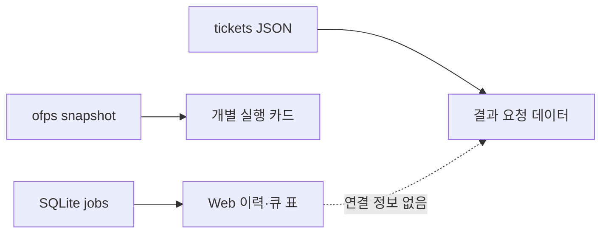
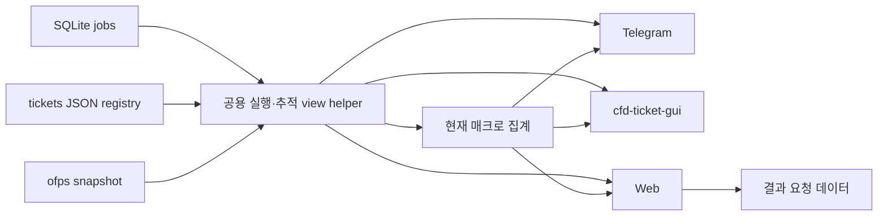

# 결과 데이터 추적 링크와 실행 중인 매크로 진행 현황

GitHub Issue: [#9](https://github.com/jo0n-lab/cfd-bot/issues/9)

## 배경

실행 이력과 작업 큐에 케이스가 표시되어도 현재 티켓 JSON과 연결되는지 알 수 없고, 결과 요청 데이터 화면으로 바로 이동할 수 없다. 대시보드에는 개별 실행 케이스만 보여 매크로 전체의 완료 수와 예상 잔여 시간을 확인하기 어렵다.

## As-Is HLD

## To-Be HLD

## As-Is LLD

1. Web의 `job_view`는 작업 ID, 이름, 경로, 상태만 직렬화한다.
2. 이력 행과 상세 보기에는 현재 등록된 티켓과 연결할 case ID가 없다.
3. 작업 큐의 대기·실행 중 행은 같은 일반 텍스트를 사용한다.
4. 매크로 티켓의 `cases[].job_id`와 하위 작업 상태를 화면용으로 집계하지 않는다.
5. Telegram과 cfd-ticket-gui에도 큐 작업에서 결과 데이터로 가는 공통 추적 판정이 없다.

## To-Be LLD

1. 공용 view helper가 현재 `cases_for()` registry를 case directory 절대 경로로 색인한다.
2. 각 job은 `trackable`, `case_id`, `ticket`을 같은 규칙으로 계산한다. 파일이 현재 registry에 존재하는 경우에만 추적 가능하다.
3. 종료 이력은 추적 가능한 케이스명과 상세 보기에서 결과 데이터로 이동할 수 있다. 티켓 부재는 별도 색상 상태로 표시한다.
4. 대기·실행 중 목록은 추적 여부를 표시하되 `running`인 작업만 결과 데이터 이동을 활성화한다. `queued`, `starting`, `postprocessing`은 링크를 만들지 않는다.
5. 실행 중 매크로는 매크로 JSON의 현재 `cases[].job_id`만 Store 작업과 결합한다. 완료된 하위 작업 수와 실행 중 하위 작업의 solver 진행률을 더해 전체 진행률을 계산한다.
6. 매크로의 경과 시간은 현재 묶음 작업 중 가장 이른 생성 시각부터 계산한다. 예상 잔여 시간은 현재 실행 작업의 ETA와 남은 대기 작업의 설정값·최근 성공 이력 예측을 합산하고, 개별 이력이 없는 하위 작업은 같은 매크로에서 최근 완료된 성공 작업의 중앙 실행 시간을 사용한다. 그래도 예측할 수 없는 항목이 있으면 알 수 없음으로 표시한다.
7. Telegram은 큐 화면에 실행 중인 추적 가능 케이스의 결과 버튼과 매크로 요약을 제공한다. cfd-ticket-gui 작업 큐 창은 실행·이력과 결과 데이터 진입, 매크로 요약을 제공한다. Web은 대시보드와 전체 큐/이력에 같은 공용 값을 표시한다.

## 호환성

- 기존 티켓 JSON과 SQLite schema는 변경하지 않는다.
- 삭제된 티켓의 과거 실행 이력은 계속 표시하되 결과 데이터 링크만 비활성화한다.
- 외부에서 실행한 ofps 케이스도 현재 티켓 registry와 경로가 일치하면 추적 가능하다.
- 매크로 JSON의 현재 job ID가 없는 이전 기록은 실행 중 매크로 집계에서 제외한다.

## 검증 계획

- 공용 helper에서 티켓 존재·부재, queued/running/terminal 작업의 추적 상태를 검증한다.
- 매크로 하위 작업의 완료·실행·대기 조합과 ETA 합산을 검증한다.
- Web 최근 이력, 전체 이력, 상세 보기, 대기·실행 표의 링크 활성 조건을 브라우저 fixture로 확인한다.
- Telegram 큐 결과 버튼과 매크로 요약, cfd-ticket-gui 큐/이력 결과 진입을 검증한다.
- compileall, 전체 unittest, bot config check와 세 서비스 상태를 확인한다.

## 결과

- `run_views`에 현재 티켓 JSON registry 기반 `trackable` 판정과 공용 job projection을 추가했다.
- Web의 최근 실행 이력과 전체 이력은 추적 가능 여부를 파랑/빨강으로 표시하고, 추적 가능한 행의 케이스명과 상세 보기만 결과 요청 데이터로 연결한다.
- Web의 대기·실행 중 표는 추적 여부를 표시하되 상태가 정확히 `running`인 추적 가능 작업만 결과 링크를 제공한다.
- 대시보드 실행 케이스 아래에 현재 매크로 child job ID 기준 완료/목표, 경과 시간, 예상 남은 시간, 진행 바를 추가했다. 개별 이력이 없는 대기 child는 현재 매크로의 최근 성공 child 중앙 실행 시간을 ETA fallback으로 사용한다.
- Telegram `/queue`에는 계산 중인 추적 가능 케이스와 최근 추적 가능 이력의 결과 버튼, 실행 중인 매크로 요약을 추가했다.
- cfd-ticket-gui 작업 큐 창에는 추적 가능 상태를 구분한 계산 중·실행 이력과 결과 요청 데이터 창, 실행 중 매크로 요약을 추가했다.
- 전체 Python 회귀 테스트, UI resource 검사, config check, SVG XML parse·PNG 렌더링과 실제 web overview 응답을 확인했다. Telegram과 web user service를 재시작했고 둘 다 active 상태를 확인했다.
