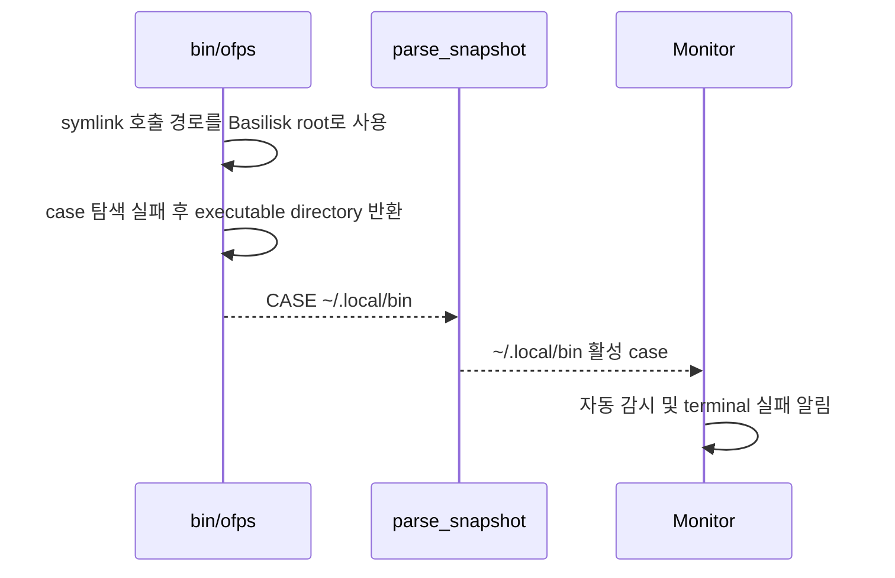
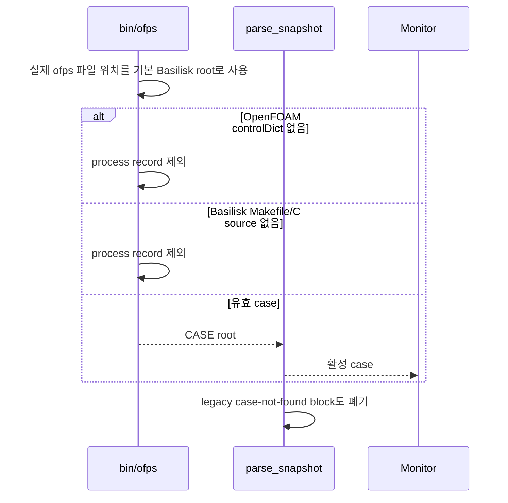

# 유효 CFD case가 없는 scanner 오탐 제거

- 날짜: 2026-10-01
- GitHub Issue: [#12](https://github.com/jo0n-lab/cfd-bot/issues/12)

## 배경

`/home/joon/.local/bin`이 `bin · 미등록 자동 감시`로 반복 등록되어 시작·실패 알림이 발송됐다. 저장된 관측에는 52코어 affinity의 일반 CLI 프로세스가 있었지만 계산 로그와 종료 코드는 없었다.

직접 원인은 `~/.local/bin/ofps` symlink의 호출 디렉터리를 기본 Basilisk root로 사용한 데 있다. 이 때문에 `~/.local/bin`의 native executable이 모두 Basilisk 후보가 됐고, `basilisk_case_from_process()`가 Makefile과 C source를 찾지 못해도 executable directory를 case로 반환했다.

OpenFOAM 경로에도 `system/controlDict`를 못 찾은 `CASE: <cwd> [controlDict not found]`를 parser가 정상 경로로 바꾸는 같은 종류의 경계 오류가 있었다.

## As-Is HLD

## To-Be HLD

## As-Is LLD

## To-Be LLD

## 호환성과 검증

- `system/controlDict`가 있는 OpenFOAM case, `-case` 지정과 case 내부 하위 디렉터리 실행은 유지한다.
- `OFPS_BASILISK_ROOT`로 지정한 실제 tree와 Makefile/C source가 있는 Basilisk case는 유지한다.
- symlink 설치 경로의 일반 executable은 계산으로 분류하지 않는다.
- scanner 통합 테스트와 parser 단위 테스트로 두 engine의 invalid case가 snapshot에 들어오지 않는지 확인한다.
