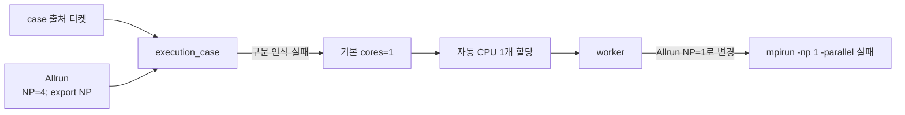
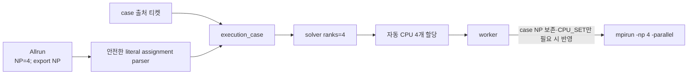

# case 실행 설정의 NP 보존

- 날짜: 2026-10-02
- GitHub Issue: [#14](https://github.com/jo0n-lab/cfd-bot/issues/14)
- 대상: case 실행 설정 해석, worker 설정 적용, 회귀 테스트

## 배경

`of-main` 티켓은 `resource_source=case`와 자동 CPU 배정을 사용한다. 실제 `Allrun`에는 `NP=4; export NP`가 있었지만 기존 parser는 대입문의 오른쪽에 이어진 `export NP`를 허용하지 않아 NP를 찾지 못했다. loader 기본값 `cores=1`이 사용됐고, worker는 자동 CPU 정책이라는 이유로 case가 소유한 `Allrun`까지 `NP=1`로 다시 썼다. 그 결과 `mpirun -np 1 ... -parallel`이 실행돼 OpenFOAM이 `attempt to run parallel on 1 processor`로 중단됐다.

## As-Is HLD

## As-Is LLD

- `execution_case()`는 NP/CPU_SET 줄 전체를 `shlex.split()`한 결과가 정확히 한 항목일 때만 값을 인정한다.
- `NP=4; export NP`는 여러 shell token이 되어 case의 NP가 누락된다.
- `load_case()`가 추가한 `cores=1`이 누락된 case NP의 fallback으로 사용된다.
- `apply_execution_settings()`는 `resource_source=case`라도 `cpu_policy=auto`이면 NP와 CPU_SET을 모두 덮어쓴다.
- 설정 반영은 전처리보다 먼저 수행되므로 전처리가 실패해도 잘못 변경된 `Allrun`이 case에 남는다.

## To-Be HLD

## To-Be LLD

1. NP/CPU_SET은 shell을 실행하지 않고 대입문의 첫 literal 값만 읽는다. 값 뒤에는 `; export NP`, `; export CPU_SET`만 허용한다.
2. command substitution, backtick, 산술·복합 shell 표현은 계속 거부한다.
3. `resource_source=case`에서는 case에서 읽은 NP를 실행 rank의 진실 원천으로 유지한다.
4. `apply_execution_settings()`는 ticket/macro 출처에서만 NP를 다시 쓴다. case 출처 자동 배정은 case NP를 변경하지 않고 런타임 CPU 배치만 적용한다.
5. `NP=4; export NP` 회귀 fixture로 `execution_case()`가 4 rank를 반환하고 worker 설정 적용 뒤에도 원문 NP가 유지되는지 검증한다.
6. 명시적 ticket/macro 설정이 NP를 덮어쓰는 기존 동작은 유지한다.

## 호환성

- 단순 `NP=4`, `export NP=4`, 인용된 CPU_SET과 config `*Run` 파일은 계속 지원한다.
- `resource_source=ticket|macro`의 명시 NP 우선순위와 원본 백업은 유지한다.
- 기존 case 출처 티켓은 JSON에 `cores`가 없어도 case script의 NP를 사용한다.
- Telegram, GUI, web의 입력 계약은 바뀌지 않으며 공용 실행 domain만 수정한다.

## 검증 계획

- `NP=4; export NP`와 `export NP=4; export NP` literal parsing
- 위험한 command substitution이 실행되지 않고 설정으로 채택되지 않는지 확인
- case 출처 자동 배정이 NP를 보존하고 4개 solver CPU를 요청하는지 확인
- ticket/macro 출처가 지정 NP와 CPU_SET을 계속 반영하는지 확인
- `python3 -m compileall -q cfd_bot tests`
- `python3 -m unittest discover -s tests -q`
- `python3 -m cfd_bot --config bot.json check`
- 서비스 재시작과 상태 확인
- `of-main/Allrun`을 보관된 원본 `NP=4; export NP`로 복구한 뒤 dry resolution으로 4 rank 확인
