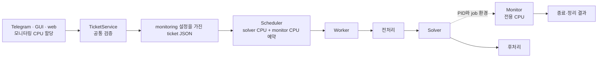

# 모니터링 전용 CPU와 스크립트 실행

- GitHub Issue: [#13](https://github.com/jo0n-lab/cfd-bot/issues/13)
- 대상: Telegram, `cfd-ticket-gui`, web, ticket domain, scheduler, worker

## 배경

TCB `of-main`은 솔버와 별도로 `Allmonitor`를 실행한다. 모니터링 프로세스가 솔버 CPU와 경쟁하지 않게 티켓에서 모니터링 전용 CPU 사용 여부와 스크립트를 지정할 수 있어야 한다. `Allmonitor`는 `TCB_MONITORED_SOLVER_PID`를 통해 솔버 종료를 감지하므로 실행과 정리도 worker가 함께 관리해야 한다.

## As-Is HLD


## As-Is LLD

- 티켓 스키마와 공통 편집 모델에 모니터 실행 설정이 없다.
- scheduler는 `cores` 또는 `cpu_set`만 예약하며, 별도 모니터 프로세스의 CPU를 알지 못한다.
- worker는 전처리, 솔버, 후처리만 실행하고 솔버 PID만 관리한다.
- `Allmonitor`에 `TCB_MONITORED_SOLVER_PID`를 전달할 경로가 없다.
- 세 인터페이스에서 모니터 CPU를 선택하거나 스크립트를 입력할 수 없다.

## To-Be HLD



## To-Be LLD

1. 선택된 티켓은 다음 선택 스키마를 사용한다.

   ```json
   {
     "monitoring": {
       "allocate_cpu": true,
       "command": ["./Allmonitor"]
     }
   }
   ```

2. 공통 form은 `monitoring_cpu`와 `monitoring_command`를 제공한다. 체크 해제 시 `monitoring` 블록을 저장하지 않는다.
3. Telegram은 toggle button과 텍스트 입력, GUI와 web은 checkbox와 활성화되는 script input으로 같은 form을 편집한다.
4. 자동 CPU 정책은 `cores + 1`개의 가용 물리 코어를 한 번에 선택하고 마지막 CPU를 monitor 전용으로 분리한다.
5. 수동 CPU 정책은 지정한 solver CPU를 보존하면서 그 범위를 busy 집합에 넣고 monitor CPU 1개를 자동 선택한다.
6. active job의 solver CPU와 monitor CPU를 모두 이후 할당의 busy 집합으로 사용한다.
7. worker는 solver를 먼저 시작하고 monitor에 `TCB_MONITORED_SOLVER_PID`, `CFD_BOT_JOB_ID`, `CFD_BOT_CASE_DIR`, `NP`, `CPU_SET`을 전달한다. monitor는 예약 CPU에 `taskset`으로 고정한다.
8. solver 종료 후 monitor의 자체 정리를 잠시 기다린다. 남은 process group은 종료하며 결과를 job 진단 정보에 기록한다.
9. macro 설정은 child 티켓에 복제되고, 실행 중에는 다른 실행 설정과 같이 변경을 제한한다.

## 호환성

- `monitoring`이 없는 기존 티켓은 기존 scheduler와 worker 경로를 그대로 사용한다.
- solver의 `cores`는 계산 rank 수를 뜻하며 monitor CPU를 포함하지 않는다.
- 수동 `cpu_set`도 solver 전용 의미를 유지한다.
- monitor 실패는 solver의 계산 성공 여부를 덮어쓰지 않고 별도 오류로 기록한다.

## 검증 계획

- config/editor round-trip과 잘못된 `monitoring` 설정 거부
- 자동·수동 CPU 정책에서 solver/monitor CPU 비중복과 active job 예약 확인
- worker의 command, affinity, solver PID 환경 전달과 종료 처리 확인
- Telegram·GUI·web의 생성, 편집, 표시, 저장 동등성 확인
- macro→child 상속과 실행 중 변경 보호 확인
- `compileall`, 전체 `unittest`, `python3 -m cfd_bot --config bot.json check`
- 사용자 서비스 재시작 후 bot/web 상태 확인
