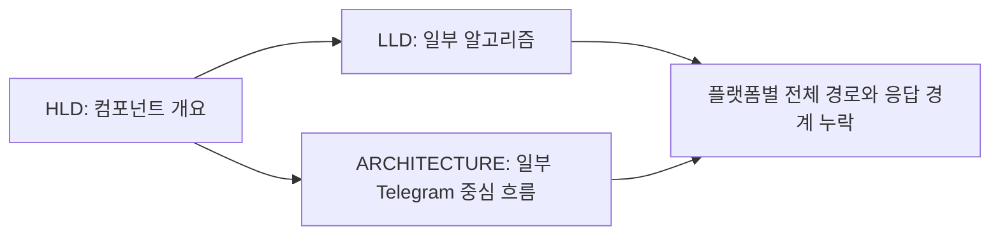
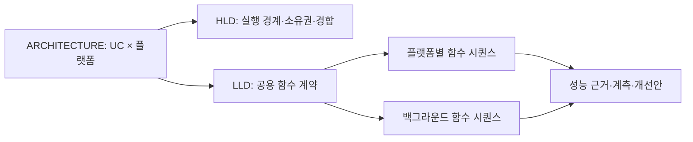
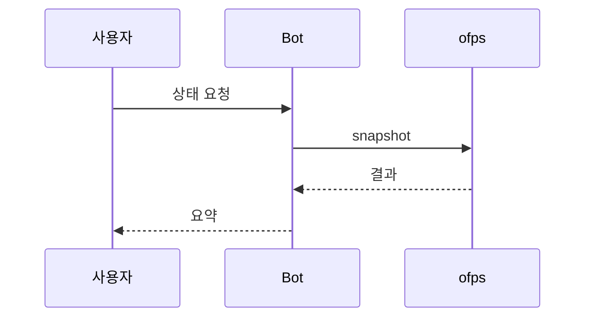

# 함수 호출·응답 및 플랫폼별 아키텍처 문서 재작성

- 날짜: 2026-10-04
- GitHub Issue: [#19](https://github.com/jo0n-lab/cfd-bot/issues/19)
- 기준 HEAD: `4b3b798bedec113d5d53d21f741d6c6e6238df63` + 작업 트리의 기존 미커밋 변경
- 범위: 설계 문서·그림·문서 검증 및 격리된 성능 실험. 제품 로직·설정·서비스 변경 없음.

## 배경과 목적

Telegram 응답 지연을 분석하려 해도 기존 문서는 일부 모듈과 기능만 설명하며, 모든 유즈케이스의 플랫폼 진입점에서 실제 함수 호출·반환·대기 구간까지 연결하지 못한다. 현행 코드를 근거로 HLD/LLD/ARCHITECTURE를 재구성하고, 확인한 구조적 비용과 미확인 성능 가설을 구별한다.

## As-Is HLD — 기존 문서 구성



## To-Be HLD — 문서 탐색 구조



## As-Is LLD — 기존 설명 수준



## To-Be LLD — 명세 수준 예시(현행 동작)

```mermaid
sequenceDiagram
    participant M as bot.serve 메인 loop
    participant B as Bot
    participant P as processes.snapshot
    participant S as subprocess.run
    participant O as bin/ofps
    participant T as Telegram
    M->>B: handle(update) → dispatch(status)
    B->>P: fresh_runs() → snapshot(command)
    Note over P: SNAPSHOT_LOCK 대기; 프로세스 내부
    P->>S: run(command, timeout=45, managed env)
    S->>O: ofps 프로세스 실행
    O->>O: scan_and_sync() → scan_once()
    O-->>S: stdout / stderr / exit code
    S-->>P: CompletedProcess(stdout, stderr, returncode)
    Note over P: lock 해제 후 parse_snapshot(stdout)
    P-->>B: {raw, cases}
    B->>B: tickets_for → cases_for → active_runs → status
    B->>T: send(chat, text, markup) → call(sendMessage)
    T-->>B: Message 목록
    B->>B: _remember → Store.remember_message
    B-->>M: None; 이후 update offset 저장
```

제품의 To-Be 구조는 현행 설명에 섞지 않고 성능 분석 문서의 제안으로 구분한다. /stat의 fresh scan 및 기존 기능을 문서 작업에서 변경하지 않는다.

## 호환성 및 검증 계획

- 기존 README와 세 설계 문서 진입 경로 유지; 세부 LLD는 분리 문서로 연결.
- 기존 미커밋 기능(매크로 이름 필터 등)을 현행 코드 기준으로 포함.
- 소스 기준 해시, 함수 위치/명세, 플랫폼별 진입점과 테스트 연결 검증.
- SVG XML parse 및 실제 PNG 렌더링·육안 검토.
- 실제 Telegram 전송·OpenFOAM 계산 없는 기존 테스트와 설정 검사.
- 격리된 fixture 계측은 생산 환경 응답 시간과 구분. 서비스 재시작 없음.

## 결과

### 후속 분석 — 함수 내부 반복 누락 보완

기존 그림에 cases_for 이름은 있었지만 child마다 macro rows를 재검색하고 Path.resolve를 수행하는 내부 로직이 빠져 있었다. LLD에 단계·조건·반복량·파일 접근·lock 해제 위치를 추가하고 D-01과 `/stat` 그림에 중첩 loop 프레임을 넣었다. 큐 본문의 전체 job 순회는 D-13으로 추가했다.

[운영 데이터 읽기 전용 분석](../analysis/live-bottlenecks.md)에서 managed ofps 약 1.06초, membership 16.562/19.684초, queue_text 5.535초와 SQLite 연결 1,839회/본문 35조각을 확인했다. Monitor 정상 경로의 membership 3회·전체 catalog 읽기 4회를 문서와 그림에 표시했다. DB snapshot 갱신 간격 72.059/76.624초는 작성자를 식별하지 못한 수동 관찰값이며 Monitor 단독 trace와 구분했다.

기존 single-only fixture가 macro O(N²) 비용을 포착하지 못한 제한을 기록하고 개선 순서를 바꿨다. 제품 수정·서비스 재시작·실제 Telegram 전송·계산 시작은 수행하지 않았다. 아래 96개/101개/1,812개 수치는 최초 검증 기록이며 후속 추가 결과는 validation 문서의 최신 기록을 따른다.

추가로 실제 queue dispatcher를 read-only SQL/fake API로 실행해 네트워크 없이 35.888초를 확인했다. 매크로 ETA 7.874초와 본문 ETA 4.586초의 중복 조회를 D-14와 LLD에 반영했다. 전체 이력 조회 1,837회/SQLite 연결 3,681회/메시지 35조각이며 단계의 포함 관계와 API 시간 제외를 원시 집계와 함께 기록했다.

- [ARCHITECTURE](../ARCHITECTURE.md)에 27개 사용자 유즈케이스와 플랫폼별 지원·진입점, 백그라운드 흐름을 정리했다.
- [HLD](../HLD.md)는 프로세스·thread·저장소·lock 경계와 대기 지점을, [LLD](../LLD.md)는 실제 함수 요청·반환·오류와 데이터 계약을 설명한다.
- [플랫폼별 그림 목록](../lld/flows.md)에 가로 participant 배치의 함수 시퀀스 96개를 연결했다. 공용 도메인과 백그라운드 처리도 포함하며, 실제 ofps 프로세스 및 Telegram API 경계를 표시했다. 기존 개요 SVG 경로 5개도 갱신했다.
- [함수 색인](../analysis/function-index.md)에 342개 함수의 소스 위치·시그니처·호출 표현식을 연결했다. [성능 분석](../analysis/performance.md)은 격리된 측정 결과와 아직 운영 계측이 필요한 병목 후보·개선안을 구분한다.
- [검증 결과](../analysis/validation.md): 전체 테스트 272개 실행, OK(skipped=1), compileall·설정 검사 통과. 로컬 링크 1,812개와 SVG 101개 XML·실제 렌더링 검사를 통과했다. 제품 파일 42개의 시작 전후 해시가 동일하며 제품 동작·서비스는 변경하지 않았다.
