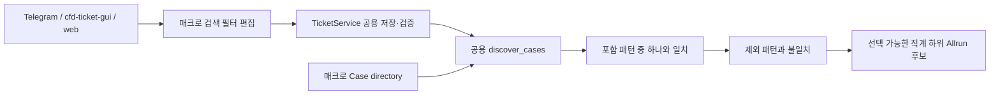

# 매크로 하위 케이스 이름 포함·제외 필터

GitHub Issue: [#17](https://github.com/jo0n-lab/cfd-bot/issues/17)

## 배경

매크로 루트에 서로 다른 이름 규칙을 쓰는 케이스가 함께 있을 때, 현재 검색은 바로 아래에 `Allrun`이 있는 모든 폴더를 후보로 표시한다. 사용자는 원하는 계열만 남기거나 특정 계열을 명시적으로 제외할 수 없다.

예시는 포함 `DS_CART_NQ_*`, 제외 `DS_ID_LHS_vN-Q_fC*`이다. 패턴은 케이스 절대 경로가 아니라 직계 하위 디렉터리의 이름에 적용한다.

## As-Is HLD

## To-Be HLD

## As-Is LLD

1. `discover_cases()`는 루트의 직계 하위 디렉터리 중 바로 아래에 `Allrun`이 있는 후보를 모두 검사한다.
2. 숨김·symlink·`*-template`·실행 중 케이스와 계산 상태만 판정한다.
3. 매크로 티켓에는 검색 이름 규칙을 저장할 필드가 없다.

## To-Be LLD

1. 매크로 티켓의 `discovery.include_patterns[]`와 `discovery.exclude_patterns[]`에 glob 패턴을 저장한다.
2. 세 UI는 여러 패턴을 줄바꿈으로 입력하며 같은 `TicketService.form_document()`를 통해 저장한다.
3. `discover_cases()`는 디렉터리 basename에 대소문자를 구분하는 `fnmatchcase`를 적용한다.
4. 포함 목록이 비어 있으면 기존 후보 전체를 허용한다. 값이 있으면 하나 이상의 포함 패턴과 일치해야 한다.
5. 제외 패턴과 하나라도 일치하면 포함 패턴과도 일치하더라도 제외한다.
6. 패턴에 경로 구분자를 허용하지 않아 직계 하위 탐색 범위를 유지한다.
7. 단일 티켓과 매크로에서 발행한 child 티켓에는 `discovery`를 저장하지 않는다.
8. Telegram 비동기 검색은 시작 당시 디렉터리·종료값·필터와 현재 draft가 같을 때만 결과를 적용한다.

## 호환성

- 기존 티켓처럼 `discovery`가 없거나 두 목록이 비어 있으면 현재 검색 결과와 동일하다.
- 기존 직계 하위 탐색, 실행 중 제외, checkpoint/postProcessing 상태 판정은 유지한다.
- 매크로 하위 티켓의 실행·큐 설정에는 영향을 주지 않는다.

## 검증 계획

- 포함만, 제외만, 두 규칙 동시 적용과 제외 우선순위를 단위 테스트한다.
- 재귀 탐색이 다시 생기지 않는지와 경로 구분자 거부를 검증한다.
- Telegram·cfd-ticket-gui·web의 입력, 저장, 재편집, 검색 연결을 검증한다.
- 매크로 child 복제본에 `discovery`가 남지 않는지 검증한다.
- README, example, HLD, LLD, ARCHITECTURE와 관련 SVG를 최종 구조에 맞춘다.
- compileall, 전체 unittest, config check와 SVG XML/렌더링 검증을 실행한다.

## 결과

- 매크로 티켓에 `discovery.include_patterns`와 `discovery.exclude_patterns`를 저장하고 세 UI에서 줄바꿈 입력·재편집·검색에 사용한다.
- 공용 `discover_cases()`가 직계 하위 `Allrun` 후보의 폴더 이름만 검사하며 제외 패턴을 최종 우선한다.
- 패턴의 경로 구분자와 중복을 공용 validator가 거부하고, 발행된 child 티켓에서는 `discovery`를 제거한다.
- Telegram 검색은 필터가 검색 도중 바뀐 경우 이전 결과를 적용하지 않는다.
- 2026-10-04 기준 compileall, 272개 unittest, bot config check, JavaScript 문법 검사, SVG 5개 XML parse와 변경 SVG 2개 PNG 렌더링을 통과했다. 디스플레이가 없는 환경의 Tk widget 테스트 1개는 skip되었고 같은 폼·검색 연결은 비표시 단위 테스트로 검증했다.
- `cfd-bot.service`와 `cfd-bot-web.service`를 재시작했으며 두 서비스가 active이고 web health 응답이 정상임을 확인했다.
