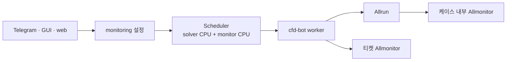
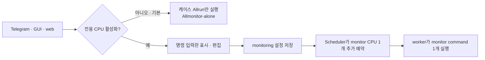

# 모니터링 전용 CPU의 명시적 활성화와 입력란 표시

- GitHub Issue: [#16](https://github.com/jo0n-lab/cfd-bot/issues/16)
- 대상: Telegram, `cfd-ticket-gui`, web, ticket domain, scheduler, worker

## 배경

케이스의 `Allrun`이 자체적으로 `Allmonitor`를 실행하는 경우가 있다. 여기에 티켓의
`monitoring.allocate_cpu=true`가 저장되면 cfd-bot도 별도 CPU에서 모니터를 하나 더
실행하므로 같은 케이스에 모니터가 중복 실행된다. 전용 CPU 모니터는 사용자가 명시적으로
활성화한 경우에만 저장하고 실행해야 하며, 명령 입력란도 활성 상태에서만 보여야 한다.

## As-Is HLD

## As-Is LLD

- 새 티켓의 공통 모델은 전용 CPU를 비활성화하지만 예제와 일부 실제 티켓에는
  `monitoring.allocate_cpu=true`가 기본처럼 저장되어 있다.
- `of-main/Allrun`은 자체 `Allmonitor`를 시작하고, `alone-of-main.json`도 worker에
  `./Allmonitor` 실행을 요청한다.
- Telegram은 비활성 상태에서 명령 편집 버튼을 숨기지만 GUI와 web은 비활성화된 입력란을
  계속 표시한다.
- worker는 `monitoring` 블록이 있으면 의도된 명시 설정으로 보고 별도 CPU를 예약한다.

## To-Be HLD

## To-Be LLD

1. 공통 `TicketService` form에서 `monitoring_cpu=false`를 기본으로 유지하며 저장 시
   `monitoring` 블록을 제거한다.
2. 사용자가 전용 CPU를 활성화한 때에만 monitor command를 검증하고
   `{ "allocate_cpu": true, "command": ["./Allmonitor"] }`를 저장한다.
3. Telegram은 현재 조건부 버튼을 유지하고, GUI와 web도 비활성 상태에서는 command
   입력 행 전체를 숨긴다.
4. `alone-of-main.json`에서는 `monitoring` 블록을 제거해 케이스 `Allrun`이 시작하는
   단일 `Allmonitor`만 사용하고, 실제 solver 출력인 `log.solver`를 감시한다.
5. 예제 티켓은 전용 CPU를 기본값처럼 보이지 않도록 `monitoring` 블록을 제거한다.

## 호환성

- 기존 티켓에 `monitoring.allocate_cpu=true`가 명시돼 있으면 계속 활성 상태로 읽고 실행한다.
- `monitoring`이 없는 티켓의 scheduler와 worker 동작은 바뀌지 않는다.
- monitor command 기본값은 실제 케이스에 존재하는 `./Allmonitor`를 유지한다.
  `Allmonitor-alone`은 별도 파일명이 아니라 케이스 내부 모니터 하나만 사용하는 기본 실행
  상태를 뜻한다.

## 검증 계획

- 공통 form의 기본 비활성화, 활성화 round-trip, 비활성화 시 설정 제거 확인
- Telegram에서 비활성 상태의 command 편집 버튼 부재 확인
- GUI와 web에서 비활성 상태의 command 입력 행 숨김, 활성화 후 표시·편집 확인
- 예제와 `alone-of-main.json`에 암묵적 전용 CPU 설정이 없는지 확인
- worker가 명시된 `monitoring`에만 전용 CPU를 예약하는 회귀 테스트
- `compileall`, 전체 `unittest`, config check
- bot/web user service 재시작과 상태 확인
