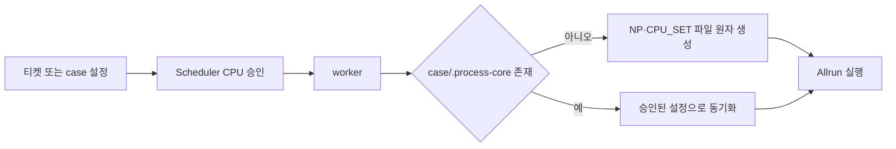

# 케이스별 `.process-core` 자동 생성과 동기화

- 날짜: 2026-10-04
- GitHub Issue: [#15](https://github.com/jo0n-lab/cfd-bot/issues/15)
- 대상: case 실행 설정 해석, worker 실행 설정 적용, 회귀 테스트

## 배경

케이스별 `.process-core`가 `NP`와 `CPU_SET`의 표준 실행 설정 파일로 사용되기 시작했다. 현재 cfd-bot은 실행 설정을 `Allrun`과 `config/*Run`에서 읽고 수정하며, `.process-core`가 없는 케이스에는 파일을 만들지 않는다. 새 규약을 사용하는 `Allrun`은 파일 누락 시 즉시 실패하고, 자동 할당된 CPU와 파일 값이 불일치할 수 있다.

## As-Is HLD

## As-Is LLD

- `execution_case()`는 `Allrun`과 `config/*Run`에서만 literal `NP`/`CPU_SET`을 읽는다.
- `apply_execution_settings()`는 case 출처 수동 설정이면 즉시 반환한다.
- worker가 승인한 `cores`와 `cpu_set`으로 `.process-core`를 생성하는 경로가 없다.
- ticket/macro와 자동 CPU 배정은 legacy 파일을 수정하지만 `.process-core`를 동기화하지 않는다.

## To-Be HLD

## To-Be LLD

1. `execution_case()`는 `.process-core`가 있으면 legacy 파일 뒤에 읽어 case 설정의 최종 우선순위로 사용한다.
2. worker는 전처리 전에 `apply_execution_settings()`에서 `.process-core` 존재를 확인한다.
3. 파일이 없으면 승인된 `NP`와 `CPU_SET`, `export NP CPU_SET`을 포함해 같은 디렉터리의 임시 파일에서 원자적으로 생성한다.
4. 기존 `.process-core`는 ticket/macro 또는 자동 CPU 배정의 승인값과 동기화한다.
5. case 출처 수동 설정도 파일이 없으면 생성하되 기존 파일은 변경하지 않는다.
6. symlink `.process-core`는 case 경계 우회 방지를 위해 거부한다.
7. 기존 `Allrun`과 `config/*Run` 반영은 호환성을 위해 유지한다.

## 호환성

- `.process-core`를 사용하지 않는 기존 케이스도 실행 시 표준 파일을 얻는다.
- case 출처 수동 설정의 기존 값은 보존한다.
- ticket/macro와 자동 CPU 정책은 실제 승인된 배치가 파일과 일치한다.
- Telegram, GUI, web 티켓 계약과 화면은 변경하지 않는다.

## 검증 계획

- 파일이 없는 case 출처 수동 케이스 생성
- ticket/macro 자동 배정값 생성 및 기존 파일 갱신
- `.process-core`가 legacy 설정보다 우선하는지 확인
- 기존 파일 백업 및 원자 갱신 확인
- symlink 거부 확인
- `python3 -m compileall -q cfd_bot tests`
- `python3 -m unittest discover -s tests -q`
- `python3 -m cfd_bot --config bot.json check`
- user service 재시작 후 active 상태 확인
