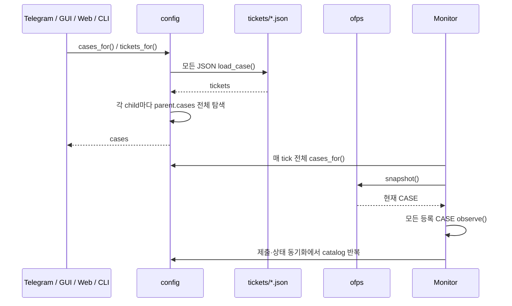
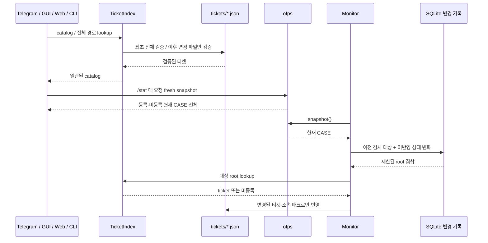
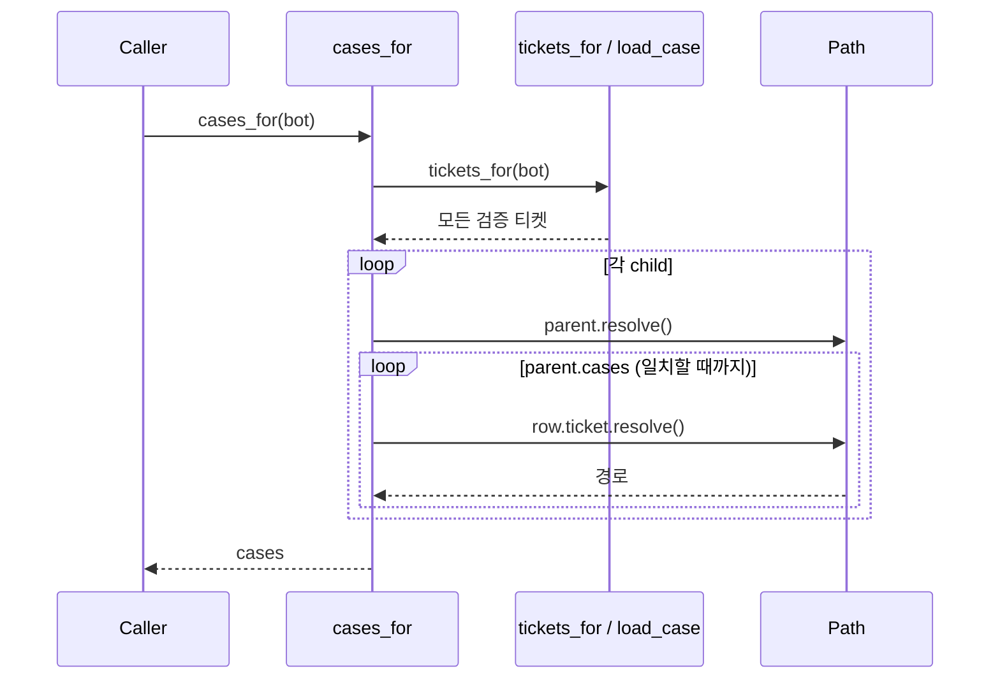
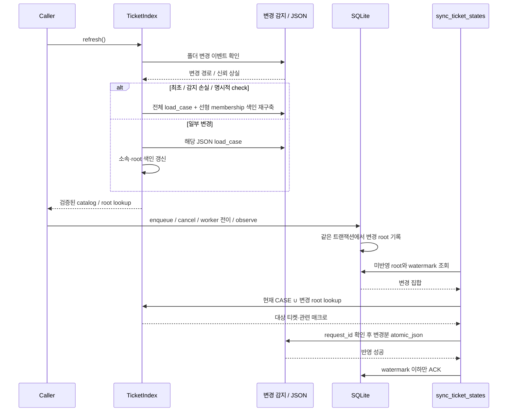

# 티켓 색인과 증분 감시로 전역 재검증 병목 제거

GitHub Issue: [#20](https://github.com/jo0n-lab/cfd-bot/issues/20)

## 배경
관련 분석: #19. 운영 티켓 1,007개, 매크로 구성원 921개인 측정에서 cases_for의 child × parent.cases 순회가 Path.resolve 447,630회를 유발했다. 이미 읽은 티켓에 대한 cases_for만 약 16.6–19.7초, queue dispatch는 전송을 제외해도 약 35.9초였다. 921은 매크로 구성원 수이며 실제 대기 작업 수와 다르다.

## 목적 및 운영 제약
정규화된 전체 CASE 경로를 키로 사용하는 공용 티켓 색인으로 반복 JSON 검증과 매크로 중첩 탐색을 제거한다. 프로세스 감시는 현재 CASE와 이전 실행·종료 확인 중 CASE만 처리하고, 큐 전이는 별도 변경 기록으로 반영한다.
사용자 제약은 현재 계산·큐를 보존하는 것이다. 최초에는 /tmp/cfd-bot-ticket-index 작업 사본에서 구현·검증했다. 이후 사용자가 운영 반영을 명시적으로 요청했고, 실행 worker·계산 프로세스와 큐 ID·순서를 보존하며 봇·웹 서비스에 적용했다.

## As-Is HLD

## To-Be HLD

## As-Is LLD

## To-Be LLD

## 전체 검증 유지 / 제거 구분

| As-Is 호출·유즈케이스 | To-Be | 전체 검증 |
|---|---|---|
| Bot.cases: 목록·선택·상세·결과·큐·실행 연결 | 공용 색인 / 대상 lookup | 매 요청 제거 |
| Bot.fresh_runs: /stat | fresh ofps + 색인 매칭, 미등록 포함 | 매 요청 제거 |
| serve 및 CLI 공통 진입 | 실제 필요한 consumer에서 최초 색인 구축 | 중복 제거 |
| CLI check | 강제 전체 JSON·경로·소속·중복 검증 | 유지 |
| GUI refresh_queue_manager / Web catalog·overview | 공용 색인 | 매 새로고침 제거 |
| Scheduler.tick 티켓 rename 복구 | root 색인으로 새 경로 찾기, 실행 직전 대상 재검증 | 전체 제거 |
| Monitor.tick | 현재 CASE ∪ 영속화된 이전 감시 대상 | 매 tick 제거 |
| sync_ticket_states | 현재 CASE·DB 변경·티켓 변경과 관련 매크로 | 전체 제거 |
| accept_submissions | 색인의 submit=true 티켓과 해당 구성원 | 전체 제거 |
| TicketService 저장·복제·삭제 / 실행 | 대상 검증, root 중복·변경된 매크로 소속 확인 | 무관한 티켓 재검증 제거 |
| 색인 미생성, 프로세스 재시작 | cold rebuild + 미반영 상태 복구 | 유지 |
| 이벤트 overflow / 폴더 교체 / 변경 범위 불명 | 신뢰 폐기 후 재구축 | 유지 |
| 변경 파일을 특정할 수 있는 외부 편집 | 해당 파일 검증·색인 갱신 | 제거 |
| 알 수 없는 범위의 복구·설정 registry 변경 | 전역 재구축 또는 새 catalog | 유지 |

## 구현 및 호환성
- JSON이 원본이며 별도 수동 hash 파일은 필요 없다. 색인은 프로세스별 파생 데이터이다.
- Linux 폴더 이벤트 감지를 사용하고, 지원되지 않는 환경·동적 glob은 파일 metadata 비교로 변경 파일을 찾는다. fallback은 O(T) metadata 조회이며 모든 JSON 검증과 다르다.
- full path를 키로 사용하고 child membership은 (ticket path, case root) 집합으로 선형 구축한다.
- 다중 스레드 및 프로세스 간 기존 ticket flock과 원자적 JSON 교체를 보존한다. 반환 객체가 색인을 오염시키지 않도록 한다.
- 실행·저장 대상 검증, 경로와 symlink 안전 검사, JSON 형식, 큐 ID·순서·멱등성, 종료 판정, outbox 규칙을 유지한다.
- 현재 프로세스만 검사하지 않는다. 사라진 실행은 기존 missing_polls와 로그·endTime 규칙으로 종료를 확정한다.
- 동일 경로의 새 PID/starttime 실행도 구분한다. 동일 supervisor 아래 solver 단계 변화는 새 실행으로 오인하지 않는다.
- 상태 변화는 SQLite 트랜잭션에 기록하여 프로세스 종료 후에도 재시도한다. 기존 worker DB 쓰기도 포착하는 trigger를 사용한다.
- 종료 티켓의 상태와 소속 매크로 row·집계는 함께 반영하고, 성공한 변경 기록만 ACK한다.
- 매크로 JSON이 한 파일인 이상 해당 부모 수정은 O(M) 직렬화가 남는다. 큐 ETA 전체 계산·Telegram 분할 전송은 별도 잔여 비용이다.

## 검증 계획
격리된 임시 tickets·SQLite, fake ofps/API만 사용한다. cold/warm/변경 1개 catalog 로드 수, 매크로 membership 정합성, 외부 편집·rename·삭제·rollback·overflow, 중복·경로 가드, 동시 변경과 재시도, 종료 누락·동일 경로 재시작·미등록 실행, 큐 제출·취소·전후처리 전이, 부모 집계, 세 UI 및 fresh /stat을 검증한다.
compileall, 전체 unittest, 격리 bot.json check, SVG XML 및 렌더링을 수행한다. 격리 테스트에서 운영 데이터로 상태 동기화·enqueue·worker를 실행하지 않는다. 운영 반영 시에는 기존 계산과 큐를 보존하고 서비스 상태를 확인한다. 성능은 합성 921-member 데이터로 비교한다.

## 구현 결과와 격리 검증

- 격리 소스: `/tmp/cfd-bot-ticket-index`. 운영 저장소의 기존 변경사항을 보존한 사본에서 먼저 구현했다.
- 공용 TicketIndex, Linux inotify/metadata fallback, 선형 membership set, 대상 root 조회를 적용했다. Telegram/GUI/Web의 공용 config·TicketService·TicketRunner 경로를 연결하고 Web 버튼 상태는 jobs/observed를 일괄 읽는다.
- 현재 CASE ∪ 영속 추적 CASE 감시, 실행 identity, 종료 확인, SQLite 변경 journal과 watermark ACK, child/parent 재시도를 구현했다. `/stat` fresh ofps는 유지한다.
- `python3 -m compileall -q cfd_bot tests`: 통과.
- `python3 -m unittest discover -s tests -q`: **292 tests, OK (skipped=1)**. Tk 실제 화면 테스트는 display가 없어 건너뛰었으며 GUI controller·공용 서비스 테스트는 실행했다. HTTP 및 /proc 통합 테스트는 sandbox 밖에서 임시 fixture로 검증했다.
- `python3 -m cfd_bot --config bot.json check`: 격리 bot.json/티켓에서 통과. check는 state DB를 생성하지 않았다. 추가로 배포 전후 실제 운영 bot.json check도 982개 CASE로 통과했다.
- SVG 104개 XML·실제 렌더링, Markdown 링크 1,958개, 소스 fingerprint 35개 검증 통과. D-15 실제 이미지도 육안 확인했다.
- 격리 검증 단계에서는 운영 소스·테스트 파일 52개가 작업 시작 사본과 동일함을 확인했다. 이 단계에서는 운영 티켓/DB 쓰기, 큐 제출·취소·pause, 서비스 재시작을 하지 않았다. 이후 배포 결과는 아래에 기록한다.

### 합성 921-member 성능

JSON 922개(매크로 1 + child 921), 임시 디렉터리와 DB만 사용했다. 네트워크와 subprocess는 계측 코드에서 차단했다.

| 구간 | 중앙값 | load_case |
|---|---:|---:|
| 기존 membership (이미 로드된 티켓) | 15.160291 s | 0 |
| 새 membership (이미 로드된 티켓) | 0.072068 s | 0 |
| cold 전체 catalog | 0.687912 s | 922 |
| warm 전체 catalog 반환 | 0.047339 s | 0 |
| warm 단일 root 조회 | 0.000359 s | 0 |
| 외부 편집 1개 후 조회 | 0.067036 s | 1 |
| 활성 1개 warm 상태 반영 | 0.007414 s | 0 |

[측정 코드](../analysis/benchmark_ticket_index.py) · [원시 결과](../analysis/ticket-index-results.json). cold/변경 1개/old·new membership은 1표본, warm 구간은 5표본 중앙값이다. 운영 사용자 요청 전체 응답 시간이 아니다.

### 남는 비용과 반영 경계

변경 후 메모리 관계 재구축은 O(T+M), 전체 목록 반환은 목록 크기에 비례한다. fallback은 O(T) metadata 비교다. 부모 매크로 수정은 한 JSON 전체를 읽고 직렬화한다. 큐 전체 ETA/history 및 Telegram 분할 전송은 별도 비용으로 남는다. 격리 검증 완료 후 기존 계산·큐를 보존하는 절차로 운영에 반영했다. 아래 값은 배포 당시 비교이며 이후 정상적인 큐 진행에 따라 달라질 수 있다.

## 운영 반영 결과 (2026-10-04 23:57 KST)

- 검증된 143개 소스·문서·테스트·UI 리소스 파일을 반영했다. 기존 작업 트리 변경과 bot.json·티켓 파일을 배포 복사로 덮어쓰지 않았다.
- SQLite 온라인 백업 후 변경 기록 스키마를 추가했다. 복제 DB에서 기존 작업 1,106행과 outbox 481행이 유지되는 것을 확인했다. 운영 DB를 과거 백업으로 되돌리지 않았다.
- 봇의 KillMode=process 및 웹 cgroup의 계산 프로세스 부재를 확인하고 두 부모 서비스만 재시작했다. 정지 구간 전후 계산 관련 프로세스 45개의 PID·시작 식별자가 유지됐다.
- 재시작 전후 대기 작업 906개의 ID·순서, queue_paused=false, 실행 job 26f934bdba7f와 worker PID 4087471·실행 wrapper PID 4087487이 유지됐다. 배포로 작업을 제출·취소·재정렬하지 않았다.
- 정지·적용·기동 절차는 약 16.75초였다. 이후 봇·웹은 active/running, 재시작 횟수 0, 감시 오류 없음, 변경 journal과 pending outbox는 0이었다. 웹 /api/health 응답도 확인했다.
- 기존 계산 로그는 Time 2474에서 3000까지 진행했고 End / Finalising parallel run으로 MPI 단계가 정상 종료됐다. 이후 남은 wrapper 작업은 계속 실행됐다. MPI 자식의 자연 종료를 서비스 재시작에 의한 중단으로 해석하지 않는다.
- 운영 전체 Telegram 응답 지연은 별도로 계측하지 않았다. GUI 실제 화면 테스트 1건은 display 부재로 건너뛴 상태이며 공용 서비스·adapter 검증은 통과했다.
