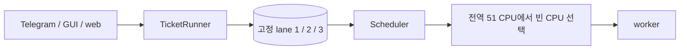
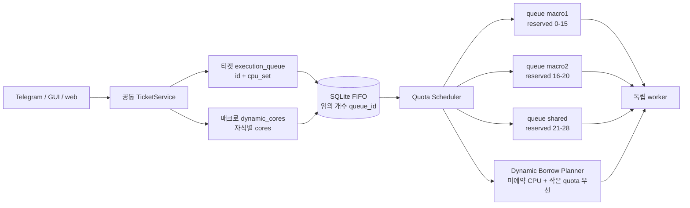
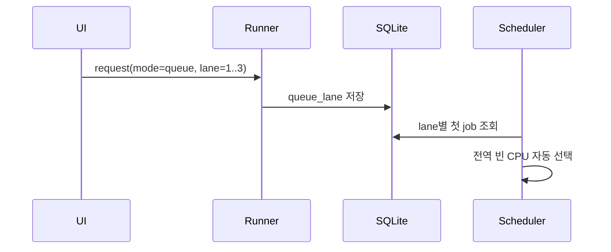
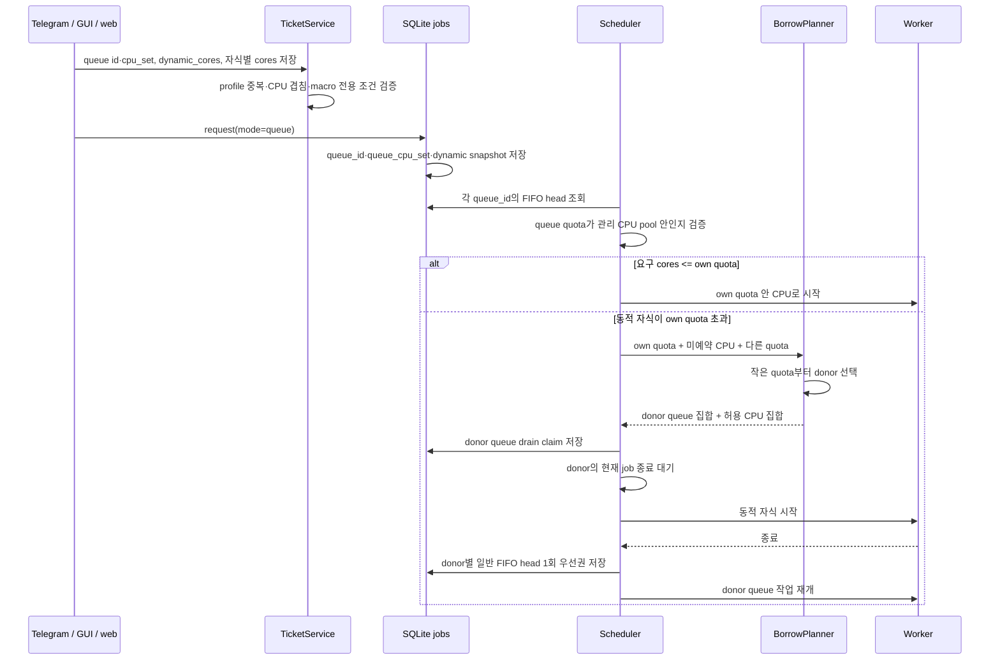

# 이름 있는 독립 대기열과 동적 코어 매크로

## 배경

#21의 첫 구현은 즉시 실행과 1·2·3번 FIFO lane을 분리하고, 서버의 51개 관리 CPU 안에서 여러 계산을 병렬 실행할 수 있게 했다. 그러나 lane 수가 세 개로 고정되어 있고 lane에 소유 CPU가 없어서 매크로별 예약 quota, 독립 실행, 큰 동적 계산을 위한 선택적 양보와 공정한 재개를 표현하지 못한다.

새 구조에서는 대기열을 숫자 lane이 아닌 이름 있는 queue profile로 관리한다. 각 profile은 서로 겹치지 않는 고정 CPU quota를 소유하고, 같은 대기열 안에서는 FIFO 순서를 지킨다. 서로 다른 대기열은 CPU가 겹치지 않으므로 병렬 실행한다. 동적 코어 매크로의 하위 계산은 각자 다른 코어 수를 요구할 수 있으며, 자신의 quota와 미예약 CPU만으로 부족하면 작은 quota의 대기열부터 필요한 만큼 drain한 뒤 일시적으로 CPU를 빌린다.

## As-Is HLD



- lane 개수는 3으로 고정된다.
- lane은 FIFO 구분자일 뿐 CPU quota와 위치를 소유하지 않는다.
- 매크로의 모든 자식은 같은 `cores`를 사용한다.
- 큰 작업을 위해 어떤 대기열을 비워야 하는지, 비운 대기열에 언제 실행권을 돌려줄지 표현할 수 없다.

## To-Be HLD



- `execution_queue.id`가 대기열을 식별하고 `execution_queue.cpu_set`이 예약 quota와 CPU 위치를 정의한다. 대기열 개수에는 제한을 두지 않는다.
- 서로 다른 queue profile의 CPU 집합은 겹칠 수 없다. 같은 `id`를 공유하는 일반 티켓은 같은 `cpu_set`을 사용한다.
- 매크로는 전용 queue profile을 사용한다. 고정 매크로는 부모 `cores`를 모든 자식에 적용한다.
- `dynamic_cores: true`인 매크로는 `cases[*].cores`를 허용한다. 자식마다 필요한 코어 수가 달라질 수 있다.
- 일반 작업은 자기 queue quota 안에서만 CPU를 배정받는다. 같은 queue의 작업은 FIFO 직렬, 서로 다른 queue의 작업은 독립 병렬로 실행한다.
- 동적 자식의 요구량이 자기 quota보다 크면 미예약 관리 CPU를 먼저 포함하고, 부족분은 현재 등록된 다른 queue를 quota 크기 오름차순으로 선택해 drain한다. 선택되지 않은 큰 quota는 계속 실행한다.

## As-Is LLD



## To-Be LLD



### Queue profile 계약

티켓은 다음 실행 설정을 공통 domain model로 사용한다.

```json
{
  "execution_queue": {
    "id": "macro1",
    "cpu_set": "0-15"
  }
}
```

- `id`는 영문, 숫자, 점, 밑줄, 하이픈으로 구성하며 길이는 1~48자다.
- `cpu_set`은 기존 `.process-core`와 같은 CPU set 형식을 사용한다.
- 같은 `id`는 같은 CPU set을 뜻한다. 다른 `id`끼리는 CPU가 겹치면 저장하지 않는다.
- 매크로 queue id는 다른 매크로나 일반 티켓이 공유할 수 없는 전용 id다.
- queue 설정이 없는 기존 티켓과 이미 등록된 `queue_lane` job은 `legacy-<lane>`으로 읽어 호환한다. 새 편집 화면에서 저장하면 이름 있는 profile로 전환한다.

### 동적 코어 매크로 계약

```json
{
  "task_type": "macro",
  "cores": 3,
  "dynamic_cores": true,
  "execution_queue": {"id": "shared", "cpu_set": "21-28"},
  "cases": [
    {"case_dir": "case1", "ticket": "child-case1.json", "cores": 3},
    {"case_dir": "case2", "ticket": "child-case2.json", "cores": 3},
    {"case_dir": "case3", "ticket": "child-case3.json", "cores": 40}
  ]
}
```

- `dynamic_cores`가 꺼져 있으면 기존처럼 부모 `cores`가 모든 자식에 적용된다.
- 켜져 있으면 각 row의 `cores`가 필수이며 1~관리 CPU 수 범위다.
- quota 이하의 자식은 자기 queue 안에서만 실행한다.
- quota를 초과하는 자식은 동적 borrow 대상이다. 고정 매크로나 일반 티켓은 자기 quota를 초과할 수 없다.

### Drain과 공정성

1. 동적 head는 자기 quota와 어떤 queue에도 예약되지 않은 CPU를 기본 집합으로 사용한다.
2. 부족하면 다른 queue profile을 quota 크기 오름차순으로 추가한다. 필요한 순간까지만 추가하므로 작은 quota 하나로 충분하면 큰 quota는 drain하지 않는다.
3. donor queue의 이미 실행 중인 작업은 중단하지 않는다. drain claim 이후 새 작업만 막고 현재 작업의 자연 종료를 기다린다.
4. 가장 오래 대기한 oversized dynamic head 하나만 drain claim을 가진다.
5. 동적 작업이 끝나면 실제 donor queue 중 대기 작업이 있는 queue 각각에 일반 head 한 번의 우선권을 준다. 그 우선권을 소진하기 전에는 같은 donor를 요구하는 다음 동적 작업이 claim을 얻지 못한다.
6. donor queue가 비어 있으면 해당 우선권은 즉시 소멸한다. 불필요한 idle을 만들지 않는다.

예를 들어 `macro1=0-15`, `macro2=16-20`, `shared=21-28`이고 40-core 동적 head가 있으면 `shared + 미예약 CPU` 뒤 부족분에 대해 5-core `macro2`, 16-core `macro1` 순서로 drain한다. 모든 donor의 현재 작업이 끝난 뒤 40-core 작업이 실행된다. 종료 후 macro1과 macro2의 FIFO head가 한 번씩 실행권을 되찾은 다음 다음 oversized 동적 head가 다시 donor를 요청할 수 있다.

### 생성 시 안내

세 UI는 같은 shared capacity 결과를 표시한다.

- queue quota 안에 요청 cores가 들어오면 고정 queue로 실행 가능하다고 표시한다.
- 일반 티켓이나 고정 매크로가 quota를 초과하면 저장/실행을 막고 quota를 늘리거나 cores를 낮추라고 안내한다.
- 매크로 자식이 quota를 초과하고 전체 51-core 관리 pool 안에는 들어오면 `동적 코어 매크로` 옵션을 사용하라고 안내한다.
- 전체 관리 pool보다 큰 요청은 동적 옵션으로도 실행할 수 없다고 표시한다.

## 호환성

- 기존 `max_parallel`과 51-core 관리 pool은 안전 상한으로 유지한다.
- 기존 1·2·3 lane job은 DB migration 없이 `legacy-1`·`legacy-2`·`legacy-3`으로 읽는다.
- 기존 티켓은 읽을 수 있다. queue profile이 없는 티켓은 즉시 실행과 기존 1·2·3 lane 등록을 계속 지원하며, 세 편집 UI에서 profile을 저장하면 이름 있는 queue로 전환한다.
- `queue_lane` 필드는 읽기·기존 callback 호환용으로 유지하고 이름 있는 queue의 스케줄링과 표시는 `queue_id`·`queue_cpu_set`을 우선한다.
- `.process-core`, worker 환경 변수 `NP`·`CPU_SET`, OpenMPI ordered binding 계약은 그대로 유지한다.

## 검증 계획

1. 임의 개수 queue profile의 저장, 동일 id/동일 CPU 허용, 서로 다른 id의 CPU 겹침 거부를 검증한다.
2. 각 queue의 FIFO와 queue 간 병렬 시작을 scheduler 테스트로 검증한다.
3. 일반 job이 자기 quota 밖 CPU를 사용하지 않는지 확인한다.
4. 동적 매크로 row의 서로 다른 cores가 child ticket과 SQLite job snapshot, `.process-core`까지 전달되는지 확인한다.
5. 작은 quota 우선 donor 선택, 현재 donor 작업의 자연 종료, 선택하지 않은 queue의 계속 실행을 검증한다.
6. 동적 작업 종료 뒤 donor별 일반 head 1회 우선권과 queue가 비었을 때 즉시 해제를 검증한다.
7. 동적 옵션 안내와 queue fields를 Telegram, GUI, web에서 같은 TicketService 값으로 편집·표시·저장하는지 검증한다.
8. legacy lane job 호환과 기존 티켓 load를 검증한다.
9. 전체 compile, unit test, config check, 문서 링크, SVG XML parse/render를 수행한다.
10. 실제 user service를 재시작하고 bot/web 상태를 확인한다.

## 검증 결과

- 이름 있는 queue와 동적 borrow 전용 테스트 13개를 포함한 전체 unittest 305개가 통과했다. Tk display 의존 테스트 1개는 기존과 같이 skip됐다.
- 운영 `bot.json check`에서 982개 CASE 설정이 정상으로 확인됐다.
- compileall, UI JSON parse, JavaScript syntax, `git diff --check`가 통과했다.
- 문서 Markdown 13개와 로컬 링크 1,991개, SVG 104개의 XML parse·PNG 렌더링·텍스트 경계를 검사했고 오류가 없었다.
- bot·web user service 재시작 뒤 둘 다 active였고 web health가 정상이었다. 기존 detached worker와 40-rank OpenFOAM 계산은 종료되지 않고 같은 PID로 유지됐다. monitor 오류와 남은 drain/fairness 상태도 없었다.

## 추적

- 기능 추적: [#21](https://github.com/jo0n-lab/cfd-bot/issues/21)
- CPU affinity 버그: [#22](https://github.com/jo0n-lab/cfd-bot/issues/22)
