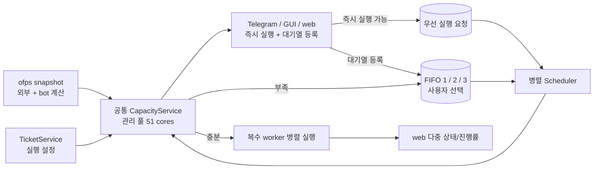
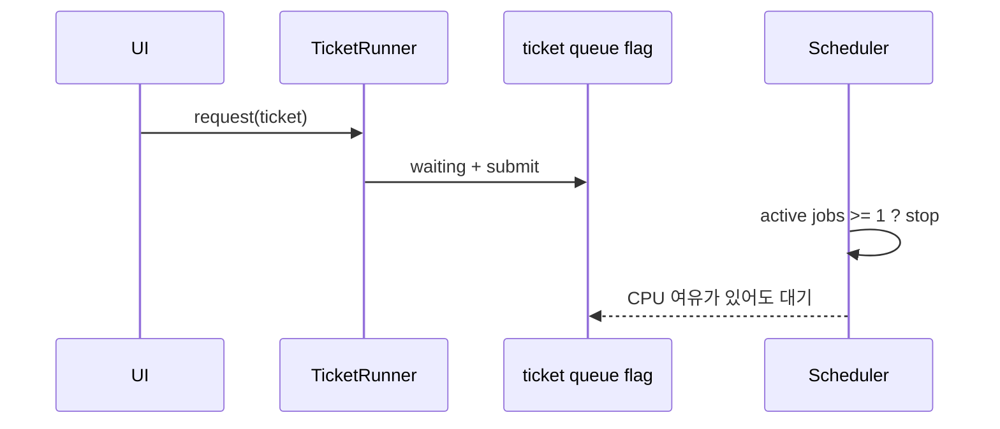
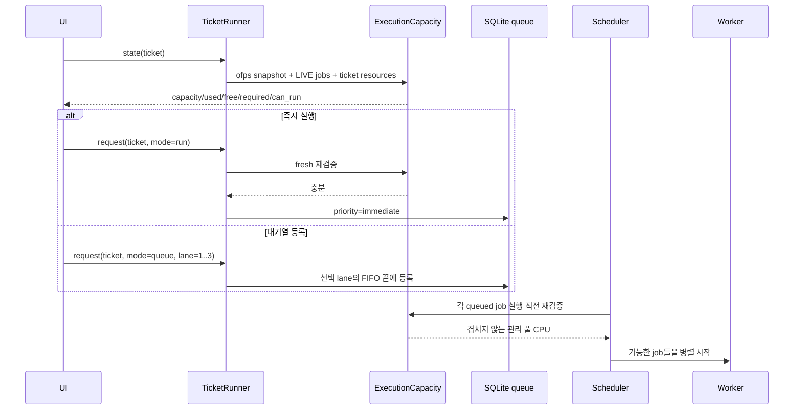
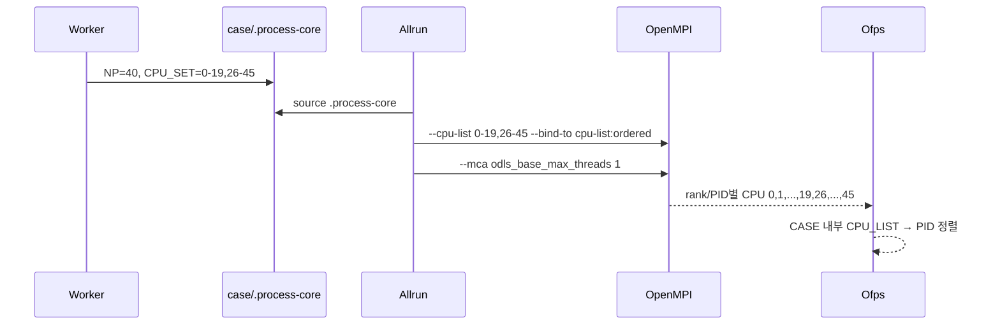

# CPU 용량 기반 병렬 실행과 다중 실행 상태

## 배경

현재 티켓 실행 요청은 모두 FIFO 대기열에 기록되고, scheduler의 `max_parallel: 1` 설정이 CPU 여유와 무관하게 한 번에 한 계산만 허용한다. 따라서 자동 CPU 배정을 선택해도 기존 계산이 하나 있으면 새 계산은 남는 코어가 충분한 경우에도 시작하지 않는다. GUI와 web의 실행 버튼도 실제 즉시 실행 가능 여부를 표시하지 않으며, 실행과 대기열 등록을 구분하지 않는다.

이 변경은 서버의 논리 CPU 52개 중 51개만 계산용 관리 풀로 사용한다. 실행 중인 외부 계산과 bot 작업이 점유한 코어를 같은 `ofps` snapshot에서 합산하고, 티켓이 요구하는 solver 및 선택적 monitor 코어가 남아 있을 때 여러 계산을 병렬로 시작한다.

## As-Is HLD

- 실행 요청과 대기열 등록이 같은 동작이다.
- CPU가 남아 있어도 활성 job이 하나면 scheduler가 다음 job을 시작하지 않는다.
- 자동 배정기는 시스템 affinity의 52개 CPU를 모두 후보로 사용하여 서비스용 예비 코어가 없다.
- UI는 잔여 코어와 요청 코어를 알지 못해 실행 가능 여부와 대기 이유를 설명할 수 없다.
- worker의 바깥 `taskset` 뒤에서 case 스크립트가 `mpirun --bind-to core --map-by core`를 실행하면 OpenMPI가 topology 순서로 rank를 다시 배치한다. `.process-core`의 비연속 CPU 집합이 실제 affinity에 반영되지 않고 PID별 CPU 번호도 뒤섞인다.
- OpenMPI 4.1.1은 local process가 32개 이상이면 기본 4개 ODLS spawn thread를 사용한다. `cpu-list:ordered`로 rank/CPU 순서를 고쳐도 OS PID 발급 순서는 병렬 spawn 때문에 일부 뒤집힌다.
- `ofps`의 case 내부 행은 PID순으로만 정렬되어 실제 CPU 배치 확인이 어렵다.

## To-Be HLD

- 세 UI는 동일한 공통 용량 판정 결과를 사용한다.
- 즉시 실행은 남는 코어가 충분한 경우에만 허용하고, 일반 대기열 등록은 별도 동작으로 제공한다.
- 일반 대기열은 최대 3개의 독립 FIFO lane으로 나누고 사용자가 등록할 lane을 선택한다.
- scheduler는 실행 직전에 용량을 다시 확인하므로 표시 이후 상태가 바뀌어도 CPU가 겹치지 않는다.
- web은 활성 계산 각각에 독립된 상태와 진행률을 표시한다.
- cfd-bot worker는 승인된 `NP`와 `CPU_SET`을 기존 `apply_execution_settings()` 경로로 case의 `.process-core`에 기록한다. OpenFOAM `Allrun`과 MPI 실행 스크립트는 이 파일을 source하고 `--cpu-list "$CPU_SET" --bind-to cpu-list:ordered --mca odls_base_max_threads 1`로 실행하여 local rank, 생성 PID, 실제 CPU가 같은 오름차순을 따르게 한다.
- `ofps`는 같은 case의 프로세스 행을 CPU_LIST의 첫 CPU와 PID 순으로 표시한다.
- CPU 중복 여부는 기존 `check_cpus()` → `ofps --check` 실행 직전 검증을 그대로 사용한다. 별도 watcher 검증 계층은 추가하지 않는다.

## As-Is LLD

## To-Be LLD

### 공통 상태 계약

티켓 실행 상태는 최소한 다음 값을 세 UI에 동일하게 제공한다.

- `state`: `idle`, `queued`, `running`, `invalid`
- `run_enabled`, `queue_enabled`
- `capacity`, `used_cores`, `free_cores`, `required_cores`
- `queue_lane`: 대기열 등록 시 선택하는 1, 2, 3 중 하나
- `availability_message`: 예) `현재 잔여 코어 7개 (44/51 사용 중)입니다. 코어 수를 낮추거나 대기열에 등록하세요.`

자동 배정은 관리 풀 안에서만 solver/monitor CPU를 고른다. 수동 배정도 관리 풀을 벗어나거나 기존 계산과 겹치면 즉시 실행할 수 없다. 매크로 티켓은 하위 계산을 순차 실행하므로 한 하위 계산의 최대 동시 요구량으로 판정한다.

### MPI 실행 계약

## 호환성

- 기존 `max_parallel`은 상한으로 유지하되 실제 서버 설정은 CPU 용량을 방해하지 않도록 51로 올린다.
- `cpu_capacity`가 없는 기존 설정은 현재 process affinity 전체를 관리 풀로 사용한다. 운영 설정에는 `cpu_capacity: 51`을 명시한다.
- 기존 API의 실행 요청은 즉시 실행 의도로 해석하되, 명시적인 `queue` mode를 새로 제공한다.
- 이미 등록된 FIFO job과 티켓 JSON은 그대로 읽는다. lane이 없으면 1번 큐로 처리한다.
- scheduler는 각 lane 내부 순서를 보존하면서 각 lane의 선두를 번갈아 검토한다. 한 lane의 큰 작업이 코어 부족으로 대기해도 다른 lane의 실행 가능한 작업은 시작할 수 있다.
- cfd-bot은 case별 `.process-core`만 생성·동기화한다. MPI 옵션의 적용 책임은 case의 `Allrun`/공용 실행 스크립트에 두며 bot 내부 launcher wrapper는 만들지 않는다.
- local MPI process 생성만 직렬화하므로 solver 계산 자체의 MPI 병렬성은 그대로다. 프로세스 시작 시간이 소폭 늘 수 있다.

## 검증 계획

1. 52 CPU 환경에서 관리 풀이 0~50의 51개로 제한되는지 단위 테스트한다.
2. 기존 worker 설정 검증에서 비연속 CPU 집합이 `.process-core`에 기록되고 Akita/TCB 실행 스크립트가 같은 값을 `--cpu-list`, `cpu-list:ordered`, `odls_base_max_threads=1`에 전달하는지 확인한다.
3. 44개 코어가 사용 중이고 8개를 요청하면 즉시 실행이 비활성화되고, 7개를 요청하면 활성화되는지 확인한다.
4. 즉시 실행과 대기열 등록이 Telegram, GUI, web에서 같은 shared runner 상태와 요청 mode를 사용하는지 확인한다.
5. Telegram, GUI, web에서 대기열 등록 시 1·2·3번 큐를 선택하고 같은 `queue_lane` 값이 저장되는지 확인한다.
6. 각 lane의 FIFO 순서가 유지되고, 한 lane이 막혀도 다른 lane의 실행 가능한 작업이 병렬 시작되는 scheduler 테스트를 추가한다.
7. web overview가 복수 활성 계산의 진행률을 각각 반환하고, 작업 큐 화면이 1·2·3번 대기열을 구분해 렌더링하는지 확인한다.
8. 전체 compile, unit test, config check와 실제 user service 재시작/상태 확인을 수행한다.
9. 설치된 OpenMPI probe에서 `odls_base_cutoff=1`로 thread pool을 강제한 뒤 `odls_base_max_threads=1`일 때 rank·PID·CPU가 모두 오름차순이고, `ofps`도 CPU_LIST 순서로 행을 출력하는지 확인한다.

## 추적

- 기능 추적: [#21](https://github.com/jo0n-lab/cfd-bot/issues/21)
- CPU affinity 버그: [#22](https://github.com/jo0n-lab/cfd-bot/issues/22)
