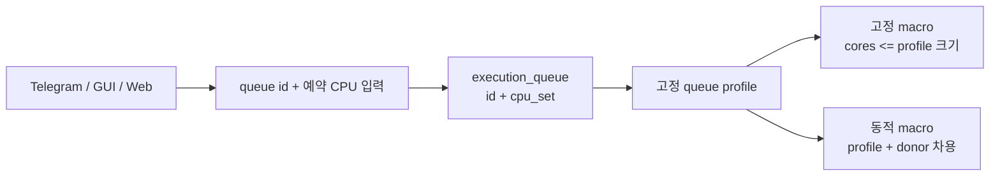
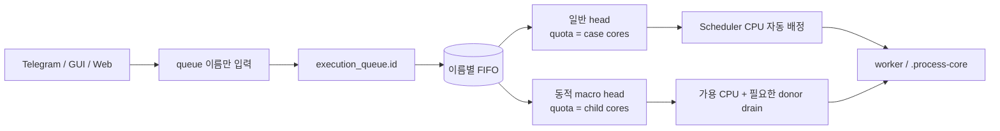
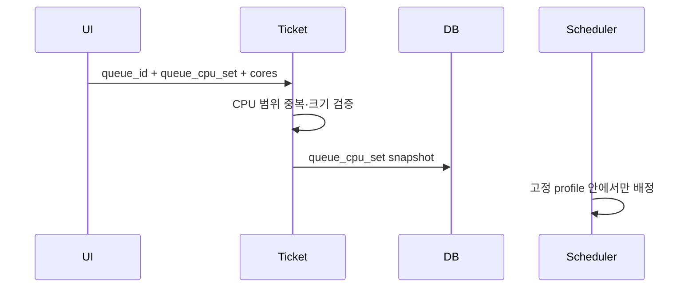
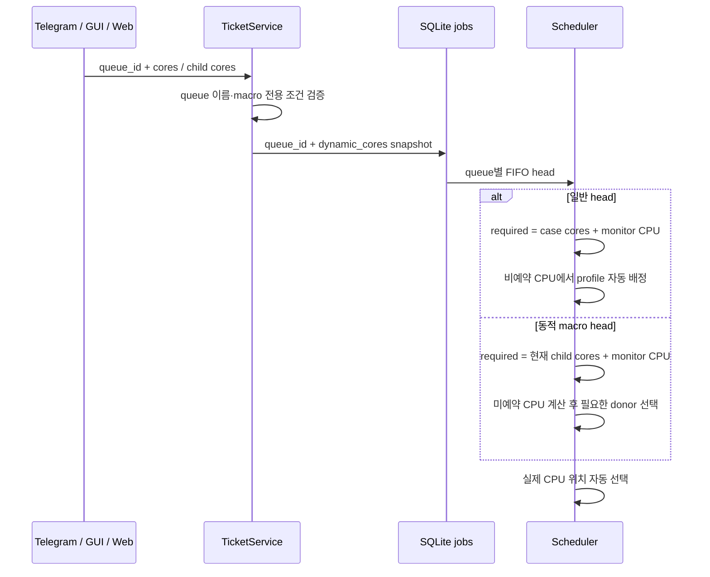

# 케이스 코어 수에서 대기열 quota 파생

## 배경

#21 구현은 이름 있는 대기열마다 `execution_queue.id`와 `execution_queue.cpu_set`을 함께 입력하게 했다. 이 구조에서는 사용자가 계산의 `cores`를 지정한 뒤 같은 크기의 예약 CPU 범위를 다시 입력해야 한다. 동적 코어 매크로도 고정된 최소 CPU 범위를 요구하므로, 실행할 child의 코어 수가 곧 동적 quota라는 사용자 모델과 맞지 않는다.

새 계약에서는 대기열 설정에 이름만 저장한다. 일반 매크로와 일반 티켓은 실행할 case의 `cores`에서 quota 크기를 얻고 Scheduler가 CPU 위치를 자동 배정한다. 동적 매크로는 FIFO head가 된 child의 `cores`만큼 그 시점에 가용 CPU와 필요한 donor 대기열을 확보한다.

## As-Is HLD



- `cores`와 `queue_cpu_set`을 별도로 입력한다.
- 일반 매크로의 quota 크기는 case의 cores가 아니라 사용자가 입력한 CPU 범위 길이다.
- 동적 매크로도 자기 고정 quota가 없으면 저장할 수 없다.
- queue profile의 CPU 위치는 대기열이 비어 있어도 예약된다.

## To-Be HLD



- 일반 티켓과 고정 매크로는 현재 job의 `cores`와 선택적 monitor CPU를 quota 크기로 사용한다.
- Scheduler는 일반 queue head가 admission될 때 겹치지 않는 CPU 위치를 자동 배정한다. 같은 queue는 계속 FIFO 직렬이다.
- 동적 매크로는 고정 quota를 소유하지 않는다. 각 child가 head가 될 때 해당 child의 `cores`가 요구 quota가 된다.
- 동적 head는 고정 queue에 배정되지 않은 CPU를 먼저 사용한다. 부족하면 작은 실행 quota의 대기열부터 donor로 선택하고 현재 작업의 자연 종료를 기다린다.
- 서로 다른 queue head는 현재 CPU가 충분하면 병렬 실행한다.

## As-Is LLD



## To-Be LLD



### 저장 계약

새 티켓은 다음처럼 대기열 이름만 저장한다.

```json
{
  "execution_queue": {"id": "macro1"},
  "cores": 16
}
```

동적 매크로는 child별 cores가 quota가 된다.

```json
{
  "execution_queue": {"id": "shared"},
  "dynamic_cores": true,
  "cases": [
    {"case_dir": "case1", "cores": 3},
    {"case_dir": "case2", "cores": 8},
    {"case_dir": "case3", "cores": 40}
  ]
}
```

## 호환성

- 기존 `execution_queue={id,cpu_set}` 티켓과 `queue_cpu_set`이 저장된 job은 읽고 실행한다.
- 기존 티켓을 세 편집 UI에서 저장하면 새 `{id}` 형식으로 전환한다.
- 기존 `queue_lane` job은 계속 `legacy-N` queue id로 읽는다.
- `.process-core`, `NP`, 최종 `CPU_SET`, ordered MPI binding 계약은 바뀌지 않는다.
- 매크로 queue id의 전용 조건과 동일 queue FIFO 조건은 유지한다.

## 검증 계획

1. 세 UI에서 예약 CPU 입력을 제거하고 queue 이름만 저장하는지 검증한다.
2. 일반 매크로의 공통 cores와 일반 티켓 cores가 자동 profile 크기가 되는지 검증한다.
3. 동적 매크로 child별 cores가 고정 quota 없이 admission 요구량이 되는지 검증한다.
4. 여러 일반 queue가 자동 배정된 서로 다른 CPU에서 병렬 실행하는지 검증한다.
5. 동적 head가 미예약 CPU를 먼저 사용하고 필요한 작은 donor만 drain하며 실행 후 공정 turn을 돌려주는지 검증한다.
6. legacy `cpu_set` profile과 `queue_lane` job을 계속 처리하는지 검증한다.
7. Telegram · GUI · Web 표시·입력·저장·실행 연결을 함께 검증한다.
8. compile, 전체 unittest, config check 후 bot/web user service를 재시작하고 상태를 확인한다.

## GitHub Issue

- [#24](https://github.com/jo0n-lab/cfd-bot/issues/24)

## 구현 결과

- Telegram, Tk GUI, Web에서 예약 CPU/quota 입력을 제거하고 대기열 이름만 편집한다.
- 새 티켓은 `execution_queue={"id": ...}`만 저장한다. legacy `cpu_set`은 읽을 수 있지만 다시 저장하면 제거된다.
- 일반 queue head는 `execution_case()`가 해석한 실제 NP와 선택적 monitor 1코어를 quota로 사용한다. 케이스 설정 방식은 `.process-core`/`Allrun`의 NP까지 반영한다.
- 서로 다른 일반 queue는 Scheduler가 겹치지 않는 CPU profile을 자동 배정해 병렬 시작한다. 같은 queue의 다음 head는 이전 작업이 끝난 뒤 자기 NP 크기로 새 profile을 받는다.
- 동적 macro는 고정 profile 없이 현재 child NP를 요구량으로 사용하고, 미예약 CPU가 부족한 경우에만 필요한 작은 donor queue를 drain한다.
- 기존 `queue_lane`, `{id,cpu_set}` 티켓, `queue_cpu_set` job의 실행 호환은 유지한다.

## 검증 결과

- `python3 -m unittest discover -s tests -q`: 309개 통과, Tk display 관련 1개 skip.
- `python3 -m compileall -q cfd_bot tests docs/diagrams docs/analysis`: 통과.
- `python3 -m cfd_bot --config bot.json check`: 운영 티켓 982개 통과.
- Telegram UI JSON parse, Web JavaScript syntax, `git diff --check`: 통과.
- 문서 13개 로컬 링크와 source fingerprint, SVG 104개 XML/PNG 렌더링·텍스트 경계 검사: 통과.
- Playwright 모듈이 설치되어 있지 않아 브라우저 E2E는 실행하지 못했다. HTTP Web adapter 테스트는 전체 unittest에 포함해 통과했다.
- `cfd-bot.service`, `cfd-bot-web.service` 재시작 후 모두 active이며 Web health 응답을 확인했다.
