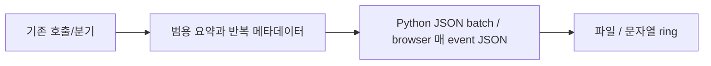
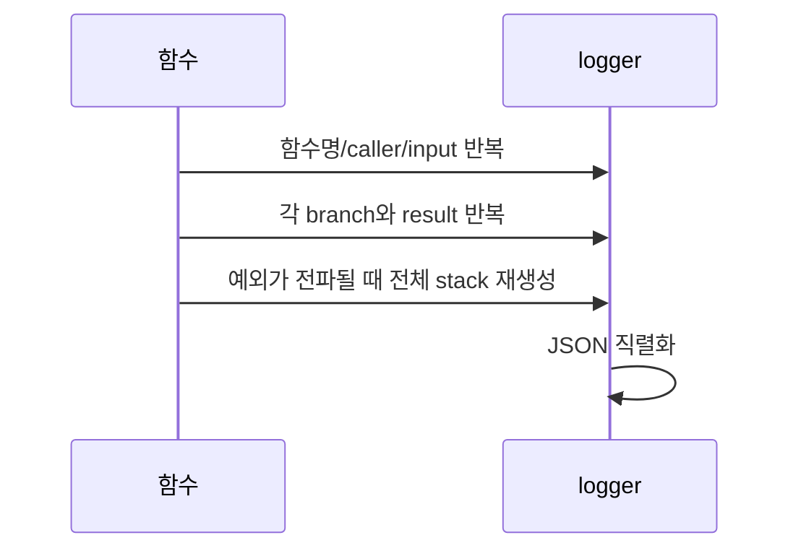
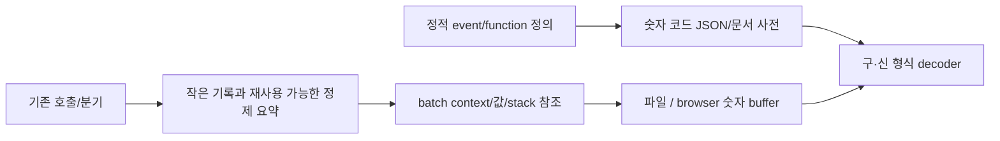
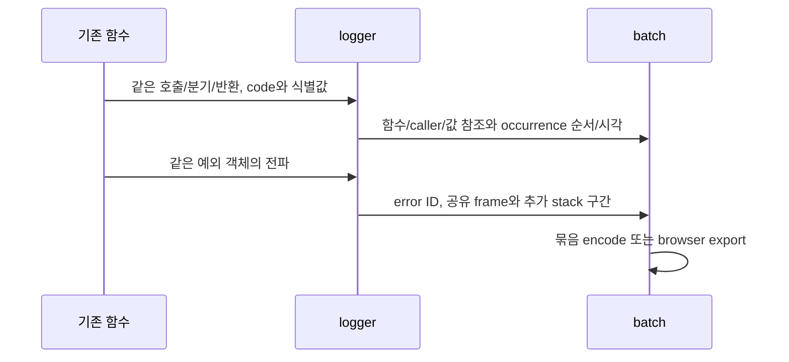

# 숫자 코드·사전 기반 진단 로그 구현

- Issue: [#30](https://github.com/jo0n-lab/cfd-bot/issues/30), 관련 [#18](https://github.com/jo0n-lab/cfd-bot/issues/18)
- 근거: [병목 실측](../analysis/diagnostic-overhead-review.md), [코드 사전 검토안](../analysis/diagnostic-codebook-proposal.md)
- 범위: 로그 기록·해석·문서와 성능 비교. 업무 판단, 검증, 재시도, 실행 정책은 변경하지 않는다.

## As-Is HLD / LLD

## To-Be HLD / LLD

## 호환성 및 검증 계획

기존 schema 1 파일은 계속 읽는다. schema 2의 batch는 rotation 파일에서도 해석 가능하도록 필요한 dictionary를 포함한다. 코드 사전은 별도 JSON/Markdown으로도 제공한다. 샘플링 없이 각 호출/분기/반환·exception/warning을 보존하고, 중복 설명 및 저가치 동일 요약의 표현을 줄인다. Telegram 수신과 라우팅, DB context 종료와 실제 commit의 로그 의미를 구별한다.

Telegram·GUI·web backend는 같은 모듈을 사용하며 browser와 ofps에도 코드 기록을 적용한다. actor·token 정제는 사전에 넣기 전에 한다. 원래 반환 객체/예외·stdout/exit code를 유지한다. 제품 HLD/LLD 99개 mapping을 최종 코드에 맞춘다.

decoder 왕복/구형 파일/회전/예외 전파/비밀값/ON·OFF, 전체 unittest, compile/config check, 실제 Chromium 시나리오와 shell 동작을 확인한다. 정상 설정과 설정 누락의 921개 티켓, 2,000줄 parser, 1,000행 browser를 비교하고 CPU/크기와 지연을 구분한다. 운영 배포 여부와 성능 판정은 실측 결과에 기록한다.

## 결과

Python·browser·ofps에 schema 2 숫자 event/함수 코드와 별도 JSON/Markdown 사전을 적용했다. Python은 batch 값·context·예외 stack 참조를, browser는 숫자 buffer와 export 시 JSON 변환을 사용한다. 동일 입력 요약을 재사용하고 같은 예외의 ID/추가 stack을 기록한다. Telegram 수신/라우팅 및 실제 DB commit/context 종료의 의미를 구분했다. 기존 schema 1 decoder도 유지한다.

최종 Python 340개 테스트가 통과했다(inotify 환경 1개 skip). 실제 Chromium UI 시나리오와 진단 ON/OFF·compact export·비밀값 제외 및 Python decoder 456개 기록 동등 복원도 통과했다. shell stdout/exit/PIPESTATUS와 실제 managed ofps snapshot을 확인했다. HLD/LLD 99개 매핑과 SVG XML/실제 렌더를 갱신했다.

정상 설정 921개 조회의 ON 중앙값은 5.56초 → 4.69초, 누적 batch 출력은 약 684 MB → 238 MB(65.3% 감소)였다. 논리 event 수는 같다. parser와 browser p95는 개선되지 않았으므로 전체 성능 수용은 미달이다. [최종 원자료·판정](../analysis/diagnostic-codec-performance.md)에 불리한 결과와 RSS 측정 방식도 포함했다. 기본 OFF이며 운영 checkout/config/service는 변경하지 않았다.
