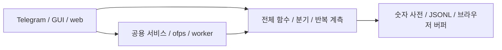
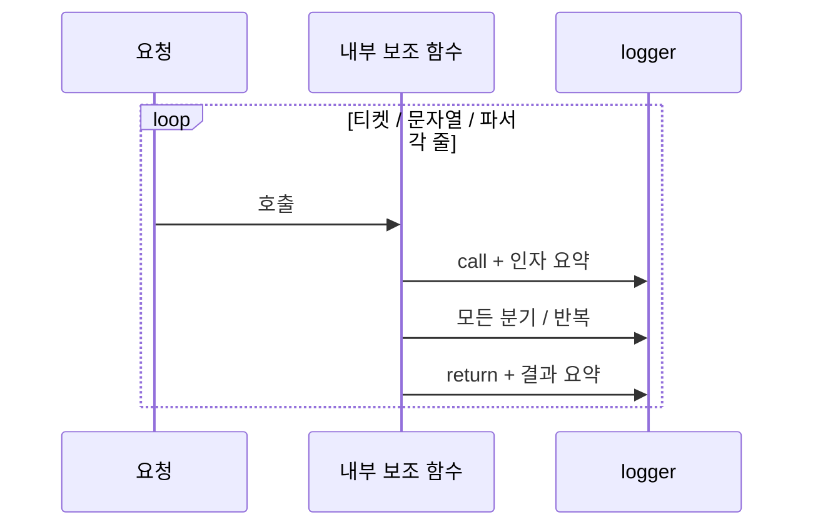
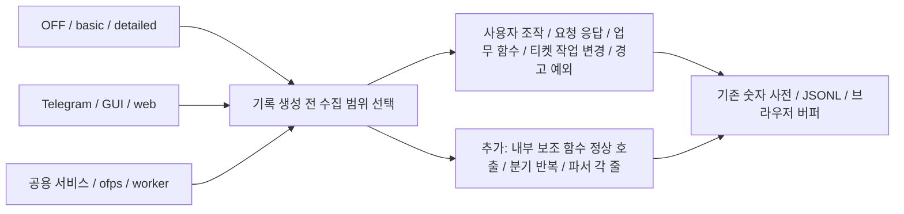
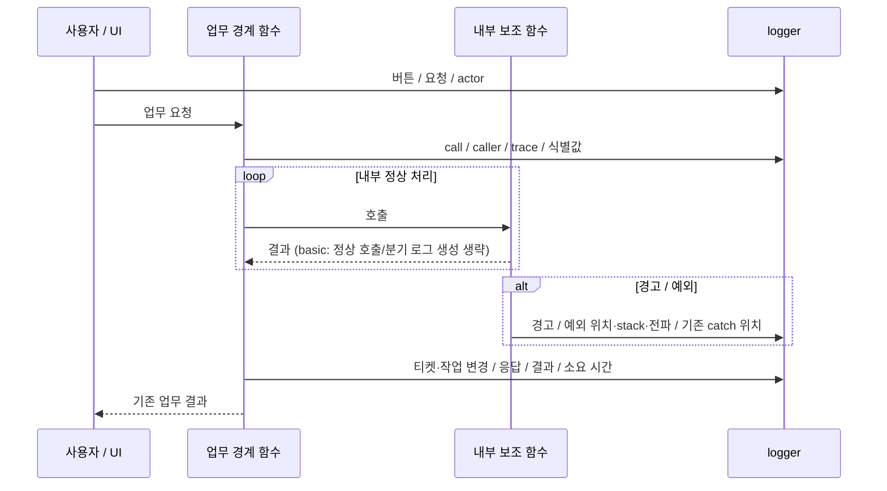

# 기본 업무 로그와 상세 함수 로그 분리

- 날짜: 2026-10-07
- GitHub Issue: [#30](https://github.com/jo0n-lab/cfd-bot/issues/30), 원 요구 [#18](https://github.com/jo0n-lab/cfd-bot/issues/18)
- 사용자 승인: 기본 로그는 HLD/LLD 업무 시퀀스를 추적하고 반복 내부 함수 기록은 별도 상세 모드로 분리한다.

## 배경 / As-Is

숫자 코드와 값/예외 참조로 저장량을 줄였지만 정상 921개 티켓 조회는 OFF 0.72초, ON 4.69초였다. 정상 보조 함수 호출, 모든 분기/반복, 파서 각 줄, 브라우저 표시 함수를 계속 수집해 CPU 비용이 남는다. 기존 기록 수는 약 228만 개로 같았다.

### As-Is HLD

### As-Is LLD

## To-Be

공통 `diagnostic_logging.enabled` ON/OFF는 유지한다. ON일 때 `level: basic`이 기본이며 `detailed`는 이전의 전체 함수/분기 계측이다. `CFD_BOT_DIAGNOSTICS_LEVEL`로 재정의하고 자식 프로세스/ofps 및 web 응답 헤더에 전파한다. 기존 enabled=true만 있던 설정은 basic으로 바뀐다. 잘못된 로그 옵션은 basic으로 취급하며 새로운 업무 검증은 추가하지 않는다.

### To-Be HLD

### To-Be LLD

basic은 명시된 업무 경계 함수와 UI 이벤트를 기록한다. 내부 함수가 던지거나 기존 코드가 처리한 예외는 계속 기록한다. 정상 helper에서 시간·context·입력/결과 요약을 만들지 않는다. Python 정상 분기/반복은 detailed에서만 생성하며, except 위치는 basic에서도 보존한다. SQL statement와 실제 transaction 기록은 유지한다. 브라우저는 주요 화면/요청/작업 함수와 사용자 Event callback을 기록하고 map/filter/escape 등 내부 정상 호출은 상세 모드로 옮긴다. ofps는 scan/동기화/명령 경계와 관측 프로세스·ERR/EXIT를 보존하고 정상 helper call/return은 detailed로 옮긴다.

이 변경은 샘플링/압축만으로 모든 기록을 복원한다는 설계가 아니다. basic에서 생략한 정상 helper 호출과 분기는 사후 복원할 수 없다. source map에는 각 노드의 basic/detailed 관측 범위를 명시한다. 모든 업무 시나리오를 관측하되 모든 내부 호출을 기록하는 것은 detailed다. 오류가 난 후 과거 상세 로그를 소급 생성하지 않는다.

## 호환성 / 검증 계획

- 업무 safety/validation/retry/recovery 정책은 변경하지 않는다. 기존 함수의 결과·예외 객체·generator·shell stdout/종료 코드를 보존한다.
- Telegram, GUI, web 공용 서비스와 adapter의 basic 로그, 세 모드의 child/header 전파, 예외와 warning, UI action/저장/등록 로그를 테스트한다. 화면 실행 불가 환경은 별도 명시한다.
- 같은 921개 티켓/40개 활성 CASE fixture에서 OFF/basic/detailed 순차 비교: p50/p95, CPU, VmHWM, 기록 수/bytes. parser와 1,000행 Chromium 렌더도 비교한다.
- compileall, 전체 unittest, 운영 설정 read-only check, 실제 Chromium 회귀, ofps snapshot 및 SVG XML/렌더 확인.
- PR #29에서 구현/검증한다. 운영 반영 여부와 성능 한계는 결과에 명시한다.

## 구현 / 결과

Python 정책 목록과 생성 전 mode guard, browser 주요 업무 함수/사용자 Event 선택, ofps 기본 경계 및 nonzero/ERR 보존을 적용했다. 모든 adapter와 worker/ofps는 공통 level을 전달받는다. 정상 helper의 경고/예외를 보존하며 Python은 `function.error`, browser는 시작 기록이 없는 raise(null call_id/duration)로 표시한다. 기존 solver fatal 판단에도 명시적 오류 사건을 추가해 feed 정상 호출 생략 시에도 원인을 남긴다.

[최종 성능/검증](../analysis/diagnostic-level-performance.md): 정상 921개 조회 OFF 0.636초 / basic 0.686초 / detailed 5.022초, 정상 기록 수 99.47% 감소. 오류가 많은 조회는 basic에서도 OFF 대비 약 67% 지연이 남는다. 업무 로직은 변경하지 않았고 운영 배포는 수행하지 않았다.

## main 병합 통합

PR #29 병합 요청에 따라 main d684922와의 충돌을 해결합니다. main에 추가된 #27 실행 중단, #28 monitor 잔류 종료 알림 수정, 일괄 중단·대기열별 선택/취소의 업무 로직을 보존하고 해당 경로에 기존 basic/detailed 로그 계약을 적용합니다.

As-Is: be62e88 로그 계측 + 별도로 진행된 main의 작업 제어 변경 → 동일 adapter/service 소스 충돌.
To-Be: main의 최신 Telegram/GUI/web → 공용 작업 제어/Store → 기존 결과를 유지하면서 요청/응답·상태 변경·프로세스 signal을 basic에서, 추가 정상 내부 호출/분기를 detailed에서 관측.

새 업무 정책은 추가하지 않습니다. 업무 코드에서 로깅을 제거한 AST를 main과 비교하고 전체 Python/Chromium 회귀, config check, HLD/LLD 지도·소스 지문 재생성 후 병합합니다.

통합 검증 결과: 전체 Python 테스트 364개 통과(1개 skip), 추가 중단 로그와 GUI를 포함한 관련 테스트 43개 통과(1개 skip). 최신 main과 비교해 로깅을 제거한 Python/JavaScript AST가 모두 동일하다. 실제 Chromium의 실행 중단·큐 선택/취소·티켓 편집·파일/매크로·모바일 시나리오와 기본/상세 로그 검증이 통과했다. 새 browser fixture의 실행 작업에는 main 업무 코드가 기대하는 case CPU 정보를 보완했다. 설정 check 985개 CASE, 최신 103개 시퀀스 mapping, SVG XML/렌더와 소스 지문도 확인했다. 이전 성능 표는 be62e88에서 측정한 값이며 통합 후 재측정으로 표시하지 않는다.
