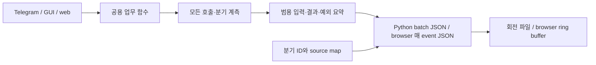
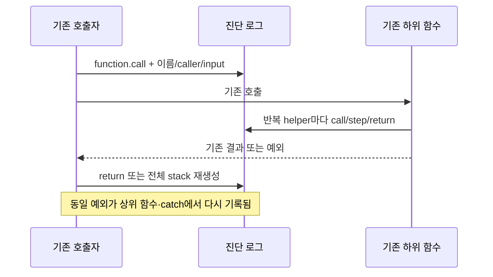
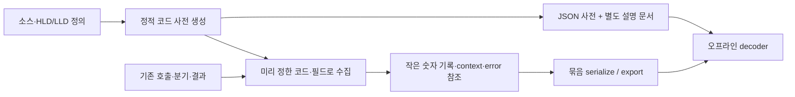
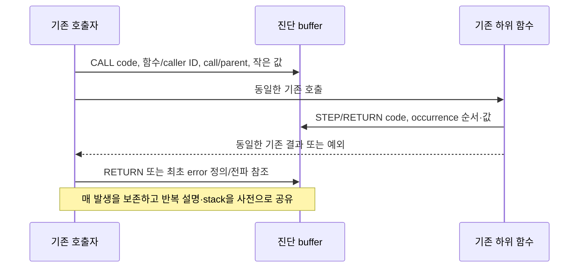

# 진단 로그 지연·중복과 signal 코드 사전 검토

- GitHub Issue: [#30](https://github.com/jo0n-lab/cfd-bot/issues/30)
- 대상: [#18](https://github.com/jo0n-lab/cfd-bot/issues/18), [Draft PR #29](https://github.com/jo0n-lab/cfd-bot/pull/29), 제품 소스 `0306c0d`
- 상태: 분석·제안 완료. 이 문서의 To-Be는 아직 구현하지 않았다.

## 배경

로그 ON의 지연 원인과 중복/불필요 로그를 검토하고, 404 같은 숫자 signal 코드나 hash 참조와 별도 사전으로 줄일 수 있는지 확인한다. 사후 원인 분석과 모든 HLD/LLD 시퀀스 추적이 목적이며 새로운 업무 검증·safe logic·복구 정책은 범위 밖이다. 이번 변경은 재현 도구와 문서이며 운영 소스·서비스는 변경하지 않는다.

## As-Is HLD / LLD

## To-Be HLD / LLD (검토안)

## 검토 결과와 호환성

분리된 [분석 보고서](../analysis/diagnostic-overhead-review.md)에 병목·중복 후보·손실 위험·실측과 재현 코드를 기록했다. [signal 코드 사전 명세](../analysis/diagnostic-codebook-proposal.md)에는 event 의미·필드·버전/복원·예시를 제안했다.

숫자 사전 포함 크기는 표본에 따라 약 25~47% 감소했으며 오프라인 왕복 복원을 확인했다. 전체 payload를 SHA-256으로 참조하는 프로토타입은 일부 web 표본에서 오히려 커졌다. 저장 크기 감소는 실행 속도 개선 증명이 아니다. 정상 설정 경로에서 함수 호출이 133,009회로 늘어 ON 중앙값 7.21초였으며 OFF는 0.92초였다. 기존 보고서의 CPU 설정 누락 표본만으로 일반적인 조회 비용을 대표할 수 없음을 확인했다.

기존 runtime schema 1과 decoder는 그대로다. To-Be를 구현할 경우 새 schema와 해당 사전을 함께 보관하고 기존 기록도 계속 읽어야 한다. 사건별 인과관계·호출/응답·티켓/작업 구분·예외/경고와 기존 업무 반환값을 유지한다. 원문 토큰/인증/환경변수를 사전에 넣지 않는다.

## 검증

임시 921개 티켓과 40개 관측 CASE의 설정 누락/설정 있음 경로, 2,000줄 parser, 실제 Chromium 1,000행 렌더를 확인했다. Python 3회 표본 중앙값, 별도 cProfile, browser CPU 표본과 사건 건수, 원자료+사전 bytes, gzip CPU/크기를 기록했다. 실제 Telegram 전송·계산은 시작하지 않았으며 fixture 서버는 종료했다. 분석 도구는 compile/node syntax와 실제 실행으로 검증한다. 최종 제품 성능 통과, 동시 요청, 실제 Windows/macOS/Tk 운영 성능은 이 분석의 완료 범위가 아니다.
