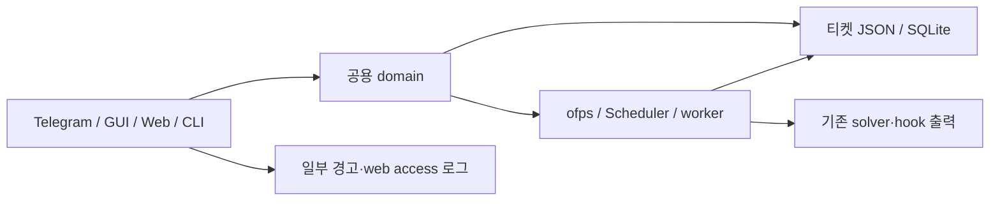
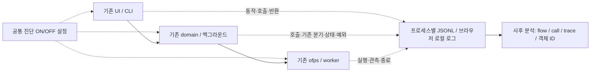
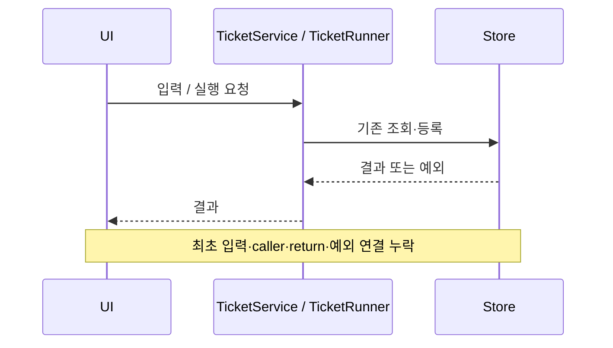
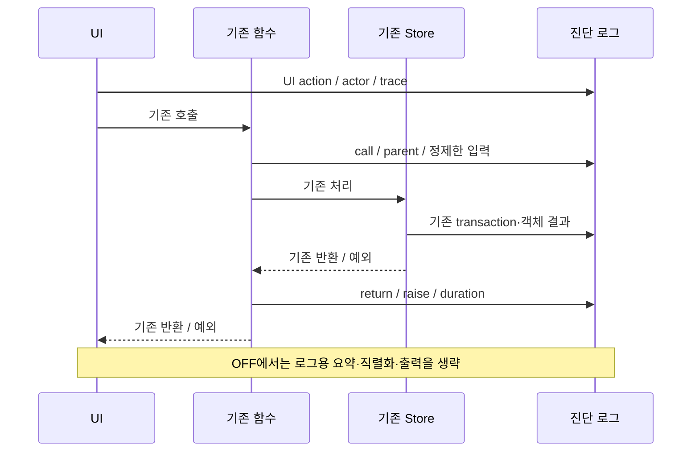

# 전체 시퀀스의 사후 원인 분석 로그

- 날짜: 2026-10-07 KST
- GitHub Issue: [#18](https://github.com/jo0n-lab/cfd-bot/issues/18)
- 상세 명세: [시나리오·전체 시퀀스·ON/OFF·성능](https://github.com/jo0n-lab/cfd-bot/issues/18#issuecomment-6031570831)

## 배경과 범위

이미 발생한 문제의 입력, 함수 호출/반환, 기존 판단, 티켓/작업 변경, 예외와 후속 영향을 복원한다. 로그와 ON/OFF만 추가한다. 업무 검증, CPU 검사, 실행 차단, 재시도, 복구 정책은 추가하거나 바꾸지 않는다. 운영 소스와 분리한 작업 트리에서 구현한다.

## As-Is HLD

상태와 출력은 존재하지만 호출 관계, 당시 값, UI 동작, DB 대기와 최초 오류를 공통 ID로 연결할 수 없다.

## To-Be HLD

업무 DB에 진단 로그를 쓰지 않는다. Python은 공통 경량 decorator와 명시적 이벤트를 사용하고, shell은 기존 함수/실행 경계에 기록한다. 브라우저는 로컬 구조화 로그를 사용하며 수집 API를 추가하지 않는다. 외부 케이스 스크립트는 기존 subprocess와 출력/종료 경계까지만 관측한다.

## As-Is LLD

## To-Be LLD

HLD/LLD의 UC-01~27, D-01~15, BG-01~07 및 플랫폼별 변형을 `문서 flow → 실제 함수/단계 → log event`에 매핑한다. mapping은 문서이며 런타임 검증기가 아니다. call ID와 parent ID는 반복·비동기 실행 및 Python/shell 경계를 구분한다. 예외 traceback은 locals 없이 정제한다. 토큰/인증/원문 대화/전체 환경변수를 기록하지 않는다.

## 호환성

- 기존 티켓/DB 스키마, solver 출력, ofps stdout·종료 코드, 실행 순서·검증 정책을 보존한다.
- ON/OFF는 새 진단 로그에만 적용한다. 기존 서비스 로그와 solver 로그는 유지한다.
- 사전 설계는 기본 ON이었으나 실측에서 성능 목표를 넘겨 최종 초안은 기본 OFF로 변경했다. 명시적인 환경/설정 ON/OFF를 지원하며 프로세스별 적용 시점과 기존 worker의 설정 유지 여부를 문서화한다.
- Telegram·GUI·web에서 같은 공용 함수의 계측을 사용한다. UI 문구가 바뀌면 리소스 규칙을 따른다.

## 검증·성능 계획

1. 임시 파일/DB, fake transport/solver/ofps에서 호출 연결, 객체별 결과, 예외/경고, 초기 원인 보존, 민감정보 제거, ON/OFF를 확인한다.
2. 실제 계산·Telegram 전송을 하지 않는다. 기존 테스트 전체와 config check, JS/shell syntax를 실행한다.
3. 기준본/OFF/ON을 동일 fixture에서 비교한다. 작은 요청·대량 티켓/큐·동시 요청·shell/browser를 포함하여 p50/p95/max, CPU/RSS, disk/log bytes, 이벤트 수를 기록한다.
4. 초기 목표는 OFF p95 증가 max(1%, 1 ms), ON 증가 max(5%, 5 ms). 달성 여부를 실측대로 보고하고 이벤트 생략으로 맞추지 않는다.
5. 문서 및 매핑을 최종 구조에 맞추고 SVG 변경 시 XML·실제 렌더링을 확인한다. 배포 시 bot/web 서비스를 재시작하되 기존 계산·큐를 보존한다.

## 구현·검증 결과

Python 함수 392개·분기 1,507곳, JavaScript 함수/callback 131개, ofps shell 함수 20개에 로그를 적용했다. HLD/LLD의 99개 그림을 함수/이벤트/source map에 연결했다. Telegram·GUI·web과 공용 domain, SQLite transaction, subprocess, worker/hook, Python warning/exception, shell ERR/RETURN/EXIT를 기록한다. 업무 검증·실행 차단·재시도·복구 정책은 추가하지 않았다.

공통 ON/OFF, 호출/부모/trace ID, 제한된 입력/결과 요약, 비식별 actor, 회전 파일, 브라우저 로컬 버퍼와 export를 구현했다. Python 로그의 lossless batch와 source map으로 중복 문자열을 줄였다. 모든 함수 호출을 기록하되 HLD/LLD에 직접 나오는 함수는 제한된 상세 요약, 내부 helper의 dict는 식별 필드와 개수를 기록한다.

통합 시점 전체 332개 unittest가 ON에서 통과했다(1개 inotify 환경 skip). 후속 진단 회귀 테스트는 11개 모두 통과했다. 실제 Chromium의 기존 web UI 시나리오 및 진단 ON/OFF·서버 trace 연결을 확인했다. config check는 984개 CASE에서 통과했고 실제 Telegram 전송이나 계산 시작은 하지 않았다. 새 SVG는 XML parse와 렌더링을 확인했다. Windows/macOS 네이티브 실행과 실제 Tk 화면 검증은 수행하지 않았다.

**성능 완료 조건은 미달이다.** 921개 티켓 web 조회 p95는 OFF 520.77 ms, ON 2,159.66 ms였고 후속 dict 요약 조정의 5회 표본에서도 ON 1,957.03 ms였다. 브라우저 1,000행 렌더 p95는 OFF 3.5 ms, ON 138.1 ms였다. OFF도 일부 경로에서 제안한 엄격한 목표를 넘겼다. [측정 보고서와 원자료](../analysis/diagnostic-performance.md)에 CPU/RSS/기록량 및 한계를 남겼다.

따라서 #18은 열린 상태로 유지하며 구현은 Draft PR로 제출한다. 운영 checkout/config/service는 변경하거나 재시작하지 않았다. 이 초안을 상시 ON 운영 성능 검증 완료로 간주하지 않는다.
