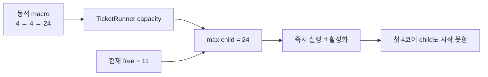
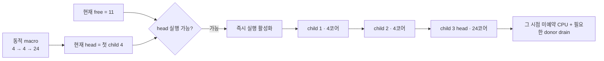
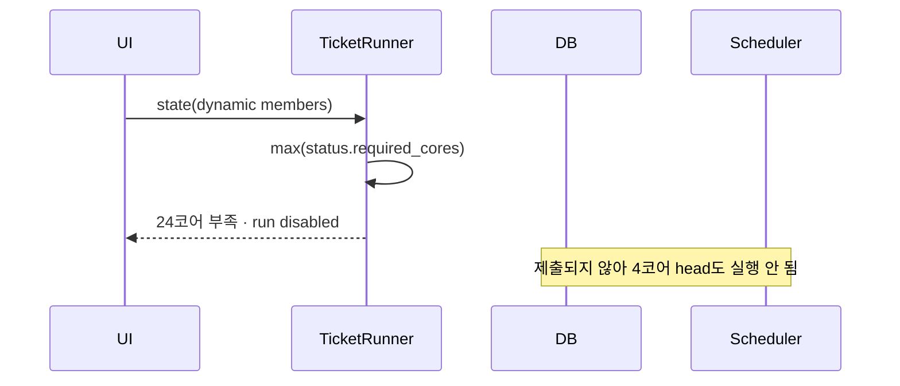
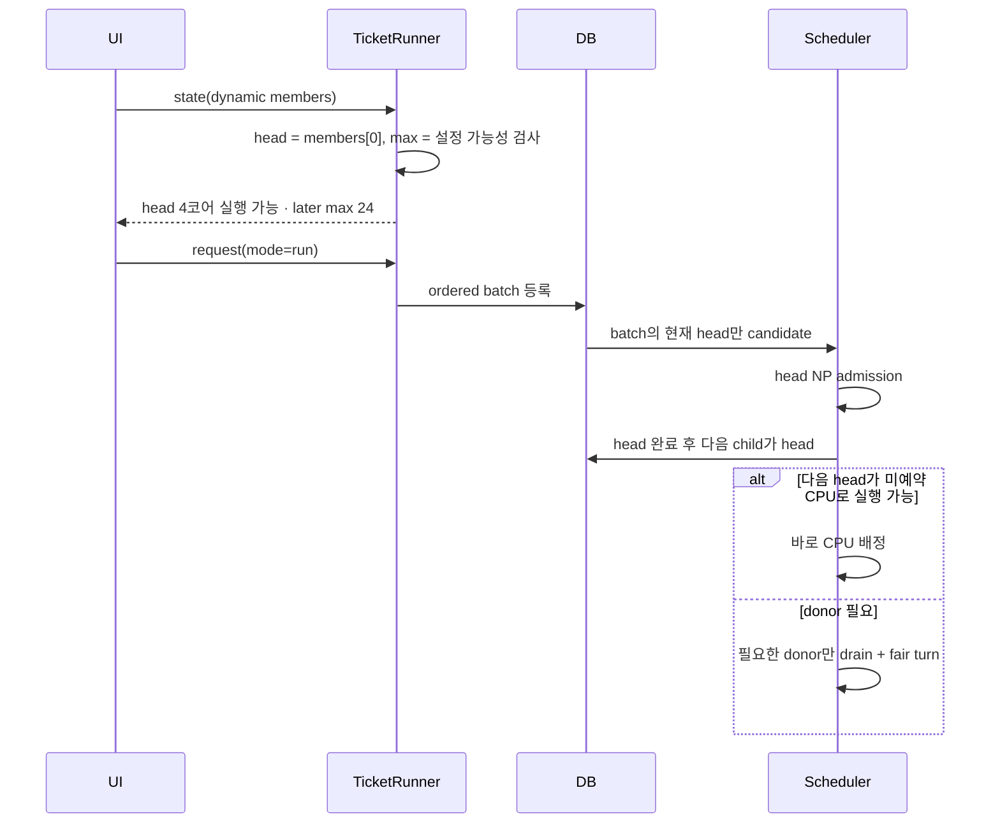

# 동적 매크로의 현재 head 기준 실행 판정

## 배경

#24는 동적 매크로의 각 child NP를 실행 시점 quota로 사용하도록 Scheduler를 바꿨지만, 실행 버튼의 사전 용량 판정은 여전히 모든 child 중 최대 NP를 사용했다. 예를 들어 `4 → 4 → 24` 순서의 동적 매크로와 잔여 11코어가 있으면 첫 4코어 child는 바로 실행할 수 있는데도 UI가 24코어 부족으로 즉시 실행을 막는다.

동적 quota의 의미는 매크로 전체 최대 NP를 시작 전에 확보하는 것이 아니다. 현재 FIFO head가 자기 NP만큼 확보되면 시작하고, 뒤의 child는 자기 차례가 되었을 때 다시 admission되어야 한다.

## As-Is HLD

- UI 실행 가능 여부가 현재 head가 아니라 매크로 전체 최대 NP를 기준으로 한다.
- `mode=run`으로 등록된 동적 macro job은 Scheduler의 donor/fair-turn 분기를 우회한다.
- immediate batch의 뒤 child도 candidate 목록에 들어가므로, 나중 child의 drain claim이 너무 일찍 생길 수 있다.

## To-Be HLD

- 동적 매크로의 즉시 실행 판정은 첫 실행 child만 본다.
- 모든 child의 최대 요구량은 전체 관리 한도를 넘는 설정을 거절하는 데만 사용한다.
- 뒤 child는 현재 head가 되기 전 CPU나 donor를 선점하지 않는다.
- `mode=run`으로 시작한 동적 매크로도 child가 커지는 시점에는 같은 dynamic borrow/fairness 정책을 사용한다.

## As-Is LLD

## To-Be LLD

## 호환성

- 일반 티켓과 고정 매크로의 실행 가능 판정은 기존처럼 해당 고정 NP를 사용한다.
- 대기열 등록 버튼은 동적 매크로의 모든 child가 전체 관리 한도 안에 있으면 계속 활성화한다.
- 저장 JSON, child 순서, queue id, `.process-core` 계약은 바뀌지 않는다.
- 기존 queued/running job의 priority 값은 그대로 읽는다.

## 검증 계획

1. 잔여 11코어에서 `4 → 4 → 24` 동적 매크로의 즉시 실행이 활성화되고 안내가 첫 child 4코어를 표시하는지 검증한다.
2. 첫 child 요구량이 잔여 코어보다 크면 즉시 실행만 비활성화하고 대기열 등록은 허용하는지 검증한다.
3. 뒤 child가 51코어 관리 한도를 넘으면 즉시 실행과 대기열 등록을 모두 막는지 검증한다.
4. immediate batch는 현재 child 하나만 Scheduler candidate가 되는지 검증한다.
5. `mode=run` 동적 macro의 큰 child도 donor drain과 fair turn을 사용하는지 검증한다.
6. Telegram, Tk GUI, Web의 버튼과 안내 문구가 같은 RunState를 표시하는지 검증한다.
7. 전체 unittest, config check, 문서·SVG 검증 후 bot/web 서비스를 재시작한다.

## GitHub Issue

- [#24 대기열 quota를 case cores에서 파생](https://github.com/jo0n-lab/cfd-bot/issues/24) 재오픈

## 구현 결과

- `TicketRunner._capacity`는 동적 macro의 첫 child를 `required_cores`와 즉시 실행 판정에 사용한다. 전체 최대 요구량은 `queue_max_required`로 분리하고 관리 한도 검사에만 쓴다.
- 동적 macro의 `queue_quota`는 고정값이 아니므로 `None`이며, `queue_required`는 현재 head 요구량이다.
- `scheduling_candidates(jobs,active)`는 active child가 없는 즉시 실행 batch마다 첫 queued child 하나만 반환하고, active job이 있는 일반 queue도 제외한다.
- `priority=run` 동적 macro도 `borrowing_plan`, drain claim, donor fair turn을 사용한다.
- Telegram, Tk GUI, Web은 같은 RunState의 실행·대기열 활성화와 안내 문구를 표시한다.

## 검증 결과

- 운영 `macro-TCB.json`을 실제 fresh snapshot으로 판정: `40/51` 사용, free 11, 첫 child 4, 최대 child 24, `run_enabled=true`, `queue_enabled=true`.
- `python3 -m compileall -q cfd_bot tests`: 통과.
- `python3 -m unittest discover -s tests -q`: 318 tests 통과, 1 skipped.
- `python3 -m cfd_bot --config bot.json check`: 984 cases, 설정 정상.
- `python3 docs/analysis/validate_docs.py`: Markdown 13개, local link 2,000개, SVG 104개 XML parse·실제 렌더링 통과.
- `cfd-bot.service`, `cfd-bot-web.service` 재시작 후 모두 active이며 Web `/api/health` 응답을 확인했다.
