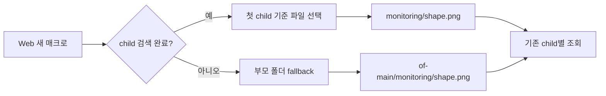
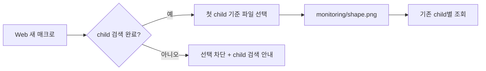
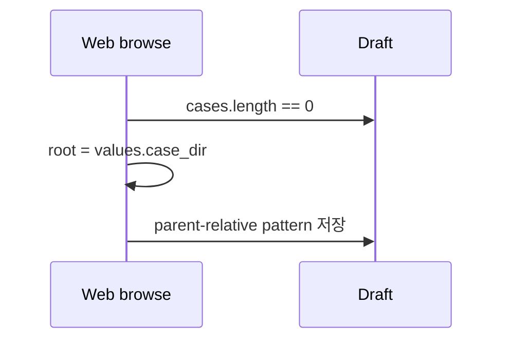
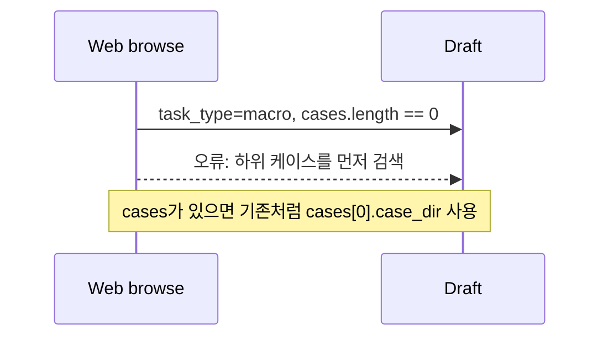

# 매크로 파일 선택기의 부모 경로 fallback 차단

## 배경

매크로의 요청 데이터 pattern은 원래부터 모든 child 티켓에 그대로 복제되며, 실제 조회는 각 child의 case root에서 수행한다. 하위 케이스를 검색한 뒤 파일을 선택하는 기존 흐름도 첫 child를 기준으로 `monitoring/shape.png` 같은 공통 상대경로를 만들기 때문에 정상이다.

예외는 Web의 새 매크로 초안에서 하위 케이스를 아직 검색하지 않은 상태다. 이때 파일 선택기가 매크로 부모 폴더를 fallback root로 사용해 `of-main/monitoring/shape.png`를 만들 수 있었다. 나중에 child를 검색하고 저장하면 이 문자열이 그대로 복제되므로 각 child에서 잘못된 하위 경로를 조회한다.

## As-Is HLD

## To-Be HLD

기존 매크로 복제·조회 로직, Telegram, GUI, `TicketService`의 저장 형식은 변경하지 않는다. Web의 잘못된 부모 fallback 진입점만 막는다.

## As-Is LLD

## To-Be LLD

## 호환성

- 하위 케이스 검색 후 선택하는 기존 동작과 저장 JSON은 그대로다.
- 직접 입력한 pattern과 기존 티켓은 자동 수정하거나 거절하지 않는다.
- 화면에 이미 입력된 `of-main/monitoring/...`은 `monitoring/...`으로 사용자가 수정해야 한다.

## 검증 계획

1. child가 없는 Web 매크로에서 파일 선택기가 열리지 않는지 확인한다.
2. child가 있으면 첫 child가 browse root가 되고 `monitoring/...`이 저장되는지 확인한다.
3. 공통 pattern이 발행된 각 child의 case root에서 독립적으로 조회되는 기존 테스트를 유지한다.
4. compile, unit test, config check 후 web user service를 재시작하고 상태를 확인한다.

## GitHub Issue

- [#23](https://github.com/jo0n-lab/cfd-bot/issues/23)

## 검증 결과

- `python3 -m compileall -q cfd_bot tests`: 통과
- `node --check cfd_bot/web_static/app.js` 및 `node --check tests/web_browser.cjs`: 통과
- `python3 -m unittest discover -s tests -q`: 305개 통과, 1개 선택적 테스트 skip
- `python3 -m cfd_bot --config bot.json check`: 982개 케이스 설정 정상
- Playwright 브라우저 E2E 시나리오에 검색 전 차단과 검색 후 `monitoring/shape.png` 선택 검증을 추가했다. 현재 환경에는 Playwright 모듈이 없어 해당 선택적 시나리오는 실행하지 못했다.
- `cfd-bot-web.service` 재시작 후 active/running, `/api/health` 정상 응답을 확인했다.
