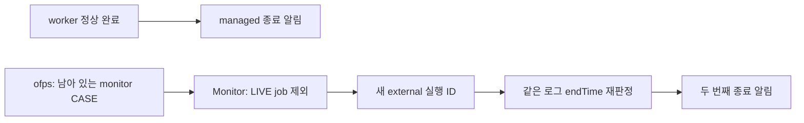
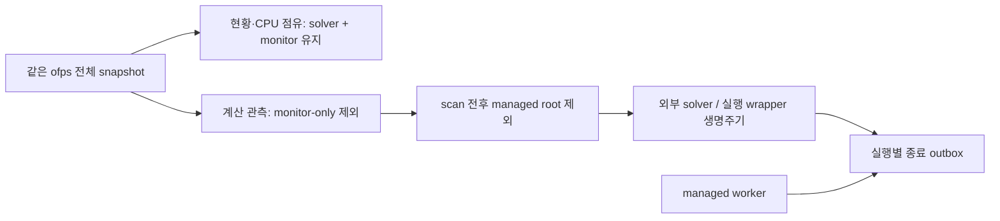

# 계산 종료 뒤 monitor를 외부 계산으로 재등록하는 중복 알림 수정

- GitHub Issue: [#28](https://github.com/jo0n-lab/cfd-bot/issues/28)
- 대상: 공용 Monitor의 계산 생명주기 분류; ofps와 모든 UI의 CPU 관측은 유지

## 배경과 운영 근거

2026-10-07 KST 기준 outbox에 같은 계산의 managed/외부 종료 이벤트가 각각 기록됐다.

| 케이스 | managed 완료 | 잘못 생성한 외부 완료 | 외부 기록의 점유 |
|---|---|---|---|
| of-main | `8ead1730d6c1`, 16:17:56 | `a28e3ddcd0d5`, 16:18:34 | monitor CPU 50 하나 |
| of-amr | `4dcd9ae3e5ff`, 16:22:33 | `27f6db5c0a97`, 16:23:05 | monitor CPU 24 하나 |

네 outbox 행 모두 attempts=0, sent=1이다. 전송 재시도가 아니라 서로 다른 실행 ID를
생성한 것이 원인이다. #25에서 CPU 충돌 방지를 위해 monitor를 ofps에 포함했지만,
Monitor는 모든 CASE를 새 계산으로 간주했다. managed 종료 후 잠시 남은 monitor가
외부 계산으로 재등록되어 같은 로그의 endTime을 다시 판정했다.

## As-Is HLD / LLD

1. `Monitor.tick`은 snapshot 이후 LIVE job을 조회해 managed root만 제외한다.
2. `observe(record)`는 monitor만 남아 있어도 새 UUID와 외부 시작 이벤트를 만든다.
3. monitor 소멸 시 같은 최신 로그로 종료 판정하여 별도 terminal outbox를 만든다.
4. scan 도중 worker가 끝나면 snapshot에 남은 solver도 LIVE 제외 목록에서 빠질 수 있다.

## To-Be HLD / LLD

1. `calculation_record`가 monitor-only CASE에는 None을 반환한다. 혼합 CASE에서는
   monitor process를 실행 identity/시작 시각에서 제외하고 합산 CPU metadata는 유지한다.
2. 실제 외부 계산이 이미 관측됐다면 monitor-only 전환은 계산 소멸로 처리하고 기존
   missing_polls로 종료한다. monitor-only 상태 자체는 새 계산을 시작하지 않는다.
3. snapshot 전과 recovery 후의 LIVE root 합집합을 managed 제외 대상으로 사용한다.
   scan 도중 끝난 managed 계산이 같은 tick에서 외부 계산으로 생기지 않는다.
4. `/stat`, GUI/web의 공용 상태와 Scheduler CPU 검사에는 전체 snapshot을 그대로 준다.
   외부에서 같은 경로의 solver를 다시 실행하면 정상적으로 새 실행을 관측한다.

## 호환성

- 티켓/DB schema, Telegram 문구·버튼과 세 UI adapter의 입력 계약은 바뀌지 않는다.
- 모니터링 CPU의 현황 표시와 충돌 방지는 유지한다. 알림과 공용 실행 이력의 잘못된
  신규 실행 생성만 제거한다. 이미 전송된 알림/과거 기록은 삭제하지 않는다.
- endTime 판정과 알림 전송 retry 계약은 유지한다. API exactly-once 보장을 추가하지 않는다.

## 검증 계획

- managed 완료 → monitor-only → 소멸 경로에서 terminal 이벤트가 정확히 하나인지 확인한다.
- 서비스 재시작 뒤 남은 monitor-only CASE도 신규 외부 실행이 되지 않는지 확인한다.
- scan 안에서 worker 완료를 재현하여 같은 snapshot의 solver가 재등록되지 않는지 확인한다.
- 진짜 외부 계산, monitor가 남은 외부 종료, 같은 경로의 재실행 알림을 확인한다.
- 전체 snapshot의 monitor CPU가 보존되는지, 기존 Telegram/GUI/web·CPU 테스트를 확인한다.
- compileall, 전체 unittest, config check, 변경 SVG parse/render 후 봇 서비스 반영을 확인한다.

## 구현·검증 결과

- 기존 Monitor에 `calculation_record`와 scan 전후 managed root 처리를 반영했다.
  새로운 watcher나 별도 전송 중복 필터는 추가하지 않았다.
- 수정 전 신규 재현 테스트 4개에서 중복 생성·종료 미감지·identity 혼입을 확인했고,
  수정 후 재시작·미등록 monitor·실제 wrapper·외부 재실행까지 총 7개 회귀 테스트를 통과했다.
- 전체 unittest 340개: 실패 0, GUI display가 필요한 1개는 환경상 skip.
  Telegram callback, GUI controller, web HTTP와 CPU 배정 기존 테스트를 함께 실행했다.
- compileall, 운영 984개 티켓 check, diff 공백 검사 통과. 변경 SVG 3개의 XML parse와
  BG-02·HLD·아키텍처 PNG 렌더링을 확인했다.
- bot/web 서비스를 재시작한 뒤 모두 active, web health 정상, monitor_error 없음과 최신
  snapshot을 확인했다. 재시작 전 실행 중이던 DS_CART_NQ_0166은 종료 코드 0으로 완료되고
  terminal outbox 하나(sent=1, attempts=0)를 남겼으며 다음 DS_CART_NQ_0167이 시작됐다.
