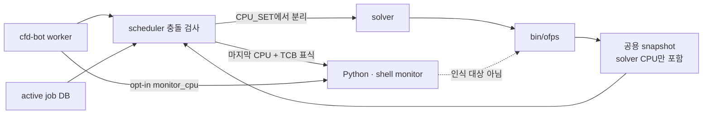

# `ofps`의 전용 모니터링 CPU 관측

- GitHub Issue: [#25](https://github.com/jo0n-lab/cfd-bot/issues/25)
- 대상: `bin/ofps`, 공용 snapshot, CPU 충돌 검사, `/stat`, scheduler

## 배경

monitor는 두 경로에서 실행된다. ticket의 전용 모니터링이 활성화되면 worker가 solver와
별도의 monitor CPU를 예약한다. 최근 TCB `Allrun`은 `.process-core`의 마지막 CPU를
monitor로 떼고 나머지를 solver에 쓰며 `TCB_MONITORED_SOLVER_PID`를 monitor process
tree에 전달한다. 그러나 `ofps`는 OpenFOAM 및 Basilisk 계산 프로세스만 application
row로 인식하므로 두 경로의 일반 Python·shell monitor affinity가 snapshot에서 빠진다.
관리 중인 active job은 DB나 전체 `.process-core` 예약으로 충돌을 피하지만 `/stat`, 외부
실행 관측, `ofps --check`가 사용하는 공용 snapshot은 실제 점유 CPU 전체를 표현하지 못한다.

## As-Is HLD



## As-Is LLD

1. worker가 직접 실행하는 opt-in monitor에는 `CFD_BOT_CASE_DIR`, `CFD_BOT_JOB_ID`,
   `CFD_BOT_MONITOR_CPU`, `TCB_MONITORED_SOLVER_PID`가 전달된다.
2. TCB `Allrun` 내부 monitor에는 `TCB_MONITORED_SOLVER_PID`가 전달되며, bot 밖에서
   `Allrun`을 시작해도 같은 표식이 존재한다.
3. `bin/ofps:scan_once`는 executable/name이 OpenFOAM 또는 Basilisk인 process만
   TSV application record로 만든다.
4. `cpu_allocation.occupied_cpus`는 active job의 `monitor_cpu`나 job 전체 CPU_SET을
   합치므로
   bot이 정상 추적 중인 작업끼리는 충돌을 막는다.
5. job DB가 없는 외부 관측 경로와 공용 snapshot에는 monitor affinity가 없으므로
   `/stat`의 코어 수와 `ofps --check`의 점유 판단이 실제 상태보다 작다.

## To-Be HLD

```mermaid
flowchart LR
    W[cfd-bot worker] --> A[TCB Allrun 또는 opt-in 실행]
    A -->|CPU_SET| S[solver]
    A -->|bot 표식 또는 TCB solver PID 표식| M[monitor process]
    S --> O[bin/ofps /proc scan]
    M --> O
    O -->|OpenFOAM + Monitor\n같은 CASE| P[공용 snapshot\naffinity 합집합]
    P --> T[/stat · web · GUI]
    P --> A[scheduler · ofps --check]
```

## To-Be LLD

1. `bin/ofps`는 기존 OpenFOAM/Basilisk 판정 다음에 bot monitor 판정을 수행한다.
2. monitor 판정은 두 기존 실행 계약 중 하나를 요구한다.
   - worker opt-in: `CFD_BOT_CASE_DIR`, `CFD_BOT_JOB_ID`, `CFD_BOT_MONITOR_CPU`
   - TCB `Allrun` 내장 monitor: 숫자형 `TCB_MONITORED_SOLVER_PID`
3. bot case 표식이 없으면 process cwd에서 OpenFOAM case root를 찾는다. case 경로를
   canonical path로 바꾸고 `system/controlDict`가 존재하며 process
   cwd가 그 case 내부인지 확인한다. 조건이 맞지 않으면 일반 process로 무시한다.
4. 유효한 process는 `ENGINE: Monitor`, `MODE: monitor`로 출력하며 실제 thread affinity를
   사용한다.
5. `processes.parse_snapshot`은 같은 case root의 OpenFOAM과 Monitor block을 기존처럼
   병합하므로 `actual_cpu_list`는 solver와 monitor affinity의 합집합이 된다.
6. `/stat`, web, GUI, scheduler 및 `ofps --check`는 모두 같은 snapshot을 소비하므로
   별도 UI별 충돌 로직 없이 monitor CPU를 표시하고 재할당에서 제외한다.

## 호환성

- ticket schema, 설정 화면, Telegram 문구는 바꾸지 않는다.
- 현재 실행 중인 worker opt-in monitor와 TCB 내장 monitor 모두 기존 환경 표식만으로
  다음 scan부터 잡힌다.
- 외부 SSH/tmux/systemd에서 시작한 TCB `Allrun`의 내장 monitor도 TCB 표식과 cwd로 잡힌다.
- 두 표식 계약이 모두 없는 임의 Python/shell process는 계속 제외해 false positive를 막는다.
- OpenFOAM/Basilisk 판정을 먼저 유지하므로 기존 application 분류는 바뀌지 않는다.
- active job DB의 monitor CPU 예약은 snapshot과 set 합집합으로 계산되어 중복 합산되지 않는다.

## 검증 계획

- 유효 OpenFOAM case에서 worker 표식 또는 TCB 내장 표식과 CPU affinity를 가진 일반 process가
  `ENGINE: Monitor`로 출력되는지 확인한다.
- 같은 CPU에 대한 `ofps --check`가 해당 monitor PID와 case를 제시하며 overlap으로
  거절하는지 확인한다.
- 같은 case의 solver와 monitor block을 parse했을 때 affinity가 하나의 case record에
  합쳐지는지 확인한다.
- 환경 표식이 일부 없거나 유효 case 밖을 가리키는 process가 제외되는지 확인한다.
- `compileall`, 전체 `unittest`, config check, 문서·SVG 검증을 수행한다.
- bot/web user service를 재시작하고 활성 상태를 확인한다.
