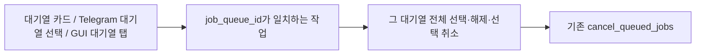

# 대기열별 선택·해제·취소

사용자 수정 지시: 모든 대기열을 대상으로 한 상단 버튼 대신 각 대기열 안에
전체 선택·전체 해제·선택 취소를 둔다. 이슈 등록 생략, 변경 경로만 검증한다.

## As-Is HLD / LLD

Web은 표시만 queue_id별로 나누고 선택은 전체 queued를 대상으로 한다.
Telegram과 GUI도 전체 queued가 하나의 선택 대상이다.

## To-Be HLD / LLD

선택은 job ID로 유지하며 한 대기열의 선택·해제·취소는 다른 대기열의 선택을 유지한다.
확인 화면에서 선택 ID를 고정한다. API·중단·대기 취소의 실행 정책은 기존 공용 함수를
유지한다. 대기열별 FIFO와 CPU 배정은 변경하지 않는다.

검증: TCB/legacy-1을 동시에 선택하고 한쪽만 해제·취소해 다른 쪽 보존을 확인한다.

## 적용·최소 확인

Web의 실제 JS action을 실행해 TCB만 선택/해제/취소할 때 legacy-1 선택 보존 및 카드별
버튼의 queue_id를 확인했다. Telegram·GUI도 같은 범위 동작을 짧게 확인했다. 사용자
요청대로 전체 테스트와 실제 GUI/브라우저 화면 테스트는 실행하지 않았다.
