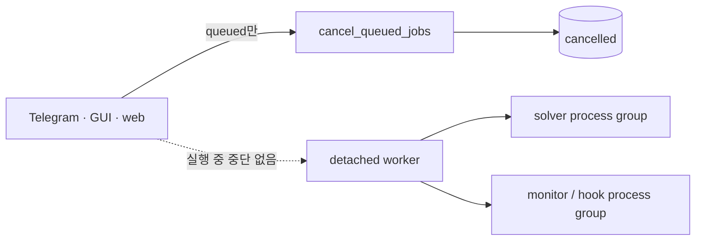
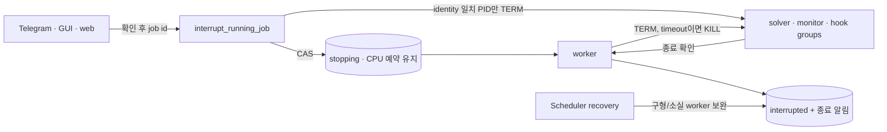

# 실행 중인 managed 계산 중단

- GitHub Issue: [#27](https://github.com/jo0n-lab/cfd-bot/issues/27)
- 대상: 공용 queue control, detached worker, Scheduler recovery, Telegram·GUI·web

## 배경

현재 대기 작업은 세 UI에서 공용 `cancel_queued_jobs`로 취소할 수 있지만, `starting`,
`running`, `postprocessing` 작업은 상태 확인만 가능하다. queue pause는 새 작업의 admission만
막으며 실행 중 solver를 중단하지 않는다. 운영자가 잘못 시작한 계산이나 장시간 계산을
종료하려면 서버에서 PID를 찾아 수동으로 처리해야 한다.

## As-Is HLD

## As-Is LLD

1. `Store.cancel_queued`는 `queued` 상태만 원자적으로 `cancelled`로 바꾼다.
2. worker는 solver, 선택적 monitor, hook을 각각 `start_new_session=True`로 시작하고 PID와
   `/proc` identity를 job에 저장한다.
3. worker 내부 오류에서는 `_stop_child`가 process group에 TERM을 보내고 timeout 뒤 KILL로
   올리지만, 이 경로를 UI에서 요청할 수 없다.
4. active 상태를 terminal로 먼저 바꾸면 Scheduler가 CPU를 재배정할 수 있으므로 실제
   process가 사라지기 전에 `interrupted`로 바꾸는 방식은 안전하지 않다.

## To-Be HLD

## To-Be LLD

1. `stopping`을 LIVE/ACTIVE 상태에 포함해 중단 처리 중에도 CPU와 case unique 예약을
   유지한다.
2. 공용 `interrupt_running_job`은 managed job 하나를 LIVE에서 `stopping`으로 CAS하고
   요청 시간·사유를 기록한다.
3. 저장된 hook/monitor/solver PID의 현재 `/proc` identity가 기록값과 일치할 때만 해당
   process group에 SIGTERM을 보낸다. PID가 재사용됐거나 identity가 없으면 신호를 보내지
   않는다.
4. worker는 시작 전, 각 child 시작 직후, 0.5초 telemetry loop, 최종 판정에서
   `stopping`을 확인한다. `_stop_child`가 TERM 후 최대 10초 기다리고 필요하면 KILL한다.
5. 중단 요청이면 solver return code나 OpenFOAM 종료 판정보다 우선해 `interrupted`와 공용
   사용자 중단 사유를 저장한다.
6. Scheduler recovery는 `stopping` 작업의 worker/children이 모두 사라지면
   `interrupted`로 확정한다. 기능 배포 전에 시작된 구형 worker도 이 경로로 끝난다.
7. Telegram `/queue`, GUI 작업 큐, web 작업 큐는 managed active job에 중단 버튼과 확인
   단계를 제공하며 같은 helper를 호출한다.

## 호환성·안전 경계

- DB migration column은 없다. 중단 metadata는 기존 job JSON body에 추가한다.
- active case unique index predicate에는 `stopping`을 포함하도록 기존 index를 한 번
  갱신한다.
- ofps로만 발견한 외부 계산에는 managed job과 검증된 PID identity 계약이 없으므로 중단
  버튼을 제공하지 않는다.
- 이미 terminal이거나 다른 요청이 먼저 처리된 작업은 변경하지 않고 unavailable로
  응답한다.
- 정상 완료·실패 판정, queued 취소, queue pause 동작은 유지한다.

## 검증 계획

- 실제 sleep child를 worker가 실행하는 동안 중단해 process 종료와 `interrupted` 상태를
  확인한다.
- 잘못되거나 재사용된 PID identity에는 신호를 보내지 않는지 확인한다.
- stopping이 CPU 예약·case unique 제약과 Scheduler recovery에 남는지 확인한다.
- Telegram callback의 확인/실행, GUI active 선택, web API·버튼을 각각 검증한다.
- compileall, 전체 unittest, config check, UI resource manifest, 문서·SVG 렌더링을 검사한다.
- user service를 재시작한 뒤 bot/web active 상태를 확인한다.

## 구현·검증 결과

- 공용 `interrupt_running_job`과 `Store.request_interruption`을 추가하고 세 UI의 확인 동작을
  같은 helper에 연결했다.
- `stopping`을 LIVE/ACTIVE와 case unique index에 포함하고 기존 SQLite index를 시작 시 한 번
  마이그레이션한다.
- 실제 30초 sleep child를 중단해 process group 소멸, `interrupted` 상태와 사유를 확인했다.
  solver 종료와 postprocess 진입 사이 및 terminal commit 사이의 경합에서도 중단 상태가
  덮어써지지 않는 테스트를 추가했다.
- 전체 unittest 333개 통과, GUI display 1개만 환경상 skip했다. loopback HTTP, Telegram
  callback, display 비의존 GUI controller, UI resource manifest와 JavaScript 구문을 검증했다.
- config check는 운영 티켓 984개를 정상으로 판정했다. 변경 SVG는 XML parse와 PNG 렌더링을
  확인했다.
