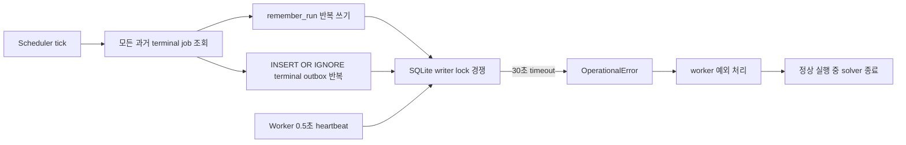
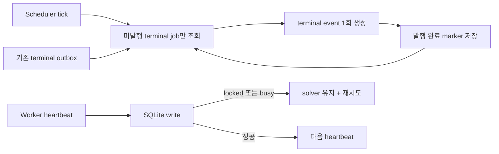

# 종료 이벤트 재처리로 인한 SQLite lock 제거

- GitHub Issue: [#26](https://github.com/jo0n-lab/cfd-bot/issues/26)
- 대상: scheduler 종료 이벤트, SQLite outbox, detached worker heartbeat

## 배경

2026-10-07에 서로 다른 두 계산이 정상적으로 진행되던 중 약 2초 간격으로
`database is locked` 오류와 함께 실패 처리됐다. 두 작업 모두 solver 종료 코드를 수집하기
전이었고 최신 로그와 residual은 계속 갱신되고 있었다. 운영 DB를 측정한 결과 outbox 실제
행은 늘지 않는 동안 12초에 211번 `AUTOINCREMENT`가 증가했고, scheduler가 완료된
과거 작업 전체를 매 tick마다 다시 처리하고 있었다.

## As-Is HLD

## As-Is LLD

1. `Scheduler.tick()`은 `succeeded`, `failed`, `interrupted` 상태의 모든 job을 매번 읽는다.
2. `terminal_event()`는 각 job에 대해 `remember_run()`을 다시 쓰고
   `outbox.event_key=<job-id>:terminal`을 `INSERT OR IGNORE`한다.
3. SQLite의 `AUTOINCREMENT`는 충돌로 행이 추가되지 않아도 `sqlite_sequence`를 갱신하므로
   중복 방지용 insert 자체가 writer transaction을 계속 만든다.
4. worker는 실행 중 0.5초마다 큰 telemetry body를 `BEGIN IMMEDIATE`로 갱신한다.
5. worker의 DB 쓰기가 30초 동안 lock을 얻지 못하면 예외가 최상위 실행 오류 처리로
   전파되고 `_stop_child(solver)`가 호출된다. 따라서 CFD 오류가 아닌 저장소 경합이
   실제 계산을 중단한다.

## To-Be HLD

## To-Be LLD

1. Store는 `terminal_event_published`가 없고 동일 terminal outbox도 없는 terminal job만
   조회한다.
2. scheduler는 위 조회 결과만 `terminal_event()`에 전달한다.
3. 알림 대상이 아니거나 outbox 기록이 끝난 managed job은
   `terminal_event_published=true`로 저장한다.
4. `Store.event`는 해당 event/recipient를 먼저 조회하고 없는 행만 writer lock 아래 다시
   확인해 INSERT한다. 기존 이벤트에는 write transaction과 `AUTOINCREMENT` 증가가 없다.
5. 기존 DB의 과거 작업은 이미 존재하는 terminal outbox로 자동 제외한다. outbox 저장과
   marker 저장 사이에 프로세스가 종료되어도 다음 tick에서 outbox 존재 여부로 제외한다.
6. worker의 solver·hook 실행 이후 Store 쓰기가 SQLite `locked` 또는 `busy`로 실패하면
   자식 프로세스를 중단하지 않고 같은 쓰기를 재시도한다. 다른 DB/코드 오류는 기존처럼
   실패 처리한다.

## 호환성

- DB schema migration은 없다. marker는 기존 job JSON body에 추가한다.
- 이미 발행된 종료 알림은 outbox event key로 판별하므로 다시 전송하지 않는다.
- 알림이 비활성화된 과거 terminal job은 처음 한 번만 확인한 뒤 marker를 기록한다.
- external watcher의 기존 outbox idempotency와 종료 판정은 유지한다.
- Telegram, GUI, web의 화면·버튼·티켓 schema는 바뀌지 않는다.

## 검증 계획

- terminal job을 두 번 tick해도 outbox sequence와 history가 두 번째에는 바뀌지 않는지 확인한다.
- 동일 event/recipient를 다시 요청해도 outbox sequence가 증가하지 않는지 확인한다.
- 기존 terminal outbox가 있는 legacy job이 재처리되지 않는지 확인한다.
- 알림 비활성 terminal job이 한 번 처리된 후 marker로 제외되는지 확인한다.
- worker heartbeat에 일시적인 `database is locked`를 주입해 solver가 성공 종료하는지 확인한다.
- 전체 unittest, compileall, config check와 문서·SVG 검증을 수행한다.
- 서비스를 재시작한 뒤 운영 DB의 outbox sequence가 유휴 tick에서 증가하지 않고 현재 solver와
  monitor가 계속 살아 있는지 확인한다.
