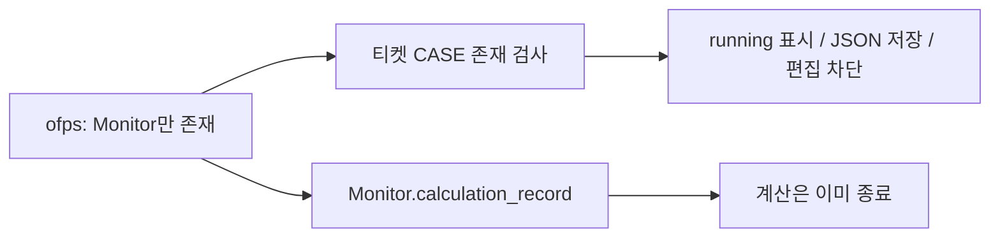
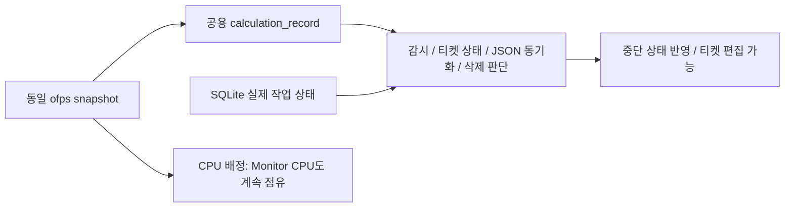

# 중단 뒤 monitor만 남은 티켓의 실행 상태 수정

GitHub Issue: 사용자 요청으로 생략.

## 원인·운영 근거

2026-10-08 19:45:16 KST, of-3d-amr 작업 `e46c00ff22c0`은 interrupted,
returncode 143으로 종료됐고 solver/worker PID도 소멸했다. 같은 케이스의
Allmonitor·pvpython만 CPU 49에 남았다. 종료 알림 감시는 이미 monitor-only를
제외하지만 티켓 상태·JSON 동기화는 전체 CASE 존재만 검사해 running을 다시 기록했다.
운영 diagnostic_logging 설정과 환경 override가 없어 기존 진단 로거는 OFF였다.

## As-Is HLD / LLD

`TicketRunner._state`, `deletion_activity`, `tickets._sync_ticket_states`가
monitor 전용 CASE까지 실행 중으로 간주한다.

## To-Be HLD / LLD

기존 calculation_record를 processes 모듈로 옮겨 동일 규칙을 공유한다.
전체 snapshot은 ofps 현황과 CPU 충돌 검사에 그대로 사용한다. LIVE 작업의
전처리·후처리는 계속 보호한다. 스키마와 세 UI의 호출 계약은 바꾸지 않는다.
로거는 운영 bot.json에서 basic 수준으로 활성화하며 과거 로그를 복원했다고 주장하지 않는다.

## 검증 계획

임시 작업·snapshot으로 중단 후 monitor-only 상태에서 JSON finished/interrupted,
티켓 idle·편집 가능, CPU 점유 유지, 실제 solver/LIVE 후처리 보호를 확인한다.
운영에서는 프로세스를 종료/시작하거나 티켓 내용을 편집하지 않고 상태 갱신과
로거 파일 생성을 확인한다. 관련 테스트만 수행한다.

## 반영 결과

- 관련 테스트 28개 통과. monitor-only 중단 후 실행 설정 저장, 삭제 허용,
  monitor CPU 점유 유지 및 실제 후처리 보호를 확인했다.
- 실제 웹 API의 of-3d-amr `state=idle`, `run_enabled=true` 확인. 운영 티켓 설정을
  변경하거나 계산/모니터를 종료하지 않았다. 상태 JSON 갱신은 기존 동기화 경로를 사용했다.
- 운영 bot.json에 `diagnostic_logging.enabled=true`, `level=basic` 반영 후 서비스 재시작.
  serve/web/ofps 진단 파일 생성 및 웹 HTTP 요청 레코드 디코딩 확인. 해당 운영 설정은 git에서 제외한다.
- Python compile, 변경 SVG 2개 XML parse·렌더링 확인. 전체 회귀/실제 Telegram 전송/GUI 수동 검증은 생략했다.
