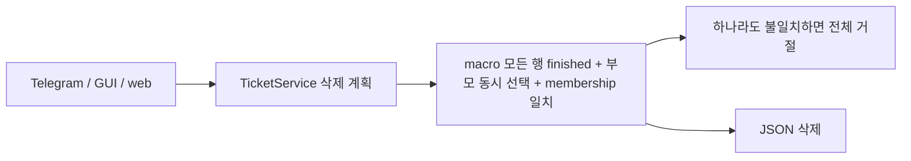
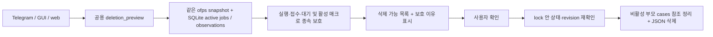

# 실행·대기 상태에 따른 티켓 삭제

- 배경: 전체 선택 삭제가 비활성 child의 매크로 목록 불일치로 거절된다.
- GitHub Issue: 사용자 요청으로 생략.

## As-Is HLD / LLD

web만 fresh 상태를 동기화한다. JSON의 waiting/running 상태와 매크로 관계를
삭제 제약으로 사용하여 미접수 child·고아 child도 삭제되지 않는다.

## To-Be HLD / LLD

- `TicketRunner`가 같은 snapshot 경로를 이용하는 activity reader를 `TicketService`에 연결한다.
  GUI도 삭제 전에 runner 연결을 보장한다. schema/membership 검증은 실행·저장의 책임이다.
- 삭제 preview는 비활성 매크로의 소유 child를 확장하고 보호할 티켓을 별도로 반환한다.
  완료 child도 부모의 다른 child가 실행·대기 중이면 보호한다.
- 설정상의 queue 이름/기본 waiting만으로는 차단하지 않는다. 제출 플래그, 실제 active job,
  현재 ofps CASE와 아직 종결되지 않은 관측을 사용한다. runtime 미연결 도구는 JSON 상태로 보수적으로 판단한다.
- inactive child는 단독/고아/membership 불일치여도 삭제 가능하다. 남기는 부모의 해당 행도 제거한다.
- 확정 시 보호 상태로 바뀌거나 revision이 변경되면 삭제 전 거절한다. I/O 실패 시 JSON을 복구한다.
- 세 UI 모두 보호 목록과 이유를 표시하고 삭제 가능 항목만 확인받는다.

## 호환성·검증 계획

티켓 schema 변경 없음. 케이스 폴더·계산 결과·작업 기록은 유지한다.
실제 티켓 삭제나 계산 실행 없이 임시 파일/DB에서 inactive child, 활성 매크로,
queued/external run, preview 이후 상태 변경, 부모 참조 정리·rollback 및 UI 전달을 집중 검증한다.
전체 회귀 실행 대신 관련 테스트와 문법·리소스·변경 SVG 검사를 수행한다.

## 반영·검증 결과

- Telegram·GUI·web의 삭제 확인 화면에 삭제 가능 수와 보호 수·이유를 반영했다.
- 관련 단위·adapter·리소스 테스트 32개 통과. 웹 JS 확인 동작과 문법, Python compile,
  변경 SVG 3개의 XML parse·렌더링을 확인했다. 전체 회귀·실제 Telegram 전송·GUI 수동 조작은 수행하지 않았다.
- 호스트 ofps를 사용한 운영 티켓 1,012개 read-only preview: 당시 삭제 가능 1,012개,
  보호 0개, 약 1.6초. 운영 티켓 삭제와 실제 계산 실행·중단은 수행하지 않았다.
