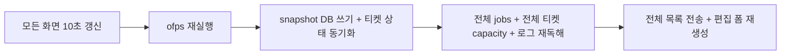
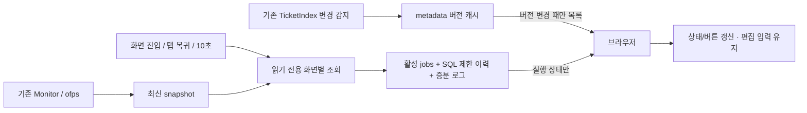

# Web 조회 비용과 탭 복귀 갱신

GitHub Issue: 사용자 요청으로 생략. 구현 전 As-Is/To-Be 기록.

## 배경 / 관측

- 기본 진단 로그의 overview 52회: 중앙값 3.56초, p95 4.38초. 운영 중 24.92/25.49초도 발생했다.
- 읽기 요청에서 fresh → ofps → snapshot DB 쓰기 → sync_ticket_states/ack 쓰기가 수행된다. 25초 요청에서 sync가 18.41초였다.
- jobs 전체 1,133건의 JSON 약 22MB를 매번 읽고 변환한 뒤 이력 100건만 반환한다.
- 모든 화면에서 전체 티켓 metadata/revision/capacity를 재계산하고, 편집 폼까지 다시 만든다.
- 숨긴 탭에서 polling을 건너뛰지만 복귀 이벤트는 없다. 초기 요청 실패 시 timer도 설치되지 않는다. 결과 화면은 polling해도 결과를 갱신하지 않는다.
- basic logger ON/OFF에서 ofps 모두 약 4.5초였다. 로거가 주된 병목이라는 근거는 없다.

## As-Is HLD / LLD

## To-Be HLD / LLD

- web은 유효 기간 내 Monitor snapshot을 재사용한다. 오래됐거나 없으면 기존 scanner로 읽기 전용 fallback, 동시 요청은 합친다. snapshot 시각/실패를 그대로 표시한다.
- `/stat` 및 실행/삭제/저장 최종 검사는 기존 fresh 경로를 유지한다. 표시 캐시로 실행을 허가하지 않는다.
- metadata는 TicketIndex 변경 시에만 재구성하고 설정 revision 기반 버전이 같으면 전송하지 않는다. 목록 상태와 선택된 티켓의 실행 가능 여부를 분리한다. TicketRunner의 공통 판정 함수를 사용한다.
- jobs는 SQL에서 최근 이력을 제한하며 활성 macro에 연결된 job만 별도로 읽는다. 로그는 기존 parser cursor를 재사용한다.
- 갱신 Promise를 공유하고 추가 요청은 후속 갱신으로 보존한다. 초기 실패 재시도, visibility/focus/pageshow/online 갱신, fetch timeout을 넣는다. 결과 화면도 실제 detail/artifacts를 갱신한다.
- 정적 파일과 검증된 결과 파일은 조건부 재검증으로 동일 파일의 재전송을 피한다.

## 호환성 / 검증 계획

기존 overview 응답(옵션 없는 호출), 공용 TicketService/TicketRunner, Telegram/GUI의 실행 정책, outbox/종료 판정은 유지한다. 새 HTTP query는 선택 사항이다. 운영 티켓 수정·계산 실행 없이 HTTP/공용 상태 회귀, 브라우저 VM의 복귀·중복·실패·편집 유지 경로를 확인한다. 수정 후 서비스를 재시작하고 실제 읽기 요청 시간과 진단 로그를 비교한다.

## 추가 구조 점검 범위

대량 DOM/큐 페이지화, 저장 전 export 중복 검증, 결과 파일 반복 탐색, 정적 파일 no-store, 클릭 전역 잠금도 점검한다. 구현 결과와 남은 비용은 완료 시 아래에 기록한다.

## 적용 결과

- 웹 GET의 `fresh/put/sync/ack` 제거. 최신 관측 재사용 + 만료 시 읽기 전용 fallback, 실패/관측 시각 표시.
- 티켓 metadata는 서버 TicketIndex generation/stamp 캐시 + 버전 조건부 응답, 브라우저는 session metadata 재사용. 목록 상태와 선택 티켓 capacity 분리. 케이스/요청 데이터 catalog도 변경 때만 재구성한다.
- 대시보드/티켓/큐/결과 화면별 응답. 이력 SQL LIMIT, root별 최신 작업 조회, macro는 관련 job ID 조회. 로그 cursor 재사용, artifact 목록 조회의 반복 case lookup 제거.
- 탭 복귀와 네트워크 복구 갱신, 초기 실패 재시도, 겹친 요청 Promise/후속 갱신, timeout, stale 화면/결과 응답 차단, 입력 폼 유지. 요청 데이터 검증도 항목별 N개 HTTP에서 공용 validator를 사용하는 1개 일괄 요청으로 줄였다.
- 정적 파일/검증된 이미지 ETag, JSON gzip. 변경 없는 결과 파일은 본문을 재전송하지 않는다.
- 운영 read-only 측정(재시작 후 당시 활성 1 case): overview 57.0/38.5ms, tickets 19.5/17.1ms, queue 92.8ms, data 6.4ms. 이전 표본은 활성 4 case를 포함하므로 같은 부하에서의 배수 비교는 하지 않는다. 최신 snapshot age 4.1~4.3초, error 없음.

## 검증 / 남은 비용

- HTTP·공용 실행·macro view·GUI 테스트와 브라우저 VM의 초기 실패/복귀/겹친 갱신/초안 유지/결과 갱신/화면 전환 검사를 수행했다. 실제 Telegram 전송/계산 시작 없이 확인했다.
- 확장 확인에서 Telegram 기존 삭제 테스트 2개 실패: 이전 삭제 문구와 JSON queue만으로 막던 동작을 기대한다. 변경 전 HEAD를 /tmp에 별도로 풀어 같은 두 실패를 재현했다. 이번 웹 변경 회귀가 아니다. GUI 실제 화면과 실제 브라우저 렌더링은 환경상 실행하지 못했고 adapter/VM으로 확인했다.
- HLD/LLD/architecture와 관련 SVG 5개·호환 링크 그림을 갱신했다. XML parse 및 rsvg 렌더 확인. check 정상(운영 티켓 4개), 서비스 재시작 확인.
- 남은 비용: 수백~수천 개의 대기 작업/매크로 하위 행 DOM은 페이지화하지 않았다. 큐 내용이 바뀌면 해당 화면은 다시 만든다. 매우 큰 실행 macro는 관련 과거 job body를 여전히 읽으므로 최소 필드 projection 후보다.
- 변경 작업의 click 전역 잠금은 동시 편집/실행 경쟁을 피하기 위해 유지했고 timeout으로 무한 대기를 제한했다. 저장/실행의 fresh scan은 안전한 승인 정책상 유지한다. 기존 `/stat` fresh 비용은 이번 웹 최적화 대상이 아니다.

최종 재시작 후 추가 측정: 첫 dashboard 요청 588ms(로그 cursor 초기화), 티켓 최초 20.9ms/1,715bytes → 동일 버전 16.8ms/517bytes(`tickets` 생략), queue 106.1ms, data 7.2ms. 최종 관련 Python 테스트 49개 중 48 통과·GUI 환경 1 skip, Node 수명주기 검사 통과. 확장 Telegram 검사에서 위 두 기존 실패 외에 새 실패는 없었다.
