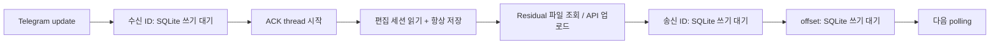

# Telegram 응답 경로의 DB 대기 제거

- 배경: 운영 basic 로그에서 Residual 요청의 수신 메시지 저장 6.58초, 불필요한 편집 세션 저장 12.08초가 확인됐다. 파일 탐색은 1ms 미만이고 이미지 API 자체는 2.76–3.08초였다.
- GitHub Issue: 앞서 지정한 사용자 요청에 따라 생략.
- 범위: Telegram adapter의 메시지 기록과 polling checkpoint. 공용 티켓·실행 정책, GUI/web의 저장 정책은 동일하게 유지한다.

## As-Is HLD / LLD



`Bot.handle → Store.remember_message → TicketChat.handle/load/persist → dispatch/file → Store.remember_message`; `serve`는 각 update 뒤 `Store.put(telegram_offset)`을 호출한다. 계산 worker·monitor와 같은 SQLite writer를 경쟁한다.

## To-Be HLD / LLD

```mermaid
flowchart LR
  U[인증된 update] --> A[ACK thread 즉시 시작]
  A --> J[수신 ID 로컬 journal]
  J --> E[편집 세션: 실제 이탈 때만 저장]
  E --> F[Residual 파일 조회 / API 업로드]
  F --> R[송신 ID + 처리 offset journal]
  R --> P[메모리 offset으로 다음 polling]
  J -.-> W[단일 background writer]
  R -.-> W
  W --> B[ID 일괄 upsert + chat별 prune + offset 한 transaction]
  B --> D[(기존 SQLite)]
  C[/clean] --> X[writer 동기화 / pending 반영]
  X --> Y[기존 일괄 삭제 / 기록 정리]
```

- `TelegramReceipts`는 메시지 ID·시간과 offset만 소유자 전용 JSON journal에 atomic replace한다. DB flush 중 mutex를 잡지 않아 요청 기록이 SQLite 대기에 종속되지 않는다. journal 기록 오류는 숨기지 않는다.
- writer는 50ms 병합 후 기존 Store의 batch API로 저장한다. 실패하면 journal을 유지하고 재시도한다. 재시작 시 journal을 재생한다. DB 성공 뒤 journal 정리 전에 종료되어도 upsert와 단조 증가 offset으로 중복 재생이 안전하다.
- `/clean`은 writer와 같은 flush lock을 획득하고 기존 pending을 먼저 저장한 뒤 조회·일괄 삭제한다. 삭제한 기록이 지연 flush로 부활하지 않는다. 삭제 중 새로 보낸 메시지는 다음 삭제 대상이다.
- polling은 journal까지 기록된 처리 offset을 사용한다. 알림 outbox의 선기록·전송 checkpoint·재시도는 기존 transaction 경계를 유지한다.
- `TicketChat`은 빈 세션/이미 away인 세션에 대해 쓰지 않는다. 실제 편집 화면에서 이탈하면 pending을 취소하고 저장해 후속 대화를 필드 입력으로 처리하지 않는다.
- 기존 진단 로거 basic 모드에 receipt 기록·batch flush·실패 경계를 추가한다. 내용/인증 값은 기록하지 않는다.

## 호환성과 검증 계획

DB schema와 ticket JSON 변경 없음. 기존 직접 Bot 사용은 동기 Store를 기본으로 사용하고 daemon은 명시적으로 receipt writer를 주입한다. GUI/web은 Telegram 메시지·offset을 사용하지 않으므로 UI 변경 없음.

잠긴 임시 SQLite에서 fake Telegram Residual 전송이 완료되는지, ACK 선행, 비편집 세션의 무변경, 편집 이탈, 실패 후 재시도·journal 복구, batch 원자성·offset 단조 증가와 `/clean`을 확인한다. 실제 Telegram 전송/OpenFOAM 실행 없이 검증하고 service를 재시작한다. API 업로드 시간은 별도이며 운영 개선 수치는 이후 실제 요청 로그로 확인한다.

## 검증 결과

- 신규 10개: 실제 SQLite writer lock 동안 Residual fake API 전송·polling checkpoint 완료, ACK 선행, 세션 무변경/실제 이탈, 실패 후 재시작 복구, `/clean`의 pending 반영·삭제 중 새 메시지 보존·실패 시 보존, batch rollback/보존 개수, journal 실패 시 offset 유지, basic 로그의 queued/committed 추적 통과.
- `compileall`, 운영 config `check` 통과. 변경 SVG 29개 XML parse 및 Residual·clean·architecture 렌더 확인.
- 전체 392개: 389 통과, GUI display 미제공으로 1 skip, 기존 삭제 테스트 2개 실패. 최초 sandbox가 localhost socket을 차단한 웹 20개는 허용 환경에서 재실행하여 모두 통과했다.
- 기존 실패: `test_bulk_selection_survives_pagination_and_deletes_only_confirmed_files`는 이전 `총 2개` 문구를 기대한다. `test_bulk_cancel_and_busy_ticket_keep_all_files`는 실제 작업 없이 JSON `queue.state=running`만으로 삭제 보호를 기대한다. 둘 다 앞선 티켓 삭제 정책 변경 이후의 기존 불일치이며 이번 요청 경로 변경으로 발생한 실패가 아니다.
- 테스트에는 실제 Telegram 전송이나 OpenFOAM 계산을 사용하지 않았다. 기존 로그에서 추정한 약 3초 응답은 API 시간이 같다는 조건의 예상치이며, 적용 후 사용자 요청의 실측 수치가 아니다.
- 운영 `cfd-bot.service` 재시작 후 `active/running`, `ExecMainStatus=0`, `KillMode=process`를 확인했다. 새 basic 로그에서 polling 반복, receipt writer 초기 flush, monitor tick이 정상 반환했고 확인 구간의 경고/예외는 없었다. 자동 테스트 메시지는 보내지 않았다.
