# 공용 도메인 LLD — 함수 요청·응답 상세

[유즈케이스 그림](flows.md)에서 연결되는 공용 내부 시퀀스다. 각 함수의 타입·예외·저장 효과는 [LLD 계약](../LLD.md)에 정리했다. 실제 외부 ofps 실행과 Telegram API 호출은 플랫폼 그림에서도 생략하지 않는다.

내부 반복·파일 접근·잠금 범위는 [catalog LLD](../LLD.md#catalog), 현재 921행 매크로의 함수별 시간과 큐 응답량은 [운영 데이터 분석](../analysis/live-bottlenecks.md)에 있다. 그림의 보라색 loop는 함수 내부 반복이며 추가 함수가 아니다.

## 그림 바로가기

- [D-01 — 공용 티켓 색인 · 변경된 JSON 검증](#d-01)
- [D-02 — 저장·revision·원자적 파일 반영](#d-02)
- [D-03 — 공용 실행 요청](#d-03)
- [D-04 — fresh snapshot과 lock 대기](#d-04)
- [D-05 — 삭제 preview와 최종 삭제](#d-05)
- [D-06 — 직계 하위 케이스 검색](#d-06)
- [D-07 — 로그·진행률·ETA](#d-07)
- [D-08 — 다중 대기 취소](#d-08)
- [D-09 — 매크로 발행·멤버 재구성](#d-09)
- [D-10 — 선언된 artifact 찾기](#d-10)
- [D-11 — 폼 변환과 티켓 검증](#d-11)
- [D-12 — 수치 기반 종료 판정](#d-12)
- [D-13 — 큐 전체 ETA 조회 · 대량 응답 생성](#d-13)
- [D-14 — 매크로 진행 ETA · 큐 본문과 중복 조회](#d-14)
- [D-15 — 증분 상태 반영 · 종료 child와 부모 macro 재시도](#d-15)
- [D-16 — 실행 중 managed 작업 안전 중단](#d-16)

## D-01 — 공용 티켓 색인 · 변경된 JSON 검증

진입: `cases_for / tickets_for / ticket_index`.

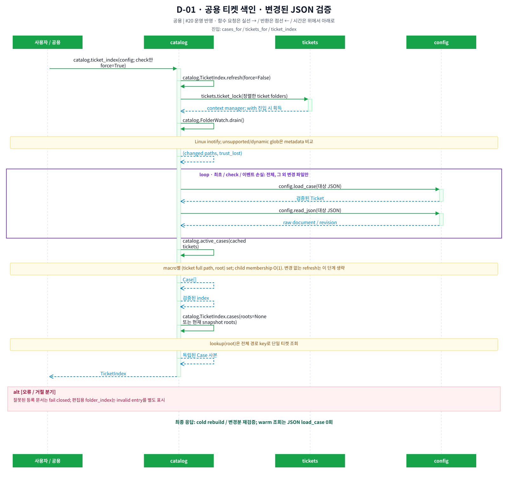

[SVG 원본 확대](../diagrams/D-01.svg)

**정상 결과:** cold rebuild / 변경분 재검증; warm 조회는 JSON load_case 0회.
**실패/취소:** 잘못된 등록 문서는 fail closed; 편집용 folder_index는 invalid entry를 별도 표시.

**내부 로직·비용:** 정규화된 전체 경로의 공용 색인을 사용한다. 최초·check·변경 감지 손실은 전역 검증하고, 이후 변경 JSON만 재검증한다. macro membership은 set 조회다. [반복 횟수·예외·개선 조건](../LLD.md#catalog).

**코드 연결:** [catalog.ticket_index](../../cfd_bot/catalog.py#L280), [catalog.TicketIndex.refresh](../../cfd_bot/catalog.py#L133), [tickets.ticket_lock](../../cfd_bot/tickets.py#L29), [catalog.FolderWatch.drain](../../cfd_bot/catalog.py#L50), [config.load_case](../../cfd_bot/config.py#L114), [config.read_json](../../cfd_bot/config.py#L23), [catalog.active_cases](../../cfd_bot/catalog.py#L77), [catalog.TicketIndex.cases](../../cfd_bot/catalog.py#L239).

**관련 검증:** [test_core.py](../../tests/test_core.py), [test_queue_tickets.py](../../tests/test_queue_tickets.py), [test_scripts.py](../../tests/test_scripts.py).

## D-02 — 저장·revision·원자적 파일 반영

진입: `TicketService.save(values, ...)`.

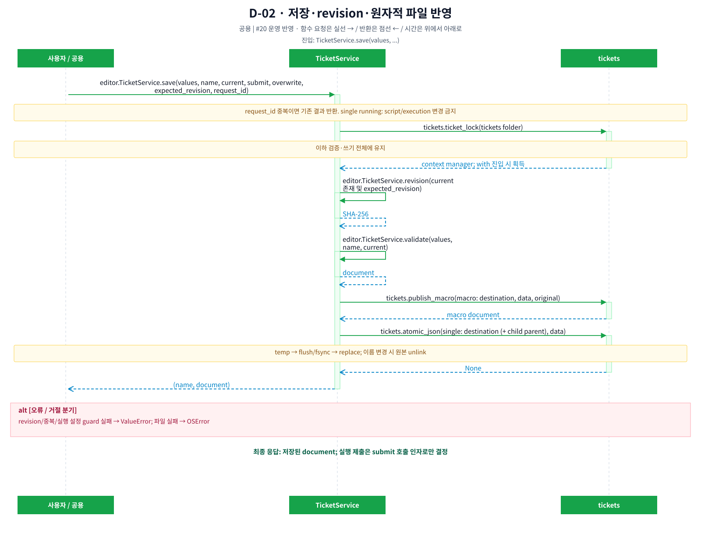

[SVG 원본 확대](../diagrams/D-02.svg)

**정상 결과:** 저장된 document; 실행 제출은 submit 호출 인자로만 결정.
**실패/취소:** revision/중복/실행 설정 guard 실패 → ValueError; 파일 실패 → OSError.

**코드 연결:** [editor.TicketService.save](../../cfd_bot/editor.py#L349), [tickets.ticket_lock](../../cfd_bot/tickets.py#L29), [editor.TicketService.revision](../../cfd_bot/editor.py#L275), [editor.TicketService.validate](../../cfd_bot/editor.py#L325), [tickets.publish_macro](../../cfd_bot/tickets.py#L198), [tickets.atomic_json](../../cfd_bot/tickets.py#L47).

**관련 검증:** [test_core.py](../../tests/test_core.py), [test_queue_tickets.py](../../tests/test_queue_tickets.py), [test_scripts.py](../../tests/test_scripts.py).

## D-03 — 공용 실행 요청

진입: `TicketRunner.request(name, revision, request_id, mode)`.

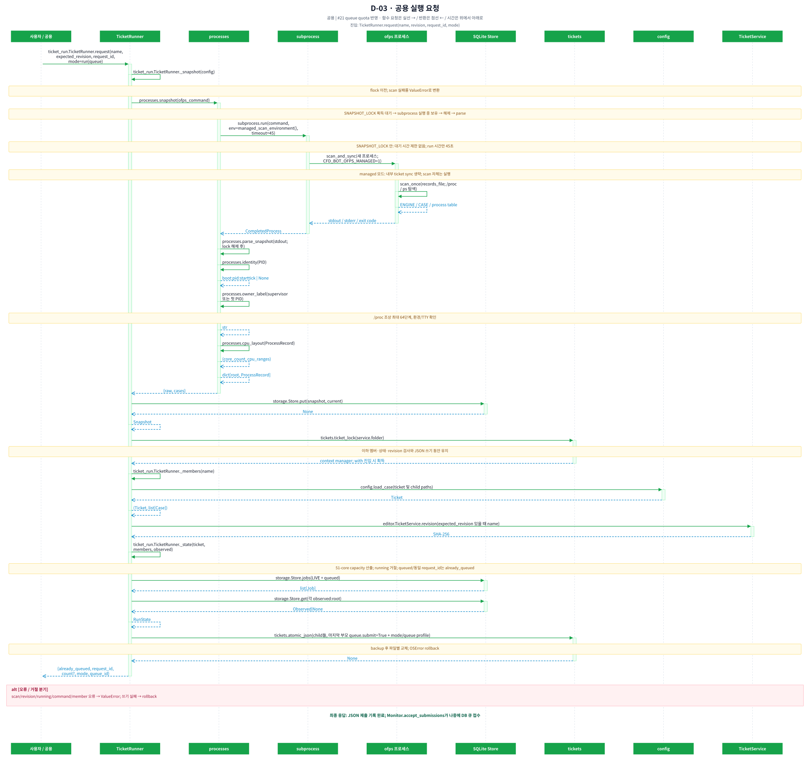

[SVG 원본 확대](../diagrams/D-03.svg)

**정상 결과:** 동적 macro는 첫 child가 가용하면 즉시 제출; Monitor.accept_submissions가 나중에 DB 큐 접수.
**실패/취소:** scan/revision/running/command/member 오류 또는 child 최대 NP가 관리 한도 초과 → ValueError; 쓰기 실패 → rollback.

**코드 연결:** [ticket_run.TicketRunner.request](../../cfd_bot/ticket_run.py#L162), [ticket_run.TicketRunner._snapshot](../../cfd_bot/ticket_run.py#L21), [processes.snapshot](../../cfd_bot/processes.py#L179), [processes.parse_snapshot](../../cfd_bot/processes.py#L140), [processes.identity](../../cfd_bot/processes.py#L22), [processes.owner_label](../../cfd_bot/processes.py#L71), [processes.cpu_layout](../../cfd_bot/processes.py#L112), [storage.Store.put](../../cfd_bot/storage.py#L137), [tickets.ticket_lock](../../cfd_bot/tickets.py#L29), [ticket_run.TicketRunner._members](../../cfd_bot/ticket_run.py#L29), [config.load_case](../../cfd_bot/config.py#L114), [editor.TicketService.revision](../../cfd_bot/editor.py#L275), [ticket_run.TicketRunner._state](../../cfd_bot/ticket_run.py#L91), [storage.Store.jobs](../../cfd_bot/storage.py#L148), [storage.Store.get](../../cfd_bot/storage.py#L116), [ticket_run.TicketRunner._capacity](../../cfd_bot/ticket_run.py#L48), [tickets.atomic_json](../../cfd_bot/tickets.py#L47).

**관련 검증:** [test_core.py](../../tests/test_core.py), [test_queue_tickets.py](../../tests/test_queue_tickets.py), [test_scripts.py](../../tests/test_scripts.py).

## D-04 — fresh snapshot과 lock 대기

진입: `processes.snapshot(command)`.

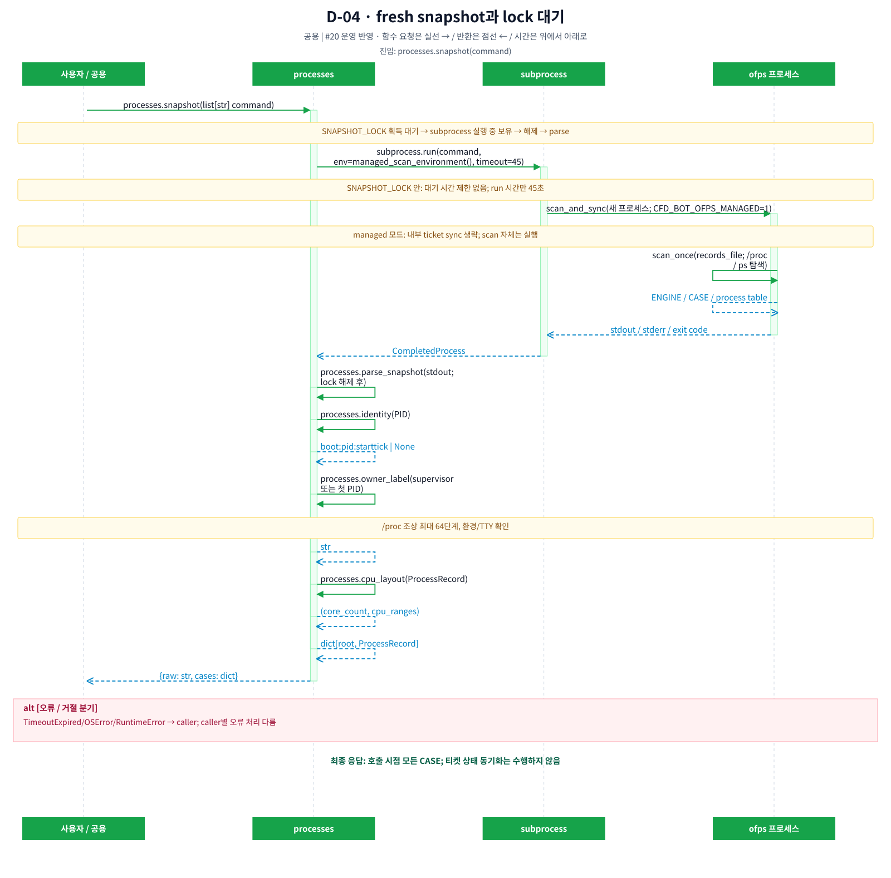

[SVG 원본 확대](../diagrams/D-04.svg)

**정상 결과:** 호출 시점 모든 CASE; 티켓 상태 동기화는 수행하지 않음.
**실패/취소:** TimeoutExpired/OSError/RuntimeError → caller; caller별 오류 처리 다름.

**코드 연결:** [processes.snapshot](../../cfd_bot/processes.py#L179), [processes.parse_snapshot](../../cfd_bot/processes.py#L140), [processes.identity](../../cfd_bot/processes.py#L22), [processes.owner_label](../../cfd_bot/processes.py#L71), [processes.cpu_layout](../../cfd_bot/processes.py#L112).

**관련 검증:** [test_core.py](../../tests/test_core.py), [test_queue_tickets.py](../../tests/test_queue_tickets.py), [test_scripts.py](../../tests/test_scripts.py).

## D-05 — 삭제 preview와 최종 삭제

진입: `deletion_preview → 사용자 확인 → delete_many`.

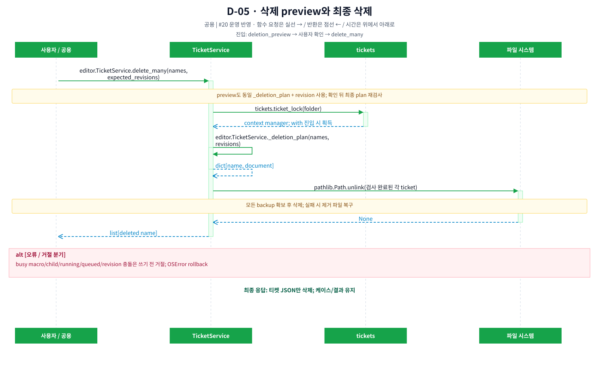

[SVG 원본 확대](../diagrams/D-05.svg)

**정상 결과:** 티켓 JSON만 삭제; 케이스/결과 유지.
**실패/취소:** busy macro/child/running/queued/revision 충돌은 쓰기 전 거절; OSError rollback.

**코드 연결:** [editor.TicketService.delete_many](../../cfd_bot/editor.py#L454), [tickets.ticket_lock](../../cfd_bot/tickets.py#L29), [editor.TicketService._deletion_plan](../../cfd_bot/editor.py#L413).

**관련 검증:** [test_core.py](../../tests/test_core.py), [test_queue_tickets.py](../../tests/test_queue_tickets.py), [test_scripts.py](../../tests/test_scripts.py).

## D-06 — 직계 하위 케이스 검색

진입: `discover_cases(root, observed, end, include, exclude)`.

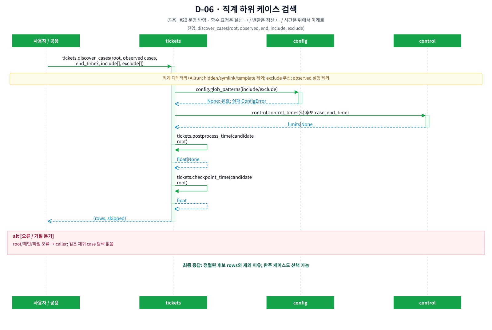

[SVG 원본 확대](../diagrams/D-06.svg)

**정상 결과:** 정렬된 후보 rows와 제외 이유; 완주 케이스도 선택 가능.
**실패/취소:** root/패턴/파일 오류 → caller; 깊은 재귀 case 탐색 없음.

**코드 연결:** [tickets.discover_cases](../../cfd_bot/tickets.py#L149), [config.glob_patterns](../../cfd_bot/config.py#L76), [control.control_times](../../cfd_bot/control.py#L78), [tickets.postprocess_time](../../cfd_bot/tickets.py#L111), [tickets.checkpoint_time](../../cfd_bot/tickets.py#L93).

**관련 검증:** [test_core.py](../../tests/test_core.py), [test_queue_tickets.py](../../tests/test_queue_tickets.py), [test_scripts.py](../../tests/test_scripts.py).

## D-07 — 로그·진행률·ETA

진입: `recent_case_log / estimate`.

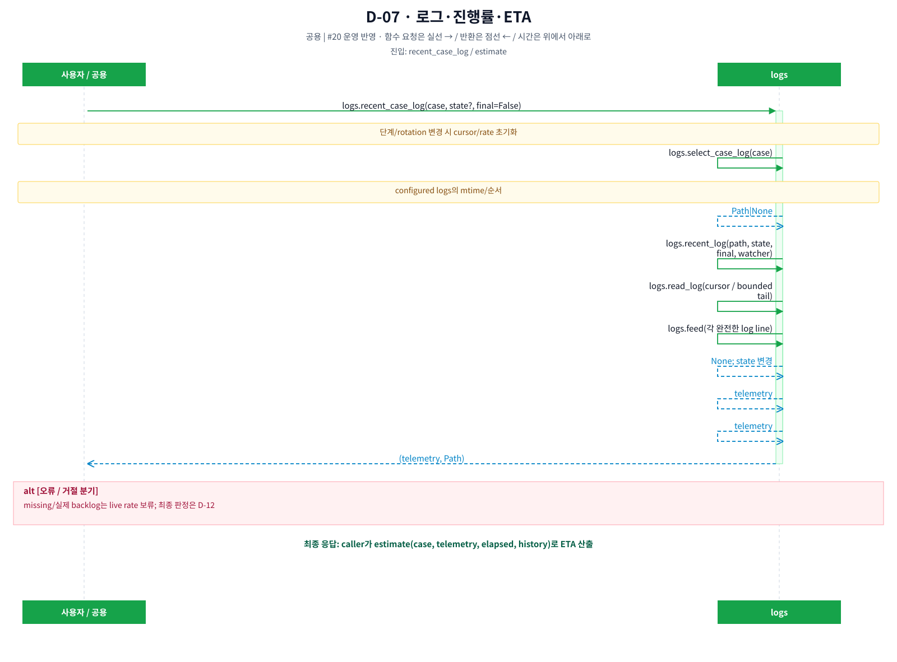

[SVG 원본 확대](../diagrams/D-07.svg)

**정상 결과:** caller가 estimate(case, telemetry, elapsed, history)로 ETA 산출.
**실패/취소:** missing/실제 backlog는 live rate 보류; 최종 판정은 D-12.

**코드 연결:** [logs.recent_case_log](../../cfd_bot/logs.py#L216), [logs.select_case_log](../../cfd_bot/logs.py#L198), [logs.recent_log](../../cfd_bot/logs.py#L162), [logs.read_log](../../cfd_bot/logs.py#L120), [logs.feed](../../cfd_bot/logs.py#L40).

**관련 검증:** [test_core.py](../../tests/test_core.py), [test_queue_tickets.py](../../tests/test_queue_tickets.py), [test_scripts.py](../../tests/test_scripts.py).

## D-08 — 다중 대기 취소

진입: `cancel_queued_jobs(store, ids)`.

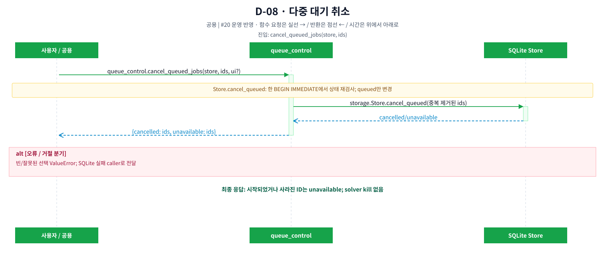

[SVG 원본 확대](../diagrams/D-08.svg)

**정상 결과:** 시작되었거나 사라진 ID는 unavailable; solver kill 없음.
**실패/취소:** 빈/잘못된 선택 ValueError; SQLite 실패 caller로 전달.

**코드 연결:** [queue_control.cancel_queued_jobs](../../cfd_bot/queue_control.py#L11), [storage.Store.cancel_queued](../../cfd_bot/storage.py#L336).

**관련 검증:** [test_core.py](../../tests/test_core.py), [test_queue_tickets.py](../../tests/test_queue_tickets.py), [test_scripts.py](../../tests/test_scripts.py).

## D-09 — 매크로 발행·멤버 재구성

진입: `publish_macro(path, data, previous, submit)`.

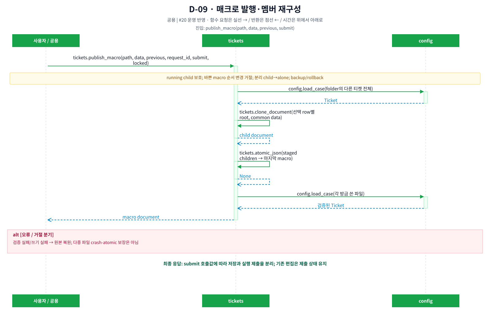

[SVG 원본 확대](../diagrams/D-09.svg)

**정상 결과:** submit 호출값에 따라 저장과 실행 제출을 분리; 기존 편집은 제출 상태 유지.
**실패/취소:** 검증 실패/쓰기 실패 → 원본 복원; 다중 파일 crash-atomic 보장은 아님.

**코드 연결:** [tickets.publish_macro](../../cfd_bot/tickets.py#L198), [config.load_case](../../cfd_bot/config.py#L114), [tickets.clone_document](../../cfd_bot/tickets.py#L75), [tickets.atomic_json](../../cfd_bot/tickets.py#L47).

**관련 검증:** [test_core.py](../../tests/test_core.py), [test_queue_tickets.py](../../tests/test_queue_tickets.py), [test_scripts.py](../../tests/test_scripts.py).

## D-10 — 선언된 artifact 찾기

진입: `residual_files / export_files`.

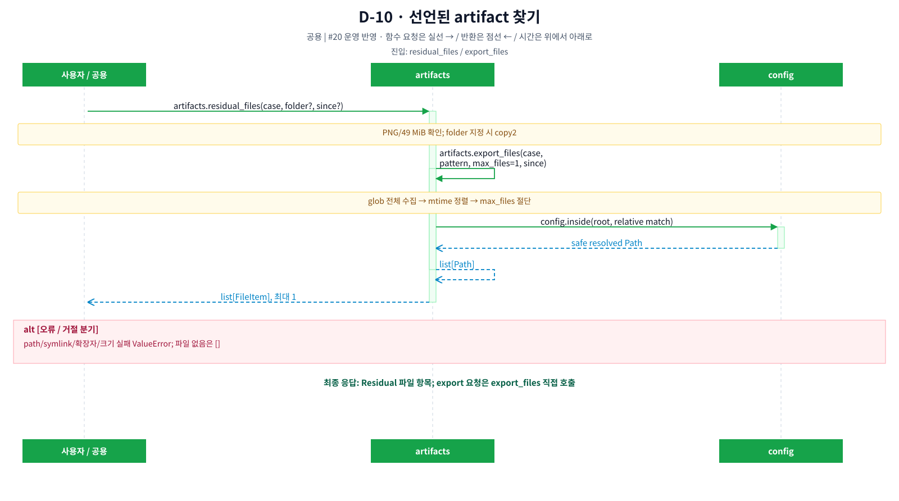

[SVG 원본 확대](../diagrams/D-10.svg)

**정상 결과:** Residual 파일 항목; export 요청은 export_files 직접 호출.
**실패/취소:** path/symlink/확장자/크기 실패 ValueError; 파일 없음은 [].

**코드 연결:** [artifacts.residual_files](../../cfd_bot/artifacts.py#L58), [artifacts.export_files](../../cfd_bot/artifacts.py#L13), [config.inside](../../cfd_bot/config.py#L89).

**관련 검증:** [test_core.py](../../tests/test_core.py), [test_queue_tickets.py](../../tests/test_queue_tickets.py), [test_scripts.py](../../tests/test_scripts.py).

## D-11 — 폼 변환과 티켓 검증

진입: `TicketService.validate(values, name, current)`.

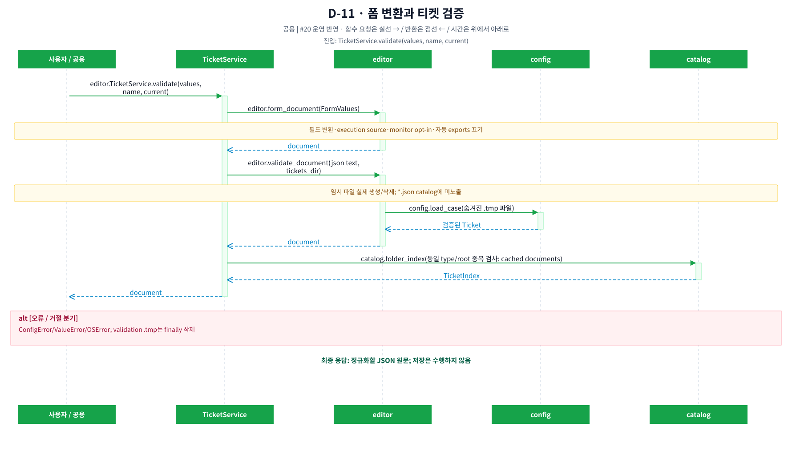

[SVG 원본 확대](../diagrams/D-11.svg)

**정상 결과:** 정규화할 JSON 원문; 저장은 수행하지 않음.
**실패/취소:** ConfigError/ValueError/OSError; validation .tmp는 finally 삭제.

**코드 연결:** [editor.TicketService.validate](../../cfd_bot/editor.py#L325), [editor.form_document](../../cfd_bot/editor.py#L108), [editor.validate_document](../../cfd_bot/editor.py#L221), [config.load_case](../../cfd_bot/config.py#L114), [catalog.folder_index](../../cfd_bot/catalog.py#L285).

**관련 검증:** [test_core.py](../../tests/test_core.py), [test_queue_tickets.py](../../tests/test_queue_tickets.py), [test_scripts.py](../../tests/test_scripts.py).

## D-12 — 수치 기반 종료 판정

진입: `outcomes.decide(case, telemetry, started, ...)`.

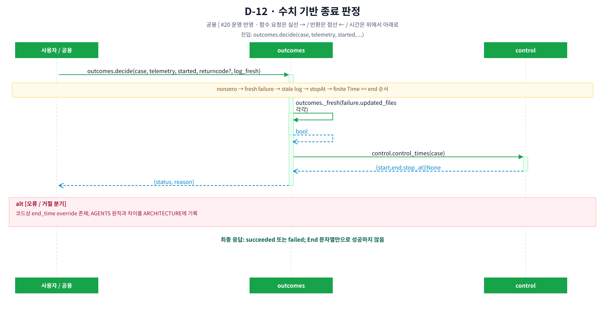

[SVG 원본 확대](../diagrams/D-12.svg)

**정상 결과:** succeeded 또는 failed; End 문자열만으로 성공하지 않음.
**실패/취소:** 코드상 end_time override 존재; AGENTS 원칙과 차이를 ARCHITECTURE에 기록.

**코드 연결:** [outcomes.decide](../../cfd_bot/outcomes.py#L23), [outcomes._fresh](../../cfd_bot/outcomes.py#L15), [control.control_times](../../cfd_bot/control.py#L78).

**관련 검증:** [test_core.py](../../tests/test_core.py), [test_queue_tickets.py](../../tests/test_queue_tickets.py), [test_scripts.py](../../tests/test_scripts.py).

## D-13 — 큐 전체 ETA 조회 · 대량 응답 생성

진입: `report.queue_text(store, enabled)`.

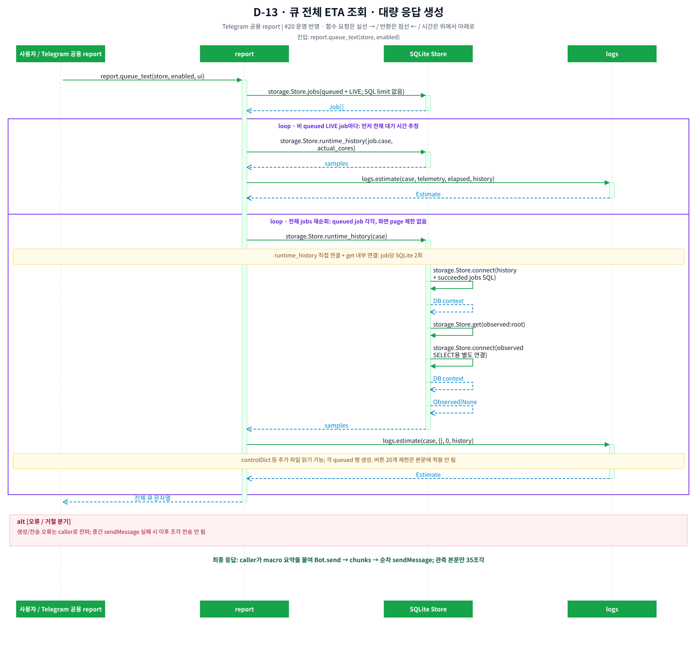

[SVG 원본 확대](../diagrams/D-13.svg)

**정상 결과:** caller가 macro 요약을 붙여 Bot.send → chunks → 순차 sendMessage; 관측 본문만 35조각.
**실패/취소:** 생성/전송 오류는 caller로 전파; 중간 sendMessage 실패 시 이후 조각 전송 안 됨.

**내부 로직·비용:** queued 전체의 history/ETA를 준비하고 본문도 전부 생성한다. 취소 버튼 20개 제한은 본문 제한이 아니다. [연결 횟수와 35개 메시지 분할 근거](../analysis/live-bottlenecks.md).

**코드 연결:** [report.queue_text](../../cfd_bot/report.py#L127), [storage.Store.jobs](../../cfd_bot/storage.py#L148), [storage.Store.runtime_history](../../cfd_bot/storage.py#L303), [logs.estimate](../../cfd_bot/logs.py#L226), [storage.Store.connect](../../cfd_bot/storage.py#L107), [storage.Store.get](../../cfd_bot/storage.py#L116).

**관련 검증:** [test_core.py](../../tests/test_core.py), [test_queue_tickets.py](../../tests/test_queue_tickets.py), [test_scripts.py](../../tests/test_scripts.py).

## D-14 — 매크로 진행 ETA · 큐 본문과 중복 조회

진입: `running_macro_views(macros,cases,jobs,store)`.

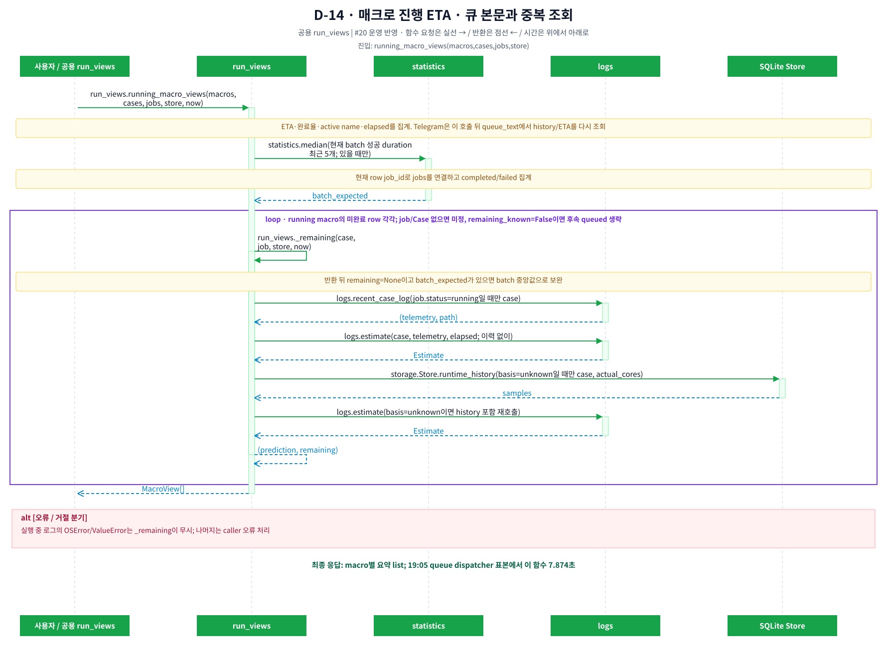

[SVG 원본 확대](../diagrams/D-14.svg)

**정상 결과:** macro별 요약 list; 19:05 queue dispatcher 표본에서 이 함수 7.874초.
**실패/취소:** 실행 중 로그의 OSError/ValueError는 _remaining이 무시; 나머지는 caller 오류 처리.

**코드 연결:** [run_views.running_macro_views](../../cfd_bot/run_views.py#L60), [run_views._remaining](../../cfd_bot/run_views.py#L41), [logs.recent_case_log](../../cfd_bot/logs.py#L216), [logs.estimate](../../cfd_bot/logs.py#L226), [storage.Store.runtime_history](../../cfd_bot/storage.py#L303).

**관련 검증:** [test_core.py](../../tests/test_core.py), [test_queue_tickets.py](../../tests/test_queue_tickets.py), [test_scripts.py](../../tests/test_scripts.py).

## D-15 — 증분 상태 반영 · 종료 child와 부모 macro 재시도

진입: `Monitor / Web / CLI / standalone ofps`.

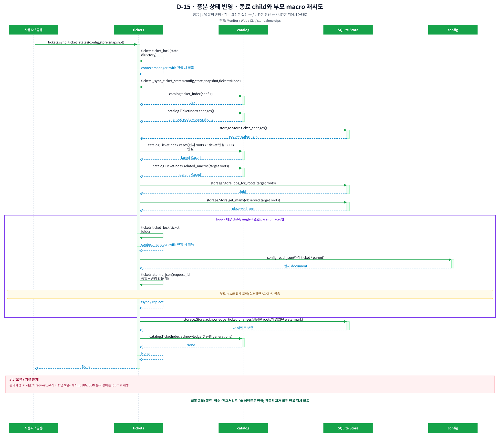

[SVG 원본 확대](../diagrams/D-15.svg)

**정상 결과:** 종료·취소·전후처리도 DB 이벤트로 반영; 완료된 과거 티켓 반복 검사 없음.
**실패/취소:** 동기화 중 새 제출의 request_id가 바뀌면 보존·재시도; DB/JSON 분리 장애는 journal 재생.

**코드 연결:** [tickets.sync_ticket_states](../../cfd_bot/tickets.py#L345), [tickets.ticket_lock](../../cfd_bot/tickets.py#L29), [tickets._sync_ticket_states](../../cfd_bot/tickets.py#L353), [catalog.ticket_index](../../cfd_bot/catalog.py#L280), [catalog.TicketIndex.changes](../../cfd_bot/catalog.py#L264), [storage.Store.ticket_changes](../../cfd_bot/storage.py#L197), [catalog.TicketIndex.cases](../../cfd_bot/catalog.py#L239), [catalog.TicketIndex.related_macros](../../cfd_bot/catalog.py#L257), [storage.Store.jobs_for_roots](../../cfd_bot/storage.py#L186), [storage.Store.get_many](../../cfd_bot/storage.py#L121), [config.read_json](../../cfd_bot/config.py#L23), [tickets.atomic_json](../../cfd_bot/tickets.py#L47), [storage.Store.acknowledge_ticket_changes](../../cfd_bot/storage.py#L201), [catalog.TicketIndex.acknowledge](../../cfd_bot/catalog.py#L268).

**관련 검증:** [test_core.py](../../tests/test_core.py), [test_queue_tickets.py](../../tests/test_queue_tickets.py), [test_scripts.py](../../tests/test_scripts.py).

## D-16 — 실행 중 managed 작업 안전 중단

진입: `interrupt_running_job(store, jid)`.

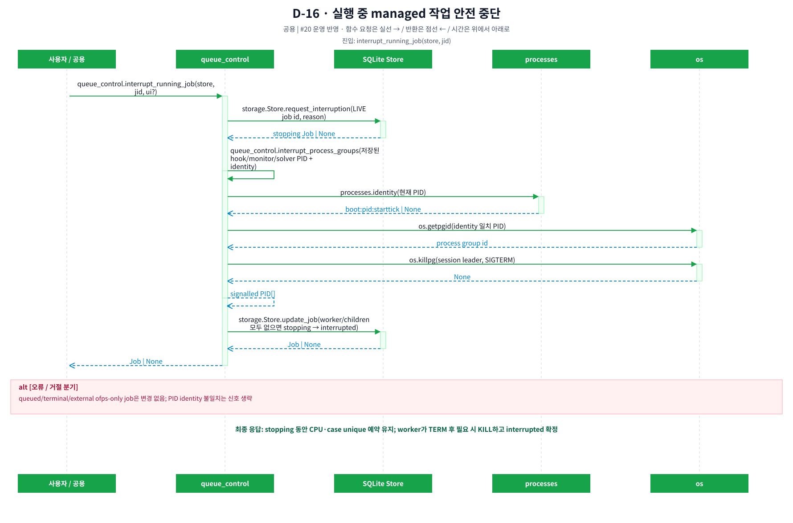

[SVG 원본 확대](../diagrams/D-16.svg)

**정상 결과:** stopping 동안 CPU·case unique 예약 유지; worker가 TERM 후 필요 시 KILL하고 interrupted 확정.
**실패/취소:** queued/terminal/external ofps-only job은 변경 없음; PID identity 불일치는 신호 생략.

**코드 연결:** [queue_control.interrupt_running_job](../../cfd_bot/queue_control.py#L44), [storage.Store.request_interruption](../../cfd_bot/storage.py#L358), [queue_control.interrupt_process_groups](../../cfd_bot/queue_control.py#L22), [processes.identity](../../cfd_bot/processes.py#L22), [storage.Store.update_job](../../cfd_bot/storage.py#L322).

**관련 검증:** [test_core.py](../../tests/test_core.py), [test_queue_tickets.py](../../tests/test_queue_tickets.py), [test_scripts.py](../../tests/test_scripts.py).
