# cfd-ticket-gui LLD — 유즈케이스별 함수 요청·응답

[전체 그림 목록](flows.md) · [공용 계약](../LLD.md)

## 진입·thread·응답 규칙

`cli.main(gui) → gui.launch → Tk → TicketEditor → root.mainloop` 또는 GUI entrypoint로 시작한다. 일반 편집·열기·검증·저장·삭제·큐 조회는 Tk main thread에서 동기 실행된다. 저장 반환 bool이 화면 전환 허용 여부를 결정한다. 파일/입력 오류는 messagebox, 일반 결과는 status/위젯에 반영한다.

`scan_cases`와 `submit`은 worker thread → Queue → `root.after(100,finish)`로 결과를 전달한다. 작업 thread에서 Tk widget을 직접 갱신하지 않는다. `poll_execution`은 1초 후 다시 예약하고 cached `TicketRunner.state`로 버튼만 갱신한다. 이는 ofps fresh scan 주기가 아니다.

전체 CASE 대시보드(UC-02), 큐 pause/resume(UC-20), Telegram clean(UC-25), 파일 preview/다운로드는 N/A다. 결과 창은 현재 티켓으로 추적 가능한 DB 작업의 파일 경로만 보여준다. macro 행 삭제는 있지만 순서 이동 버튼은 없다. 공용 서비스에 기능이 있다는 이유로 GUI 버튼이 있다고 간주하지 않는다.

| 사용자 이벤트 | 함수 |
|---|---|
| 파일 목록/선택 | refresh, open_selected, select_all_tickets, clear_ticket_selection |
| 새 초안/복제/이동/종료 | new, duplicate, confirm_switch, close |
| 필드와 실행 탭 | values, set_form, task_type_changed, update_execution_visibility, refresh_end_default |
| 파일 선택·export 편집 | choose_case, choose_logs, choose_residual, edit_item, remove_item, refresh_tables |
| 검색·멤버 제거 | scan_cases, render_case_rows, remove_case_row |
| 검증·저장·실행 | document, validate, save, submit, execution_runner, update_execution_button |
| 큐·결과 | open_queue_manager, refresh_queue_manager, open_queue_result_data |
| 대기 취소 | select_all_queue, clear_queue_selection, cancel_queue_selection |
| 템플릿 | refresh_patterns, apply_pattern, save_pattern |

실제 display 기반 테스트가 환경에서 생략되는 경우 [검증 결과](../analysis/validation.md)에 표시한다.

내부 반복·파일 접근·잠금 범위는 [catalog LLD](../LLD.md#catalog), 현재 921행 매크로의 함수별 시간과 큐 응답량은 [운영 데이터 분석](../analysis/live-bottlenecks.md)에 있다. 그림의 보라색 loop는 함수 내부 반복이며 추가 함수가 아니다.

## 그림 바로가기

- [UC-01-gui — 편집기 기동](#uc-01)
- [UC-05-gui — Residual 조회](#uc-05)
- [UC-06-gui — 결과 파일 조회](#uc-06)
- [UC-07-gui — 티켓 목록·다중 선택](#uc-07)
- [UC-08-gui — 새 티켓](#uc-08)
- [UC-09-gui — 티켓 열기](#uc-09)
- [UC-13-gui — 티켓 복제](#uc-13)
- [UC-10-gui — 기본·감시·알림·스크립트 편집](#uc-10)
- [UC-11-gui — 티켓 검증](#uc-11)
- [UC-12-gui — 저장·이름 변경](#uc-12)
- [UC-14-gui — 개별·다중 티켓 삭제](#uc-14)
- [UC-15-gui — 매크로 검색·필터](#uc-15)
- [UC-16-gui — 매크로 구성원 선택](#uc-16)
- [UC-17-gui — 실행·queue 이름·동적 macro 설정](#uc-17)
- [UC-18-gui — 즉시 실행·이름 있는 대기열 등록](#uc-18)
- [UC-19-gui — 큐·이력·매크로 진행](#uc-19)
- [UC-21-gui — 대기 작업 선택·취소](#uc-21)
- [UC-22-gui — 실패 패턴 템플릿](#uc-22)
- [UC-23-gui — 폴더·로그·Residual 선택](#uc-23)
- [UC-24-gui — 저장/폐기/취소·닫기](#uc-24)
- [UC-10-exports-gui — 요청 데이터 정의 편집](#uc-10-exports)

## UC-01-gui — 편집기 기동

진입: `Tk event → __init__`.

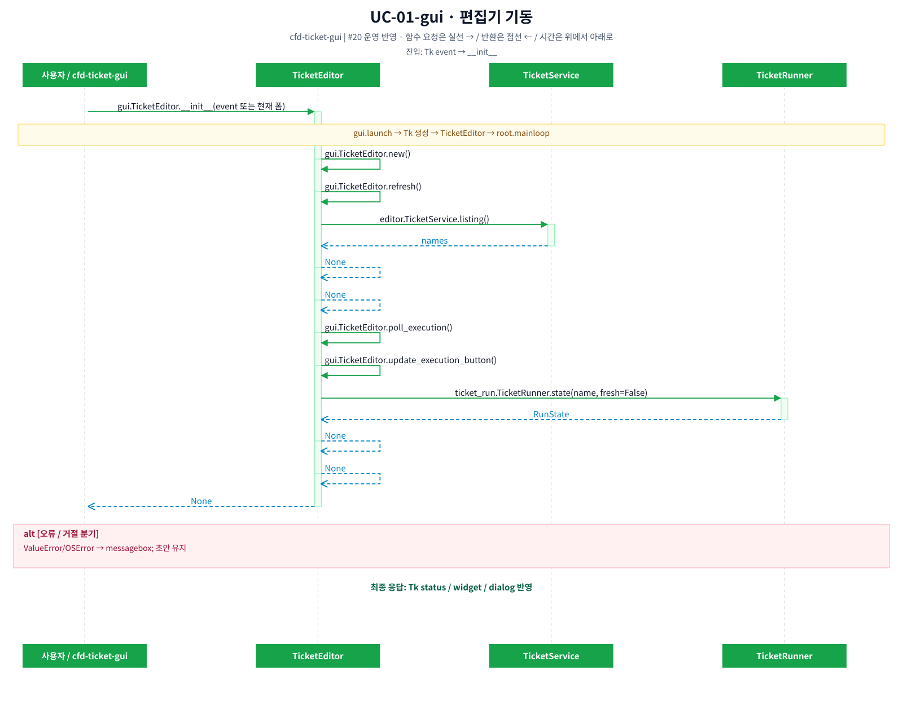

[SVG 원본 확대](../diagrams/UC-01-gui.svg)

**정상 결과:** Tk status / widget / dialog 반영.
**실패/취소:** ValueError/OSError → messagebox; 초안 유지.

**코드 연결:** [gui.TicketEditor.__init__](../../cfd_bot/gui.py#L19), [gui.TicketEditor.new](../../cfd_bot/gui.py#L728), [gui.TicketEditor.refresh](../../cfd_bot/gui.py#L710), [editor.TicketService.listing](../../cfd_bot/editor.py#L271), [gui.TicketEditor.poll_execution](../../cfd_bot/gui.py#L291), [gui.TicketEditor.update_execution_button](../../cfd_bot/gui.py#L260), [ticket_run.TicketRunner.state](../../cfd_bot/ticket_run.py#L109).

**관련 검증:** [test_ticket_chat.py](../../tests/test_ticket_chat.py), [test_gui.py](../../tests/test_gui.py), [test_web.py](../../tests/test_web.py).

## UC-05-gui — Residual 조회

진입: `Tk event → open_queue_result_data`.

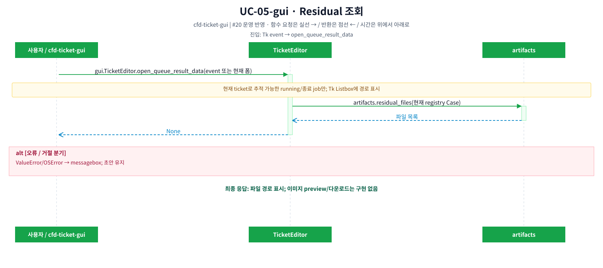

[SVG 원본 확대](../diagrams/UC-05-gui.svg)

**정상 결과:** 파일 경로 표시; 이미지 preview/다운로드는 구현 없음.
**실패/취소:** ValueError/OSError → messagebox; 초안 유지.

**코드 연결:** [gui.TicketEditor.open_queue_result_data](../../cfd_bot/gui.py#L1085), [artifacts.residual_files](../../cfd_bot/artifacts.py#L58).

**관련 검증:** [test_residual.py](../../tests/test_residual.py).

## UC-06-gui — 결과 파일 조회

진입: `Tk event → open_queue_result_data`.

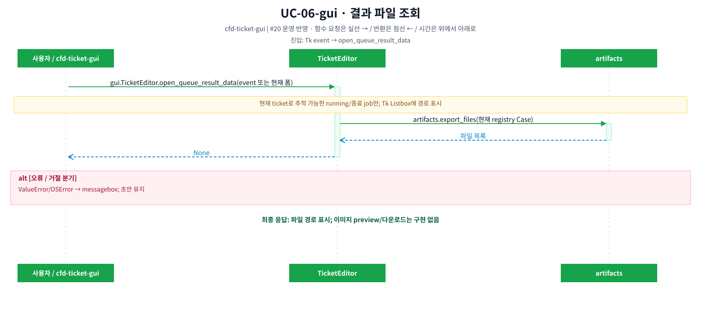

[SVG 원본 확대](../diagrams/UC-06-gui.svg)

**정상 결과:** 파일 경로 표시; 이미지 preview/다운로드는 구현 없음.
**실패/취소:** ValueError/OSError → messagebox; 초안 유지.

**코드 연결:** [gui.TicketEditor.open_queue_result_data](../../cfd_bot/gui.py#L1085), [artifacts.export_files](../../cfd_bot/artifacts.py#L13).

**관련 검증:** [test_web.py](../../tests/test_web.py), [test_core.py](../../tests/test_core.py).

## UC-07-gui — 티켓 목록·다중 선택

진입: `Tk event → refresh`.

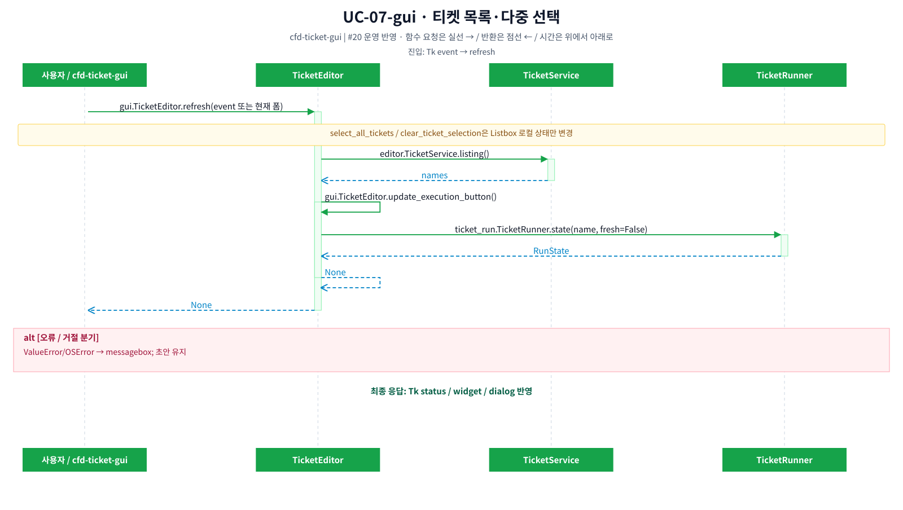

[SVG 원본 확대](../diagrams/UC-07-gui.svg)

**정상 결과:** Tk status / widget / dialog 반영.
**실패/취소:** ValueError/OSError → messagebox; 초안 유지.

**코드 연결:** [gui.TicketEditor.refresh](../../cfd_bot/gui.py#L710), [editor.TicketService.listing](../../cfd_bot/editor.py#L271), [gui.TicketEditor.update_execution_button](../../cfd_bot/gui.py#L260), [ticket_run.TicketRunner.state](../../cfd_bot/ticket_run.py#L109).

**관련 검증:** [test_ticket_chat.py](../../tests/test_ticket_chat.py), [test_gui.py](../../tests/test_gui.py), [test_web.py](../../tests/test_web.py).

## UC-08-gui — 새 티켓

진입: `Tk event → new`.

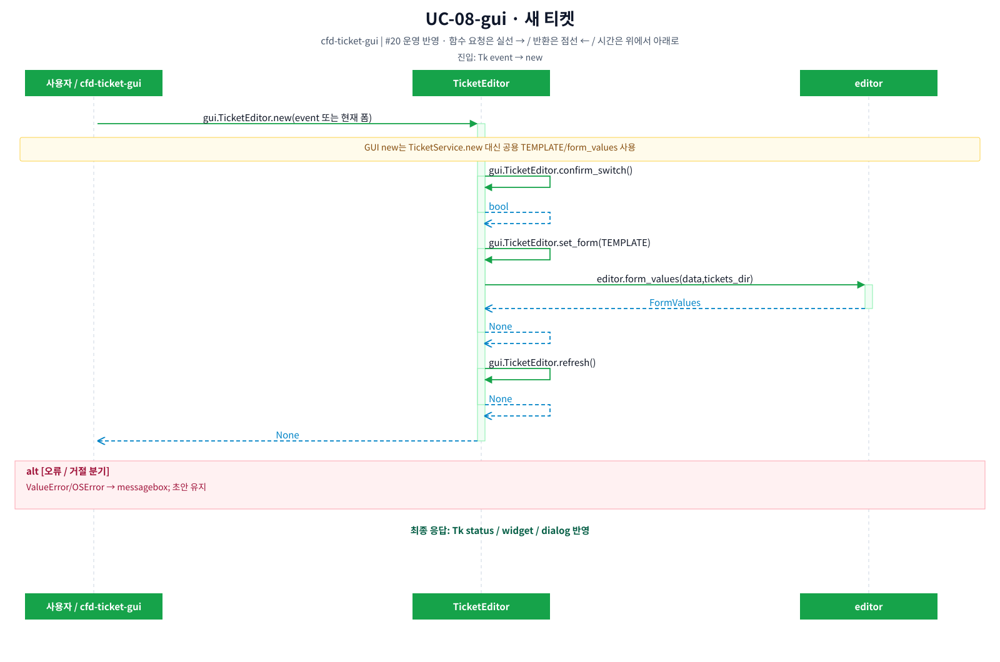

[SVG 원본 확대](../diagrams/UC-08-gui.svg)

**정상 결과:** Tk status / widget / dialog 반영.
**실패/취소:** ValueError/OSError → messagebox; 초안 유지.

**코드 연결:** [gui.TicketEditor.new](../../cfd_bot/gui.py#L728), [gui.TicketEditor.confirm_switch](../../cfd_bot/gui.py#L722), [gui.TicketEditor.set_form](../../cfd_bot/gui.py#L427), [editor.form_values](../../cfd_bot/editor.py#L50), [gui.TicketEditor.refresh](../../cfd_bot/gui.py#L710).

**관련 검증:** [test_ticket_chat.py](../../tests/test_ticket_chat.py), [test_gui.py](../../tests/test_gui.py), [test_web.py](../../tests/test_web.py).

## UC-09-gui — 티켓 열기

진입: `Tk event → open_selected`.

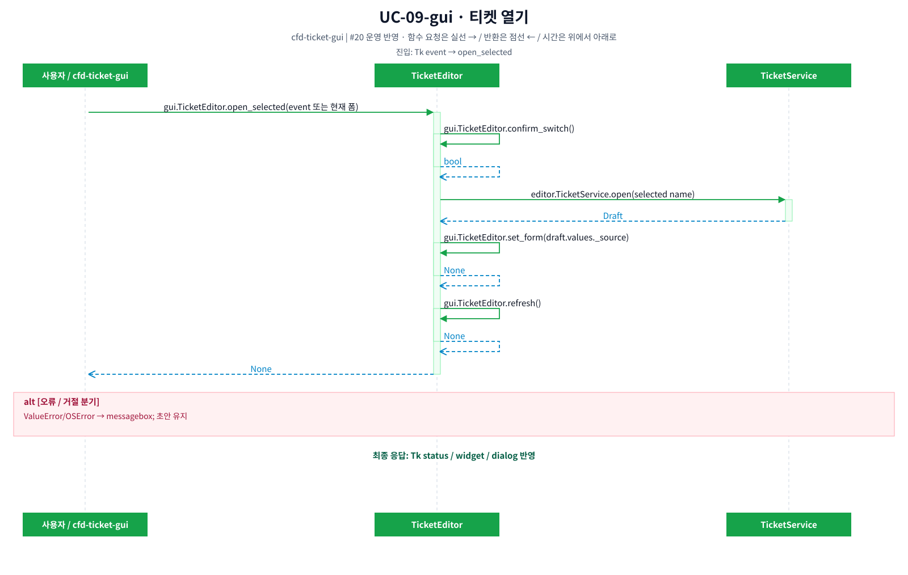

[SVG 원본 확대](../diagrams/UC-09-gui.svg)

**정상 결과:** Tk status / widget / dialog 반영.
**실패/취소:** ValueError/OSError → messagebox; 초안 유지.

**코드 연결:** [gui.TicketEditor.open_selected](../../cfd_bot/gui.py#L740), [gui.TicketEditor.confirm_switch](../../cfd_bot/gui.py#L722), [editor.TicketService.open](../../cfd_bot/editor.py#L283), [gui.TicketEditor.set_form](../../cfd_bot/gui.py#L427), [gui.TicketEditor.refresh](../../cfd_bot/gui.py#L710).

**관련 검증:** [test_ticket_chat.py](../../tests/test_ticket_chat.py), [test_gui.py](../../tests/test_gui.py), [test_web.py](../../tests/test_web.py).

## UC-13-gui — 티켓 복제

진입: `Tk event → duplicate`.

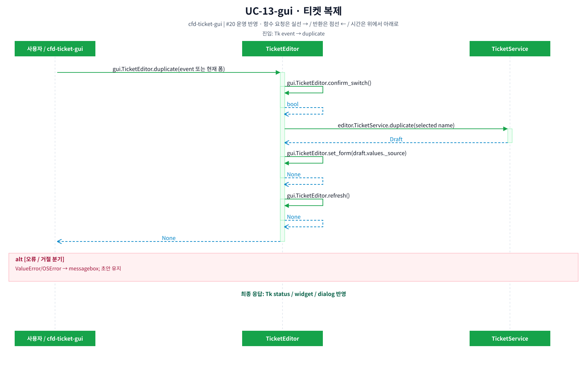

[SVG 원본 확대](../diagrams/UC-13-gui.svg)

**정상 결과:** Tk status / widget / dialog 반영.
**실패/취소:** ValueError/OSError → messagebox; 초안 유지.

**코드 연결:** [gui.TicketEditor.duplicate](../../cfd_bot/gui.py#L766), [gui.TicketEditor.confirm_switch](../../cfd_bot/gui.py#L722), [editor.TicketService.duplicate](../../cfd_bot/editor.py#L299), [gui.TicketEditor.set_form](../../cfd_bot/gui.py#L427), [gui.TicketEditor.refresh](../../cfd_bot/gui.py#L710).

**관련 검증:** [test_ticket_chat.py](../../tests/test_ticket_chat.py), [test_gui.py](../../tests/test_gui.py), [test_web.py](../../tests/test_web.py).

## UC-10-gui — 기본·감시·알림·스크립트 편집

진입: `Tk event → values`.

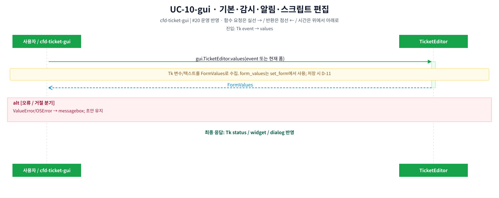

[SVG 원본 확대](../diagrams/UC-10-gui.svg)

**정상 결과:** Tk status / widget / dialog 반영.
**실패/취소:** ValueError/OSError → messagebox; 초안 유지.

**코드 연결:** [gui.TicketEditor.values](../../cfd_bot/gui.py#L412).

**관련 검증:** [test_ticket_chat.py](../../tests/test_ticket_chat.py), [test_gui.py](../../tests/test_gui.py), [test_web.py](../../tests/test_web.py).

## UC-11-gui — 티켓 검증

진입: `Tk event → validate`.

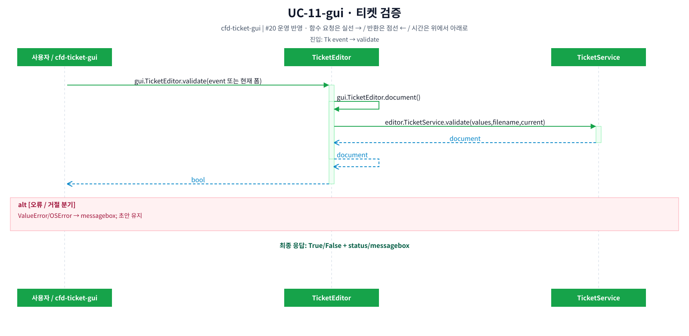

[SVG 원본 확대](../diagrams/UC-11-gui.svg)

**정상 결과:** True/False + status/messagebox.
**실패/취소:** ValueError/OSError → messagebox; 초안 유지.

**코드 연결:** [gui.TicketEditor.validate](../../cfd_bot/gui.py#L870), [gui.TicketEditor.document](../../cfd_bot/gui.py#L864), [editor.TicketService.validate](../../cfd_bot/editor.py#L325).

**관련 검증:** [test_gui.py](../../tests/test_gui.py).

## UC-12-gui — 저장·이름 변경

진입: `Tk event → save`.

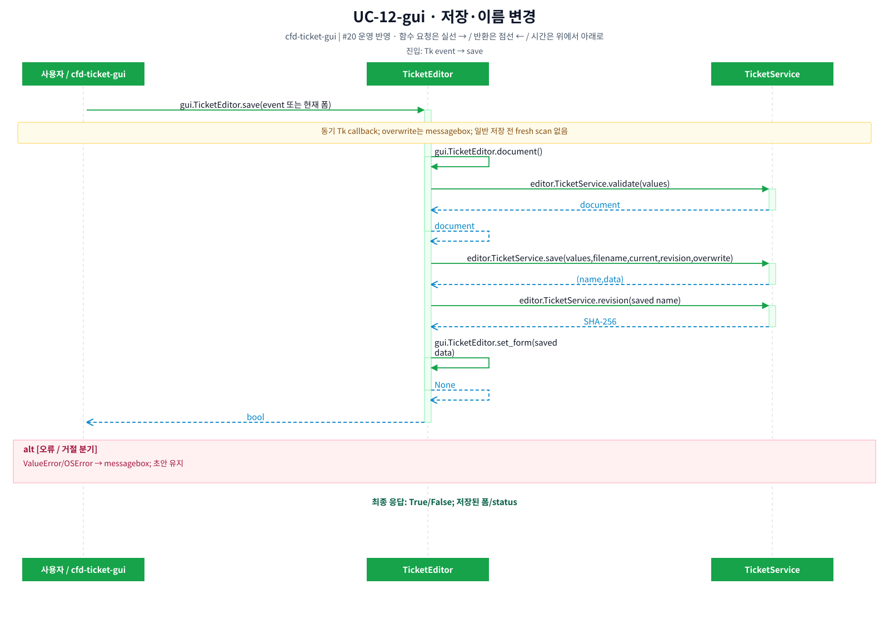

[SVG 원본 확대](../diagrams/UC-12-gui.svg)

**정상 결과:** True/False; 저장된 폼/status.
**실패/취소:** ValueError/OSError → messagebox; 초안 유지.

**코드 연결:** [gui.TicketEditor.save](../../cfd_bot/gui.py#L880), [gui.TicketEditor.document](../../cfd_bot/gui.py#L864), [editor.TicketService.validate](../../cfd_bot/editor.py#L325), [editor.TicketService.save](../../cfd_bot/editor.py#L349), [editor.TicketService.revision](../../cfd_bot/editor.py#L275), [gui.TicketEditor.set_form](../../cfd_bot/gui.py#L427).

**관련 검증:** [test_ticket_chat.py](../../tests/test_ticket_chat.py), [test_gui.py](../../tests/test_gui.py), [test_web.py](../../tests/test_web.py).

## UC-14-gui — 개별·다중 티켓 삭제

진입: `Tk event → delete`.

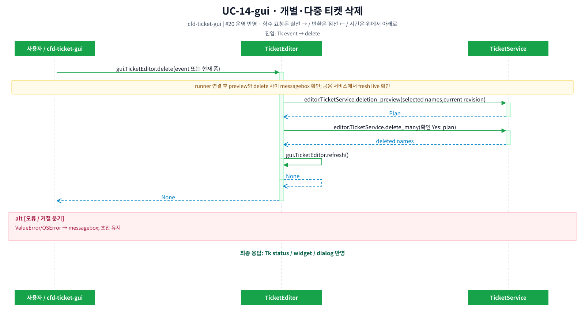

[SVG 원본 확대](../diagrams/UC-14-gui.svg)

**정상 결과:** Tk status / widget / dialog 반영.
**실패/취소:** ValueError/OSError → messagebox; 초안 유지.

**코드 연결:** [gui.TicketEditor.delete](../../cfd_bot/gui.py#L1156), [editor.TicketService.deletion_preview](../../cfd_bot/editor.py#L449), [editor.TicketService.delete_many](../../cfd_bot/editor.py#L454), [gui.TicketEditor.refresh](../../cfd_bot/gui.py#L710).

**관련 검증:** [test_ticket_chat.py](../../tests/test_ticket_chat.py).

## UC-15-gui — 매크로 검색·필터

진입: `Tk event → scan_cases`.

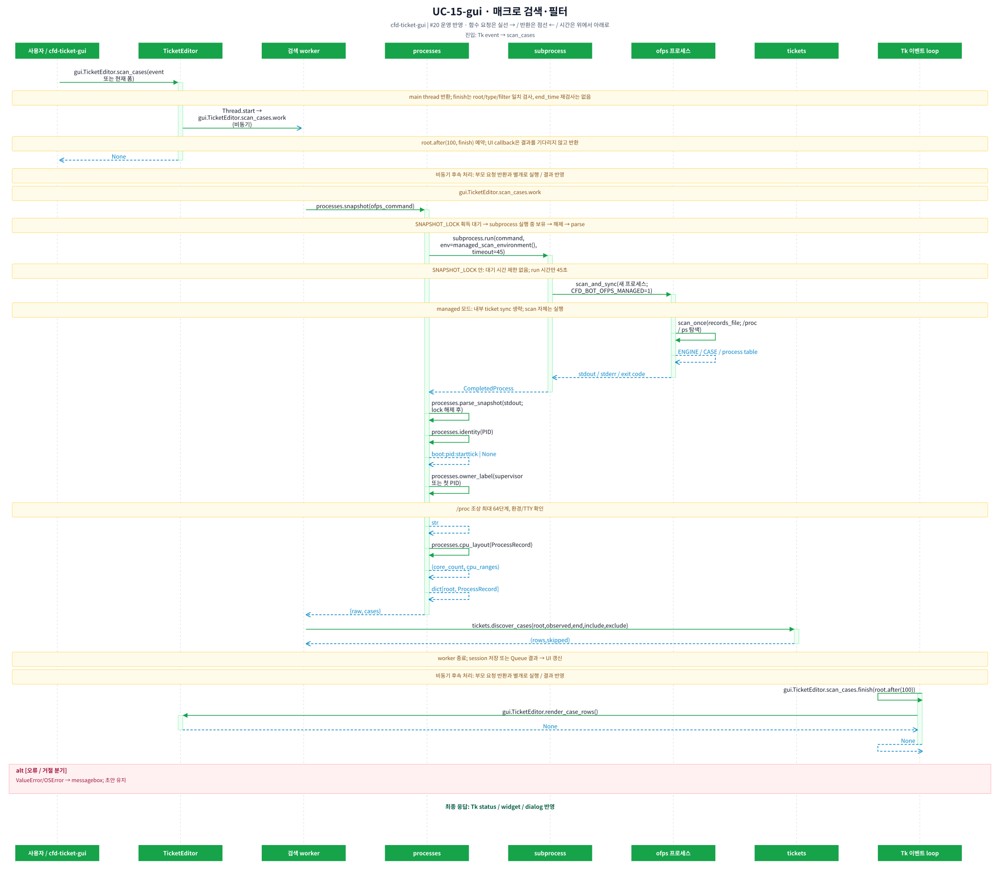

[SVG 원본 확대](../diagrams/UC-15-gui.svg)

**정상 결과:** Tk status / widget / dialog 반영.
**실패/취소:** ValueError/OSError → messagebox; 초안 유지.

**코드 연결:** [gui.TicketEditor.scan_cases](../../cfd_bot/gui.py#L545), [gui.TicketEditor.scan_cases.work](../../cfd_bot/gui.py#L576), [processes.snapshot](../../cfd_bot/processes.py#L179), [processes.parse_snapshot](../../cfd_bot/processes.py#L140), [processes.identity](../../cfd_bot/processes.py#L22), [processes.owner_label](../../cfd_bot/processes.py#L71), [processes.cpu_layout](../../cfd_bot/processes.py#L112), [tickets.discover_cases](../../cfd_bot/tickets.py#L149), [gui.TicketEditor.scan_cases.finish](../../cfd_bot/gui.py#L583), [gui.TicketEditor.render_case_rows](../../cfd_bot/gui.py#L510).

**관련 검증:** [test_queue_tickets.py](../../tests/test_queue_tickets.py).

## UC-16-gui — 매크로 구성원 선택

진입: `Tk event → remove_case_row`.

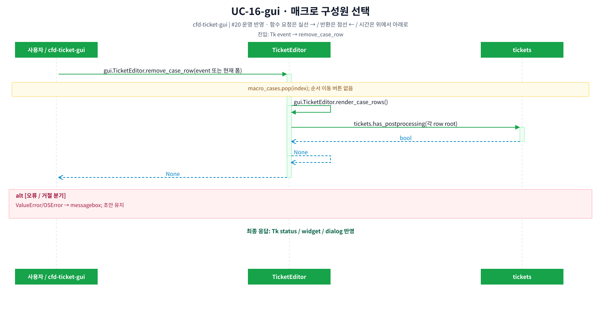

[SVG 원본 확대](../diagrams/UC-16-gui.svg)

**정상 결과:** Tk status / widget / dialog 반영.
**실패/취소:** ValueError/OSError → messagebox; 초안 유지.

**코드 연결:** [gui.TicketEditor.remove_case_row](../../cfd_bot/gui.py#L534), [gui.TicketEditor.render_case_rows](../../cfd_bot/gui.py#L510), [tickets.has_postprocessing](../../cfd_bot/tickets.py#L107).

**관련 검증:** [test_queue_tickets.py](../../tests/test_queue_tickets.py).

## UC-17-gui — 실행·queue 이름·동적 macro 설정

진입: `Tk event → update_execution_visibility`.

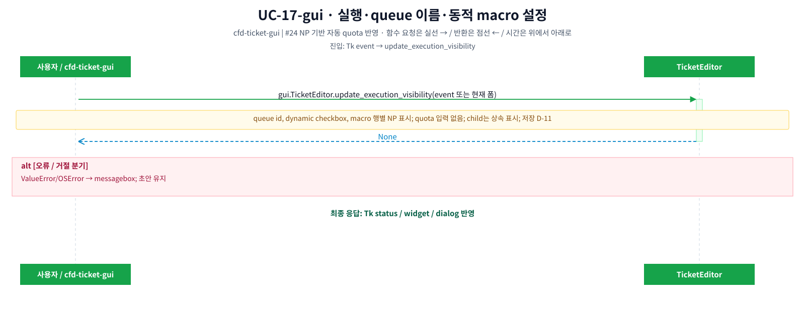

[SVG 원본 확대](../diagrams/UC-17-gui.svg)

**정상 결과:** Tk status / widget / dialog 반영.
**실패/취소:** ValueError/OSError → messagebox; 초안 유지.

**코드 연결:** [gui.TicketEditor.update_execution_visibility](../../cfd_bot/gui.py#L463).

**관련 검증:** [test_execution_environment.py](../../tests/test_execution_environment.py), [test_gui.py](../../tests/test_gui.py), [test_named_queues.py](../../tests/test_named_queues.py).

## UC-18-gui — 즉시 실행·이름 있는 대기열 등록

진입: `Tk event → submit / enqueue`.

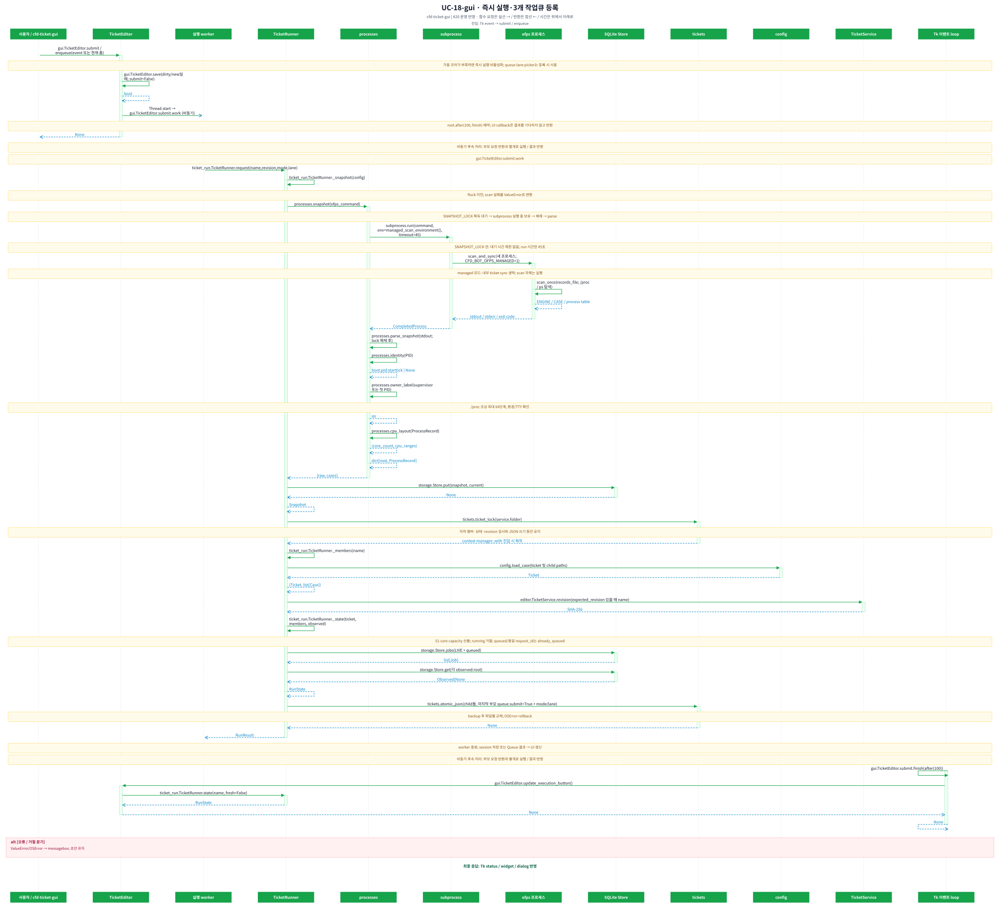

[SVG 원본 확대](../diagrams/UC-18-gui.svg)

**정상 결과:** Tk status / widget / dialog 반영.
**실패/취소:** ValueError/OSError → messagebox; 초안 유지.

**코드 연결:** [gui.TicketEditor.save](../../cfd_bot/gui.py#L880), [gui.TicketEditor.submit.work](../../cfd_bot/gui.py#L928), [ticket_run.TicketRunner.request](../../cfd_bot/ticket_run.py#L148), [ticket_run.TicketRunner._snapshot](../../cfd_bot/ticket_run.py#L21), [processes.snapshot](../../cfd_bot/processes.py#L179), [processes.parse_snapshot](../../cfd_bot/processes.py#L140), [processes.identity](../../cfd_bot/processes.py#L22), [processes.owner_label](../../cfd_bot/processes.py#L71), [processes.cpu_layout](../../cfd_bot/processes.py#L112), [storage.Store.put](../../cfd_bot/storage.py#L127), [tickets.ticket_lock](../../cfd_bot/tickets.py#L29), [ticket_run.TicketRunner._members](../../cfd_bot/ticket_run.py#L29), [config.load_case](../../cfd_bot/config.py#L114), [editor.TicketService.revision](../../cfd_bot/editor.py#L275), [ticket_run.TicketRunner._state](../../cfd_bot/ticket_run.py#L77), [storage.Store.jobs](../../cfd_bot/storage.py#L138), [storage.Store.get](../../cfd_bot/storage.py#L106), [tickets.atomic_json](../../cfd_bot/tickets.py#L47), [gui.TicketEditor.submit.finish](../../cfd_bot/gui.py#L933), [gui.TicketEditor.update_execution_button](../../cfd_bot/gui.py#L260), [ticket_run.TicketRunner.state](../../cfd_bot/ticket_run.py#L109).

**관련 검증:** [test_ticket_run.py](../../tests/test_ticket_run.py), [test_named_queues.py](../../tests/test_named_queues.py).

## UC-19-gui — 큐·이력·매크로 진행

진입: `Tk event → refresh_queue_manager`.

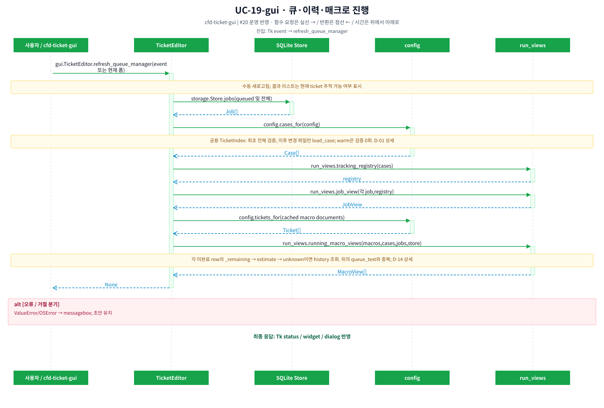

[SVG 원본 확대](../diagrams/UC-19-gui.svg)

**정상 결과:** Tk status / widget / dialog 반영.
**실패/취소:** ValueError/OSError → messagebox; 초안 유지.

**코드 연결:** [gui.TicketEditor.refresh_queue_manager](../../cfd_bot/gui.py#L1021), [storage.Store.jobs](../../cfd_bot/storage.py#L138), [config.cases_for](../../cfd_bot/config.py#L420), [run_views.tracking_registry](../../cfd_bot/run_views.py#L18), [run_views.job_view](../../cfd_bot/run_views.py#L30), [config.tickets_for](../../cfd_bot/config.py#L445), [run_views.running_macro_views](../../cfd_bot/run_views.py#L62).

**관련 검증:** [test_run_views.py](../../tests/test_run_views.py), [test_named_queues.py](../../tests/test_named_queues.py).

## UC-21-gui — 대기 작업 선택·취소

진입: `Tk event → cancel_queue_selection`.

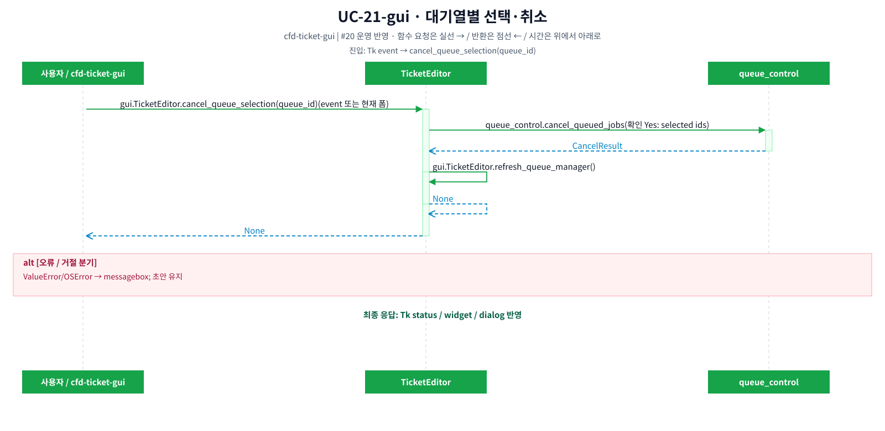

[SVG 원본 확대](../diagrams/UC-21-gui.svg)

**정상 결과:** Tk status / widget / dialog 반영.
**실패/취소:** ValueError/OSError → messagebox; 초안 유지.

**코드 연결:** [gui.TicketEditor.cancel_queue_selection](../../cfd_bot/gui.py#L1137), [queue_control.cancel_queued_jobs](../../cfd_bot/queue_control.py#L6), [gui.TicketEditor.refresh_queue_manager](../../cfd_bot/gui.py#L1021).

**관련 검증:** [test_core.py](../../tests/test_core.py), [test_web.py](../../tests/test_web.py).

## UC-22-gui — 실패 패턴 템플릿

진입: `Tk event → save_pattern`.

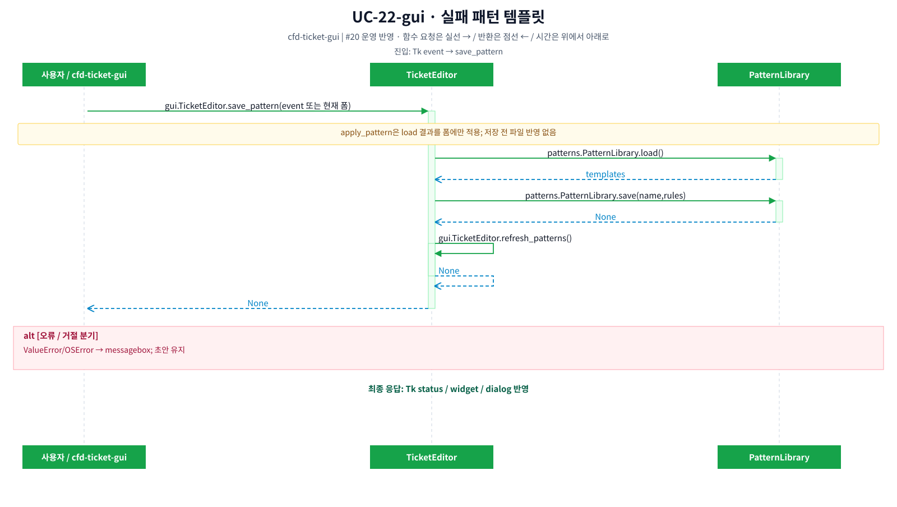

[SVG 원본 확대](../diagrams/UC-22-gui.svg)

**정상 결과:** Tk status / widget / dialog 반영.
**실패/취소:** ValueError/OSError → messagebox; 초안 유지.

**코드 연결:** [gui.TicketEditor.save_pattern](../../cfd_bot/gui.py#L620), [patterns.PatternLibrary.load](../../cfd_bot/patterns.py#L34), [patterns.PatternLibrary.save](../../cfd_bot/patterns.py#L49), [gui.TicketEditor.refresh_patterns](../../cfd_bot/gui.py#L449).

**관련 검증:** [test_gui.py](../../tests/test_gui.py).

## UC-23-gui — 폴더·로그·Residual 선택

진입: `Tk event → choose_logs`.

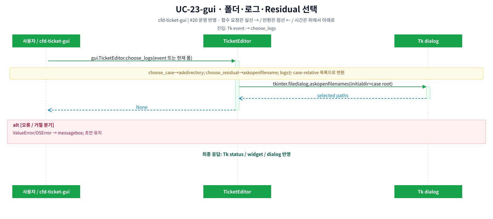

[SVG 원본 확대](../diagrams/UC-23-gui.svg)

**정상 결과:** Tk status / widget / dialog 반영.
**실패/취소:** ValueError/OSError → messagebox; 초안 유지.

**코드 연결:** [gui.TicketEditor.choose_logs](../../cfd_bot/gui.py#L840).

**관련 검증:** [test_ticket_chat.py](../../tests/test_ticket_chat.py), [test_web.py](../../tests/test_web.py).

## UC-24-gui — 저장/폐기/취소·닫기

진입: `Tk event → confirm_switch`.

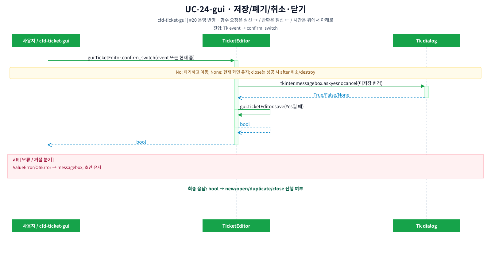

[SVG 원본 확대](../diagrams/UC-24-gui.svg)

**정상 결과:** bool → new/open/duplicate/close 진행 여부.
**실패/취소:** ValueError/OSError → messagebox; 초안 유지.

**코드 연결:** [gui.TicketEditor.confirm_switch](../../cfd_bot/gui.py#L722), [gui.TicketEditor.save](../../cfd_bot/gui.py#L880).

**관련 검증:** [test_ticket_chat.py](../../tests/test_ticket_chat.py), [test_gui.py](../../tests/test_gui.py).

## UC-10-exports-gui — 요청 데이터 정의 편집

진입: `Tk event → edit_item`.

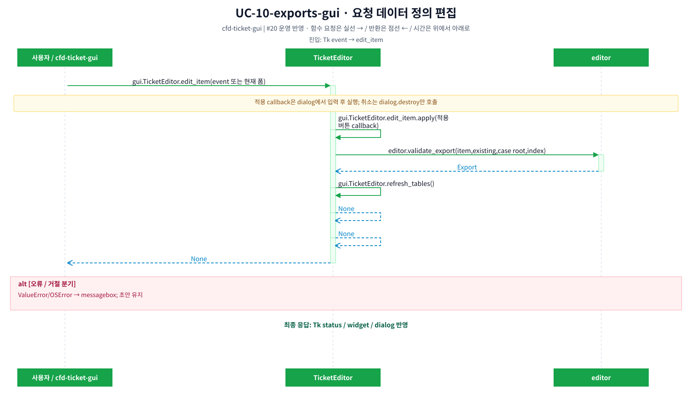

[SVG 원본 확대](../diagrams/UC-10-exports-gui.svg)

**정상 결과:** Tk status / widget / dialog 반영.
**실패/취소:** ValueError/OSError → messagebox; 초안 유지.

**코드 연결:** [gui.TicketEditor.edit_item](../../cfd_bot/gui.py#L648), [gui.TicketEditor.edit_item.apply](../../cfd_bot/gui.py#L682), [editor.validate_export](../../cfd_bot/editor.py#L470), [gui.TicketEditor.refresh_tables](../../cfd_bot/gui.py#L641).

**관련 검증:** [test_ticket_chat.py](../../tests/test_ticket_chat.py), [test_gui.py](../../tests/test_gui.py), [test_web.py](../../tests/test_web.py).
