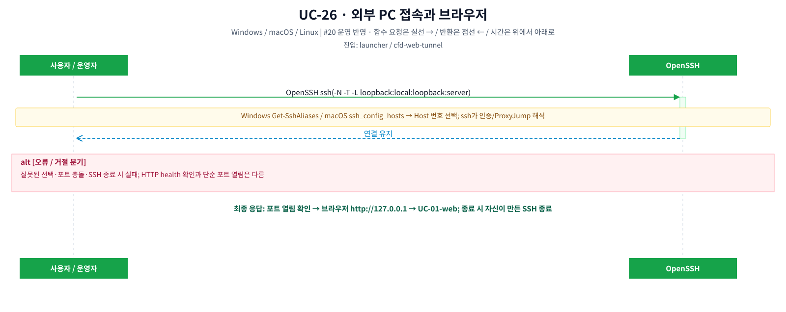
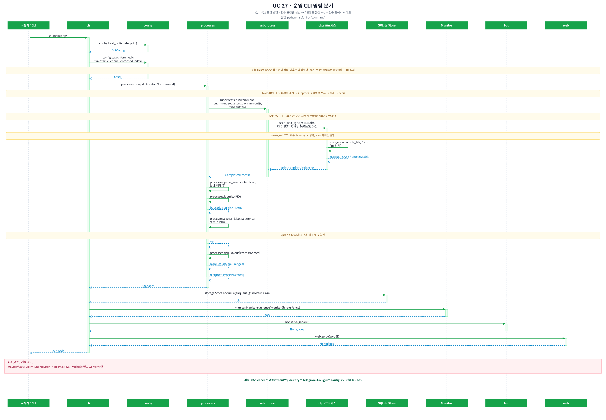
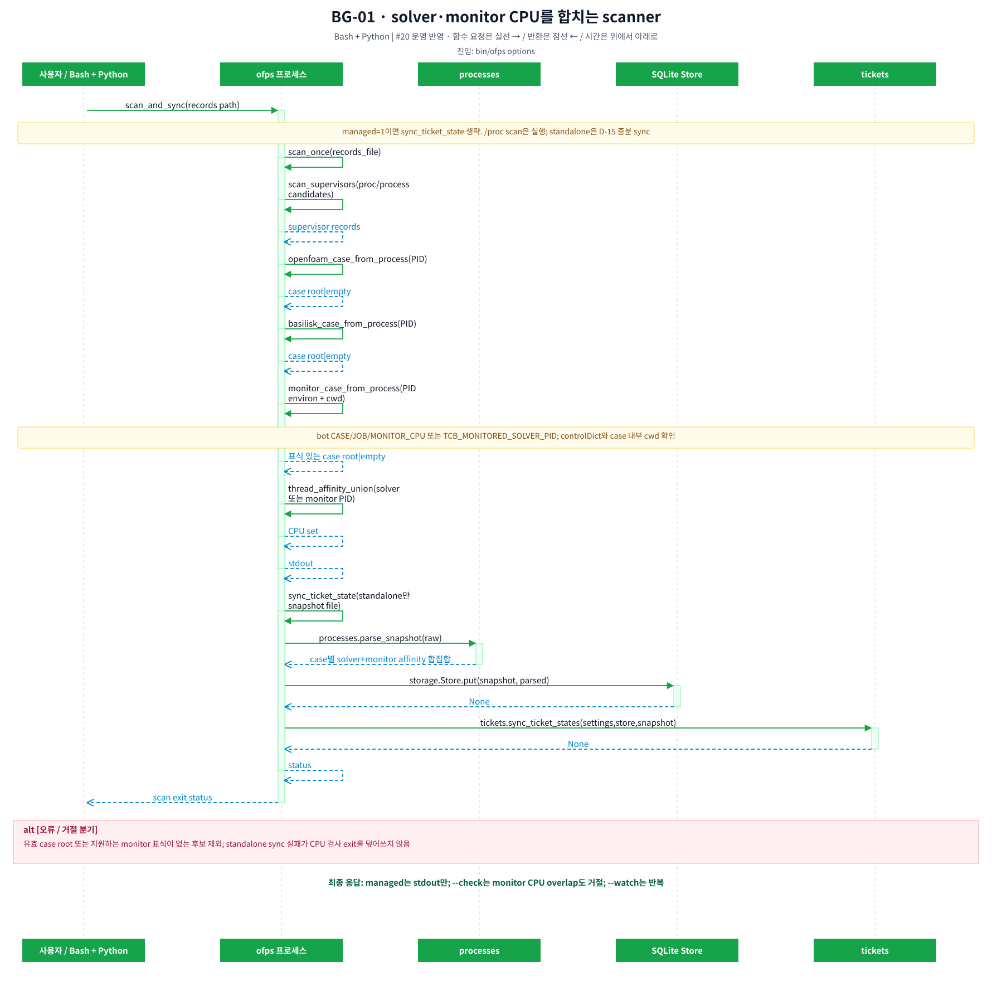
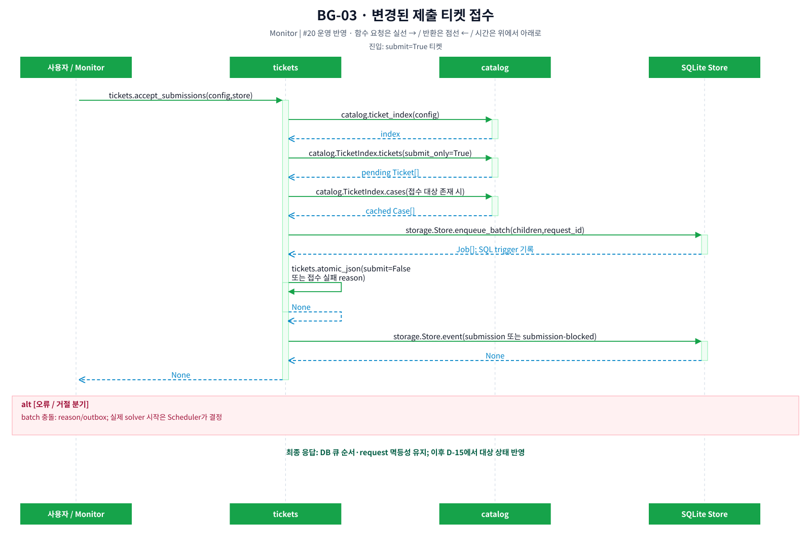
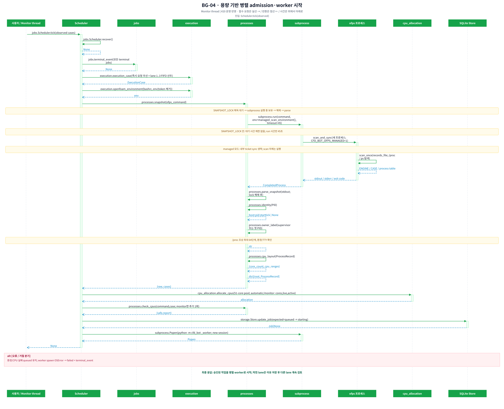
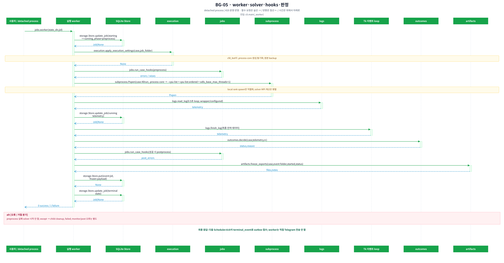
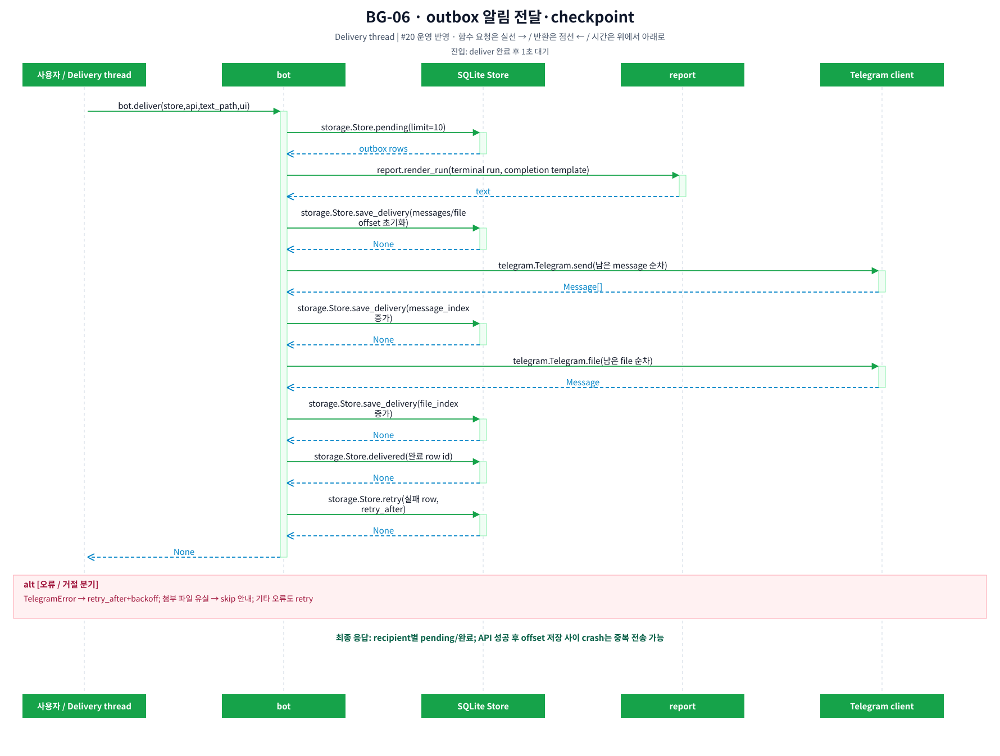
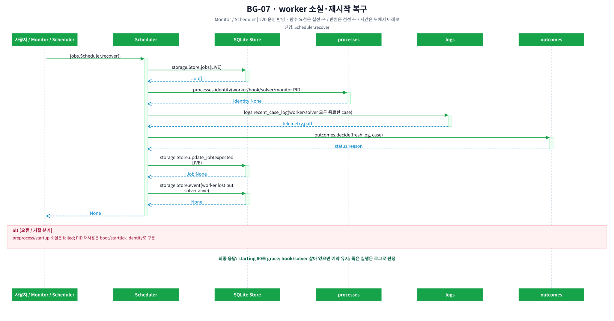

# Runtime LLD — CLI·scanner·백그라운드 요청·응답

[전체 그림 목록](flows.md) · [공용 계약](../LLD.md) · [HLD 실행 단위](../HLD.md)

## CLI 분기

`__main__ → cli.main(argv) → parser`에서 분기한다. `_worker`와 `gui`는 일반 config/store 경로 전에 처리한다. check는 load_bot/cases_for(force=True) 전역 검증 후 stdout과 0을 반환한다. `--execution-env`는 깨끗한 환경에서 OpenFOAM 도구 -help를 확인하며, `--mpi-probe`는 명시한 경우에만 실행한다. 이번 문서 검증은 기본 check만 사용했다.

identify는 getMe/getUpdates로 식별 정보를 읽는다. status는 fresh scan+sync, --json이면 jobs/observed/estimate를 직렬화한다. enqueue는 Store.enqueue 직접 호출이며 TicketRunner.request가 아니다. cancel은 공용 cancel_queued_jobs다. pause/resume은 kv 플래그다. monitor/serve는 DaemonLock으로 같은 state의 중복 daemon을 거절한다. monitor --once도 Scheduler를 호출하므로 운영 환경에서 안전한 읽기 전용 benchmark 명령이 아니다.

## 접속 launcher

Windows `Start CFD.cmd → cfd-client.ps1 → Get-SshAliases`와 macOS `CFDControlRoom → Terminal launch.command → ssh_config_hosts`가 Host 목록을 읽는다. Include는 깊이 제한·중복 방지로 처리하며 wildcard/부정 Host는 선택 목록에서 제외한다. OpenSSH가 User/Port/IdentityFile/ProxyJump를 해석한다. loopback forwarding과 포트 열림 확인 뒤 브라우저를 연다. HTTP 애플리케이션이 정상이라는 확인과 단순 TCP 포트 확인은 다르다. 연결 창 종료 시 자신이 만든 SSH PID만 정리한다. `bin/cfd-web-tunnel`은 목적지/포트를 검증한 뒤 exec ssh 한다.

## 실행·상태 전이

`queued → starting → running(phase=preprocess/solver) → postprocessing? → succeeded/failed`가 정상 흐름이다. 대기 취소는 queued에서만 cancelled다. 명시적 실행 중단은 `starting|running|postprocessing → stopping → interrupted`이며 stopping도 LIVE/ACTIVE여서 child 소멸 전까지 CPU와 case unique 예약을 유지한다. 외부 observed는 running에서 missing 임계값 이후 수치 판정으로 이동하며 UI 중단 대상이 아니다.

Monitor.tick은 ticket_index → scan 전 LIVE root 조회 → fresh snapshot → accept_submissions → recover → managed 관측 보강 → 현재 roots ∪ 영속 tracked roots 감시 → Scheduler.tick → 증분 sync_ticket_states 순서다. scan 전후 LIVE root 합집합은 외부 감시에서 제외한다. observe는 calculation_record로 monitor-only를 None으로 처리하고 혼합 record의 monitor를 실행 identity에서 제외한다. 전체 CPU snapshot은 그대로 UI/스케줄러에 전달한다. 등록 전체 CASE를 observe하지 않는다. Scheduler.tick 내부도 recover를 호출한다. Monitor 한 주기에서 recover가 두 번 실행되는 점은 현행 코드 그대로다.

`bin/ofps`는 OpenFOAM/Basilisk process 다음으로 monitor process를 판정한다. worker opt-in 경로는 `CFD_BOT_CASE_DIR`, `CFD_BOT_JOB_ID`, `CFD_BOT_MONITOR_CPU`를, TCB 내장·외부 실행 경로는 `TCB_MONITORED_SOLVER_PID`와 cwd를 사용한다. 유효 controlDict와 case 내부 cwd를 확인한 process만 `ENGINE: Monitor`로 출력한다. `parse_snapshot`은 동일 root의 solver와 monitor process를 하나의 ProcessRecord로 병합해 affinity 합집합을 `/stat`, web, scheduler, `ofps --check`에 제공한다.

Scheduler는 outbox와 `terminal_event_published` marker가 모두 없는 terminal job만 종료 이벤트로 처리한다. 이미 발행된 legacy job은 기존 outbox로 제외되며 알림 대상이 아닌 job도 marker를 남겨 다음 tick의 반복 쓰기를 막는다. 이어서 active child가 없는 즉시 실행 batch마다 첫 queued child 하나만 보고, active job이 없는 `queue_id`별 FIFO 선두를 각각 검토한다. 일반 head의 실제 NP와 선택적 monitor가 quota 크기이며 Scheduler가 겹치지 않는 CPU 위치를 자동 배정한다. 동적 macro는 `priority=run|queue` 모두 현재 child NP만큼 미예약 CPU를 먼저 쓰고 부족분은 작은 quota donor부터 drain한다. 뒤 child는 앞 child가 끝나기 전 candidate나 drain claim을 얻지 않는다. donor 작업은 자연 종료하고, 동적 작업 뒤 donor별 FIFO head에 한 번씩 우선권을 준다. automatic/monitor opt-in이면 추가 fresh snapshot, solver CPU check, monitor면 추가 CPU check를 수행한다. check_cpus는 SNAPSHOT_LOCK을 사용하지 않는다. worker는 fresh scan 자체를 주기적으로 하지 않고 로그를 0.5초 간격으로 읽는다.

worker의 .process-core 반영 → 전처리 → 로그 cursor 수집 → solver (+ opt-in monitor) → 최종 log drain → decide → 성공 시 후처리 → artifact freeze → event payload 저장 → terminal state 저장 순서를 지킨다. solver·monitor·hook이 시작된 뒤 Store 쓰기에서 SQLite locked/busy가 발생하면 child를 유지한 채 같은 쓰기를 재시도한다. 각 child 시작 직후와 telemetry loop에서 stopping을 확인하며 process group에 TERM, 10초 뒤에도 살아 있으면 KILL을 보낸다. 중단 요청은 solver verdict보다 우선해 interrupted로 저장한다. monitor 종료는 최대 30초 기다린 뒤 정리하고 monitor/postprocess 오류는 solver verdict와 별도 기록한다. terminal state 전에 파일을 freeze한다. worker는 종료 payload를 kv에 저장하며 이후 Scheduler.terminal_event가 outbox에 넣는다.

Delivery는 한 batch 최대 10개 recipient row를 순차 처리한다. message_index/file_index를 각 성공 뒤 저장하고 실패는 retry_after+backoff로 재시도한다. API 성공 직후 checkpoint 전 crash는 재전송될 수 있다. API 응답 소요가 느리면 같은 batch 뒤 recipient도 기다린다.

#18/#30 진단 로그는 basic에서 업무 경계·명시적 사건·예외를, detailed에서 내부 함수·분기까지 기록한다. [공통 로그 계약](../DIAGNOSTICS.md)과 [시퀀스별 이벤트 대응표](../analysis/diagnostic-flow-coverage.md)를 함께 읽는다.

내부 반복·파일 접근·잠금 범위는 [catalog LLD](../LLD.md#catalog), 현재 921행 매크로의 함수별 시간과 큐 응답량은 [운영 데이터 분석](../analysis/live-bottlenecks.md)에 있다. 그림의 보라색 loop는 함수 내부 반복이며 추가 함수가 아니다.

## 그림 바로가기

- [UC-26 — 외부 PC 접속과 브라우저](#uc-26)
- [UC-27 — 운영 CLI 명령 분기](#uc-27)
- [BG-01 — solver·monitor CPU를 합치는 scanner](#bg-01)
- [BG-02 — 현재 CASE · 이전 실행/종료 확인 중 CASE 감시](#bg-02)
- [BG-03 — 변경된 제출 티켓 접수](#bg-03)
- [BG-04 — 현재 head 기반 quota·동적 borrow admission](#bg-04)
- [BG-05 — worker·solver·hooks·판정](#bg-05)
- [BG-06 — outbox 알림 전달·checkpoint](#bg-06)
- [BG-07 — worker 소실·재시작 복구](#bg-07)

## UC-26 — 외부 PC 접속과 브라우저

진입: `launcher / cfd-web-tunnel`.

[SVG 원본 확대](../diagrams/UC-26.svg)

**정상 결과:** 포트 열림 확인 → 브라우저 http://127.0.0.1 → UC-01-web; 종료 시 자신이 만든 SSH 종료.
**실패/취소:** 잘못된 선택·포트 충돌·SSH 종료 시 실패; HTTP health 확인과 단순 포트 열림은 다름.

**코드 연결:** .

**관련 검증:** [test_clients.py](../../tests/test_clients.py), [test_web_tunnel.py](../../tests/test_web_tunnel.py).

## UC-27 — 운영 CLI 명령 분기

진입: `python -m cfd_bot [command]`.

[SVG 원본 확대](../diagrams/UC-27.svg)

**정상 결과:** check는 검증/stdout만; identify는 Telegram 조회; gui는 config 분기 전에 launch.
**실패/취소:** OSError/ValueError/RuntimeError → stderr, exit 2; _worker는 별도 worker 반환.

**코드 연결:** [cli.main](../../cfd_bot/cli.py#L50), [config.load_bot](../../cfd_bot/config.py#L476), [config.cases_for](../../cfd_bot/config.py#L554), [processes.snapshot](../../cfd_bot/processes.py#L229), [processes.parse_snapshot](../../cfd_bot/processes.py#L177), [processes.identity](../../cfd_bot/processes.py#L25), [processes.owner_label](../../cfd_bot/processes.py#L87), [processes.cpu_layout](../../cfd_bot/processes.py#L140), [storage.Store.enqueue](../../cfd_bot/storage.py#L247), [monitor.Monitor.run_once](../../cfd_bot/monitor.py#L267), [bot.serve](../../cfd_bot/bot.py#L741), [web.serve](../../cfd_bot/web.py#L541).

**관련 검증:** [test_ticket_chat.py](../../tests/test_ticket_chat.py), [test_gui.py](../../tests/test_gui.py), [test_web.py](../../tests/test_web.py).

## BG-01 — solver·monitor CPU를 합치는 scanner

진입: `bin/ofps options`.

[SVG 원본 확대](../diagrams/BG-01.svg)

**정상 결과:** managed는 stdout만; --check는 monitor CPU overlap도 거절; --watch는 반복.
**실패/취소:** 유효 case root 또는 지원하는 monitor 표식이 없는 후보 제외; standalone sync 실패가 CPU 검사 exit를 덮어쓰지 않음.

**코드 연결:** [processes.parse_snapshot](../../cfd_bot/processes.py#L177), [storage.Store.put](../../cfd_bot/storage.py#L151), [tickets.sync_ticket_states](../../cfd_bot/tickets.py#L425).

**관련 검증:** [test_core.py](../../tests/test_core.py), [test_queue_tickets.py](../../tests/test_queue_tickets.py), [test_scripts.py](../../tests/test_scripts.py).

## BG-02 — 현재 CASE · 이전 실행/종료 확인 중 CASE 감시

진입: `run_once 완료 후 poll_seconds 대기`.

[SVG 원본 확대](../diagrams/BG-02.svg)

**정상 결과:** monitor-only 신규 실행 없음; 기존 계산은 missing 확인 후 종료; 원본 snapshot의 monitor CPU 점유 유지.
**실패/취소:** scan 실패는 missing 증가 없음; scan 중 managed 완료도 재등록 방지; state/outbox 실패는 tracking으로 재시도.

**내부 로직·비용:** 감시 대상은 현재 CASE와 이전 실행·종료 확인 중 CASE다. DB 변화는 ticket_changes journal을 통해 대상 티켓과 부모만 반영한다. run_once가 끝난 뒤 5초 대기하므로 5초 고정 주기가 아니다. [호출별 반복 표](../LLD.md#catalog).

**코드 연결:** [monitor.Monitor.run_once](../../cfd_bot/monitor.py#L267), [monitor.Monitor.tick](../../cfd_bot/monitor.py#L156), [catalog.ticket_index](../../cfd_bot/catalog.py#L349), [storage.Store.jobs](../../cfd_bot/storage.py#L165), [processes.snapshot](../../cfd_bot/processes.py#L229), [processes.parse_snapshot](../../cfd_bot/processes.py#L177), [processes.identity](../../cfd_bot/processes.py#L25), [processes.owner_label](../../cfd_bot/processes.py#L87), [processes.cpu_layout](../../cfd_bot/processes.py#L140), [storage.Store.put](../../cfd_bot/storage.py#L151), [tickets.accept_submissions](../../cfd_bot/tickets.py#L547), [jobs.Scheduler.recover](../../cfd_bot/jobs.py#L200), [storage.Store.tracked_observations](../../cfd_bot/storage.py#L233), [catalog.TicketIndex.lookup](../../cfd_bot/catalog.py#L314), [monitor.automatic_case](../../cfd_bot/monitor.py#L96), [monitor.Monitor.observe](../../cfd_bot/monitor.py#L199), [monitor.calculation_record](../../cfd_bot/monitor.py#L56), [monitor.observed_identity](../../cfd_bot/monitor.py#L74), [monitor.new_execution](../../cfd_bot/monitor.py#L80), [logs.recent_case_log](../../cfd_bot/logs.py#L264), [outcomes.decide](../../cfd_bot/outcomes.py#L28), [jobs.terminal_event](../../cfd_bot/jobs.py#L29), [storage.Store.finish_observation](../../cfd_bot/storage.py#L240), [jobs.Scheduler.tick](../../cfd_bot/jobs.py#L276), [tickets.sync_ticket_states](../../cfd_bot/tickets.py#L425).

**관련 검증:** [test_core.py](../../tests/test_core.py), [test_queue_tickets.py](../../tests/test_queue_tickets.py), [test_scripts.py](../../tests/test_scripts.py).

## BG-03 — 변경된 제출 티켓 접수

진입: `submit=True 티켓`.

[SVG 원본 확대](../diagrams/BG-03.svg)

**정상 결과:** DB 큐 순서·request 멱등성 유지; 이후 D-15에서 대상 상태 반영.
**실패/취소:** batch 충돌: reason/outbox; 실제 solver 시작은 Scheduler가 결정.

**코드 연결:** [tickets.accept_submissions](../../cfd_bot/tickets.py#L547), [catalog.ticket_index](../../cfd_bot/catalog.py#L349), [catalog.TicketIndex.tickets](../../cfd_bot/catalog.py#L283), [catalog.TicketIndex.cases](../../cfd_bot/catalog.py#L296), [storage.Store.enqueue_batch](../../cfd_bot/storage.py#L288), [tickets.atomic_json](../../cfd_bot/tickets.py#L52), [storage.Store.event](../../cfd_bot/storage.py#L445).

**관련 검증:** [test_core.py](../../tests/test_core.py), [test_queue_tickets.py](../../tests/test_queue_tickets.py), [test_scripts.py](../../tests/test_scripts.py).

## BG-04 — 현재 head 기반 quota·동적 borrow admission

진입: `Scheduler.tick(observed)`.

[SVG 원본 확대](../diagrams/BG-04.svg)

**정상 결과:** terminal event는 job당 한 번; 즉시 실행 macro도 active child가 없을 때 현재 child 하나만 admission; 서로 다른 queue는 겹치지 않는 CPU에서 병렬 실행.
**실패/취소:** 환경/CPU 실패 queued 유지; 전체 관리 용량 초과는 대기; worker spawn OSError → failed + terminal_event.

**내부 로직·비용:** `scheduling_candidates(jobs,active)`가 active child가 없는 즉시 실행 batch마다 첫 queued child 하나만 고르고, active job이 없는 queue id만 `queue_heads`에 넘긴다. `_assign_queue_profiles`는 일반 head NP에서 quota와 CPU 위치를 정한다. `borrowing_plan`은 `priority=run|queue` 동적 현재 child의 NP와 donor를 계산한다. drain claim은 하나이며 동적 작업 뒤 donor별 다음 head에 1회 우선권을 준다.

**코드 연결:** [jobs.Scheduler.tick](../../cfd_bot/jobs.py#L276), [jobs.Scheduler.recover](../../cfd_bot/jobs.py#L200), [storage.Store.unpublished_terminal_jobs](../../cfd_bot/storage.py#L177), [jobs.terminal_event](../../cfd_bot/jobs.py#L29), [catalog.TicketIndex.queue_profiles](../../cfd_bot/catalog.py#L289), [jobs.scheduling_candidates](../../cfd_bot/jobs.py#L52), [queueing.queue_heads](../../cfd_bot/queueing.py#L66), [jobs.Scheduler._assign_queue_profiles](../../cfd_bot/jobs.py#L134), [queueing.borrowing_plan](../../cfd_bot/queueing.py#L76), [jobs.Scheduler._borrow_state](../../cfd_bot/jobs.py#L83), [execution.execution_case](../../cfd_bot/execution.py#L195), [execution.openfoam_environment](../../cfd_bot/execution.py#L113), [processes.snapshot](../../cfd_bot/processes.py#L229), [processes.parse_snapshot](../../cfd_bot/processes.py#L177), [processes.identity](../../cfd_bot/processes.py#L25), [processes.owner_label](../../cfd_bot/processes.py#L87), [processes.cpu_layout](../../cfd_bot/processes.py#L140), [cpu_allocation.allocate_cpus](../../cfd_bot/cpu_allocation.py#L187), [processes.check_cpus](../../cfd_bot/processes.py#L255), [storage.Store.update_job](../../cfd_bot/storage.py#L375).

**관련 검증:** [test_core.py](../../tests/test_core.py), [test_queue_tickets.py](../../tests/test_queue_tickets.py), [test_scripts.py](../../tests/test_scripts.py).

## BG-05 — worker·solver·hooks·판정

진입: `cli.main(_worker)`.

[SVG 원본 확대](../diagrams/BG-05.svg)

**정상 결과:** 다음 Scheduler.tick이 미발행 terminal만 outbox 접수; 중단은 interrupted가 solver 판정보다 우선.
**실패/취소:** preprocess 실패 solver 시작 안 함; DB locked/busy는 child 유지+재시도; stopping이면 child cleanup+interrupted.

**코드 연결:** [jobs.worker](../../cfd_bot/jobs.py#L633), [storage.Store.update_job](../../cfd_bot/storage.py#L375), [execution.apply_execution_settings](../../cfd_bot/execution.py#L256), [jobs.run_case_hooks](../../cfd_bot/jobs.py#L559), [logs.read_log](../../cfd_bot/logs.py#L149), [jobs._retry_locked](../../cfd_bot/jobs.py#L509), [jobs._stop_child](../../cfd_bot/jobs.py#L611), [logs.finish_log](../../cfd_bot/logs.py#L192), [outcomes.decide](../../cfd_bot/outcomes.py#L28), [artifacts.freeze_exports](../../cfd_bot/artifacts.py#L34), [storage.Store.put](../../cfd_bot/storage.py#L151).

**관련 검증:** [test_core.py](../../tests/test_core.py), [test_queue_tickets.py](../../tests/test_queue_tickets.py), [test_scripts.py](../../tests/test_scripts.py).

## BG-06 — outbox 알림 전달·checkpoint

진입: `deliver 완료 후 1초 대기`.

[SVG 원본 확대](../diagrams/BG-06.svg)

**정상 결과:** recipient별 pending/완료; API 성공 후 offset 저장 사이 crash는 중복 전송 가능.
**실패/취소:** TelegramError → retry_after+backoff; 첨부 파일 유실 → skip 안내; 기타 오류도 retry.

**코드 연결:** [bot.deliver](../../cfd_bot/bot.py#L686), [storage.Store.pending](../../cfd_bot/storage.py#L473), [report.render_run](../../cfd_bot/report.py#L116), [storage.Store.save_delivery](../../cfd_bot/storage.py#L491), [telegram.Telegram.send](../../cfd_bot/telegram.py#L102), [telegram.Telegram.file](../../cfd_bot/telegram.py#L115), [storage.Store.delivered](../../cfd_bot/storage.py#L480), [storage.Store.retry](../../cfd_bot/storage.py#L485).

**관련 검증:** [test_core.py](../../tests/test_core.py), [test_queue_tickets.py](../../tests/test_queue_tickets.py), [test_scripts.py](../../tests/test_scripts.py).

## BG-07 — worker 소실·재시작 복구

진입: `Scheduler.recover`.

[SVG 원본 확대](../diagrams/BG-07.svg)

**정상 결과:** starting 60초 grace; stopping은 모든 process 소멸 뒤 interrupted; 그 밖의 죽은 실행은 로그 판정.
**실패/취소:** preprocess/startup 소실은 failed; PID 재사용은 boot/starttick identity로 구분.

**코드 연결:** [jobs.Scheduler.recover](../../cfd_bot/jobs.py#L200), [storage.Store.jobs](../../cfd_bot/storage.py#L165), [processes.identity](../../cfd_bot/processes.py#L25), [queue_control.interrupt_process_groups](../../cfd_bot/queue_control.py#L27), [logs.recent_case_log](../../cfd_bot/logs.py#L264), [outcomes.decide](../../cfd_bot/outcomes.py#L28), [storage.Store.update_job](../../cfd_bot/storage.py#L375), [storage.Store.event](../../cfd_bot/storage.py#L445).

**관련 검증:** [test_core.py](../../tests/test_core.py), [test_queue_tickets.py](../../tests/test_queue_tickets.py), [test_scripts.py](../../tests/test_scripts.py).
