# Telegram LLD — 유즈케이스별 함수 요청·응답

[전체 그림 목록](flows.md) · [공용 계약](../LLD.md) · [실행 경계](../HLD.md)

## 진입·thread·응답 규칙

`bot.serve → Telegram.updates(offset) → for update → Bot.handle`이 main thread에서 순차 실행된다. callback ACK는 `start_callback_ack → acknowledge_callback → Telegram.call(answerCallbackQuery)`의 별도 daemon thread다. 인증은 sender와 chat을 모두 검사한다. ACK와 실제 사용자 화면 응답은 별개다.

`TicketChat.handle`은 일반 Bot.dispatch보다 먼저 호출된다. `/tickets`·`/ticket`·`tickets`·`ticketopen`·`/cancel`, 편집 callback 및 pending field 입력을 소비하면 True를 반환한다. 나머지는 일반 dispatcher로 넘긴다. session은 `ticket-editor:<chat>:<user>`에 저장한다. render마다 token을 교체하며 다른 사용자/오래된 버튼은 거절한다.

TicketChat의 RLock은 handle과 검색 결과 반영, render의 Telegram API까지 포함한다. render는 먼저 새 token을 저장하고 editMessageText를 시도하며 TelegramError면 새 메시지로 fallback한다. 일반 Bot.send/file은 outbox를 거치지 않는다. `Bot.handle`은 일반 dispatch의 ValueError/OSError를 메시지로 바꾸고, 그 밖의 예외는 serve에서 경고 후 offset을 진행한다. 모든 실패가 사용자 오류 응답을 보장하는 것은 아니다.

## 전체 callback 분기와 UC

| callback / 명령 | UC |
|---|---|
| home, /start, /help, 알 수 없는 일반 입력 | UC-01 |
| status, /stat | UC-02 |
| cases:page, case:id, /data, /cases | UC-03 |
| detail:id / residual:id / export:id:name | UC-04 / 05 / 06 |
| tickets, /tickets, /ticket, list, bulk, bulkpage, btoggle, ball, bnone | UC-07 |
| new / open, ticketopen, card / duplicate | UC-08 / 09 / 13 |
| basic, rules, scripts, scriptdefault, field, clear, event | UC-10 |
| validate / review, save | UC-11 / 12 |
| delete, breview, deleteyes, bdelete | UC-14 |
| scan, stopscan / members, remove | UC-15 / 16 |
| queue(편집 화면), mode, setmode, role, execsource, cpupolicy, toggle | UC-17 |
| runstate, runreview, runyes / prepare:cid, enqueue:cid | UC-18 / UC-18-legacy |
| /queue, queue(일반 dispatcher), pause, resume | UC-19 / 20 |
| qselect,qback,qpage,qtoggle,qall,qnone,qcancel,qcancelyes,cancel:id | UC-21 |
| templates,template,savetemplate | UC-22 |
| browse,bp,bd,bup,bf,bapply,bcancel; exports,xe,xnew,xkind,xapply,xdelete | UC-23 / UC-10 exports |
| /cancel,backinput,discard,switch | UC-24 |
| clean,/clean | UC-25 |

`te:<token>:queue`는 실행 설정 화면이고 일반 `queue`는 실제 DB 큐다. 동일 단어라도 처리 함수가 다르다. 그림에는 action 조건을 표시한다. 논리적 UC가 확인 버튼까지 여러 update를 필요로 하면 각각의 action 분기를 시간 순서로 나열한다.

#18 진단 로그는 아래 모든 시퀀스의 실제 함수·분기에 적용한다. [공통 로그 계약](../DIAGNOSTICS.md)과 [시퀀스별 이벤트 대응표](../analysis/diagnostic-flow-coverage.md)를 함께 읽는다.

내부 반복·파일 접근·잠금 범위는 [catalog LLD](../LLD.md#catalog), 현재 921행 매크로의 함수별 시간과 큐 응답량은 [운영 데이터 분석](../analysis/live-bottlenecks.md)에 있다. 그림의 보라색 loop는 함수 내부 반복이며 추가 함수가 아니다.

## 그림 바로가기

- [UC-01-tg — 진입·도움말](#uc-01)
- [UC-02-tg — 실시간 현재 CASE](#uc-02)
- [UC-03-tg — 등록 케이스 목록·선택](#uc-03)
- [UC-04-tg — 상태 상세](#uc-04)
- [UC-05-tg — Residual 조회](#uc-05)
- [UC-06-tg — 결과 파일 조회](#uc-06)
- [UC-07-tg — 티켓 목록·다중 선택](#uc-07)
- [UC-08-tg — 새 티켓](#uc-08)
- [UC-09-tg — 티켓 열기](#uc-09)
- [UC-13-tg — 티켓 복제](#uc-13)
- [UC-10-tg — 기본·감시·알림·스크립트 편집](#uc-10)
- [UC-11-tg — 티켓 검증](#uc-11)
- [UC-12-tg — 저장·이름 변경](#uc-12)
- [UC-14-tg — 개별·다중 티켓 삭제](#uc-14)
- [UC-15-tg — 매크로 검색·필터·취소](#uc-15)
- [UC-16-tg — 매크로 구성원 선택](#uc-16)
- [UC-17-tg — 실행·queue 이름·동적 macro 설정](#uc-17)
- [UC-18-tg — 즉시 실행·이름 있는 대기열 등록](#uc-18)
- [UC-18-legacy-tg — 케이스 메뉴 실행(우회 경로)](#uc-18-legacy)
- [UC-19-tg — 큐·이력·매크로 진행](#uc-19)
- [UC-20-tg — 자동 시작 pause/resume](#uc-20)
- [UC-21-tg — 대기 작업 선택·취소](#uc-21)
- [UC-22-tg — 실패 패턴 템플릿](#uc-22)
- [UC-23-tg — 폴더·로그·Residual 선택](#uc-23)
- [UC-24-tg — 입력 취소·초안 폐기·검색 취소](#uc-24)
- [UC-25-tg — 대화 일괄 정리](#uc-25)
- [UC-10-exports-tg — 요청 데이터 정의 편집](#uc-10-exports)

## UC-01-tg — 진입·도움말

진입: `/start /help home`.

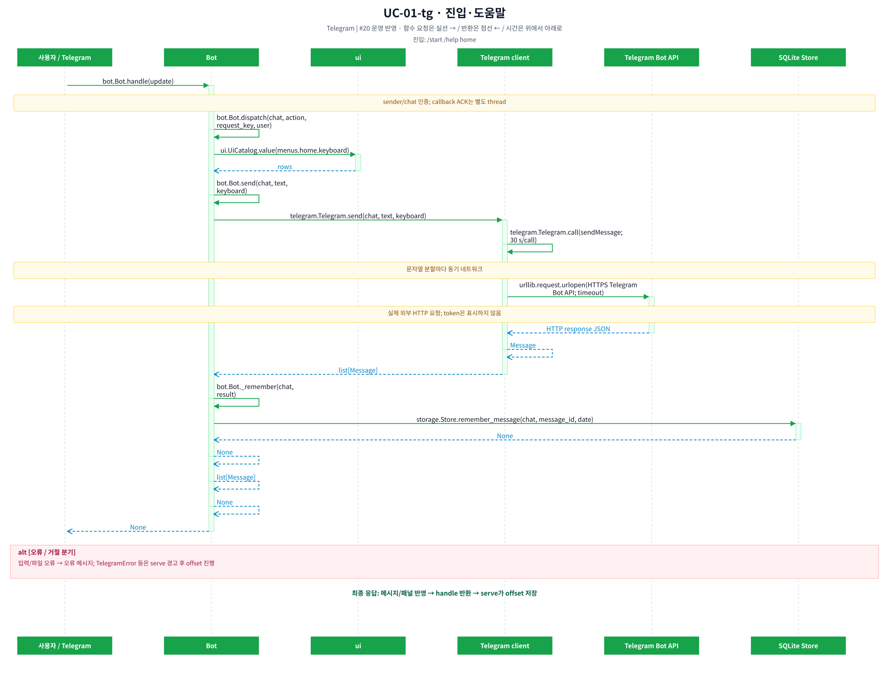

[SVG 원본 확대](../diagrams/UC-01-tg.svg)

**정상 결과:** 메시지/패널 반영 → handle 반환 → serve가 offset 저장.
**실패/취소:** 입력/파일 오류 → 오류 메시지; TelegramError 등은 serve 경고 후 offset 진행.

**코드 연결:** [bot.Bot.handle](../../cfd_bot/bot.py#L298), [bot.Bot.dispatch](../../cfd_bot/bot.py#L340), [ui.UiCatalog.value](../../cfd_bot/ui.py#L118), [bot.Bot.send](../../cfd_bot/bot.py#L85), [telegram.Telegram.send](../../cfd_bot/telegram.py#L102), [telegram.Telegram.call](../../cfd_bot/telegram.py#L47), [bot.Bot._remember](../../cfd_bot/bot.py#L73), [storage.Store.remember_message](../../cfd_bot/storage.py#L462).

**관련 검증:** [test_ticket_chat.py](../../tests/test_ticket_chat.py), [test_gui.py](../../tests/test_gui.py), [test_web.py](../../tests/test_web.py).

## UC-02-tg — 실시간 현재 CASE

진입: `/stat / status`.

[SVG 원본 확대](../diagrams/UC-02-tg.svg)

**정상 결과:** 메시지/패널 반영 → handle 반환 → serve가 offset 저장.
**실패/취소:** fresh_runs는 OSError/RuntimeError만 catch. TimeoutExpired는 serve catch로 가며 사용자 오류 응답이 없을 수 있음.

**내부 로직·비용:** ofps 실행 시간 제한 45초는 뒤의 catalog/membership 시간 제한이 아니다. 현재 표본은 scan 약 1.06초, membership만 16.56~19.68초. [측정 범위](../analysis/live-bottlenecks.md).

**코드 연결:** [bot.Bot.handle](../../cfd_bot/bot.py#L298), [bot.Bot.dispatch](../../cfd_bot/bot.py#L340), [bot.Bot.fresh_runs](../../cfd_bot/bot.py#L128), [processes.snapshot](../../cfd_bot/processes.py#L229), [processes.parse_snapshot](../../cfd_bot/processes.py#L177), [processes.identity](../../cfd_bot/processes.py#L25), [processes.owner_label](../../cfd_bot/processes.py#L87), [processes.cpu_layout](../../cfd_bot/processes.py#L140), [catalog.ticket_index](../../cfd_bot/catalog.py#L349), [catalog.TicketIndex.cases](../../cfd_bot/catalog.py#L296), [bot.Bot.active_runs](../../cfd_bot/bot.py#L97), [bot.Bot.status](../../cfd_bot/bot.py#L183), [storage.Store.runtime_history](../../cfd_bot/storage.py#L342), [report.compact_status](../../cfd_bot/report.py#L132), [bot.Bot.send](../../cfd_bot/bot.py#L85), [telegram.Telegram.send](../../cfd_bot/telegram.py#L102), [telegram.Telegram.call](../../cfd_bot/telegram.py#L47), [bot.Bot._remember](../../cfd_bot/bot.py#L73), [storage.Store.remember_message](../../cfd_bot/storage.py#L462).

**관련 검증:** [test_core.py](../../tests/test_core.py), [test_web.py](../../tests/test_web.py).

## UC-03-tg — 등록 케이스 목록·선택

진입: `/data /cases cases:page case:id`.

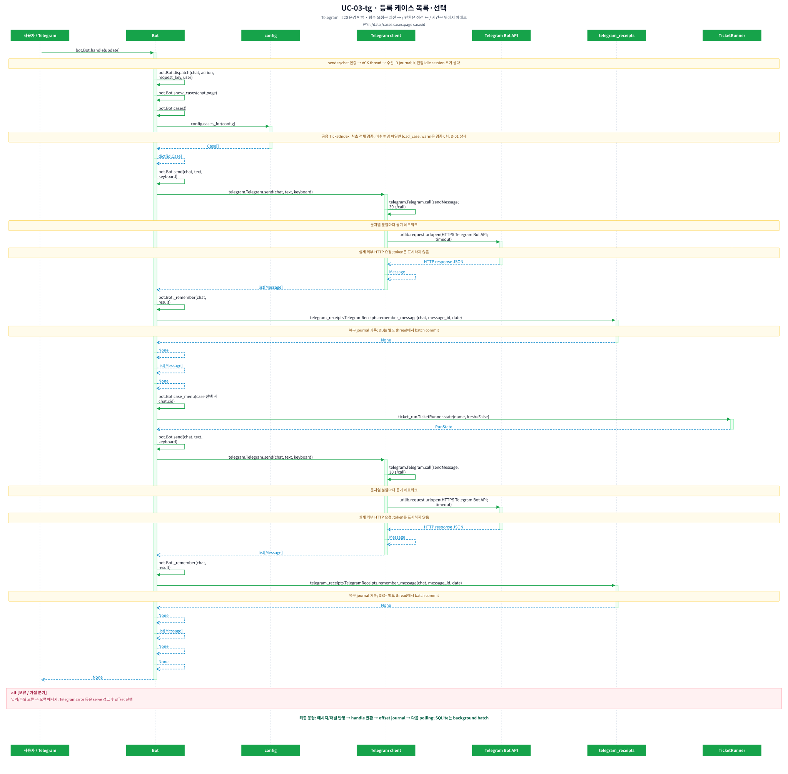

[SVG 원본 확대](../diagrams/UC-03-tg.svg)

**정상 결과:** 메시지/패널 반영 → handle 반환 → serve가 offset 저장.
**실패/취소:** 입력/파일 오류 → 오류 메시지; TelegramError 등은 serve 경고 후 offset 진행.

**코드 연결:** [bot.Bot.handle](../../cfd_bot/bot.py#L298), [bot.Bot.dispatch](../../cfd_bot/bot.py#L340), [bot.Bot.show_cases](../../cfd_bot/bot.py#L235), [bot.Bot.cases](../../cfd_bot/bot.py#L65), [config.cases_for](../../cfd_bot/config.py#L554), [bot.Bot.send](../../cfd_bot/bot.py#L85), [telegram.Telegram.send](../../cfd_bot/telegram.py#L102), [telegram.Telegram.call](../../cfd_bot/telegram.py#L47), [bot.Bot._remember](../../cfd_bot/bot.py#L73), [storage.Store.remember_message](../../cfd_bot/storage.py#L462), [bot.Bot.case_menu](../../cfd_bot/bot.py#L252), [ticket_run.TicketRunner.state](../../cfd_bot/ticket_run.py#L146).

**관련 검증:** [test_ticket_chat.py](../../tests/test_ticket_chat.py), [test_gui.py](../../tests/test_gui.py), [test_web.py](../../tests/test_web.py).

## UC-04-tg — 상태 상세

진입: `detail:case-id`.

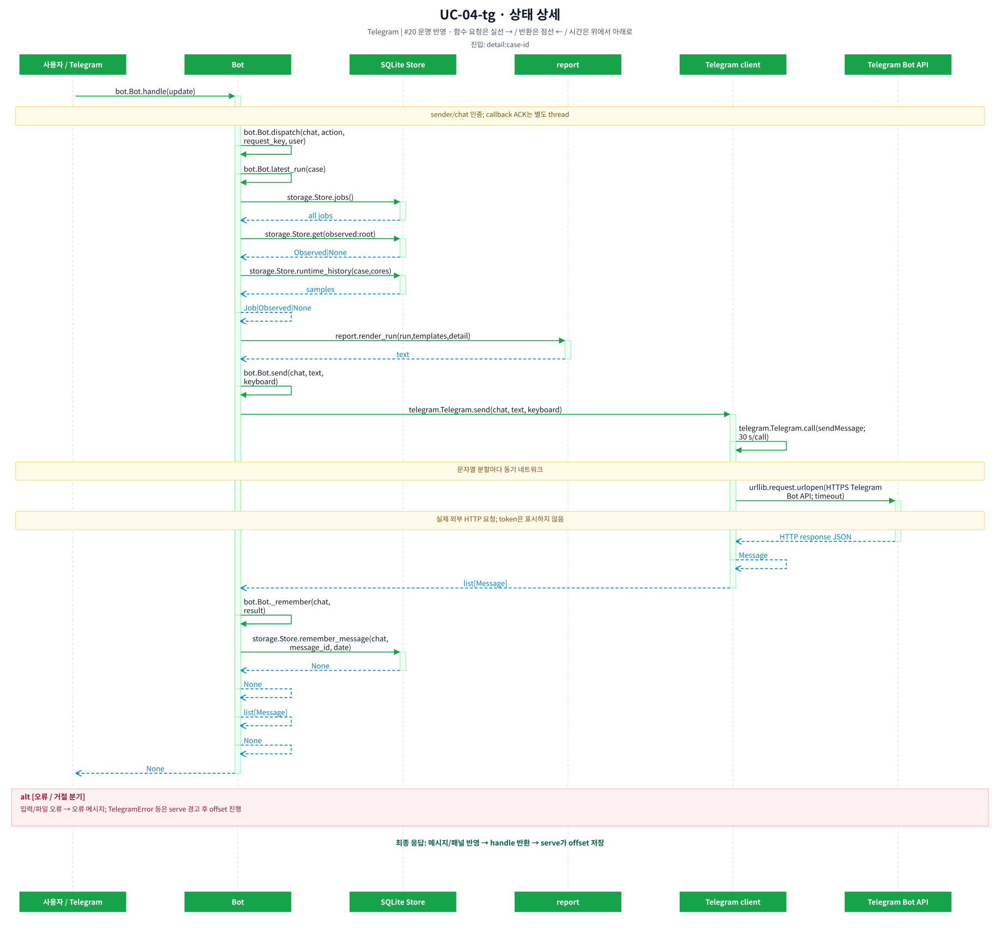

[SVG 원본 확대](../diagrams/UC-04-tg.svg)

**정상 결과:** 메시지/패널 반영 → handle 반환 → serve가 offset 저장.
**실패/취소:** 입력/파일 오류 → 오류 메시지; TelegramError 등은 serve 경고 후 offset 진행.

**코드 연결:** [bot.Bot.handle](../../cfd_bot/bot.py#L298), [bot.Bot.dispatch](../../cfd_bot/bot.py#L340), [bot.Bot.latest_run](../../cfd_bot/bot.py#L284), [storage.Store.jobs](../../cfd_bot/storage.py#L154), [storage.Store.get](../../cfd_bot/storage.py#L115), [storage.Store.runtime_history](../../cfd_bot/storage.py#L342), [report.render_run](../../cfd_bot/report.py#L116), [bot.Bot.send](../../cfd_bot/bot.py#L85), [telegram.Telegram.send](../../cfd_bot/telegram.py#L102), [telegram.Telegram.call](../../cfd_bot/telegram.py#L47), [bot.Bot._remember](../../cfd_bot/bot.py#L73), [storage.Store.remember_message](../../cfd_bot/storage.py#L462).

**관련 검증:** [test_ticket_chat.py](../../tests/test_ticket_chat.py), [test_gui.py](../../tests/test_gui.py), [test_web.py](../../tests/test_web.py).

## UC-05-tg — Residual 조회

진입: `residual:case-id[:name]`.

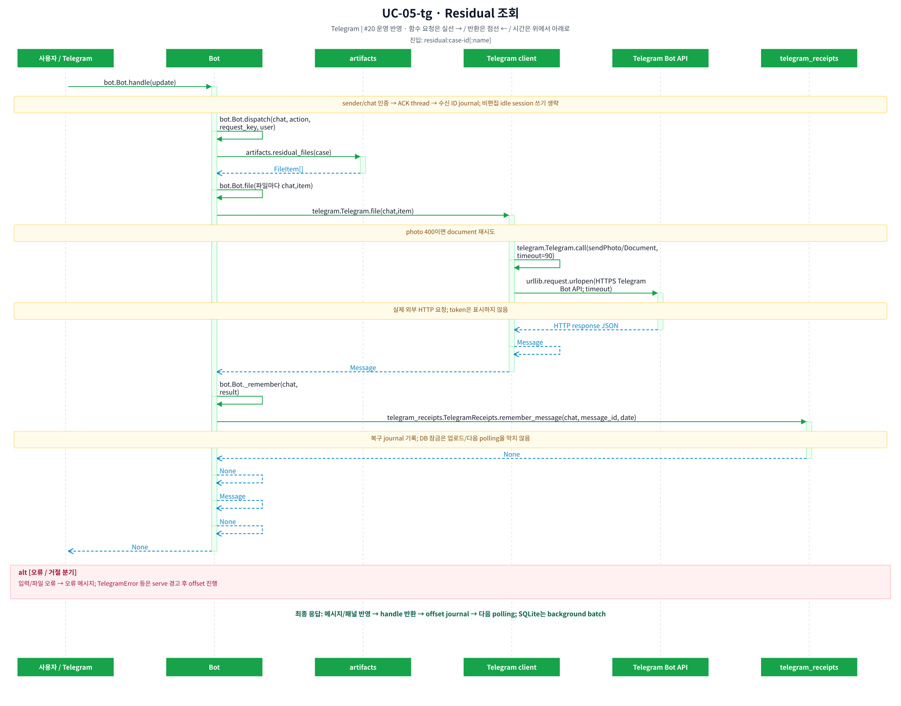

[SVG 원본 확대](../diagrams/UC-05-tg.svg)

**정상 결과:** 메시지/패널 반영 → handle 반환 → serve가 offset 저장.
**실패/취소:** 입력/파일 오류 → 오류 메시지; TelegramError 등은 serve 경고 후 offset 진행.

**코드 연결:** [bot.Bot.handle](../../cfd_bot/bot.py#L298), [bot.Bot.dispatch](../../cfd_bot/bot.py#L340), [artifacts.residual_files](../../cfd_bot/artifacts.py#L72), [bot.Bot.file](../../cfd_bot/bot.py#L91), [telegram.Telegram.file](../../cfd_bot/telegram.py#L115), [telegram.Telegram.call](../../cfd_bot/telegram.py#L47).

**관련 검증:** [test_residual.py](../../tests/test_residual.py).

## UC-06-tg — 결과 파일 조회

진입: `export:case-id[:name]`.

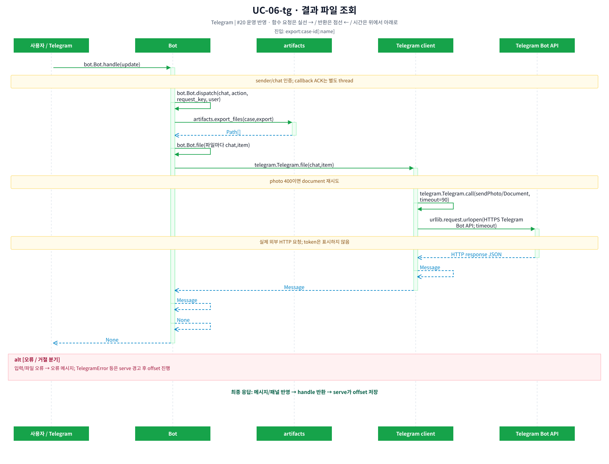

[SVG 원본 확대](../diagrams/UC-06-tg.svg)

**정상 결과:** 메시지/패널 반영 → handle 반환 → serve가 offset 저장.
**실패/취소:** 입력/파일 오류 → 오류 메시지; TelegramError 등은 serve 경고 후 offset 진행.

**코드 연결:** [bot.Bot.handle](../../cfd_bot/bot.py#L298), [bot.Bot.dispatch](../../cfd_bot/bot.py#L340), [artifacts.export_files](../../cfd_bot/artifacts.py#L15), [bot.Bot.file](../../cfd_bot/bot.py#L91), [telegram.Telegram.file](../../cfd_bot/telegram.py#L115), [telegram.Telegram.call](../../cfd_bot/telegram.py#L47).

**관련 검증:** [test_web.py](../../tests/test_web.py), [test_core.py](../../tests/test_core.py).

## UC-07-tg — 티켓 목록·다중 선택

진입: `/tickets /ticket tickets`.

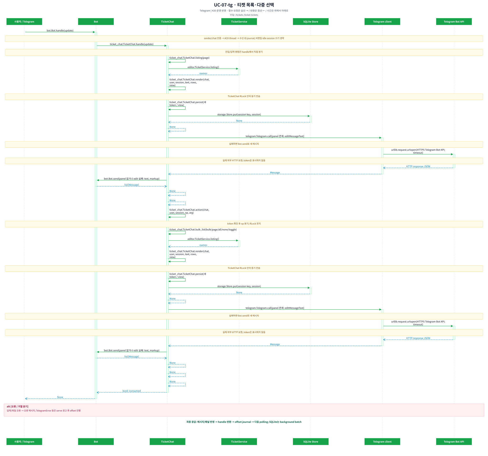

[SVG 원본 확대](../diagrams/UC-07-tg.svg)

**정상 결과:** 메시지/패널 반영 → handle 반환 → serve가 offset 저장.
**실패/취소:** 입력/파일 오류 → 오류 메시지; TelegramError 등은 serve 경고 후 offset 진행.

**코드 연결:** [bot.Bot.handle](../../cfd_bot/bot.py#L298), [ticket_chat.TicketChat.handle](../../cfd_bot/ticket_chat.py#L134), [ticket_chat.TicketChat.listing](../../cfd_bot/ticket_chat.py#L227), [editor.TicketService.listing](../../cfd_bot/editor.py#L328), [ticket_chat.TicketChat.render](../../cfd_bot/ticket_chat.py#L96), [ticket_chat.TicketChat.persist](../../cfd_bot/ticket_chat.py#L77), [storage.Store.put](../../cfd_bot/storage.py#L140), [telegram.Telegram.call](../../cfd_bot/telegram.py#L47), [bot.Bot.send](../../cfd_bot/bot.py#L85), [ticket_chat.TicketChat.action](../../cfd_bot/ticket_chat.py#L997), [ticket_chat.TicketChat.bulk_list](../../cfd_bot/ticket_chat.py#L241).

**관련 검증:** [test_ticket_chat.py](../../tests/test_ticket_chat.py), [test_gui.py](../../tests/test_gui.py), [test_web.py](../../tests/test_web.py).

## UC-08-tg — 새 티켓

진입: `new`.

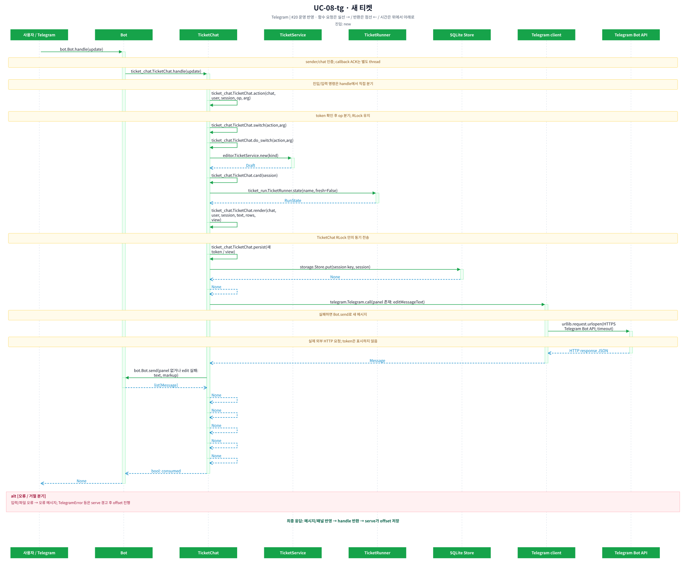

[SVG 원본 확대](../diagrams/UC-08-tg.svg)

**정상 결과:** 메시지/패널 반영 → handle 반환 → serve가 offset 저장.
**실패/취소:** 입력/파일 오류 → 오류 메시지; TelegramError 등은 serve 경고 후 offset 진행.

**코드 연결:** [bot.Bot.handle](../../cfd_bot/bot.py#L298), [ticket_chat.TicketChat.handle](../../cfd_bot/ticket_chat.py#L134), [ticket_chat.TicketChat.action](../../cfd_bot/ticket_chat.py#L997), [ticket_chat.TicketChat.switch](../../cfd_bot/ticket_chat.py#L912), [ticket_chat.TicketChat.do_switch](../../cfd_bot/ticket_chat.py#L923), [editor.TicketService.new](../../cfd_bot/editor.py#L353), [ticket_chat.TicketChat.card](../../cfd_bot/ticket_chat.py#L296), [ticket_run.TicketRunner.state](../../cfd_bot/ticket_run.py#L146), [ticket_chat.TicketChat.render](../../cfd_bot/ticket_chat.py#L96), [ticket_chat.TicketChat.persist](../../cfd_bot/ticket_chat.py#L77), [storage.Store.put](../../cfd_bot/storage.py#L140), [telegram.Telegram.call](../../cfd_bot/telegram.py#L47), [bot.Bot.send](../../cfd_bot/bot.py#L85).

**관련 검증:** [test_ticket_chat.py](../../tests/test_ticket_chat.py), [test_gui.py](../../tests/test_gui.py), [test_web.py](../../tests/test_web.py).

## UC-09-tg — 티켓 열기

진입: `open`.

[SVG 원본 확대](../diagrams/UC-09-tg.svg)

**정상 결과:** 메시지/패널 반영 → handle 반환 → serve가 offset 저장.
**실패/취소:** 입력/파일 오류 → 오류 메시지; TelegramError 등은 serve 경고 후 offset 진행.

**코드 연결:** [bot.Bot.handle](../../cfd_bot/bot.py#L298), [ticket_chat.TicketChat.handle](../../cfd_bot/ticket_chat.py#L134), [ticket_chat.TicketChat.action](../../cfd_bot/ticket_chat.py#L997), [ticket_chat.TicketChat.switch](../../cfd_bot/ticket_chat.py#L912), [ticket_chat.TicketChat.do_switch](../../cfd_bot/ticket_chat.py#L923), [editor.TicketService.open](../../cfd_bot/editor.py#L344), [ticket_chat.TicketChat.card](../../cfd_bot/ticket_chat.py#L296), [ticket_run.TicketRunner.state](../../cfd_bot/ticket_run.py#L146), [ticket_chat.TicketChat.render](../../cfd_bot/ticket_chat.py#L96), [ticket_chat.TicketChat.persist](../../cfd_bot/ticket_chat.py#L77), [storage.Store.put](../../cfd_bot/storage.py#L140), [telegram.Telegram.call](../../cfd_bot/telegram.py#L47), [bot.Bot.send](../../cfd_bot/bot.py#L85).

**관련 검증:** [test_ticket_chat.py](../../tests/test_ticket_chat.py), [test_gui.py](../../tests/test_gui.py), [test_web.py](../../tests/test_web.py).

## UC-13-tg — 티켓 복제

진입: `duplicate`.

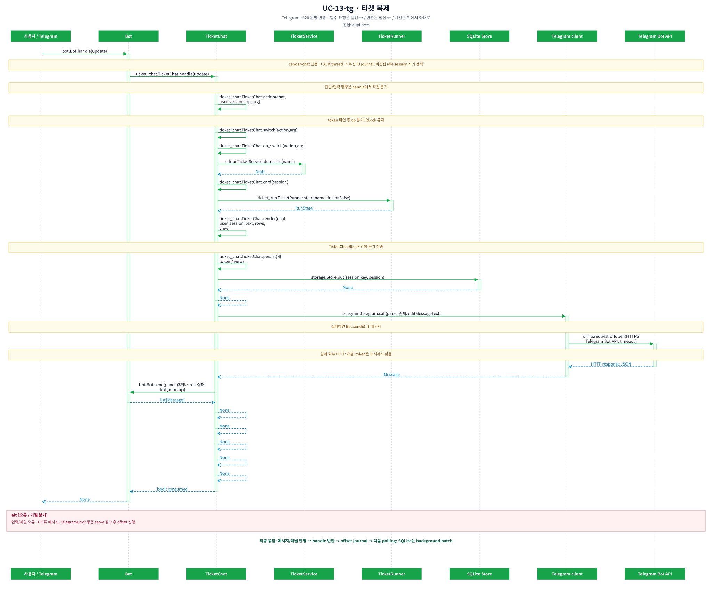

[SVG 원본 확대](../diagrams/UC-13-tg.svg)

**정상 결과:** 메시지/패널 반영 → handle 반환 → serve가 offset 저장.
**실패/취소:** 입력/파일 오류 → 오류 메시지; TelegramError 등은 serve 경고 후 offset 진행.

**코드 연결:** [bot.Bot.handle](../../cfd_bot/bot.py#L298), [ticket_chat.TicketChat.handle](../../cfd_bot/ticket_chat.py#L134), [ticket_chat.TicketChat.action](../../cfd_bot/ticket_chat.py#L997), [ticket_chat.TicketChat.switch](../../cfd_bot/ticket_chat.py#L912), [ticket_chat.TicketChat.do_switch](../../cfd_bot/ticket_chat.py#L923), [editor.TicketService.duplicate](../../cfd_bot/editor.py#L363), [ticket_chat.TicketChat.card](../../cfd_bot/ticket_chat.py#L296), [ticket_run.TicketRunner.state](../../cfd_bot/ticket_run.py#L146), [ticket_chat.TicketChat.render](../../cfd_bot/ticket_chat.py#L96), [ticket_chat.TicketChat.persist](../../cfd_bot/ticket_chat.py#L77), [storage.Store.put](../../cfd_bot/storage.py#L140), [telegram.Telegram.call](../../cfd_bot/telegram.py#L47), [bot.Bot.send](../../cfd_bot/bot.py#L85).

**관련 검증:** [test_ticket_chat.py](../../tests/test_ticket_chat.py), [test_gui.py](../../tests/test_gui.py), [test_web.py](../../tests/test_web.py).

## UC-10-tg — 기본·감시·알림·스크립트 편집

진입: `field / event / scripts / scriptdefault`.

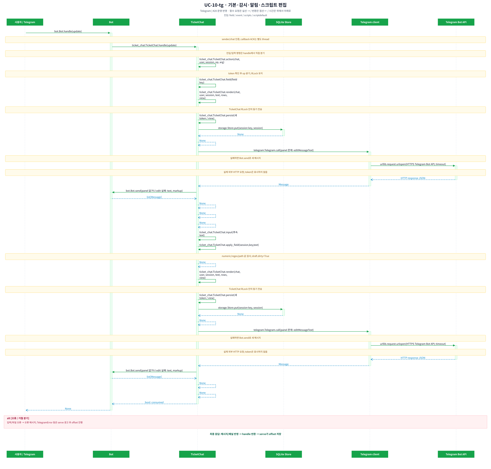

[SVG 원본 확대](../diagrams/UC-10-tg.svg)

**정상 결과:** 메시지/패널 반영 → handle 반환 → serve가 offset 저장.
**실패/취소:** 입력/파일 오류 → 오류 메시지; TelegramError 등은 serve 경고 후 offset 진행.

**코드 연결:** [bot.Bot.handle](../../cfd_bot/bot.py#L298), [ticket_chat.TicketChat.handle](../../cfd_bot/ticket_chat.py#L134), [ticket_chat.TicketChat.action](../../cfd_bot/ticket_chat.py#L997), [ticket_chat.TicketChat.field](../../cfd_bot/ticket_chat.py#L507), [ticket_chat.TicketChat.render](../../cfd_bot/ticket_chat.py#L96), [ticket_chat.TicketChat.persist](../../cfd_bot/ticket_chat.py#L77), [storage.Store.put](../../cfd_bot/storage.py#L140), [telegram.Telegram.call](../../cfd_bot/telegram.py#L47), [bot.Bot.send](../../cfd_bot/bot.py#L85), [ticket_chat.TicketChat.input](../../cfd_bot/ticket_chat.py#L627), [ticket_chat.TicketChat.apply_field](../../cfd_bot/ticket_chat.py#L526).

**관련 검증:** [test_ticket_chat.py](../../tests/test_ticket_chat.py), [test_gui.py](../../tests/test_gui.py), [test_web.py](../../tests/test_web.py).

## UC-11-tg — 티켓 검증

진입: `validate`.

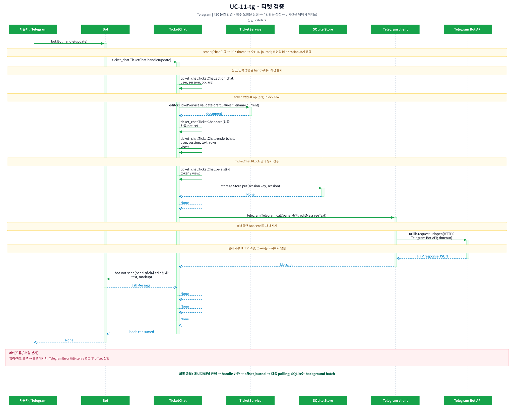

[SVG 원본 확대](../diagrams/UC-11-tg.svg)

**정상 결과:** 메시지/패널 반영 → handle 반환 → serve가 offset 저장.
**실패/취소:** 입력/파일 오류 → 오류 메시지; TelegramError 등은 serve 경고 후 offset 진행.

**코드 연결:** [bot.Bot.handle](../../cfd_bot/bot.py#L298), [ticket_chat.TicketChat.handle](../../cfd_bot/ticket_chat.py#L134), [ticket_chat.TicketChat.action](../../cfd_bot/ticket_chat.py#L997), [editor.TicketService.validate](../../cfd_bot/editor.py#L394), [ticket_chat.TicketChat.card](../../cfd_bot/ticket_chat.py#L296), [ticket_chat.TicketChat.render](../../cfd_bot/ticket_chat.py#L96), [ticket_chat.TicketChat.persist](../../cfd_bot/ticket_chat.py#L77), [storage.Store.put](../../cfd_bot/storage.py#L140), [telegram.Telegram.call](../../cfd_bot/telegram.py#L47), [bot.Bot.send](../../cfd_bot/bot.py#L85).

**관련 검증:** [test_gui.py](../../tests/test_gui.py).

## UC-12-tg — 저장·이름 변경

진입: `review → save`.

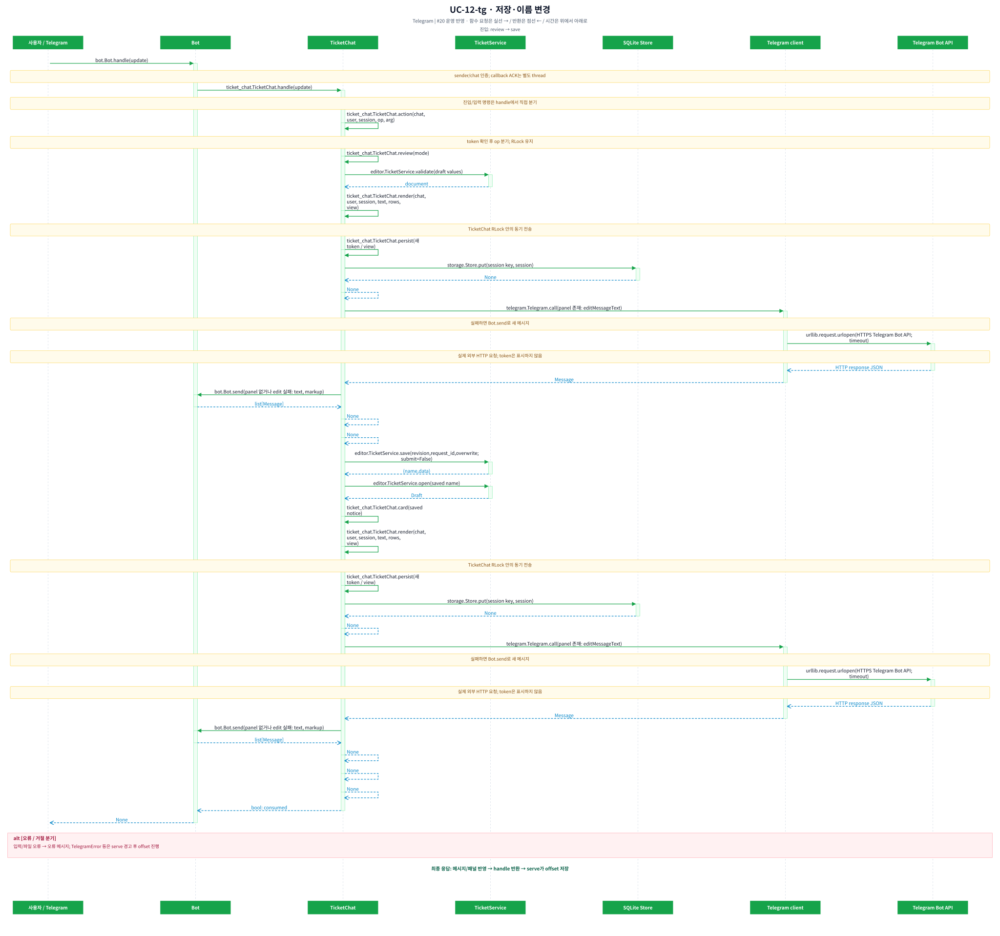

[SVG 원본 확대](../diagrams/UC-12-tg.svg)

**정상 결과:** 메시지/패널 반영 → handle 반환 → serve가 offset 저장.
**실패/취소:** 입력/파일 오류 → 오류 메시지; TelegramError 등은 serve 경고 후 offset 진행.

**코드 연결:** [bot.Bot.handle](../../cfd_bot/bot.py#L298), [ticket_chat.TicketChat.handle](../../cfd_bot/ticket_chat.py#L134), [ticket_chat.TicketChat.action](../../cfd_bot/ticket_chat.py#L997), [ticket_chat.TicketChat.review](../../cfd_bot/ticket_chat.py#L950), [editor.TicketService.validate](../../cfd_bot/editor.py#L394), [ticket_chat.TicketChat.render](../../cfd_bot/ticket_chat.py#L96), [ticket_chat.TicketChat.persist](../../cfd_bot/ticket_chat.py#L77), [storage.Store.put](../../cfd_bot/storage.py#L140), [telegram.Telegram.call](../../cfd_bot/telegram.py#L47), [bot.Bot.send](../../cfd_bot/bot.py#L85), [editor.TicketService.save](../../cfd_bot/editor.py#L424), [editor.TicketService.open](../../cfd_bot/editor.py#L344), [ticket_chat.TicketChat.card](../../cfd_bot/ticket_chat.py#L296).

**관련 검증:** [test_ticket_chat.py](../../tests/test_ticket_chat.py), [test_gui.py](../../tests/test_gui.py), [test_web.py](../../tests/test_web.py).

## UC-14-tg — 개별·다중 티켓 삭제

진입: `delete/breview → deleteyes/bdelete`.

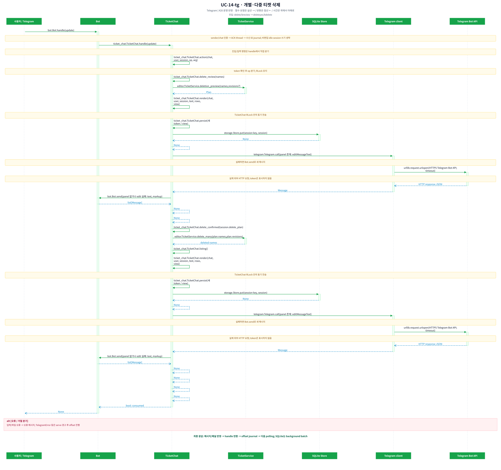

[SVG 원본 확대](../diagrams/UC-14-tg.svg)

**정상 결과:** 메시지/패널 반영 → handle 반환 → serve가 offset 저장.
**실패/취소:** 입력/파일 오류 → 오류 메시지; TelegramError 등은 serve 경고 후 offset 진행.

**코드 연결:** [bot.Bot.handle](../../cfd_bot/bot.py#L298), [ticket_chat.TicketChat.handle](../../cfd_bot/ticket_chat.py#L134), [ticket_chat.TicketChat.action](../../cfd_bot/ticket_chat.py#L997), [ticket_chat.TicketChat.delete_review](../../cfd_bot/ticket_chat.py#L257), [editor.TicketService.deletion_preview](../../cfd_bot/editor.py#L558), [ticket_chat.TicketChat.render](../../cfd_bot/ticket_chat.py#L96), [ticket_chat.TicketChat.persist](../../cfd_bot/ticket_chat.py#L77), [storage.Store.put](../../cfd_bot/storage.py#L140), [telegram.Telegram.call](../../cfd_bot/telegram.py#L47), [bot.Bot.send](../../cfd_bot/bot.py#L85), [ticket_chat.TicketChat.delete_confirmed](../../cfd_bot/ticket_chat.py#L271), [editor.TicketService.delete_many](../../cfd_bot/editor.py#L564), [ticket_chat.TicketChat.listing](../../cfd_bot/ticket_chat.py#L227).

**관련 검증:** [test_ticket_chat.py](../../tests/test_ticket_chat.py).

## UC-15-tg — 매크로 검색·필터·취소

진입: `scan / stopscan`.

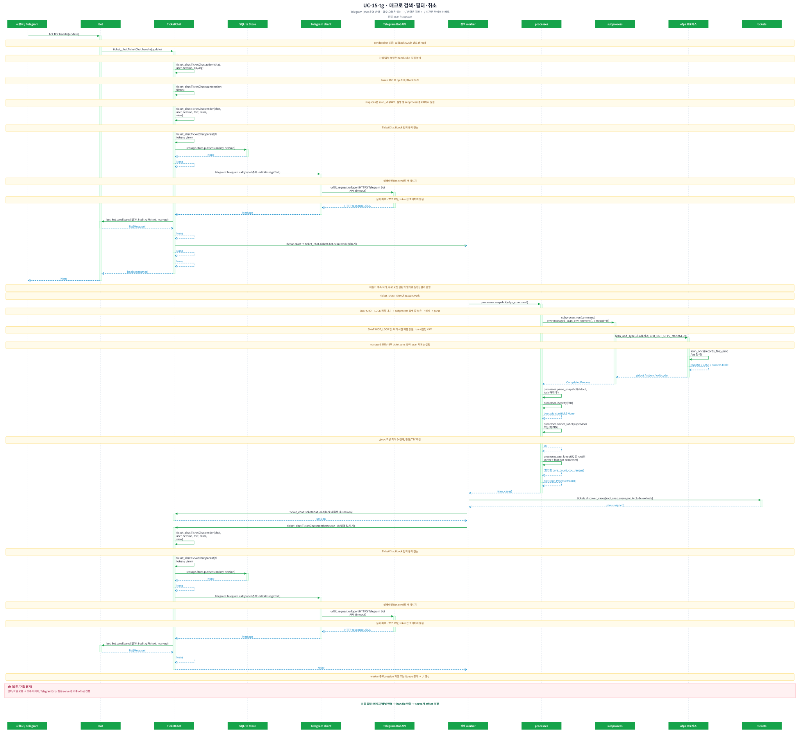

[SVG 원본 확대](../diagrams/UC-15-tg.svg)

**정상 결과:** 메시지/패널 반영 → handle 반환 → serve가 offset 저장.
**실패/취소:** 입력/파일 오류 → 오류 메시지; TelegramError 등은 serve 경고 후 offset 진행.

**코드 연결:** [bot.Bot.handle](../../cfd_bot/bot.py#L298), [ticket_chat.TicketChat.handle](../../cfd_bot/ticket_chat.py#L134), [ticket_chat.TicketChat.action](../../cfd_bot/ticket_chat.py#L997), [ticket_chat.TicketChat.scan](../../cfd_bot/ticket_chat.py#L835), [ticket_chat.TicketChat.render](../../cfd_bot/ticket_chat.py#L96), [ticket_chat.TicketChat.persist](../../cfd_bot/ticket_chat.py#L77), [storage.Store.put](../../cfd_bot/storage.py#L140), [telegram.Telegram.call](../../cfd_bot/telegram.py#L47), [bot.Bot.send](../../cfd_bot/bot.py#L85), [ticket_chat.TicketChat.scan.work](../../cfd_bot/ticket_chat.py#L859), [processes.snapshot](../../cfd_bot/processes.py#L229), [processes.parse_snapshot](../../cfd_bot/processes.py#L177), [processes.identity](../../cfd_bot/processes.py#L25), [processes.owner_label](../../cfd_bot/processes.py#L87), [processes.cpu_layout](../../cfd_bot/processes.py#L140), [tickets.discover_cases](../../cfd_bot/tickets.py#L178), [ticket_chat.TicketChat.load](../../cfd_bot/ticket_chat.py#L68), [ticket_chat.TicketChat.members](../../cfd_bot/ticket_chat.py#L807).

**관련 검증:** [test_queue_tickets.py](../../tests/test_queue_tickets.py).

## UC-16-tg — 매크로 구성원 선택

진입: `members / remove`.

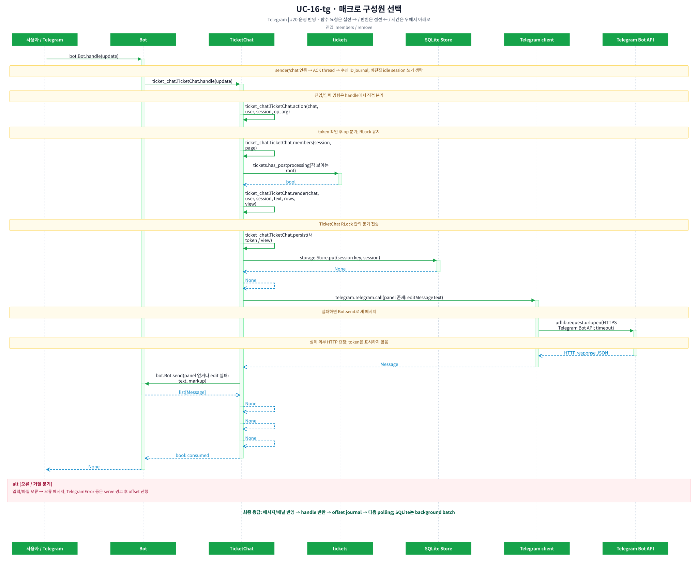

[SVG 원본 확대](../diagrams/UC-16-tg.svg)

**정상 결과:** 메시지/패널 반영 → handle 반환 → serve가 offset 저장.
**실패/취소:** 입력/파일 오류 → 오류 메시지; TelegramError 등은 serve 경고 후 offset 진행.

**코드 연결:** [bot.Bot.handle](../../cfd_bot/bot.py#L298), [ticket_chat.TicketChat.handle](../../cfd_bot/ticket_chat.py#L134), [ticket_chat.TicketChat.action](../../cfd_bot/ticket_chat.py#L997), [ticket_chat.TicketChat.members](../../cfd_bot/ticket_chat.py#L807), [tickets.has_postprocessing](../../cfd_bot/tickets.py#L125), [ticket_chat.TicketChat.render](../../cfd_bot/ticket_chat.py#L96), [ticket_chat.TicketChat.persist](../../cfd_bot/ticket_chat.py#L77), [storage.Store.put](../../cfd_bot/storage.py#L140), [telegram.Telegram.call](../../cfd_bot/telegram.py#L47), [bot.Bot.send](../../cfd_bot/bot.py#L85).

**관련 검증:** [test_queue_tickets.py](../../tests/test_queue_tickets.py).

## UC-17-tg — 실행·queue 이름·동적 macro 설정

진입: `execsource / cpupolicy / toggle / field / macrocores`.

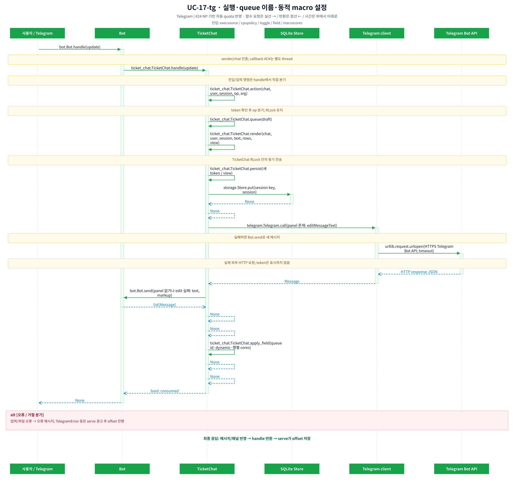

[SVG 원본 확대](../diagrams/UC-17-tg.svg)

**정상 결과:** 메시지/패널 반영 → handle 반환 → serve가 offset 저장.
**실패/취소:** 입력/파일 오류 → 오류 메시지; TelegramError 등은 serve 경고 후 offset 진행.

**코드 연결:** [bot.Bot.handle](../../cfd_bot/bot.py#L298), [ticket_chat.TicketChat.handle](../../cfd_bot/ticket_chat.py#L134), [ticket_chat.TicketChat.action](../../cfd_bot/ticket_chat.py#L997), [ticket_chat.TicketChat.queue](../../cfd_bot/ticket_chat.py#L400), [ticket_chat.TicketChat.render](../../cfd_bot/ticket_chat.py#L96), [ticket_chat.TicketChat.persist](../../cfd_bot/ticket_chat.py#L77), [storage.Store.put](../../cfd_bot/storage.py#L140), [telegram.Telegram.call](../../cfd_bot/telegram.py#L47), [bot.Bot.send](../../cfd_bot/bot.py#L85), [ticket_chat.TicketChat.apply_field](../../cfd_bot/ticket_chat.py#L526).

**관련 검증:** [test_execution_environment.py](../../tests/test_execution_environment.py), [test_gui.py](../../tests/test_gui.py), [test_named_queues.py](../../tests/test_named_queues.py).

## UC-18-tg — 즉시 실행·이름 있는 대기열 등록

진입: `runstate / runreview / runyes`.

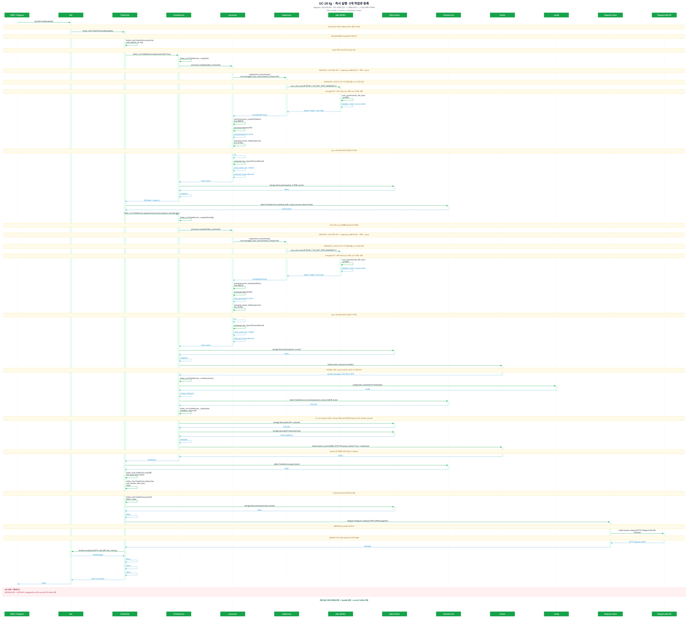

[SVG 원본 확대](../diagrams/UC-18-tg.svg)

**정상 결과:** 메시지/패널 반영 → handle 반환 → serve가 offset 저장.
**실패/취소:** 입력/파일 오류 → 오류 메시지; TelegramError 등은 serve 경고 후 offset 진행.

**코드 연결:** [bot.Bot.handle](../../cfd_bot/bot.py#L298), [ticket_chat.TicketChat.handle](../../cfd_bot/ticket_chat.py#L134), [ticket_chat.TicketChat.action](../../cfd_bot/ticket_chat.py#L997), [ticket_run.TicketRunner.state](../../cfd_bot/ticket_run.py#L146), [ticket_run.TicketRunner._snapshot](../../cfd_bot/ticket_run.py#L24), [processes.snapshot](../../cfd_bot/processes.py#L229), [processes.parse_snapshot](../../cfd_bot/processes.py#L177), [processes.identity](../../cfd_bot/processes.py#L25), [processes.owner_label](../../cfd_bot/processes.py#L87), [processes.cpu_layout](../../cfd_bot/processes.py#L140), [storage.Store.put](../../cfd_bot/storage.py#L140), [editor.TicketService.save](../../cfd_bot/editor.py#L424), [ticket_run.TicketRunner.request](../../cfd_bot/ticket_run.py#L195), [tickets.ticket_lock](../../cfd_bot/tickets.py#L31), [ticket_run.TicketRunner._members](../../cfd_bot/ticket_run.py#L34), [config.load_case](../../cfd_bot/config.py#L146), [editor.TicketService.revision](../../cfd_bot/editor.py#L333), [ticket_run.TicketRunner._state](../../cfd_bot/ticket_run.py#L109), [storage.Store.jobs](../../cfd_bot/storage.py#L154), [storage.Store.get](../../cfd_bot/storage.py#L115), [ticket_run.TicketRunner._capacity](../../cfd_bot/ticket_run.py#L58), [tickets.atomic_json](../../cfd_bot/tickets.py#L52), [editor.TicketService.open](../../cfd_bot/editor.py#L344), [ticket_chat.TicketChat.card](../../cfd_bot/ticket_chat.py#L296), [ticket_chat.TicketChat.render](../../cfd_bot/ticket_chat.py#L96), [ticket_chat.TicketChat.persist](../../cfd_bot/ticket_chat.py#L77), [telegram.Telegram.call](../../cfd_bot/telegram.py#L47), [bot.Bot.send](../../cfd_bot/bot.py#L85).

**관련 검증:** [test_ticket_run.py](../../tests/test_ticket_run.py), [test_named_queues.py](../../tests/test_named_queues.py).

## UC-18-legacy-tg — 케이스 메뉴 실행(우회 경로)

진입: `prepare:cid → enqueue:cid`.

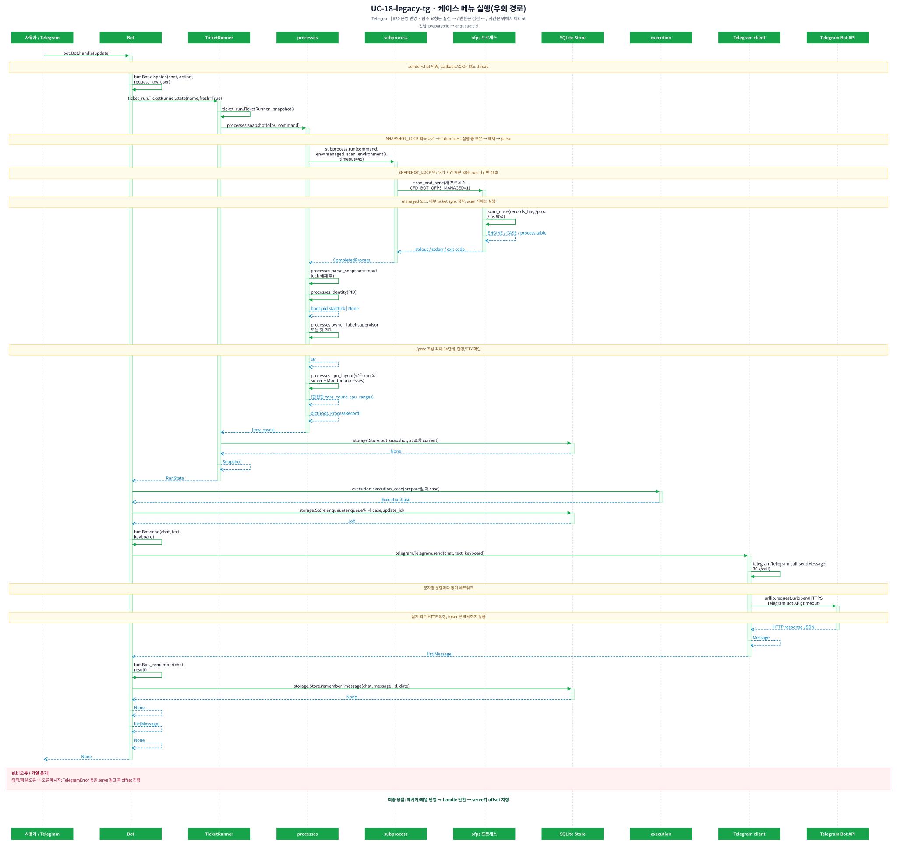

[SVG 원본 확대](../diagrams/UC-18-legacy-tg.svg)

**정상 결과:** 메시지/패널 반영 → handle 반환 → serve가 offset 저장.
**실패/취소:** 입력/파일 오류 → 오류 메시지; TelegramError 등은 serve 경고 후 offset 진행.

**코드 연결:** [bot.Bot.handle](../../cfd_bot/bot.py#L298), [bot.Bot.dispatch](../../cfd_bot/bot.py#L340), [ticket_run.TicketRunner.state](../../cfd_bot/ticket_run.py#L146), [ticket_run.TicketRunner._snapshot](../../cfd_bot/ticket_run.py#L24), [processes.snapshot](../../cfd_bot/processes.py#L229), [processes.parse_snapshot](../../cfd_bot/processes.py#L177), [processes.identity](../../cfd_bot/processes.py#L25), [processes.owner_label](../../cfd_bot/processes.py#L87), [processes.cpu_layout](../../cfd_bot/processes.py#L140), [storage.Store.put](../../cfd_bot/storage.py#L140), [execution.execution_case](../../cfd_bot/execution.py#L195), [storage.Store.enqueue](../../cfd_bot/storage.py#L236), [bot.Bot.send](../../cfd_bot/bot.py#L85), [telegram.Telegram.send](../../cfd_bot/telegram.py#L102), [telegram.Telegram.call](../../cfd_bot/telegram.py#L47), [bot.Bot._remember](../../cfd_bot/bot.py#L73), [storage.Store.remember_message](../../cfd_bot/storage.py#L462).

**관련 검증:** [test_ticket_run.py](../../tests/test_ticket_run.py), [test_named_queues.py](../../tests/test_named_queues.py).

## UC-19-tg — 큐·이력·매크로 진행

진입: `queue`.

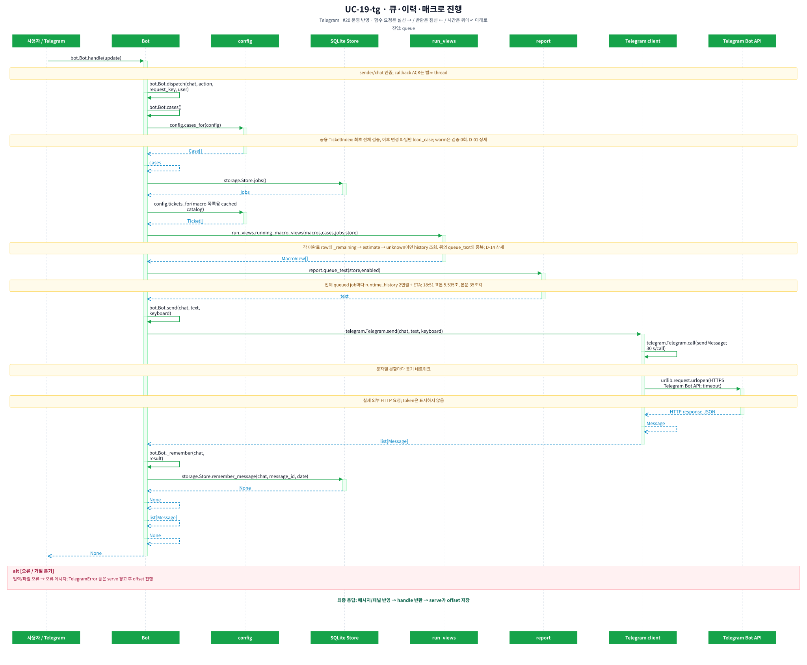

[SVG 원본 확대](../diagrams/UC-19-tg.svg)

**정상 결과:** 메시지/패널 반영 → handle 반환 → serve가 offset 저장.
**실패/취소:** 입력/파일 오류 → 오류 메시지; TelegramError 등은 serve 경고 후 offset 진행.

**내부 로직·비용:** 전체 큐 본문은 별도 페이지 제한 없이 순차 sendMessage한다. 마지막 조각에만 keyboard가 붙는다. [큐 내부 상세](../diagrams/D-13.svg).

**코드 연결:** [bot.Bot.handle](../../cfd_bot/bot.py#L298), [bot.Bot.dispatch](../../cfd_bot/bot.py#L340), [bot.Bot.cases](../../cfd_bot/bot.py#L65), [config.cases_for](../../cfd_bot/config.py#L554), [storage.Store.jobs](../../cfd_bot/storage.py#L154), [config.tickets_for](../../cfd_bot/config.py#L586), [run_views.running_macro_views](../../cfd_bot/run_views.py#L74), [report.queue_text](../../cfd_bot/report.py#L151), [bot.Bot.send](../../cfd_bot/bot.py#L85), [telegram.Telegram.send](../../cfd_bot/telegram.py#L102), [telegram.Telegram.call](../../cfd_bot/telegram.py#L47), [bot.Bot._remember](../../cfd_bot/bot.py#L73), [storage.Store.remember_message](../../cfd_bot/storage.py#L462).

**관련 검증:** [test_run_views.py](../../tests/test_run_views.py), [test_named_queues.py](../../tests/test_named_queues.py).

## UC-20-tg — 자동 시작 pause/resume

진입: `pause/resume`.

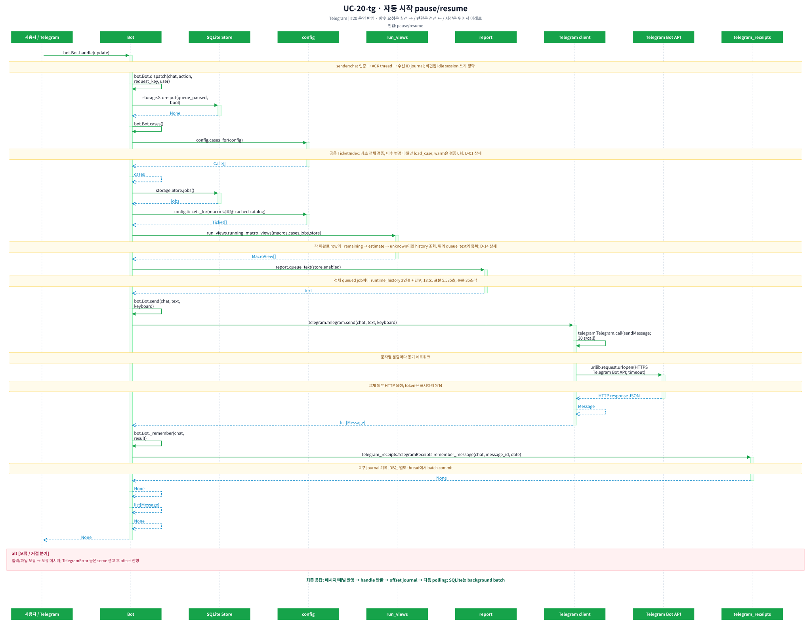

[SVG 원본 확대](../diagrams/UC-20-tg.svg)

**정상 결과:** 메시지/패널 반영 → handle 반환 → serve가 offset 저장.
**실패/취소:** 입력/파일 오류 → 오류 메시지; TelegramError 등은 serve 경고 후 offset 진행.

**코드 연결:** [bot.Bot.handle](../../cfd_bot/bot.py#L298), [bot.Bot.dispatch](../../cfd_bot/bot.py#L340), [storage.Store.put](../../cfd_bot/storage.py#L140), [bot.Bot.cases](../../cfd_bot/bot.py#L65), [config.cases_for](../../cfd_bot/config.py#L554), [storage.Store.jobs](../../cfd_bot/storage.py#L154), [config.tickets_for](../../cfd_bot/config.py#L586), [run_views.running_macro_views](../../cfd_bot/run_views.py#L74), [report.queue_text](../../cfd_bot/report.py#L151), [bot.Bot.send](../../cfd_bot/bot.py#L85), [telegram.Telegram.send](../../cfd_bot/telegram.py#L102), [telegram.Telegram.call](../../cfd_bot/telegram.py#L47), [bot.Bot._remember](../../cfd_bot/bot.py#L73), [storage.Store.remember_message](../../cfd_bot/storage.py#L462).

**관련 검증:** [test_core.py](../../tests/test_core.py).

## UC-21-tg — 대기 작업 선택·취소

진입: `qselect/qall/qnone/qcancel/qcancelyes/cancel:id`.

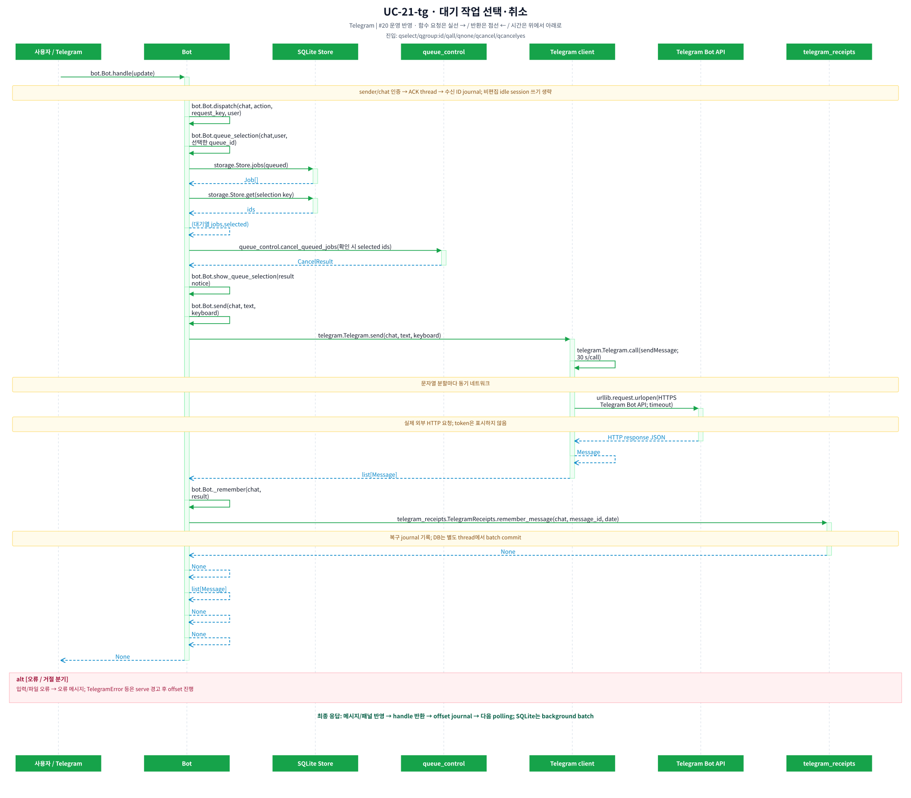

[SVG 원본 확대](../diagrams/UC-21-tg.svg)

**정상 결과:** 메시지/패널 반영 → handle 반환 → serve가 offset 저장.
**실패/취소:** 입력/파일 오류 → 오류 메시지; TelegramError 등은 serve 경고 후 offset 진행.

**코드 연결:** [bot.Bot.handle](../../cfd_bot/bot.py#L298), [bot.Bot.dispatch](../../cfd_bot/bot.py#L340), [bot.Bot.queue_selection](../../cfd_bot/bot.py#L147), [storage.Store.jobs](../../cfd_bot/storage.py#L154), [storage.Store.get](../../cfd_bot/storage.py#L115), [queue_control.cancel_queued_jobs](../../cfd_bot/queue_control.py#L8), [bot.Bot.show_queue_selection](../../cfd_bot/bot.py#L155), [bot.Bot.send](../../cfd_bot/bot.py#L85), [telegram.Telegram.send](../../cfd_bot/telegram.py#L102), [telegram.Telegram.call](../../cfd_bot/telegram.py#L47), [bot.Bot._remember](../../cfd_bot/bot.py#L73), [storage.Store.remember_message](../../cfd_bot/storage.py#L462).

**관련 검증:** [test_core.py](../../tests/test_core.py), [test_web.py](../../tests/test_web.py).

## UC-22-tg — 실패 패턴 템플릿

진입: `templates/template/savetemplate`.

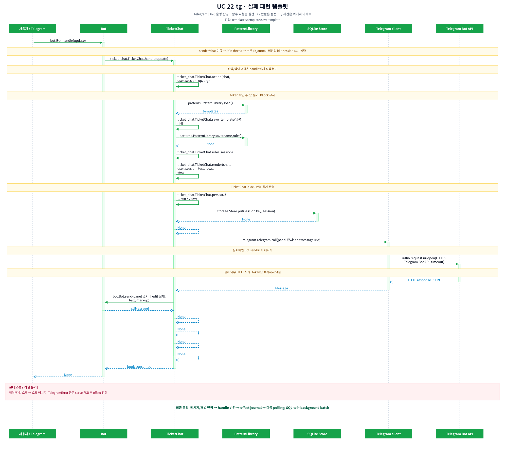

[SVG 원본 확대](../diagrams/UC-22-tg.svg)

**정상 결과:** 메시지/패널 반영 → handle 반환 → serve가 offset 저장.
**실패/취소:** 입력/파일 오류 → 오류 메시지; TelegramError 등은 serve 경고 후 offset 진행.

**코드 연결:** [bot.Bot.handle](../../cfd_bot/bot.py#L298), [ticket_chat.TicketChat.handle](../../cfd_bot/ticket_chat.py#L134), [ticket_chat.TicketChat.action](../../cfd_bot/ticket_chat.py#L997), [patterns.PatternLibrary.load](../../cfd_bot/patterns.py#L40), [ticket_chat.TicketChat.save_template](../../cfd_bot/ticket_chat.py#L800), [patterns.PatternLibrary.save](../../cfd_bot/patterns.py#L60), [ticket_chat.TicketChat.rules](../../cfd_bot/ticket_chat.py#L383), [ticket_chat.TicketChat.render](../../cfd_bot/ticket_chat.py#L96), [ticket_chat.TicketChat.persist](../../cfd_bot/ticket_chat.py#L77), [storage.Store.put](../../cfd_bot/storage.py#L140), [telegram.Telegram.call](../../cfd_bot/telegram.py#L47), [bot.Bot.send](../../cfd_bot/bot.py#L85).

**관련 검증:** [test_gui.py](../../tests/test_gui.py).

## UC-23-tg — 폴더·로그·Residual 선택

진입: `browse/bd/bf/bapply/bcancel`.

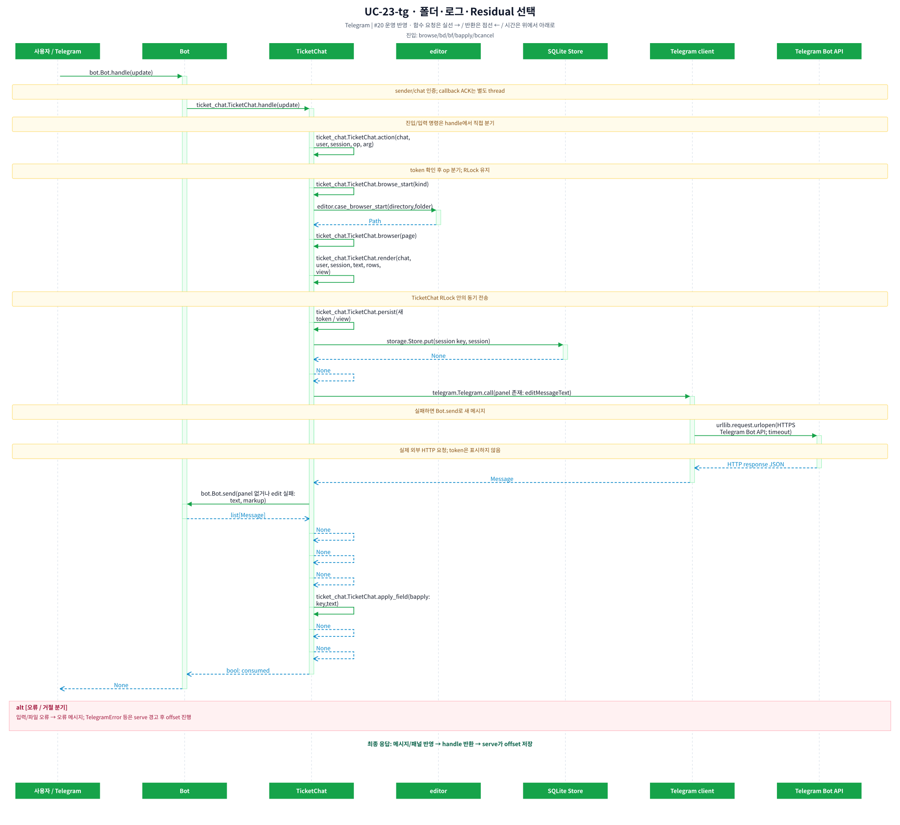

[SVG 원본 확대](../diagrams/UC-23-tg.svg)

**정상 결과:** 메시지/패널 반영 → handle 반환 → serve가 offset 저장.
**실패/취소:** 입력/파일 오류 → 오류 메시지; TelegramError 등은 serve 경고 후 offset 진행.

**코드 연결:** [bot.Bot.handle](../../cfd_bot/bot.py#L298), [ticket_chat.TicketChat.handle](../../cfd_bot/ticket_chat.py#L134), [ticket_chat.TicketChat.action](../../cfd_bot/ticket_chat.py#L997), [ticket_chat.TicketChat.browse_start](../../cfd_bot/ticket_chat.py#L672), [editor.case_browser_start](../../cfd_bot/editor.py#L29), [ticket_chat.TicketChat.browser](../../cfd_bot/ticket_chat.py#L713), [ticket_chat.TicketChat.render](../../cfd_bot/ticket_chat.py#L96), [ticket_chat.TicketChat.persist](../../cfd_bot/ticket_chat.py#L77), [storage.Store.put](../../cfd_bot/storage.py#L140), [telegram.Telegram.call](../../cfd_bot/telegram.py#L47), [bot.Bot.send](../../cfd_bot/bot.py#L85), [ticket_chat.TicketChat.apply_field](../../cfd_bot/ticket_chat.py#L526).

**관련 검증:** [test_ticket_chat.py](../../tests/test_ticket_chat.py), [test_web.py](../../tests/test_web.py).

## UC-24-tg — 입력 취소·초안 폐기·검색 취소

진입: `/cancel / backinput / discard / stopscan`.

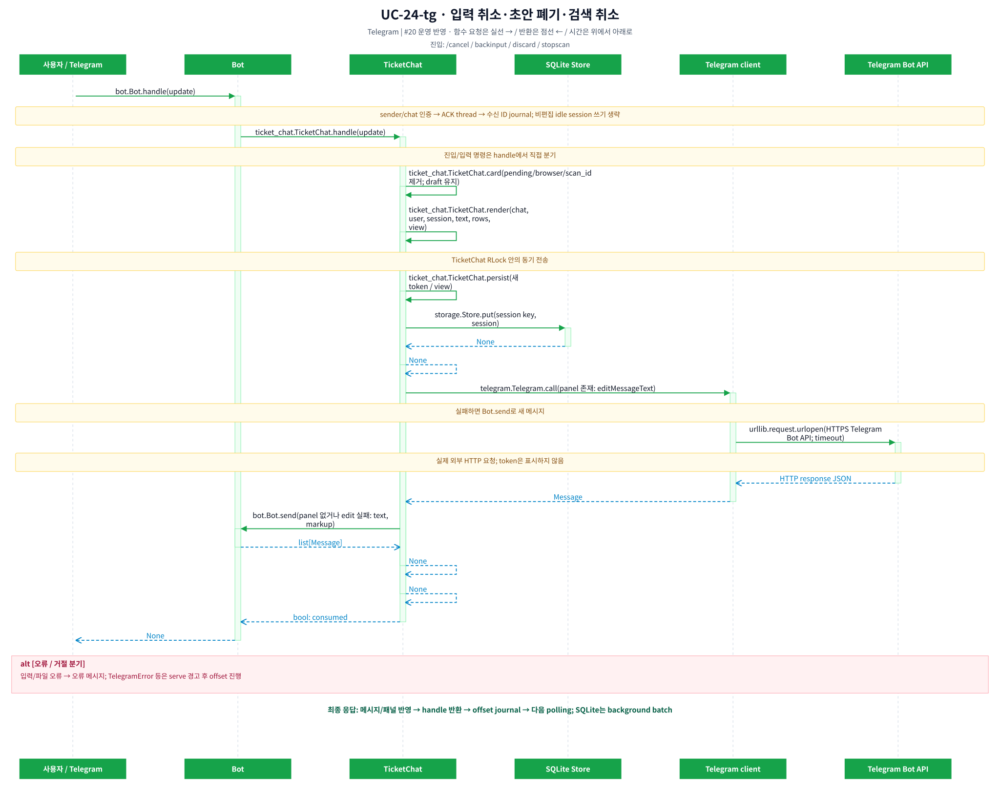

[SVG 원본 확대](../diagrams/UC-24-tg.svg)

**정상 결과:** 메시지/패널 반영 → handle 반환 → serve가 offset 저장.
**실패/취소:** 입력/파일 오류 → 오류 메시지; TelegramError 등은 serve 경고 후 offset 진행.

**코드 연결:** [bot.Bot.handle](../../cfd_bot/bot.py#L298), [ticket_chat.TicketChat.handle](../../cfd_bot/ticket_chat.py#L134), [ticket_chat.TicketChat.card](../../cfd_bot/ticket_chat.py#L296), [ticket_chat.TicketChat.render](../../cfd_bot/ticket_chat.py#L96), [ticket_chat.TicketChat.persist](../../cfd_bot/ticket_chat.py#L77), [storage.Store.put](../../cfd_bot/storage.py#L140), [telegram.Telegram.call](../../cfd_bot/telegram.py#L47), [bot.Bot.send](../../cfd_bot/bot.py#L85).

**관련 검증:** [test_ticket_chat.py](../../tests/test_ticket_chat.py), [test_gui.py](../../tests/test_gui.py).

## UC-25-tg — 대화 일괄 정리

진입: `/clean`.

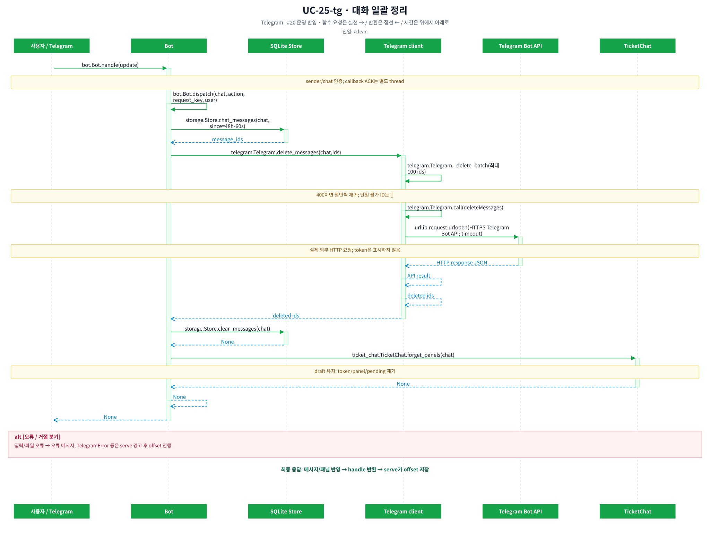

[SVG 원본 확대](../diagrams/UC-25-tg.svg)

**정상 결과:** 메시지/패널 반영 → handle 반환 → serve가 offset 저장.
**실패/취소:** 입력/파일 오류 → 오류 메시지; TelegramError 등은 serve 경고 후 offset 진행.

**코드 연결:** [bot.Bot.handle](../../cfd_bot/bot.py#L298), [bot.Bot.dispatch](../../cfd_bot/bot.py#L340), [storage.Store.chat_messages](../../cfd_bot/storage.py#L477), [telegram.Telegram.delete_messages](../../cfd_bot/telegram.py#L139), [telegram.Telegram._delete_batch](../../cfd_bot/telegram.py#L150), [telegram.Telegram.call](../../cfd_bot/telegram.py#L47), [storage.Store.clear_messages](../../cfd_bot/storage.py#L491), [ticket_chat.TicketChat.forget_panels](../../cfd_bot/ticket_chat.py#L81).

**관련 검증:** [test_core.py](../../tests/test_core.py).

## UC-10-exports-tg — 요청 데이터 정의 편집

진입: `exports / xe / xnew / xkind / xapply / xdelete`.

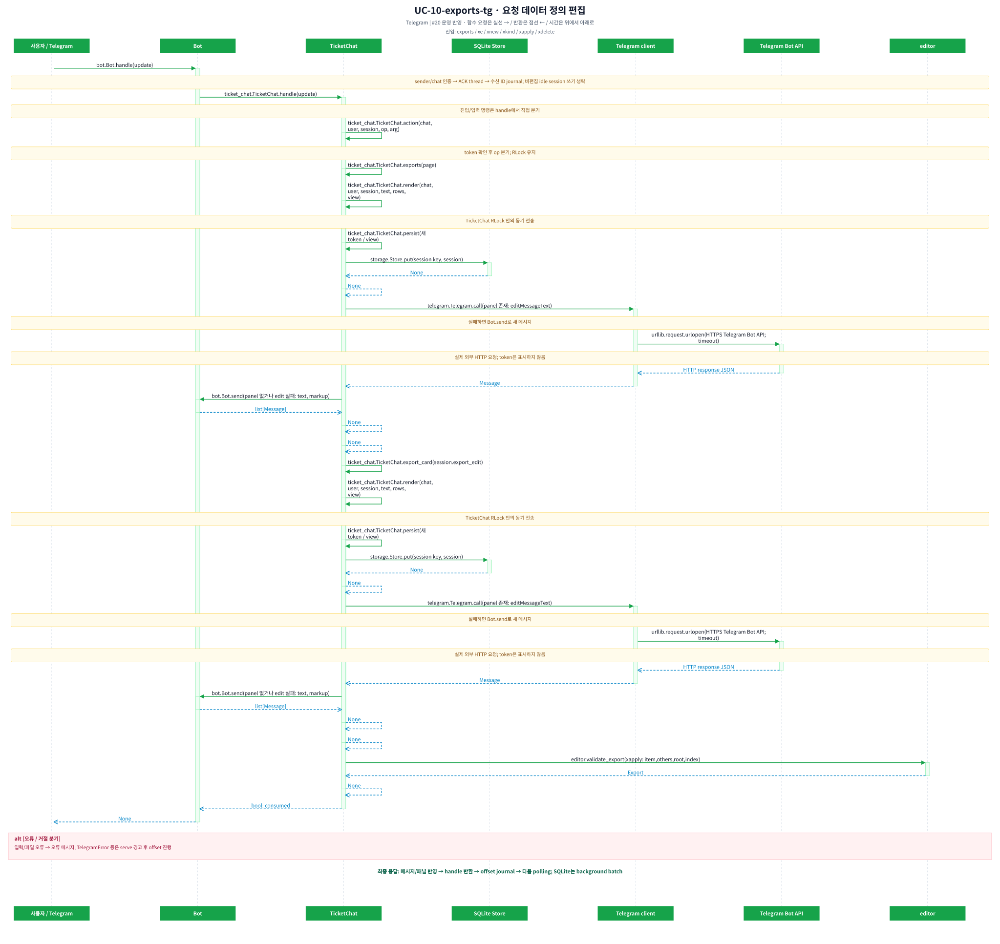

[SVG 원본 확대](../diagrams/UC-10-exports-tg.svg)

**정상 결과:** 메시지/패널 반영 → handle 반환 → serve가 offset 저장.
**실패/취소:** 입력/파일 오류 → 오류 메시지; TelegramError 등은 serve 경고 후 offset 진행.

**코드 연결:** [bot.Bot.handle](../../cfd_bot/bot.py#L298), [ticket_chat.TicketChat.handle](../../cfd_bot/ticket_chat.py#L134), [ticket_chat.TicketChat.action](../../cfd_bot/ticket_chat.py#L997), [ticket_chat.TicketChat.exports](../../cfd_bot/ticket_chat.py#L760), [ticket_chat.TicketChat.render](../../cfd_bot/ticket_chat.py#L96), [ticket_chat.TicketChat.persist](../../cfd_bot/ticket_chat.py#L77), [storage.Store.put](../../cfd_bot/storage.py#L140), [telegram.Telegram.call](../../cfd_bot/telegram.py#L47), [bot.Bot.send](../../cfd_bot/bot.py#L85), [ticket_chat.TicketChat.export_card](../../cfd_bot/ticket_chat.py#L771), [editor.validate_export](../../cfd_bot/editor.py#L584).

**관련 검증:** [test_ticket_chat.py](../../tests/test_ticket_chat.py), [test_gui.py](../../tests/test_gui.py), [test_web.py](../../tests/test_web.py).
