# Web LLD — 브라우저/HTTP별 함수 요청·응답

[전체 그림 목록](flows.md) · [공용 계약](../LLD.md)

## 진입·HTTP·화면 응답 규칙

`app.js:start → api(bootstrap) → api(cases) → render → refresh → 10초 timer`다. visible 상태이며 S.busy가 아닐 때 자동 갱신한다. refresh의 S.refreshing은 같은 탭 중복만 막는다. click은 S.busy/content.inert로 조작을 제한한다. input은 draft만 변경하며 API mutation과 다르다.

`Handler.do_GET/do_POST → handle_request → trusted → WebApp.get/post → respond → wfile.write`다. 각 HTTP 요청은 별도 thread지만 snapshot lock은 같은 web process 안에서 공유한다. `/api/file`만 Handler가 `WebApp.file`을 직접 호출한다. 다운로드 ZIP과 정적 파일은 allowlist로 제공한다.

| HTTP | 실제 분기 / 반환 | UC |
|---|---|---|
| GET /api/health | app/version/hostname | 27 |
| GET /api/bootstrap | csrf/default_directory/patterns | 01 |
| GET /api/overview | fresh + sync + live/tickets/queue/history/macros | 02,07,19 |
| GET /api/ticket | TicketService.open + cached state + postprocessed | 09 |
| GET /api/cases | case_rows | 03 |
| GET /api/detail | log/control/ETA/latest/history | 04 |
| GET /api/artifacts | groups/files/URL | 05,06 |
| GET /api/file | binary inline/attachment; 선언된 파일 재검증 | 05,06 |
| GET /api/browse /control | 목록(최대 1000) / control_times | 23,10 |
| POST /api/new /duplicate | 새 Draft / 복제 Draft | 08,13 |
| POST /api/validate /save | {valid:true} / 저장 후 Draft | 11,12 |
| POST /api/exports/validate | 정규화 Export | 10,11 |
| POST /api/delete/preview /delete | Plan / deleted names | 14 |
| POST /api/run | RunResult | 18 |
| POST /api/discover | cases/skipped/postprocessed | 15 |
| POST /api/patterns | 갱신 templates | 22 |
| POST /api/queue | pause/resume {ok:true}; cancel CancelResult; interrupt JobView | 20,21,28 |

403=Host/Origin/Fetch-Site/CSRF, 413=body 크기, 400=입력 타입·ValueError/OSError, 404=LookupError, 500=그 밖 예외다. browser.api는 non-2xx에서 Error를 던지고 click handler가 toast로 표시한다. overview 수집 실패는 HTTP 200+error와 이전 snapshot을 반환할 수 있다. refresh는 오류 표시를 유지한다. 클라이언트 fetch 자체에 timeout/AbortController는 없다. 서버 socket timeout 60초가 모든 domain 연산을 60초 안에 중단하는 것은 아니다.

stableOverview는 동일 실행의 일시적으로 사라진 ETA/progress를 유지한다. shape가 같으면 updateOverview가 기존 DOM을 수정한다. form은 polling 때문에 재생성하지 않는다. loadData는 detail/artifacts를 Promise.all로 요청하고 현재 선택 ID가 바뀌었으면 이전 응답을 버린다.

#18/#30 진단 로그는 basic에서 업무 경계·명시적 사건·예외를, detailed에서 내부 함수·분기까지 기록한다. [공통 로그 계약](../DIAGNOSTICS.md)과 [시퀀스별 이벤트 대응표](../analysis/diagnostic-flow-coverage.md)를 함께 읽는다.

내부 반복·파일 접근·잠금 범위는 [catalog LLD](../LLD.md#catalog), 현재 921행 매크로의 함수별 시간과 큐 응답량은 [운영 데이터 분석](../analysis/live-bottlenecks.md)에 있다. 그림의 보라색 loop는 함수 내부 반복이며 추가 함수가 아니다.

## 그림 바로가기

- [UC-01-web — 초기 화면](#uc-01)
- [UC-02-web — 대시보드·현황 갱신](#uc-02)
- [UC-03-web — 등록 케이스 목록](#uc-03)
- [UC-04-web — 상태 상세·ETA](#uc-04)
- [UC-05-web — Residual 조회](#uc-05)
- [UC-06-web — 결과 파일 조회](#uc-06)
- [UC-07-web — 티켓 목록·선택](#uc-07)
- [UC-08-web — 새 티켓](#uc-08)
- [UC-09-web — 티켓 열기](#uc-09)
- [UC-13-web — 티켓 복제](#uc-13)
- [UC-10-web — 기본·감시·알림·스크립트 편집](#uc-10)
- [UC-11-web — 티켓 검증](#uc-11)
- [UC-12-web — 저장·이름 변경](#uc-12)
- [UC-14-web — 개별·다중 티켓 삭제](#uc-14)
- [UC-15-web — 매크로 검색·필터](#uc-15)
- [UC-16-web — 매크로 구성원 순서·제거](#uc-16)
- [UC-17-web — 실행·queue 이름·동적 macro 설정](#uc-17)
- [UC-18-web — 즉시 실행·이름 있는 대기열 등록](#uc-18)
- [UC-19-web — 큐·이력·매크로 진행](#uc-19)
- [UC-20-web — 자동 시작 pause/resume](#uc-20)
- [UC-21-web — 대기열 카드별 선택·취소](#uc-21)
- [UC-22-web — 실패 패턴 템플릿](#uc-22)
- [UC-23-web — 폴더·파일 선택](#uc-23)
- [UC-24-web — 초안 폐기·modal 취소](#uc-24)
- [UC-28-web — 실행 중 managed 작업 중단](#uc-28)
- [UC-05-file-web — Residual 실제 HTTP 전송](#uc-05-file)
- [UC-06-file-web — 결과 파일 실제 HTTP 전송](#uc-06-file)
- [UC-10-exports-web — 요청 데이터 정의 검증](#uc-10-exports)

## UC-01-web — 초기 화면

진입: `start → /api/bootstrap`.

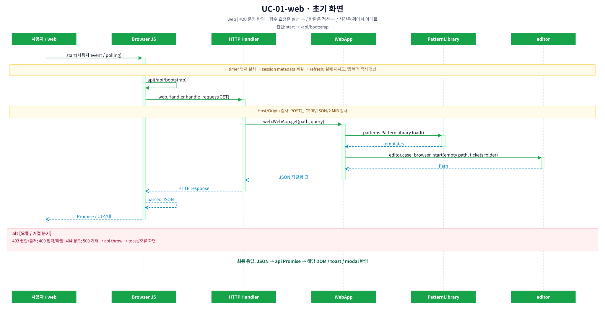

[SVG 원본 확대](../diagrams/UC-01-web.svg)

**정상 결과:** JSON → api Promise → 해당 DOM / toast / modal 반영.
**실패/취소:** 403 권한/출처; 400 입력/파일; 404 경로; 500 기타 → api throw → toast/오류 화면.

**코드 연결:** [web.Handler.handle_request](../../cfd_bot/web.py#L453), [web.WebApp.get](../../cfd_bot/web.py#L248), [patterns.PatternLibrary.load](../../cfd_bot/patterns.py#L40), [editor.case_browser_start](../../cfd_bot/editor.py#L29).

**관련 검증:** [test_ticket_chat.py](../../tests/test_ticket_chat.py), [test_gui.py](../../tests/test_gui.py), [test_web.py](../../tests/test_web.py).

## UC-02-web — 대시보드·현황 갱신

진입: `refresh → /api/overview`.

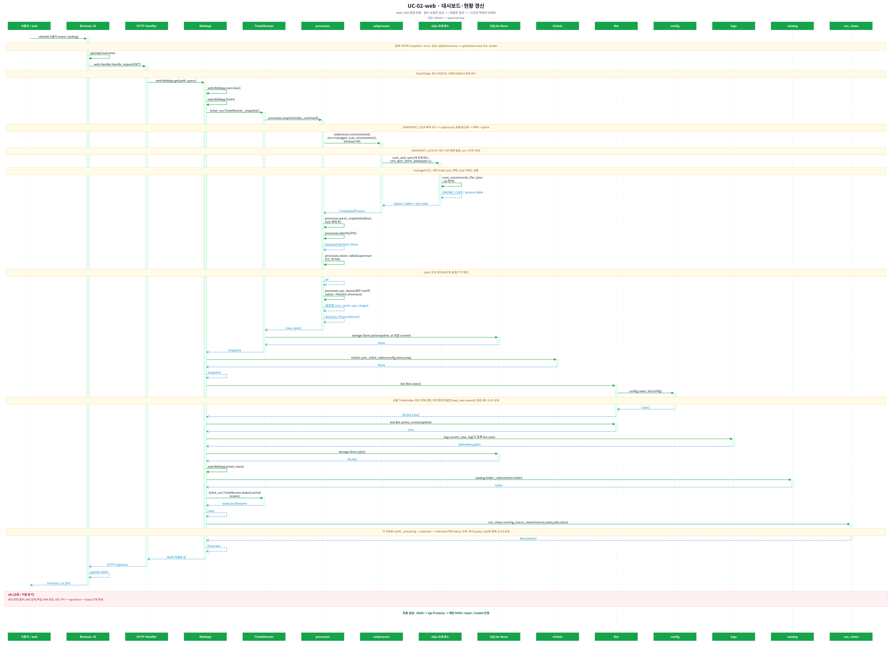

[SVG 원본 확대](../diagrams/UC-02-web.svg)

**정상 결과:** JSON → api Promise → 해당 DOM / toast / modal 반영.
**실패/취소:** 403 권한/출처; 400 입력/파일; 404 경로; 500 기타 → api throw → toast/오류 화면.

**코드 연결:** [web.Handler.handle_request](../../cfd_bot/web.py#L453), [web.WebApp.get](../../cfd_bot/web.py#L248), [web.WebApp.overview](../../cfd_bot/web.py#L74), [web.WebApp.fresh](../../cfd_bot/web.py#L49), [ticket_run.TicketRunner._snapshot](../../cfd_bot/ticket_run.py#L24), [processes.snapshot](../../cfd_bot/processes.py#L229), [processes.parse_snapshot](../../cfd_bot/processes.py#L177), [processes.identity](../../cfd_bot/processes.py#L25), [processes.owner_label](../../cfd_bot/processes.py#L87), [processes.cpu_layout](../../cfd_bot/processes.py#L140), [storage.Store.put](../../cfd_bot/storage.py#L151), [tickets.sync_ticket_states](../../cfd_bot/tickets.py#L425), [bot.Bot.cases](../../cfd_bot/bot.py#L65), [config.cases_for](../../cfd_bot/config.py#L554), [bot.Bot.active_runs](../../cfd_bot/bot.py#L97), [logs.recent_case_log](../../cfd_bot/logs.py#L264), [storage.Store.jobs](../../cfd_bot/storage.py#L165), [web.WebApp.ticket_rows](../../cfd_bot/web.py#L55), [catalog.folder_index](../../cfd_bot/catalog.py#L355), [ticket_run.TicketRunner.states](../../cfd_bot/ticket_run.py#L153), [run_views.running_macro_views](../../cfd_bot/run_views.py#L72).

**관련 검증:** [test_core.py](../../tests/test_core.py), [test_web.py](../../tests/test_web.py).

## UC-03-web — 등록 케이스 목록

진입: `start / reload-data → /api/cases`.

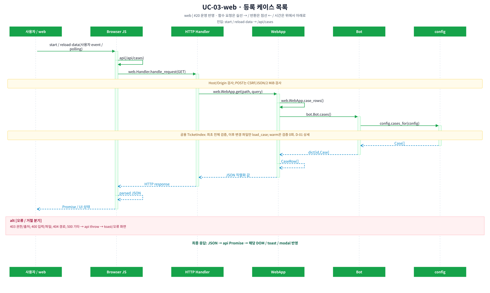

[SVG 원본 확대](../diagrams/UC-03-web.svg)

**정상 결과:** JSON → api Promise → 해당 DOM / toast / modal 반영.
**실패/취소:** 403 권한/출처; 400 입력/파일; 404 경로; 500 기타 → api throw → toast/오류 화면.

**코드 연결:** [web.Handler.handle_request](../../cfd_bot/web.py#L453), [web.WebApp.get](../../cfd_bot/web.py#L248), [web.WebApp.case_rows](../../cfd_bot/web.py#L127), [bot.Bot.cases](../../cfd_bot/bot.py#L65), [config.cases_for](../../cfd_bot/config.py#L554).

**관련 검증:** [test_ticket_chat.py](../../tests/test_ticket_chat.py), [test_gui.py](../../tests/test_gui.py), [test_web.py](../../tests/test_web.py).

## UC-04-web — 상태 상세·ETA

진입: `loadData → /api/detail?case=id`.

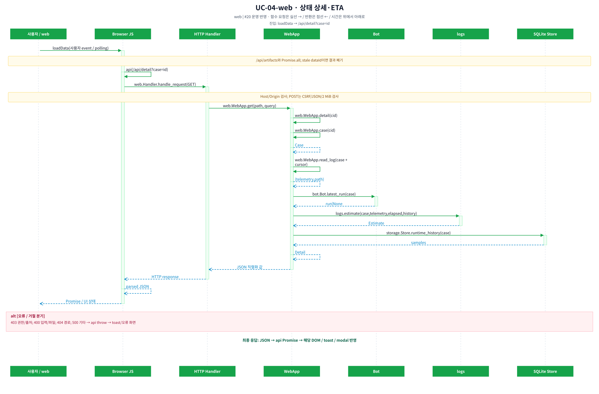

[SVG 원본 확대](../diagrams/UC-04-web.svg)

**정상 결과:** JSON → api Promise → 해당 DOM / toast / modal 반영.
**실패/취소:** 403 권한/출처; 400 입력/파일; 404 경로; 500 기타 → api throw → toast/오류 화면.

**코드 연결:** [web.Handler.handle_request](../../cfd_bot/web.py#L453), [web.WebApp.get](../../cfd_bot/web.py#L248), [web.WebApp.detail](../../cfd_bot/web.py#L134), [web.WebApp.case](../../cfd_bot/web.py#L119), [logs.recent_case_log](../../cfd_bot/logs.py#L264), [bot.Bot.latest_run](../../cfd_bot/bot.py#L318), [logs.estimate](../../cfd_bot/logs.py#L276), [storage.Store.runtime_history](../../cfd_bot/storage.py#L353).

**관련 검증:** [test_ticket_chat.py](../../tests/test_ticket_chat.py), [test_gui.py](../../tests/test_gui.py), [test_web.py](../../tests/test_web.py).

## UC-05-web — Residual 조회

진입: `loadData / download → /api/artifacts → /api/file`.

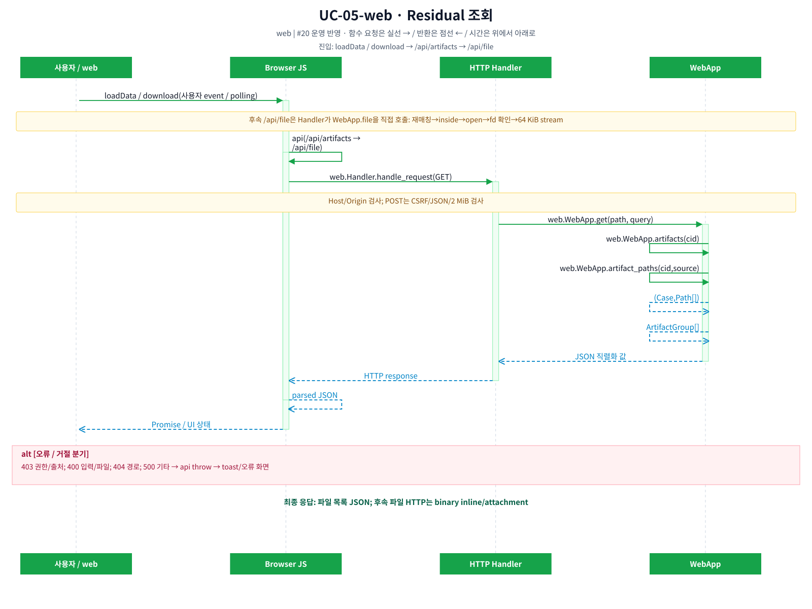

[SVG 원본 확대](../diagrams/UC-05-web.svg)

**정상 결과:** 파일 목록 JSON; 후속 파일 HTTP는 binary inline/attachment.
**실패/취소:** 403 권한/출처; 400 입력/파일; 404 경로; 500 기타 → api throw → toast/오류 화면.

**코드 연결:** [web.Handler.handle_request](../../cfd_bot/web.py#L453), [web.WebApp.get](../../cfd_bot/web.py#L248), [web.WebApp.artifacts](../../cfd_bot/web.py#L161), [web.WebApp.artifact_paths](../../cfd_bot/web.py#L149).

**관련 검증:** [test_residual.py](../../tests/test_residual.py).

## UC-06-web — 결과 파일 조회

진입: `loadData / download → /api/artifacts → /api/file`.

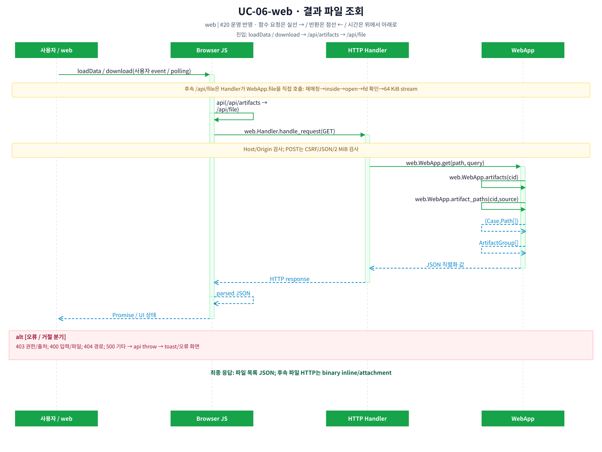

[SVG 원본 확대](../diagrams/UC-06-web.svg)

**정상 결과:** 파일 목록 JSON; 후속 파일 HTTP는 binary inline/attachment.
**실패/취소:** 403 권한/출처; 400 입력/파일; 404 경로; 500 기타 → api throw → toast/오류 화면.

**코드 연결:** [web.Handler.handle_request](../../cfd_bot/web.py#L453), [web.WebApp.get](../../cfd_bot/web.py#L248), [web.WebApp.artifacts](../../cfd_bot/web.py#L161), [web.WebApp.artifact_paths](../../cfd_bot/web.py#L149).

**관련 검증:** [test_web.py](../../tests/test_web.py), [test_core.py](../../tests/test_core.py).

## UC-07-web — 티켓 목록·선택

진입: `refresh / ticketList → /api/overview`.

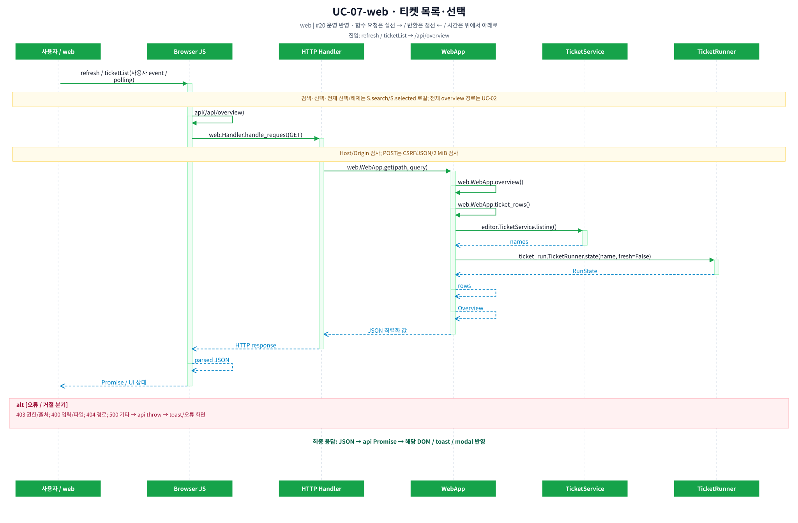

[SVG 원본 확대](../diagrams/UC-07-web.svg)

**정상 결과:** JSON → api Promise → 해당 DOM / toast / modal 반영.
**실패/취소:** 403 권한/출처; 400 입력/파일; 404 경로; 500 기타 → api throw → toast/오류 화면.

**코드 연결:** [web.Handler.handle_request](../../cfd_bot/web.py#L453), [web.WebApp.get](../../cfd_bot/web.py#L248), [web.WebApp.overview](../../cfd_bot/web.py#L74), [web.WebApp.ticket_rows](../../cfd_bot/web.py#L55), [editor.TicketService.listing](../../cfd_bot/editor.py#L328), [ticket_run.TicketRunner.state](../../cfd_bot/ticket_run.py#L146).

**관련 검증:** [test_ticket_chat.py](../../tests/test_ticket_chat.py), [test_gui.py](../../tests/test_gui.py), [test_web.py](../../tests/test_web.py).

## UC-08-web — 새 티켓

진입: `newTicket → /api/new`.

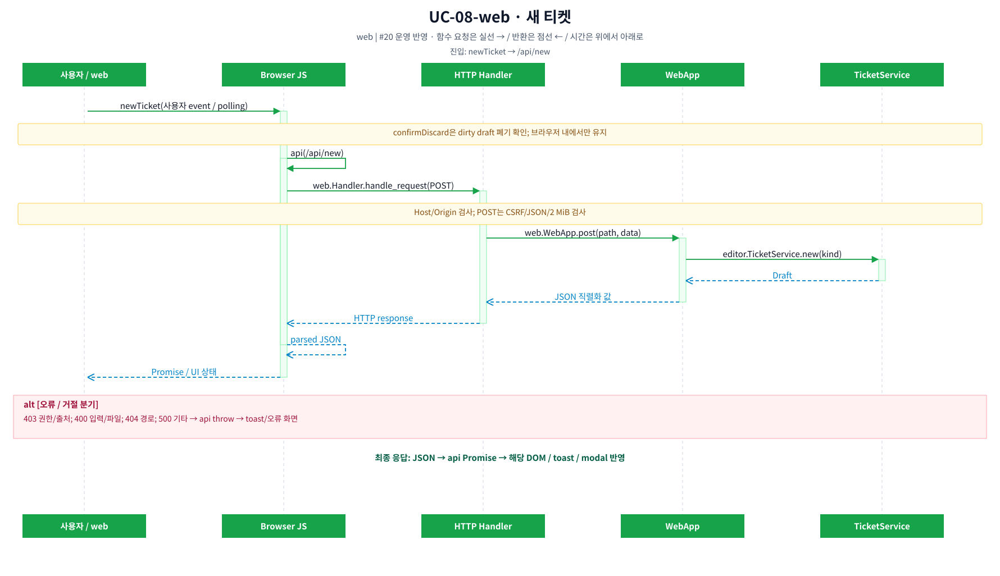

[SVG 원본 확대](../diagrams/UC-08-web.svg)

**정상 결과:** JSON → api Promise → 해당 DOM / toast / modal 반영.
**실패/취소:** 403 권한/출처; 400 입력/파일; 404 경로; 500 기타 → api throw → toast/오류 화면.

**코드 연결:** [web.Handler.handle_request](../../cfd_bot/web.py#L453), [web.WebApp.post](../../cfd_bot/web.py#L296), [editor.TicketService.new](../../cfd_bot/editor.py#L353).

**관련 검증:** [test_ticket_chat.py](../../tests/test_ticket_chat.py), [test_gui.py](../../tests/test_gui.py), [test_web.py](../../tests/test_web.py).

## UC-09-web — 티켓 열기

진입: `openTicket → /api/ticket?name=...`.

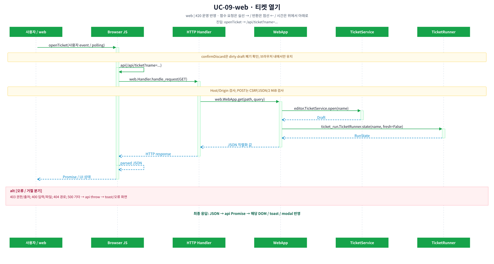

[SVG 원본 확대](../diagrams/UC-09-web.svg)

**정상 결과:** JSON → api Promise → 해당 DOM / toast / modal 반영.
**실패/취소:** 403 권한/출처; 400 입력/파일; 404 경로; 500 기타 → api throw → toast/오류 화면.

**코드 연결:** [web.Handler.handle_request](../../cfd_bot/web.py#L453), [web.WebApp.get](../../cfd_bot/web.py#L248), [editor.TicketService.open](../../cfd_bot/editor.py#L344), [ticket_run.TicketRunner.state](../../cfd_bot/ticket_run.py#L146).

**관련 검증:** [test_ticket_chat.py](../../tests/test_ticket_chat.py), [test_gui.py](../../tests/test_gui.py), [test_web.py](../../tests/test_web.py).

## UC-13-web — 티켓 복제

진입: `action(duplicate-ticket) → /api/duplicate`.

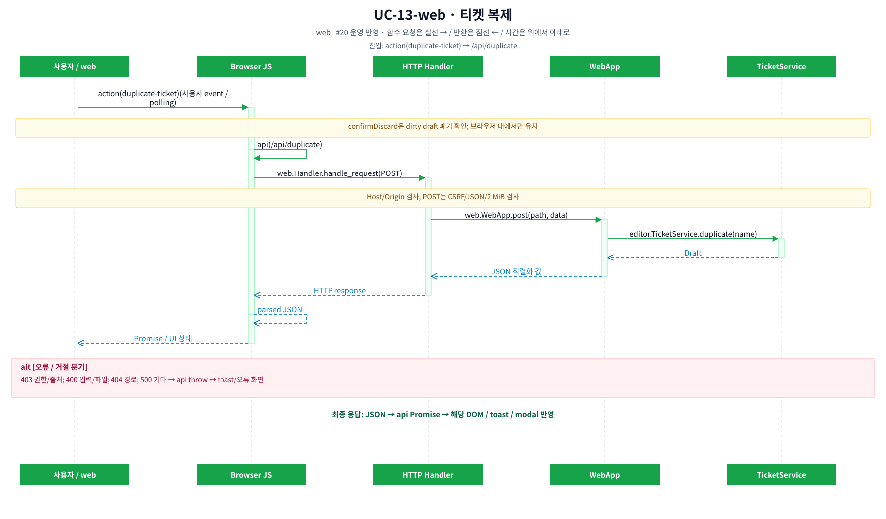

[SVG 원본 확대](../diagrams/UC-13-web.svg)

**정상 결과:** JSON → api Promise → 해당 DOM / toast / modal 반영.
**실패/취소:** 403 권한/출처; 400 입력/파일; 404 경로; 500 기타 → api throw → toast/오류 화면.

**코드 연결:** [web.Handler.handle_request](../../cfd_bot/web.py#L453), [web.WebApp.post](../../cfd_bot/web.py#L296), [editor.TicketService.duplicate](../../cfd_bot/editor.py#L363).

**관련 검증:** [test_ticket_chat.py](../../tests/test_ticket_chat.py), [test_gui.py](../../tests/test_gui.py), [test_web.py](../../tests/test_web.py).

## UC-10-web — 기본·감시·알림·스크립트 편집

진입: `controlHint → /api/control?path=...`.

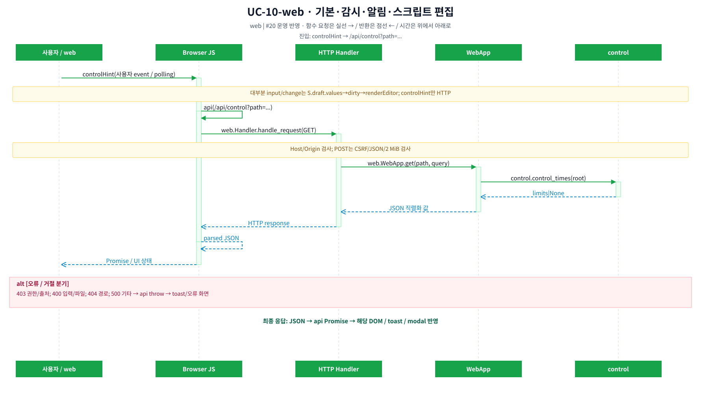

[SVG 원본 확대](../diagrams/UC-10-web.svg)

**정상 결과:** JSON → api Promise → 해당 DOM / toast / modal 반영.
**실패/취소:** 403 권한/출처; 400 입력/파일; 404 경로; 500 기타 → api throw → toast/오류 화면.

**코드 연결:** [web.Handler.handle_request](../../cfd_bot/web.py#L453), [web.WebApp.get](../../cfd_bot/web.py#L248), [control.control_times](../../cfd_bot/control.py#L100).

**관련 검증:** [test_ticket_chat.py](../../tests/test_ticket_chat.py), [test_gui.py](../../tests/test_gui.py), [test_web.py](../../tests/test_web.py).

## UC-11-web — 티켓 검증

진입: `action(validate) → /api/validate`.

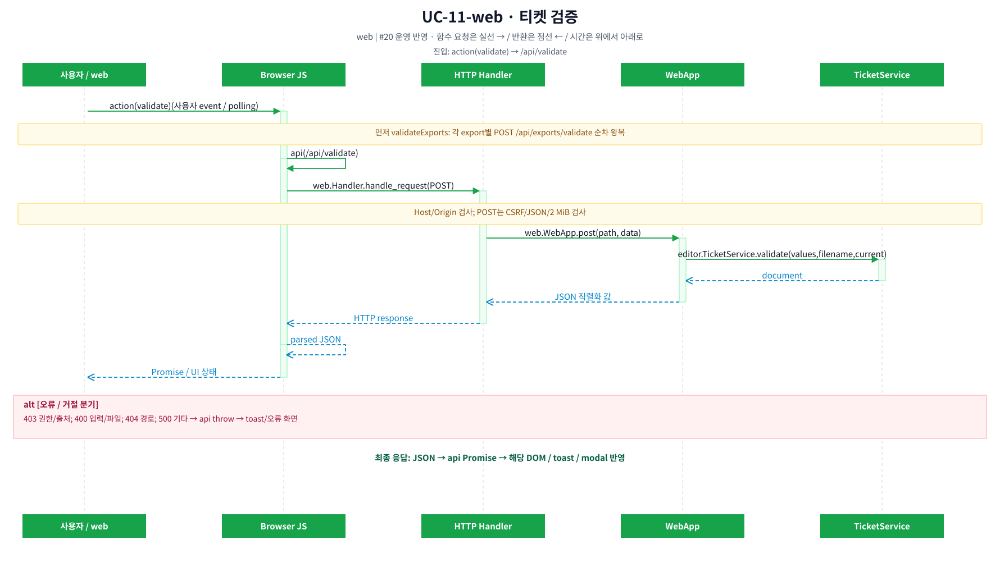

[SVG 원본 확대](../diagrams/UC-11-web.svg)

**정상 결과:** JSON → api Promise → 해당 DOM / toast / modal 반영.
**실패/취소:** 403 권한/출처; 400 입력/파일; 404 경로; 500 기타 → api throw → toast/오류 화면.

**코드 연결:** [web.Handler.handle_request](../../cfd_bot/web.py#L453), [web.WebApp.post](../../cfd_bot/web.py#L296), [editor.TicketService.validate](../../cfd_bot/editor.py#L394).

**관련 검증:** [test_gui.py](../../tests/test_gui.py).

## UC-12-web — 저장·이름 변경

진입: `saveNow → /api/save`.

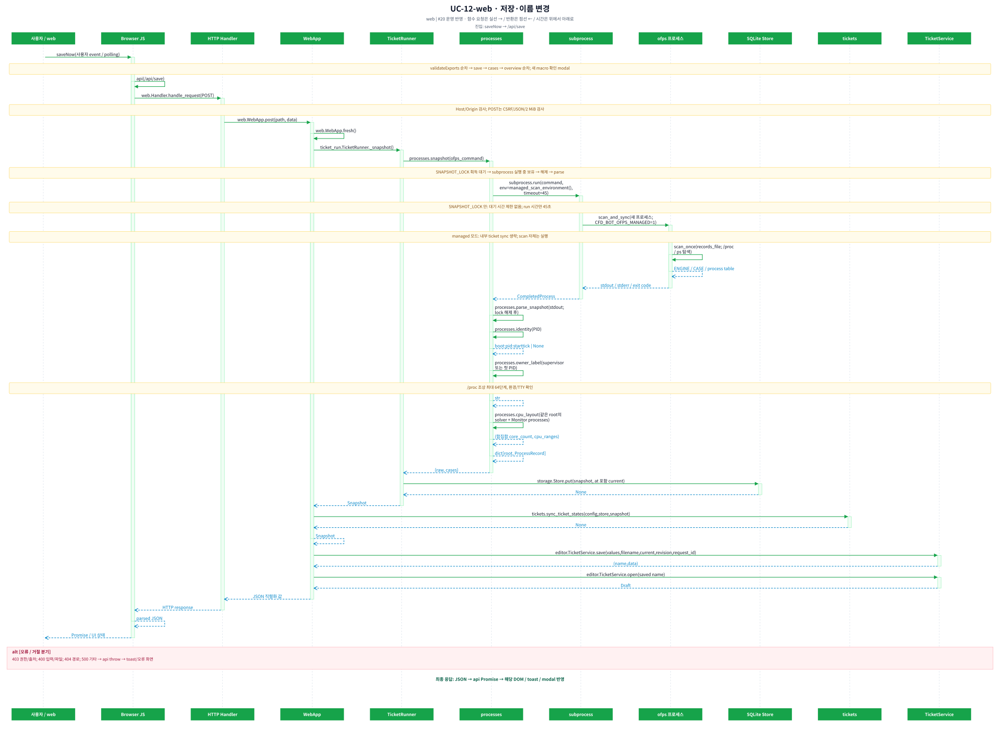

[SVG 원본 확대](../diagrams/UC-12-web.svg)

**정상 결과:** JSON → api Promise → 해당 DOM / toast / modal 반영.
**실패/취소:** 403 권한/출처; 400 입력/파일; 404 경로; 500 기타 → api throw → toast/오류 화면.

**코드 연결:** [web.Handler.handle_request](../../cfd_bot/web.py#L453), [web.WebApp.post](../../cfd_bot/web.py#L296), [web.WebApp.fresh](../../cfd_bot/web.py#L49), [ticket_run.TicketRunner._snapshot](../../cfd_bot/ticket_run.py#L24), [processes.snapshot](../../cfd_bot/processes.py#L229), [processes.parse_snapshot](../../cfd_bot/processes.py#L177), [processes.identity](../../cfd_bot/processes.py#L25), [processes.owner_label](../../cfd_bot/processes.py#L87), [processes.cpu_layout](../../cfd_bot/processes.py#L140), [storage.Store.put](../../cfd_bot/storage.py#L151), [tickets.sync_ticket_states](../../cfd_bot/tickets.py#L425), [editor.TicketService.save](../../cfd_bot/editor.py#L424), [editor.TicketService.open](../../cfd_bot/editor.py#L344).

**관련 검증:** [test_ticket_chat.py](../../tests/test_ticket_chat.py), [test_gui.py](../../tests/test_gui.py), [test_web.py](../../tests/test_web.py).

## UC-14-web — 개별·다중 티켓 삭제

진입: `action(delete-selected) → /api/delete/preview → /api/delete`.

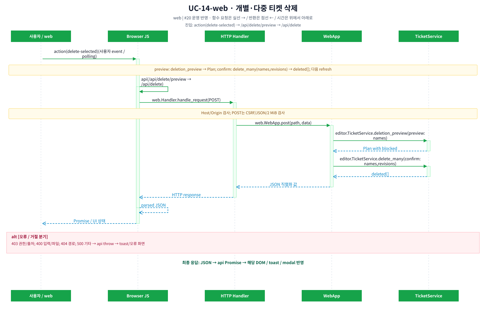

[SVG 원본 확대](../diagrams/UC-14-web.svg)

**정상 결과:** JSON → api Promise → 해당 DOM / toast / modal 반영.
**실패/취소:** 403 권한/출처; 400 입력/파일; 404 경로; 500 기타 → api throw → toast/오류 화면.

**코드 연결:** [web.Handler.handle_request](../../cfd_bot/web.py#L453), [web.WebApp.post](../../cfd_bot/web.py#L296), [web.WebApp.fresh](../../cfd_bot/web.py#L49), [ticket_run.TicketRunner._snapshot](../../cfd_bot/ticket_run.py#L24), [processes.snapshot](../../cfd_bot/processes.py#L229), [processes.parse_snapshot](../../cfd_bot/processes.py#L177), [processes.identity](../../cfd_bot/processes.py#L25), [processes.owner_label](../../cfd_bot/processes.py#L87), [processes.cpu_layout](../../cfd_bot/processes.py#L140), [storage.Store.put](../../cfd_bot/storage.py#L151), [tickets.sync_ticket_states](../../cfd_bot/tickets.py#L425), [editor.TicketService.deletion_preview](../../cfd_bot/editor.py#L558), [editor.TicketService.delete_many](../../cfd_bot/editor.py#L564).

**관련 검증:** [test_ticket_chat.py](../../tests/test_ticket_chat.py).

## UC-15-web — 매크로 검색·필터

진입: `action(discover) → /api/discover`.

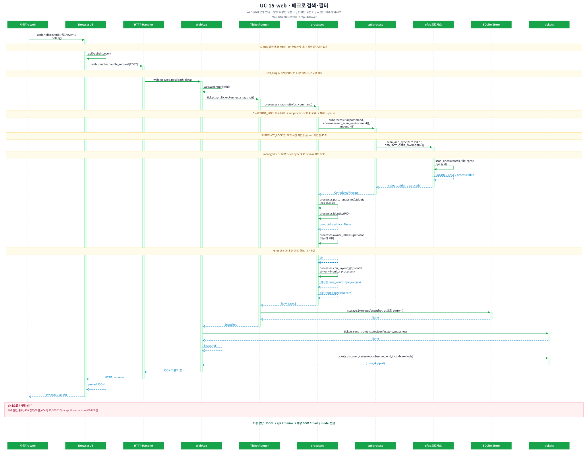

[SVG 원본 확대](../diagrams/UC-15-web.svg)

**정상 결과:** JSON → api Promise → 해당 DOM / toast / modal 반영.
**실패/취소:** 403 권한/출처; 400 입력/파일; 404 경로; 500 기타 → api throw → toast/오류 화면.

**코드 연결:** [web.Handler.handle_request](../../cfd_bot/web.py#L453), [web.WebApp.post](../../cfd_bot/web.py#L296), [web.WebApp.fresh](../../cfd_bot/web.py#L49), [ticket_run.TicketRunner._snapshot](../../cfd_bot/ticket_run.py#L24), [processes.snapshot](../../cfd_bot/processes.py#L229), [processes.parse_snapshot](../../cfd_bot/processes.py#L177), [processes.identity](../../cfd_bot/processes.py#L25), [processes.owner_label](../../cfd_bot/processes.py#L87), [processes.cpu_layout](../../cfd_bot/processes.py#L140), [storage.Store.put](../../cfd_bot/storage.py#L151), [tickets.sync_ticket_states](../../cfd_bot/tickets.py#L425), [tickets.discover_cases](../../cfd_bot/tickets.py#L178).

**관련 검증:** [test_queue_tickets.py](../../tests/test_queue_tickets.py).

## UC-16-web — 매크로 구성원 순서·제거

진입: `remove-case / case-up / case-down`.

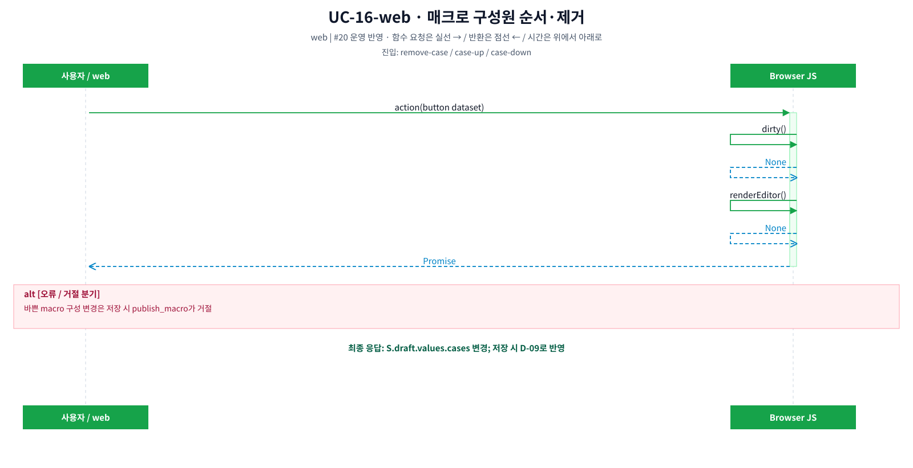

[SVG 원본 확대](../diagrams/UC-16-web.svg)

**정상 결과:** S.draft.values.cases 변경; 저장 시 D-09로 반영.
**실패/취소:** 바쁜 macro 구성 변경은 저장 시 publish_macro가 거절.

**코드 연결:** .

**관련 검증:** [test_queue_tickets.py](../../tests/test_queue_tickets.py).

## UC-17-web — 실행·queue 이름·동적 macro 설정

진입: `input/change → resources 탭`.

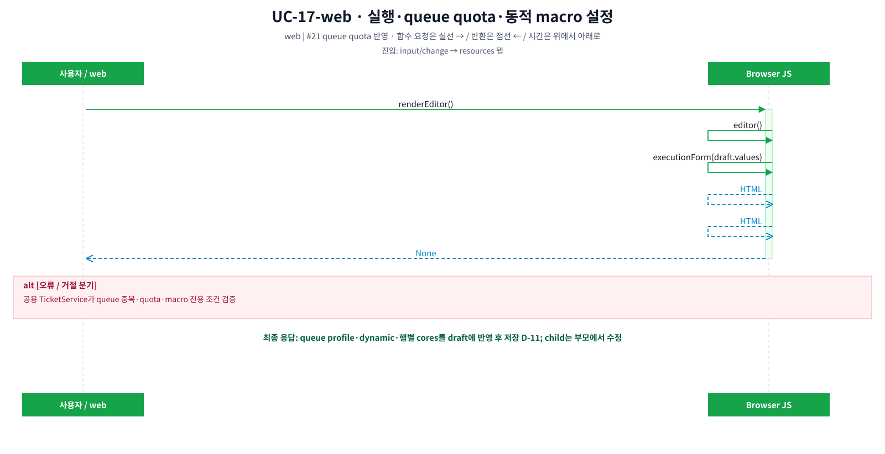

[SVG 원본 확대](../diagrams/UC-17-web.svg)

**정상 결과:** queue id·dynamic·행별 cores를 draft에 반영 후 저장 D-11; quota는 NP에서 파생; child는 부모에서 수정.
**실패/취소:** 공용 TicketService가 queue 이름 중복·macro 전용 조건 검증.

**코드 연결:** .

**관련 검증:** [test_execution_environment.py](../../tests/test_execution_environment.py), [test_gui.py](../../tests/test_gui.py), [test_named_queues.py](../../tests/test_named_queues.py).

## UC-18-web — 즉시 실행·이름 있는 대기열 등록

진입: `requestRun(mode) → /api/run`.

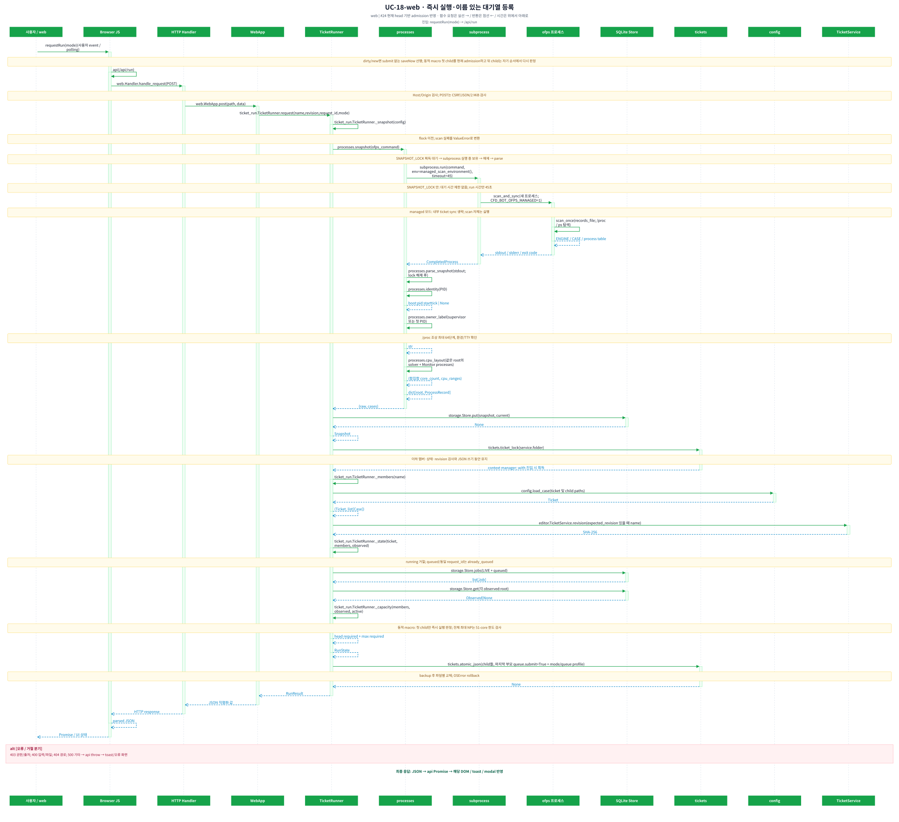

[SVG 원본 확대](../diagrams/UC-18-web.svg)

**정상 결과:** JSON → api Promise → 해당 DOM / toast / modal 반영.
**실패/취소:** 403 권한/출처; 400 입력/파일; 404 경로; 500 기타 → api throw → toast/오류 화면.

**코드 연결:** [web.Handler.handle_request](../../cfd_bot/web.py#L453), [web.WebApp.post](../../cfd_bot/web.py#L296), [ticket_run.TicketRunner.request](../../cfd_bot/ticket_run.py#L195), [ticket_run.TicketRunner._snapshot](../../cfd_bot/ticket_run.py#L24), [processes.snapshot](../../cfd_bot/processes.py#L229), [processes.parse_snapshot](../../cfd_bot/processes.py#L177), [processes.identity](../../cfd_bot/processes.py#L25), [processes.owner_label](../../cfd_bot/processes.py#L87), [processes.cpu_layout](../../cfd_bot/processes.py#L140), [storage.Store.put](../../cfd_bot/storage.py#L151), [tickets.ticket_lock](../../cfd_bot/tickets.py#L31), [ticket_run.TicketRunner._members](../../cfd_bot/ticket_run.py#L34), [config.load_case](../../cfd_bot/config.py#L146), [editor.TicketService.revision](../../cfd_bot/editor.py#L333), [ticket_run.TicketRunner._state](../../cfd_bot/ticket_run.py#L109), [storage.Store.jobs](../../cfd_bot/storage.py#L165), [storage.Store.get](../../cfd_bot/storage.py#L126), [ticket_run.TicketRunner._capacity](../../cfd_bot/ticket_run.py#L58), [tickets.atomic_json](../../cfd_bot/tickets.py#L52).

**관련 검증:** [test_ticket_run.py](../../tests/test_ticket_run.py), [test_named_queues.py](../../tests/test_named_queues.py).

## UC-19-web — 큐·이력·매크로 진행

진입: `refresh → /api/overview`.

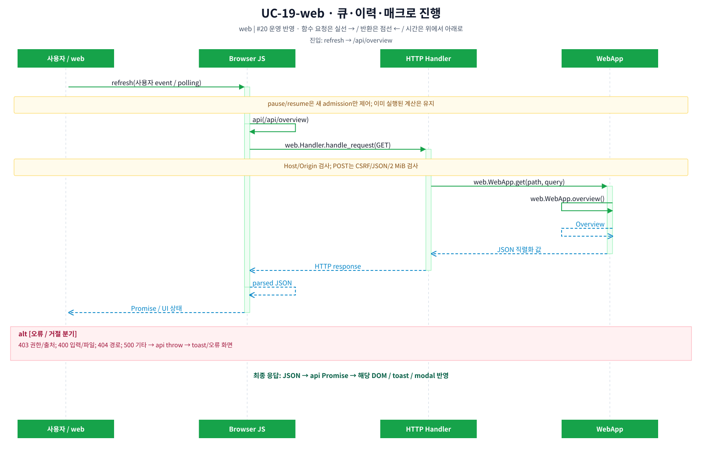

[SVG 원본 확대](../diagrams/UC-19-web.svg)

**정상 결과:** JSON → api Promise → 해당 DOM / toast / modal 반영.
**실패/취소:** 403 권한/출처; 400 입력/파일; 404 경로; 500 기타 → api throw → toast/오류 화면.

**코드 연결:** [web.Handler.handle_request](../../cfd_bot/web.py#L453), [web.WebApp.get](../../cfd_bot/web.py#L248), [web.WebApp.overview](../../cfd_bot/web.py#L74).

**관련 검증:** [test_run_views.py](../../tests/test_run_views.py), [test_named_queues.py](../../tests/test_named_queues.py).

## UC-20-web — 자동 시작 pause/resume

진입: `action(pause/resume) → /api/queue`.

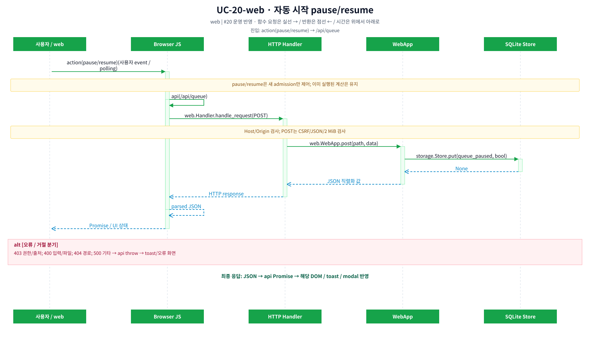

[SVG 원본 확대](../diagrams/UC-20-web.svg)

**정상 결과:** JSON → api Promise → 해당 DOM / toast / modal 반영.
**실패/취소:** 403 권한/출처; 400 입력/파일; 404 경로; 500 기타 → api throw → toast/오류 화면.

**코드 연결:** [web.Handler.handle_request](../../cfd_bot/web.py#L453), [web.WebApp.post](../../cfd_bot/web.py#L296), [storage.Store.put](../../cfd_bot/storage.py#L151).

**관련 검증:** [test_core.py](../../tests/test_core.py).

## UC-21-web — 대기열 카드별 선택·취소

진입: `action(cancel-selected-jobs / cancel-job) → /api/queue`.

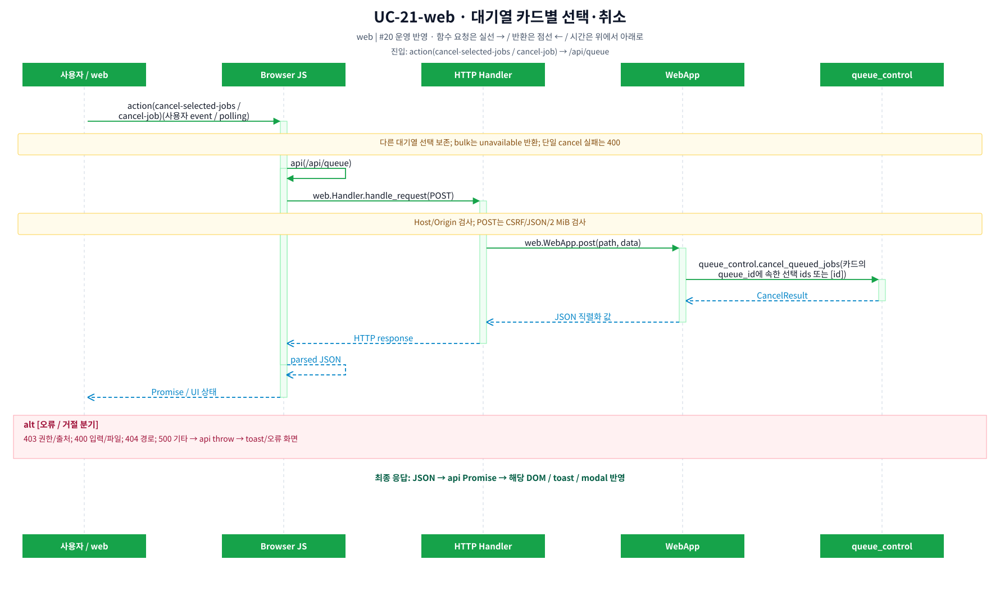

[SVG 원본 확대](../diagrams/UC-21-web.svg)

**정상 결과:** JSON → api Promise → 해당 DOM / toast / modal 반영.
**실패/취소:** 403 권한/출처; 400 입력/파일; 404 경로; 500 기타 → api throw → toast/오류 화면.

**코드 연결:** [web.Handler.handle_request](../../cfd_bot/web.py#L453), [web.WebApp.post](../../cfd_bot/web.py#L296), [queue_control.cancel_queued_jobs](../../cfd_bot/queue_control.py#L13).

**관련 검증:** [test_core.py](../../tests/test_core.py), [test_web.py](../../tests/test_web.py).

## UC-22-web — 실패 패턴 템플릿

진입: `action(save-preset) → /api/patterns`.

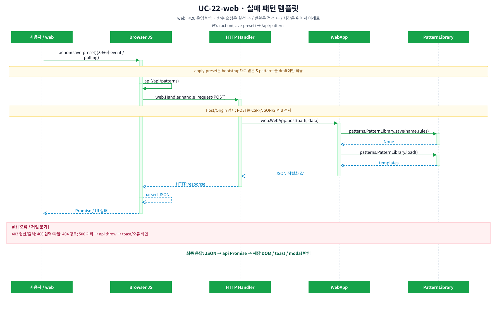

[SVG 원본 확대](../diagrams/UC-22-web.svg)

**정상 결과:** JSON → api Promise → 해당 DOM / toast / modal 반영.
**실패/취소:** 403 권한/출처; 400 입력/파일; 404 경로; 500 기타 → api throw → toast/오류 화면.

**코드 연결:** [web.Handler.handle_request](../../cfd_bot/web.py#L453), [web.WebApp.post](../../cfd_bot/web.py#L296), [patterns.PatternLibrary.save](../../cfd_bot/patterns.py#L60), [patterns.PatternLibrary.load](../../cfd_bot/patterns.py#L40).

**관련 검증:** [test_gui.py](../../tests/test_gui.py).

## UC-23-web — 폴더·파일 선택

진입: `showBrowser → /api/browse`.

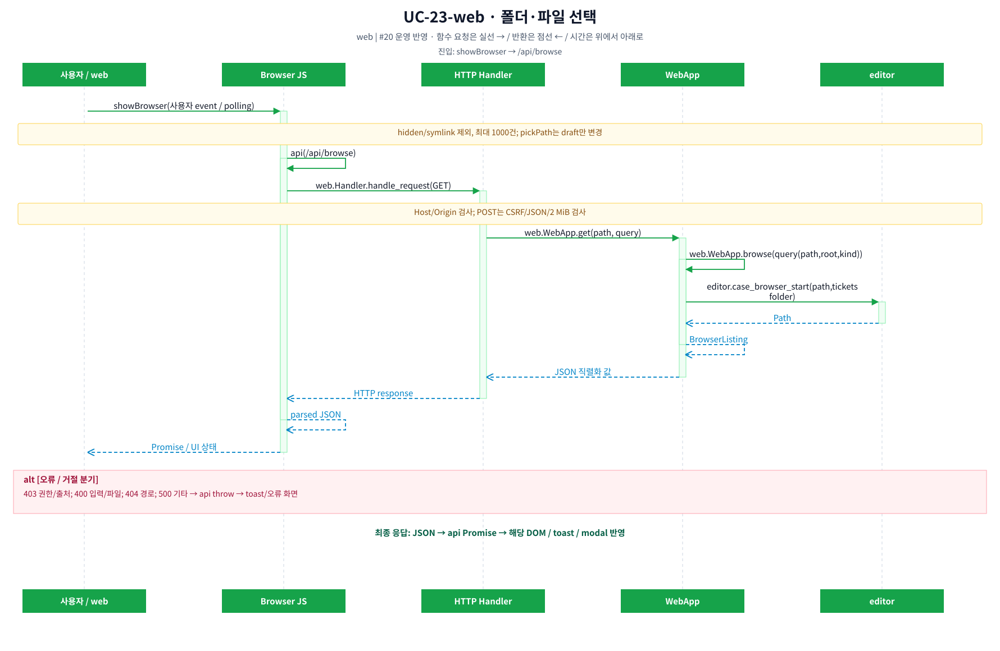

[SVG 원본 확대](../diagrams/UC-23-web.svg)

**정상 결과:** JSON → api Promise → 해당 DOM / toast / modal 반영.
**실패/취소:** 403 권한/출처; 400 입력/파일; 404 경로; 500 기타 → api throw → toast/오류 화면.

**코드 연결:** [web.Handler.handle_request](../../cfd_bot/web.py#L453), [web.WebApp.get](../../cfd_bot/web.py#L248), [web.WebApp.browse](../../cfd_bot/web.py#L214), [editor.case_browser_start](../../cfd_bot/editor.py#L29).

**관련 검증:** [test_ticket_chat.py](../../tests/test_ticket_chat.py), [test_web.py](../../tests/test_web.py).

## UC-24-web — 초안 폐기·modal 취소

진입: `confirmDiscard / close-modal / beforeunload`.

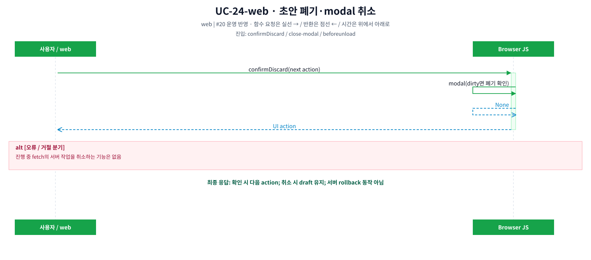

[SVG 원본 확대](../diagrams/UC-24-web.svg)

**정상 결과:** 확인 시 다음 action; 취소 시 draft 유지; 서버 rollback 동작 아님.
**실패/취소:** 진행 중 fetch의 서버 작업을 취소하는 기능은 없음.

**코드 연결:** .

**관련 검증:** [test_ticket_chat.py](../../tests/test_ticket_chat.py), [test_gui.py](../../tests/test_gui.py).

## UC-28-web — 실행 중 managed 작업 중단

진입: `action(stop-selected-jobs / stop-job) → /api/queue`.

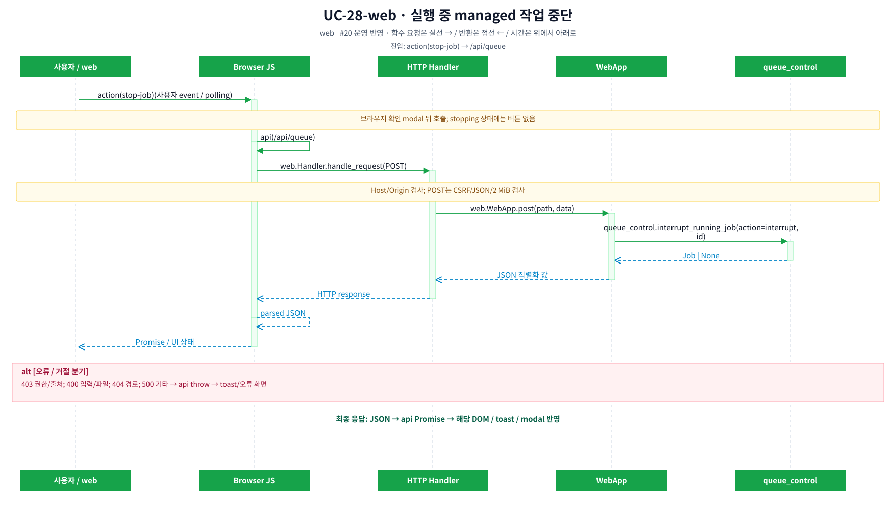

[SVG 원본 확대](../diagrams/UC-28-web.svg)

**정상 결과:** JSON → api Promise → 해당 DOM / toast / modal 반영.
**실패/취소:** 403 권한/출처; 400 입력/파일; 404 경로; 500 기타 → api throw → toast/오류 화면.

**코드 연결:** [web.Handler.handle_request](../../cfd_bot/web.py#L453), [web.WebApp.post](../../cfd_bot/web.py#L296), [queue_control.interrupt_running_jobs](../../cfd_bot/queue_control.py#L80).

**관련 검증:** [test_ticket_chat.py](../../tests/test_ticket_chat.py), [test_gui.py](../../tests/test_gui.py), [test_web.py](../../tests/test_web.py).

## UC-05-file-web — Residual 실제 HTTP 전송

진입: `GET /api/file?case&source&file[&download=1]`.

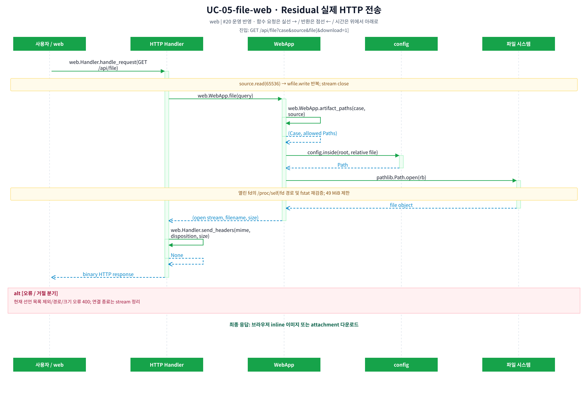

[SVG 원본 확대](../diagrams/UC-05-file-web.svg)

**정상 결과:** 브라우저 inline 이미지 또는 attachment 다운로드.
**실패/취소:** 현재 선언 목록 제외/경로/크기 오류 400; 연결 종료는 stream 정리.

**코드 연결:** [web.Handler.handle_request](../../cfd_bot/web.py#L453), [web.WebApp.file](../../cfd_bot/web.py#L188), [web.WebApp.artifact_paths](../../cfd_bot/web.py#L149), [config.inside](../../cfd_bot/config.py#L114), [web.Handler.send_headers](../../cfd_bot/web.py#L427).

**관련 검증:** [test_residual.py](../../tests/test_residual.py).

## UC-06-file-web — 결과 파일 실제 HTTP 전송

진입: `GET /api/file?case&source&file[&download=1]`.

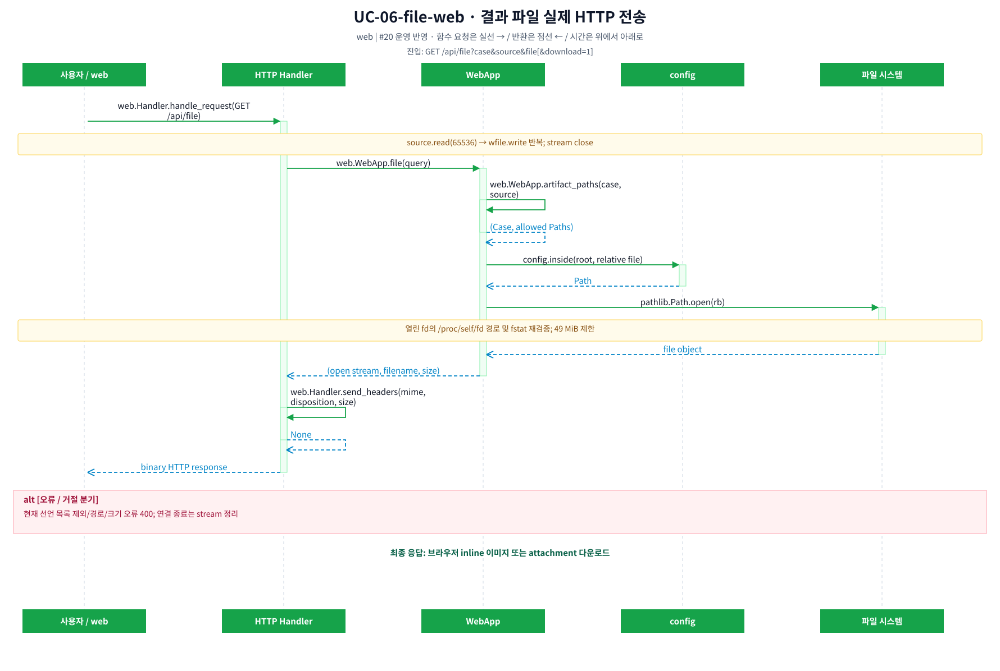

[SVG 원본 확대](../diagrams/UC-06-file-web.svg)

**정상 결과:** 브라우저 inline 이미지 또는 attachment 다운로드.
**실패/취소:** 현재 선언 목록 제외/경로/크기 오류 400; 연결 종료는 stream 정리.

**코드 연결:** [web.Handler.handle_request](../../cfd_bot/web.py#L453), [web.WebApp.file](../../cfd_bot/web.py#L188), [web.WebApp.artifact_paths](../../cfd_bot/web.py#L149), [config.inside](../../cfd_bot/config.py#L114), [web.Handler.send_headers](../../cfd_bot/web.py#L427).

**관련 검증:** [test_web.py](../../tests/test_web.py), [test_core.py](../../tests/test_core.py).

## UC-10-exports-web — 요청 데이터 정의 검증

진입: `validateExports → /api/exports/validate`.

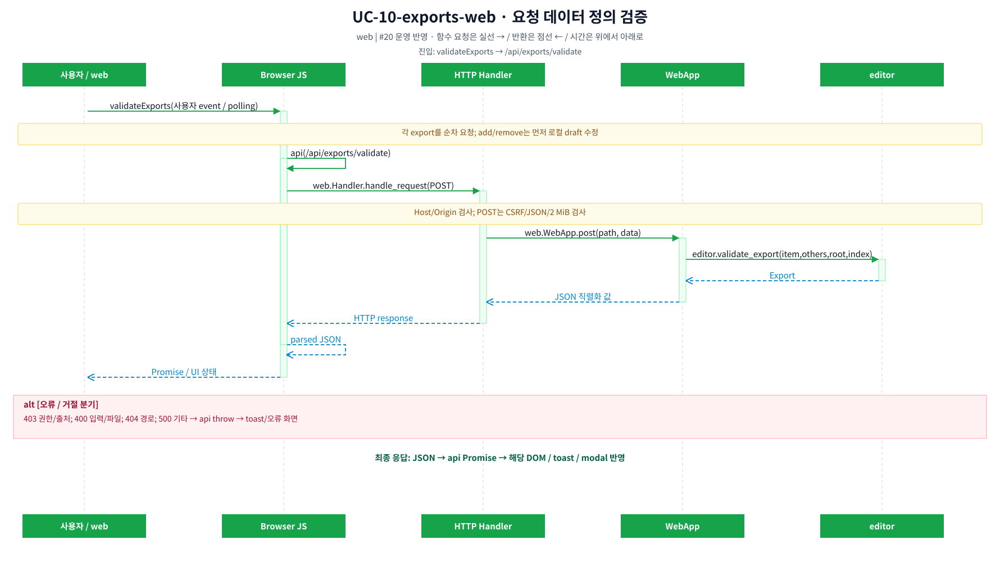

[SVG 원본 확대](../diagrams/UC-10-exports-web.svg)

**정상 결과:** JSON → api Promise → 해당 DOM / toast / modal 반영.
**실패/취소:** 403 권한/출처; 400 입력/파일; 404 경로; 500 기타 → api throw → toast/오류 화면.

**코드 연결:** [web.Handler.handle_request](../../cfd_bot/web.py#L453), [web.WebApp.post](../../cfd_bot/web.py#L296), [editor.validate_export](../../cfd_bot/editor.py#L584).

**관련 검증:** [test_ticket_chat.py](../../tests/test_ticket_chat.py), [test_gui.py](../../tests/test_gui.py), [test_web.py](../../tests/test_web.py).
